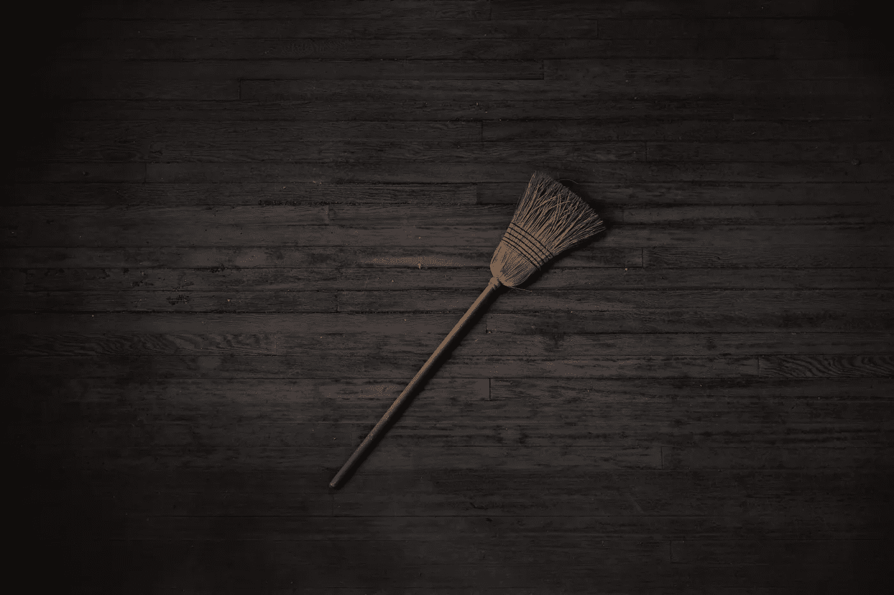
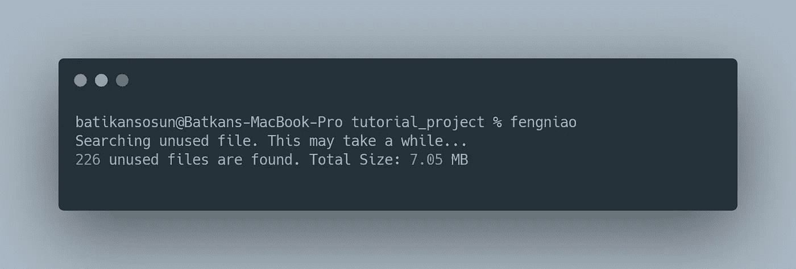
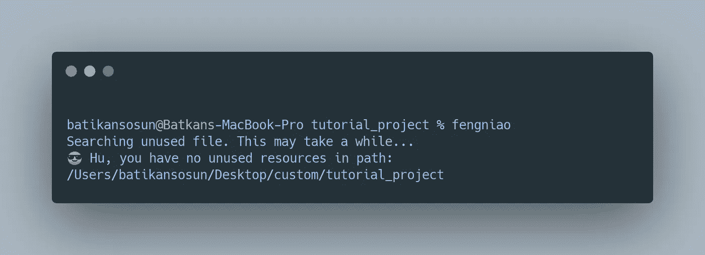

# 如何清理 Xcode 中未使用的资产

> 原文：<https://blog.devgenius.io/clean-up-unused-assets-in-xcode-69cad5ceaba8?source=collection_archive---------5----------------------->

## 轻松清理 Xcode 项目中未使用的图像和资源



尼尔·约翰逊在 Unsplash 上拍摄的照片

我们的项目中不使用的图像有时会很烦人。这样做的最大结果之一是增加了应用程序的规模。

相反，当我们移除未使用的图像或者如果它们被留下，项目会减少，应用程序的大小也会减小。它还可以防止图像混乱。

为了解决这个问题，下面我给大家分享两种方法，并举例说明其中一种。

*   [蜂鸟](https://github.com/onevcat/FengNiao/blob/master/README.md)
*   [LSUnusedResources](https://github.com/tinymind/LSUnusedResources)

LSUnusedResources 认为不值得解释，因为这种情况已不复存在。

我将重点介绍蜂鸟，并解释其细节。

# 用蜂鸟清理不用的图像

FengNiao 是一个简单的命令行工具，用于从 Xcode 项目中删除未使用的图像资源文件。风鸟是一个命令行工具，大部分是用 Swift 编写的，它是一个开源项目。您可以在 Github 上访问该工具。

## 怎么会？

— — — — — — — — — — — — — — — — — — — — — — — — — — — — — —-

**安装**

您需要在 macOS 中安装 Swift Package Manager(以及 Swift 编译器);一般来说，如果您安装了最新的 Xcode，就已经准备好了。

它可以通过克隆存储库来安装:

```
> git clone [https://github.com/onevcat/FengNiao.git](https://github.com/onevcat/FengNiao.git)
> cd FengNiao
> ./install.sh
```

**用途**

使用起来非常简单。只需导航到您的项目文件夹，然后执行 FengNiao:

```
> fengniao
```

它将扫描当前文件夹及其所有子文件夹以查找未使用的图像，然后询问您是否要删除它们。在删除图像之前，请确保您有备份或版本控制系统；这将是一个不可恢复的操作。

```
> fengniao --exclude Carthage Pods fastlane
```

这将在当前文件夹中搜索，但跳过`Carthage`、`Pods`和`fastlane` 文件夹，其中可能有一些你不想接触的第三方资源。在此命令中，您可以添加更多排除文件夹。



使用蜂鸟清理未使用的图像

为了验证这一点，选择一些随机的样本图像。然后在 Xcode 项目中搜索它们，确保它们没有被使用。然后选择删除命令，把它们都放飞。

您可以再次运行以下命令来确保它们被删除。

```
> fengniao --exclude Carthage Pods fastlane
```



使用蜂鸟清理未使用的图像

# 结论

值得一试。至少我在项目中学到了这一点。因此，大约 7.05 MB 的 IPA 文件的大小已经减小。

如果你有任何批评、问题或建议，欢迎在下面的评论区发表！

感谢阅读！