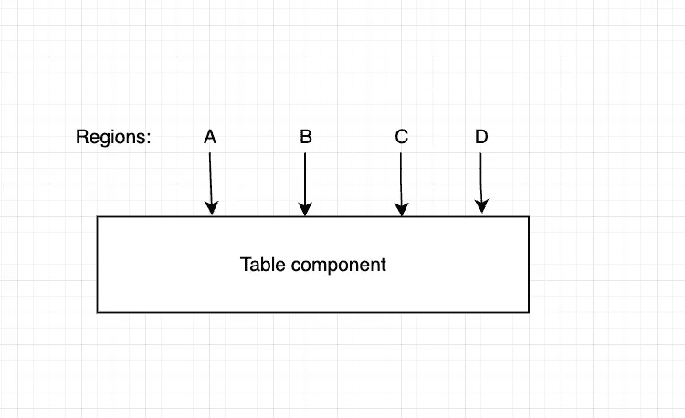
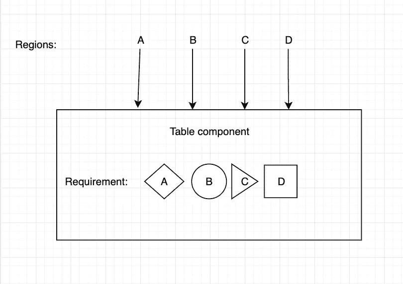

# 清洁剂反应代码.第 1 部分:干燥原理与组件道具

> 原文：<https://blog.devgenius.io/cleaner-react-code-part-1-dry-principle-and-component-props-a308d22d232d?source=collection_archive---------2----------------------->


[伊恩·泰勒](https://unsplash.com/@carrier_lost?utm_source=medium&utm_medium=referral)在 [Unsplash](https://unsplash.com?utm_source=medium&utm_medium=referral) 上拍照

## 介绍

大家好，我从 2017 年开始使用 ReactJS，瞬间成为它的发烧友。它提供了非常简单的构建模块(VDom，Component ),让我们以声明的方式考虑 UI 开发。但是因为 React 本身只是一个视图库，它几乎没有关于(文件夹结构、状态管理、句柄副作用)的官方约定或指导…所以如果没有严格应用的规则和约定、思维模式，我们的代码将很容易转换成意大利面条代码(自从我学习 React 以来，这种情况在我身上也发生过几次🤪).我写这篇文章是希望能分享我在使用 React 时的一些痛苦的错误以及我是如何解决的。

## 我第一个痛苦的错误:

我以前在一家多地区公司担任前端工程师，我们每个地区都有四到五个网站。它们看起来几乎完全相同，只有大约 30%的用户界面和功能变化，以适应该地区的业务需求…一天，我的老板让我做一个可重用的表格组件，可以在所有地区使用。



4 个区域 A、B、C、D 使用相同的表组件

过了一会儿，我得到了这样的结果:

```
Table.jsconst TableComponent = ({ data, columns }) => (...render table here);Region's page.js<Root>
  <Navbar items={items} />
  <Container>
    <Table data={data} columns={columns} />
  </Container>
</Root>
```

看起来不错，不是吗？(可重复使用，如果我们需要进行更改，只需在一个地方编辑)。开发团队对我的组件非常满意，我们将它部署到生产环境中，它运行得非常完美！！过了一段时间，每个国家都有一些特定的需求，团队开始修改表组件，这样它就可以处理这些需求，同时仍然可以重用。



具有地区特定要求的新表格组件

一两个月后，新的需求不断到来。我们的组件代码如下所示:

```
Table.jsconst TableComponent = ({
  data,
  columns,
  renderBeforeHeader,
  renderAfterHeader,
  isUserLogin,
  userRole,
  renderAfterBody,
  renderBeforeBody,
  tooltipContent,
  renderTooltip,
  isByPassPermissionAllowed,
  allowedPermissions,
  onRowClick,
  onTableClick,
  onCellClick
}) => {
  if (!isUserLoggedin && !== isByPassPermissionAllowed) {
    return null;
  }if (useRole) {
    switch(userRole):
    ...a bunch ui and logic base on roles
  }if (tooltipContent || renderTooltip) {
    ... a really long if else codition here(200 -> 300 lines)
  }const checkIfUserAllowedToViewThisTable = () => {
    ... really long logic (200 lines)
  }return (
    <Table>
      <THead>
        {renderBeforeHeader()}
        {...header render code here}
        {renderAfterHeader()}
      <THead>
      <TBody>
        {renderBeforeBody()}
        {...body render code here}
        {renderAfterBody()}
      </TBody>
      {renderTooltip && renderTooltip()}
    </Table>
  );
}Region's page.js<Root>
  <Navbar items={items} />
  <Container>
    <Table
      data,
      columns,
      renderBeforeHeader,
      renderAfterHeader,
      isUserLogin,
      userRole,
      renderAfterBody,
      renderBeforeBody,
      tooltipContent,
      renderTooltip,
      isByPassPermissionAllowed,
      allowedPermissions,
      onRowClick,
      onTableClick,
      onCellClick
    />
  </Container>
</Root>
```

新代码…还是不错的，不是吗？(理论上，它仍然是可重复使用的，如果我们需要进行更改，只需在单个文件中进行编辑🤪)…答案是:**否**，上面的代码有几个问题:

*   不可预测:它试图同时解决许多问题，导致在调试和进行更改时出现不可预测的问题。
*   可重用但不灵活:它与业务逻辑紧密耦合，将来在另一个地方使用它是一个真正的大挑战，因为开发人员需要完全理解 **15 props** 以确保它正常工作。
*   可维护性是一个大问题:过了一段时间，老员工辞职，新员工加入公司，没有人完全理解这个组件逻辑，没有人有足够的信心**编辑**或**删除**一个单独的**道具**，继续的唯一方法是不断添加新道具，修复这个组件的 bug 也是一个**噩梦**，因为**一个变化**可能会影响到其他地区。
*   可读性:因为组件非常复杂，所以人们无法理解背后的逻辑

看到这些问题，我决定对这个组件进行重构。

## 我如何重构这个组件:

首先，在对源代码做任何修改之前，我们需要找到根本原因。这里的根本原因是:

*   当我们设计组件时，我们的思维方式陷入了一个陷阱，即代码越干燥越好。与其考虑我们将如何使用组件以及理想的 API/props 看起来是什么样的，我们不如关注如何使组件可重用/干燥。我们利用 DRY 原则，却没有意识到灵活性/可读性和可重用性之间的权衡
*   我们试图将太多的问题混合在一起，这导致了代码的混乱。
*   我们试图尽可能地黑掉这个组件，每次有新的需求进来，我们就创建一个新的道具。
*   我们的组件中有业务，它与业务紧密耦合。

我们已经找到了上面的根本原因，让我们进入下一步:

*   首先，我们需要以声明的方式思考，并定义理想的组件 props/API:我们的组件是一个显示数据的表，因此它在这里唯一的职责是获取数据和列配置以显示在表中。

```
<Table data={data} column={columns} />
```

*   在我们为这个组件找到理想的 props/API 之后，我们尝试列出我们试图解决的问题:

```
- Customize event handler
- Customize UI for each region by adding more content to the base table.
- Handle UI and business logic based on the user's role
```

*   查看上面的列表，您可以看到我们的组件需要找到一种方法来公开我们的**组件数据**和**呈现过程**，以便其他开发人员可以将业务逻辑道具和事件处理程序从我们的组件中移走。为了实现这一点，我们将利用**子组件**模式，将数据从 props 转移到名为 **useTable** 的定制钩子，而不是使用黑盒**组件**。下面是我们最终的代码

```
Table.jsexport const Table = () => ...
export const THead = () => ...
export const TBody = () => ...export const useTable = ({ columns, data }) => {
  const [tableData, setTableData] = useState({ columns, data });return {
    data,
    ...handler here,
  }
}const TableComponent = ({
  children,
}) => {

return (
    <Table className="table-component">
      {children}
    </Table>
  );
};Region's page.jsimport Table, { THead,TBody, TRow, TCell } from './table';const { data, columns, handler } = useTable({ data: rawData, columns: rawColumnsConfig })...business logic and handle user role can put here<Root>
  <Navbar items={items} />
  <Container>
    <Table>
      <TRow>
        {columns.map((column) => (
          <THead onClick={handler.onHeaderCellClicked}>
            {renderBeforeHeader()}
            {column.title}
            {renderAfterHeader()}
          </THead>
        ))}
      </TRow>
      data.map((row) => (
        <TRow onClick={() => {
          handler.onRowClicked();
          customOnRowClicked();
        }}>
          {columns.map(column => (
            <TCell onClick={(c) => {
              handler.onCellClicked();
              customOnCellClicked();
            }}>
              {row[column.index]}
            </TCell>
          ))}
        </TRow>
        {renderTooltip()}
      ))
    </Table>
  </Container>
</Root>
```

*   如您所见，我们完成了一个新的表格组件，它需要多一点代码来呈现，但可定制、可读、可维护，并与业务逻辑松散耦合

**结论**

*   当你设计 react 组件时，试着以一种声明性方式来思考，而不是仅仅关注于我们将如何重用组件(命令式)。
*   我喜欢枯燥的原则，但是…任何事情都有一个权衡，所以我们需要意识到这些利弊，并做出正确的选择。
*   可以在这里阅读子组件:[https://medium . com/@ marioserano 55/cleaner-codes-react-sub components-1c 2e be 178566](https://medium.com/@marioserano55/cleaner-codes-react-subcomponents-1c2ebe178566)。
*   我的母语不是英语，所以如果有什么错误或不太好的地方，请给我反馈。我真的很感激。