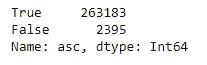

# 使用 Python 和 Adobe Analytics 清理搜索结果文件

> 原文：<https://blog.devgenius.io/cleanup-a-search-result-file-using-python-and-adobe-analytics-dc27153fa8c3?source=collection_archive---------11----------------------->

# 从每周搜索数据集中删除所有非 ascii 字符


这是我们的文件现在的样子

# **索引**

1.  为什么这是一个问题？
    2。我从哪里得到数据？
    3。为什么不 Excel？
    4。如果不是 excel，那么是什么和如何？
    5。如何使这个脚本易于跨设备执行？

> Y 您可以在:[https://github.com/abhraliteyaars/search_cleanup.git](https://github.com/abhraliteyaars/search_cleanup.git)中找到搜索文件的样本副本以及代码和输出文件

# **1。为什么这是一个问题？**

**背景:**我所在组织的搜索团队每周都会对流行的搜索词进行分析。此分析的参数之一是了解一个搜索项在一周内被所有搜索项搜索的百分比。例如下面的快照。


此外，该团队通过比较几周内的%列来监控该搜索词的健康状况。

**问题:**团队注意到，我们的网站有时也允许奇怪的搜索，这些搜索与产品/优惠甚至页面都没有关系。例如:


按作者

由于这些术语进入了我们的最终数据集，我们最终错误地计算了流行搜索术语的百分比。

此外，由于存在大量这样的垃圾条目，这不必要地消耗了我们的数据湖中的空间。

因此，任务是在将文件发送给搜索管理团队之前清除所有这样的值。

# 我从哪里获得数据？

数据将从 Adobe Analytics 数据仓库中提取。


获取这些数据的数据仓库模板

> 在我们的 Adobe analytics 设置中，我们在 evar 中捕获搜索词，搜索是一个事件。这个模板给出了搜索词 evar 在一个搜索事件中出现的次数，换句话说，就是一个搜索词被搜索了多少次。

# 为什么不 Excel？

我们的搜索词报告的典型每周文件超过 4 GB，包含超过 300 万个行项目。Excel 无法处理这么大的量。

# 如果不是 excel，那么是什么和如何？

我们将使用 Python 和 Pandas 库来处理数据帧中如此大的数据集，以便于转换和编码。

我们将从导入必要的 Numpy 和 Pandas 库开始。

```
import pandas as pd
import numpy as np
```

我们将阅读我们的搜索文件，目前是一个 csv 格式。

```
df=pd.read_csv('Search_report_10_10.csv')
df
```


这是我们的文件现在的样子

或者，如果您希望输入的用户输入文件作为输入，请使用以下命令:

```
data_source=input('File name ')
df=pd.read_csv(data_source)
```

如果你想知道我为什么要考虑这个，看看这个博客:

我们将重命名我们的搜索词列，因为搜索词(evar18)太大，不能在代码中使用

```
df.rename(columns = {'Search Term (evar18)':'Search Term'}, inplace = True)
df
```


具有重命名列的新 df

目前我的搜索词被解释为一个对象


需要将其更改为 string 以应用下一组逻辑。

```
df[‘Search Term’]=df[‘Search Term’].values.astype(‘str’)
```

我们将创建一个新列，其目的是根据搜索项列中的条目是否包含任何非 ascii 字符来存储真/假值。

```
df["asc"]=np.nan
df["asc"]=df["asc"].astype('boolean')
```

第一行创建列，并将其初始化为一个[占位符。](https://www.educba.com/numpy-nan/)


这是 df 现在的样子

接下来，我们将遍历数据集，检查每个搜索词是 ascii 还是非 ascii。结果(真/假)将存储在我们启动的“asc”栏中。

```
for i in df.index:
    b=df['Search Term'].iloc[i].isascii()
    df['asc'].iloc[i]=b
```


这是 df 现在的样子

但这还不够。从现在开始我们需要三样东西:

1.  对真与假的计数，以估计每周有多少垃圾搜索发生。

```
display(df['asc'].value_counts())
```

此样本文件的结果计数:



2.创建一个只包含垃圾搜索词的文件

```
df1=df.loc[df['asc'] == False]
df1.to_csv('Garbage file')
```

垃圾文件快照. csv


3.创建一个只包含干净搜索词的文件

```
df2=df.loc[df['asc'] == True]
df2.to_csv('Clean file')
```

clean file.csv 的快照


# 如何使这个脚本易于跨设备执行？

我会写一篇单独的文章来讨论这是怎么回事。ipynb 文件可以转换成. py 文件，然后转换成. exe 文件，这样任何没有 python 的人都可以运行它。在此之前，请订阅我的帖子，以便不断获得提醒！数据清理愉快:)

# 参考资料:

[](https://www.educba.com/numpy-nan/) [## NumPy NaN |在 Python 中使用 NumPy NaN 的示例

### 在 Python 中，NumPy NAN 代表的不是数字，它被定义为声明数值的替代…

www.educba.com](https://www.educba.com/numpy-nan/)  [## ASCII 表

### ASCII(美国信息交换标准码)字符代码图表，包括十进制、十六进制、二进制、HTML 和…

www.rapidtables.com](https://www.rapidtables.com/code/text/ascii-table.html)