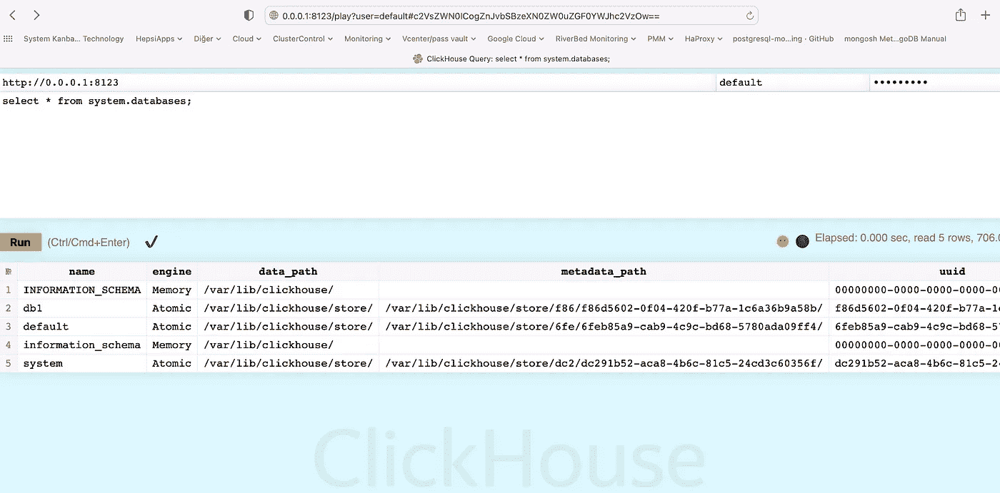
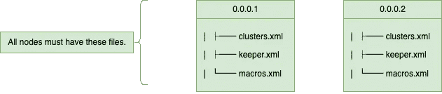
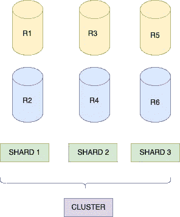

# 使用 Keeper 的 ClickHouse 复制

> 原文：<https://blog.devgenius.io/clickhouse-replication-using-keeper-219ca35821d?source=collection_archive---------4----------------------->


C lickHouse 与为 Yandex 开发的标准 SQL 有一些区别，标准 SQL 是基于列的、分布式的、并行处理的、可水平扩展的，将数据存储在磁盘或内存上，有 SQL 支持，但它是一个 OLAP(没有真正的更新/删除和事务支持)。联机分析处理)是数据库管理系统(DBMS)。

这是一个开源的免费项目。

与其他解决方案相比，查询问题还具有不同的负载平衡和数据一致性机制。

由于 DDL 支持，查询几乎可以在所有连接的服务器上运行。

它为数据一致性、速度、选择和合并过程以及分布式工作提供表结构级别的支持。

从使用它的那一刻起，就能感受到它的有用性和速度，尤其是随着数据的增长。

ClickHouse 中有几种不同的表结构，如分布式、合并、合并树、*合并树、日志、TinyLog、内存、缓冲区、空和文件。最常用的是分布式、内存、合并树及其子分类。“分布式”实际上是一个视图，而不是一个完整的表结构。在进行定义时，强调它是一个结构，但不包含数据。

“ReplicatedMergeTree”表结构通过在同一个集群中创建子集节点来复制数据，即使任何子集的一个元素正在工作，也不会改变我们结果的准确性。

分布式表结构充当这些子集的容器集。这样，我们就可以得到结果，而不用考虑哪些子集在里面，以及那些子集是如何分布的。此外，当您为数据创建分布式子集时，每个子集都可以在自身内部进行查询，并为您提供更快的结果。如文档中所述，建议最多有 300 个节点。

借助 ON CLUSTER {custom cluster}部件，您可以使其适用于所在的集群。使用这种方法，在不知道每个集群包含多少个部分和多少个副本的情况下，您可以通过任何工作节点的名称立即为集群写入所有数据。

# 安装所有节点

您可以使用安装过程中指定的默认用户和密码登录，如下所示。

[http://0.0.0.1:8123/play](http://ipname:8123/play)

**用户**:默认

**密码**:在安装阶段确定。



```
# on shell
clickhouse-client - password=xx - host=0.0.0.1
```

然后，您可以使用 ZooKeeper 或 ClickHouse Keeper 方法来使用复制方法。我们使用了 ClickHouse Keeper 方法和 shard 和 replica 方法。**我们在 6 个节点上实施了该场景，我们使用了 3 个分片和分片之间的 2 个副本。**

***我们在所有服务器上创建 clusters.xml、keeper.xml、macros.xml 文件，这里 keeper.xml 和宏. xml 的值根据节点不同而不同，clusters.xml 在所有节点上都是一样的。***



```
#different all node
/etc/clickhouse-server/config.d/keeper.xml
/etc/clickhouse-server/config.d/macros.xml
#same all nodes
/etc/clickhouse-server/config.d/clusters.xml
```

## **集群**



***clusters.xml***

**主机**:必须写服务器 IP。

**端口**:用于使用本地 TCP 协议 9000 进行通信。

**用户**:“默认”用户名。

**密码**:您在安装时提供的。

***keeper.xml***

**Tcp_port** : 9181 端口，供 keeper 的客户端使用。

**Server_id** :无论有多少台服务器，服务器的数量都是唯一的，所以在我们的场景中，有 6 台服务器。在 keeper.xml 中，服务器是递增的，例如 1、2 等。

**log_storage_path** :协调日志的路径，就像 ZooKeeper 最好把日志存储在不忙的节点上。

**快照存储路径**:协同快照的路径。

**operation_timeout_ms** :单个客户端操作的超时时间(毫秒)(默认为 10000)。

**session_timeout_ms** :客户端会话的最大超时(毫秒)(默认值:100000)。

**raft_logs_level** :关于协调的文本日志级别(跟踪、调试等)(默认:系统默认)。

**rotate _ log _ storage _ interval**:单个文件存储多少条日志记录(默认为 100000)。

**id** :仲裁中的服务器标识符。

**主机名**:服务器 IPs。

**端口** : 9444 端口，用于监听服务器间 keeper 连接。

zookeeper 下的主机每台服务器的 IP。

**端口** : 9181 端口，供保管员客户使用。

***macros.xml***

**集群**:集群名称

副本:哪个副本

碎片:哪个碎片

对于集群中的每台机器，我们需要定义不同的 macro.xml 来显示该机器在集群中的角色，每台机器上的碎片和副本根据您的集群结构而有所不同。

```
clickhouse-db-01 :) select * from system.macros;

SELECT *
FROM system.macros

Query id: 6a960092-5b03-4330-953b-c6de3e43bc95

┌─macro───┬─substitution─┐
│ cluster │ testcluster  │
│ replica │ replica1     │
│ shard   │ 1            │
└─────────┴──────────────┘
```

所有服务器 listen_host 设置为“0.0.0.0 ”,因为它允许通过网络接口进行外部通信。如何使用时区也可以在“listen.xml”中设置。

所有节点上的服务都将重新启动，如果您开始在日志中看到以下错误，则应该在所有节点上执行以下操作。

```
# Certificate file /etc/clickhouse-server/server.crt No such file or directory
openssl req -subj "/CN=localhost" -new -newkey rsa:2048 -days 365 -nodes -x509 -keyout /etc/clickhouse-server/server.key -out /etc/clickhouse-server/server.crt

# /etc/clickhouse-server/dhparam.pem: error:02000002:system library:OPENSSL_internal:No such file or directory (version 22.9.1.344 (official build))
openssl dhparam -out /etc/clickhouse-server/dhparam.pem 4096
```

检查副本

```
yum install nmap -y
```

> four _ letter _ word _ White _ list—4lw 命令的白名单(默认:conf、cons、crst、envi、ruok、srst、srvr、stat、wchs、dirs、mntr、isro、rcvr、apiv、csnp、lgif、rqld)。

```
echo mntr | nc localhost 9181
echo conf | nc localhost 9181
```

> 8123: HTTP 请求的 HTTP API 端口。由 JDBC、ODBC 和 web 界面使用。
> 
> 9181:由 keeper 的客户使用的端口
> 
> 9000:使用本机 TCP 协议进行通信
> 
> 9444:点击房屋管理员筏口
> 
> 9440:安全本地 TCP 协议
> 
> 8443 : HTTPS 接口
> 
> 9010:服务器间 https 端口
> 
> 9281 : ClickHouse Keeper 安全端口

```
CREATE DATABASE app ON CLUSTER 'testcluster';
```

感谢阅读

[](https://clickhouse.com/docs/en/quick-start/) [## ClickHouse 快速入门| ClickHouse 文档

### 启动并运行 ClickHouse 最快速、最简单的方法是在 ClickHouse Cloud 中创建一个新服务。

clickhouse.com](https://clickhouse.com/docs/en/quick-start/) [](https://zhuanlan.zhihu.com/p/461792873) [## 如何在 3 个服务器节点上设置具有 3 个碎片和 2 个副本的 ClickHouse 分布式集群

### 官方网站:ClickHouse -快速开源 OLAP dbmslickhouse 是一个开源的高性能柱状 OLAP…

zhuanlan.zhihu.com](https://zhuanlan.zhihu.com/p/461792873)