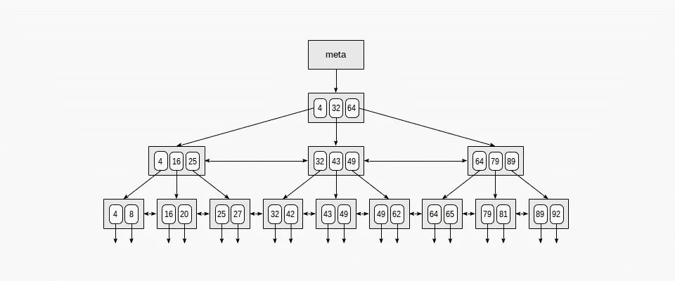
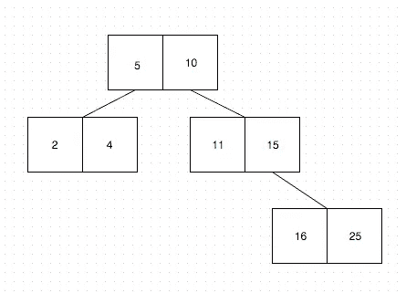
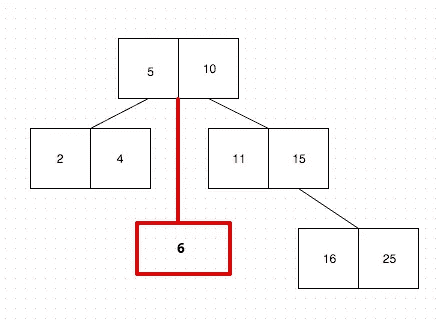

# 在 Postgres 中攀爬 B 树索引

> 原文：<https://blog.devgenius.io/climbing-b-tree-indexes-in-postgres-f82447a2d29c?source=collection_archive---------11----------------------->

在计算机科学中，B 树是一种[自平衡](http://www.entradasoft.com/blogs)树数据结构，它保持数据有序，并允许在对数时间内进行搜索、顺序访问、插入和删除。Postgres 有几种索引类型，但 B 树是最常见的。它们很适合分类和匹配

全文:[http://www . entradasoft . com/blogs/climbing-b-tree-indexes-in-postgres](http://www.entradasoft.com/blogs/climbing-b-tree-indexes-in-postgres)

**这里有一个表格中可用的索引类型的快速概述:**

**B 树:【Postgres 的缺省值。**

**GIN:** 用于 JSONB 和数组。作为倒排索引，它们包含每个单词的索引条目，以及匹配位置的压缩列表。

**要点:**用于全文搜索和地理空间数据类型。GiST 索引是有损耗的，这意味着该索引可能产生错误的匹配。

**SP-GiST :** 适用于具有自然但不均匀聚类的大型数据集

**BRIN** (块范围索引) :对于真正大的数据集，按顺序排列。例如，订单可能有一个日期列，大多数情况下，较早订单的条目出现在表中较早的位置。

**散列:**每当使用=运算符进行比较时，索引列都会被查询计划器考虑使用散列索引。

## B 树的结构

基本上，它是一个自动排序的数据结构。这就是它自我平衡的原因——它自己选择形状。*B 树是二叉查找树的推广，因为一个节点可以有两个以上的孩子。与自平衡二分搜索法树不同，B 树针对读写大型数据块的系统进行了优化。*

*b 树是“平衡的”，因为从根到任何叶节点的距离都是相同的。叶节点是没有子节点的节点。根节点是位于顶部的节点。B 树是这样一种树，其中每个节点可以有多个孩子，或者更好地说，B 树可以有 N 个孩子。在二分搜索法树中，每个节点可以有一个值，而 B 树有键的概念。键就像一个值列表，每个节点都将保存这些值。*

## *让我们把它画出来:*

*关于 B 树最重要的是他们的[平衡方面](http://www.entradasoft.com/blogs)。这个概念基于每个节点都有键的事实，就像上面的例子一样。B 树自我平衡的方式真的很有趣，而键是这个功能最重要的方面。*

**

*基本上，每当一个新的条目(或者，在我们的例子中，一个数字)被添加时，B 树为条目找到合适的位置(或者，节点)。例如，如果我们要添加数字 6，B 树将“询问根节点”，它应该将该数字推入哪个节点。“问”无非是将新数与节点的键进行比较。由于数字 6 大于 5，但小于数字 10(它们是根节点键)，它将在根节点下创建一个新节点:*

**

*通过这种机制，B 树总是有序的，并且在其中查找值是相当便宜的。*

*现在，如果我们想查找键 6，我们将比较 6 和根节点中的值，看到它在 5 和 10 之间。所以我们使用 5 和 10 之间的指针来查找包含 6 的节点。*

*这是对 Postgres 实现的抽象，但是你可以想象为什么这比遍历表中的每个数字并检查它是否等于 6 要快。*

*这就是为什么 B 树可以在 O(logN)时间内进行搜索、插入和删除。*

## *限制*

*几乎在所有用例中，索引的力量在大量数据上是显而易见的。这意味着索引必须和实际的数据表一样大。是吗？*

*想象一下，如果我们正在处理数十亿条记录。这意味着索引表将以有序的方式存储数十亿条记录。好吧，PostgreSQL 可以处理这个问题。但是，你能想象一个`INSERT`命令需要多长时间吗？在数据表中添加记录需要很长时间，因为索引必须在正确的位置添加新记录，以保持索引的顺序。由于这种限制，B 树索引的实现保留了**页面文件**，简单地说，就是一个大 B 树数据结构上的节点。*

***语法:***

*—在采购表上使用 btree 创建索引列
—在< <表上创建索引< <索引 _ 名称> >使用< <索引 _ 类型> >*

*阅读更多…[http://www . entradasoft . com/blogs/climbing-b-tree-indexes-in-postgres](http://www.entradasoft.com/blogs/climbing-b-tree-indexes-in-postgres)*