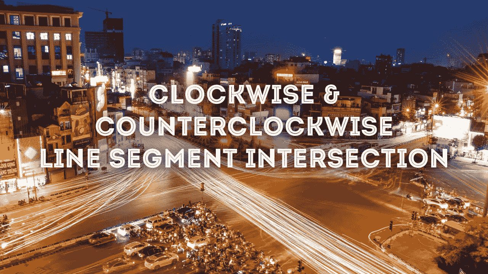
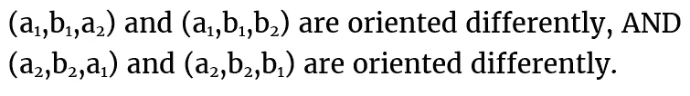
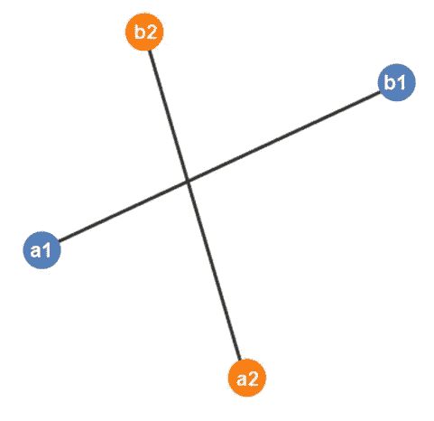
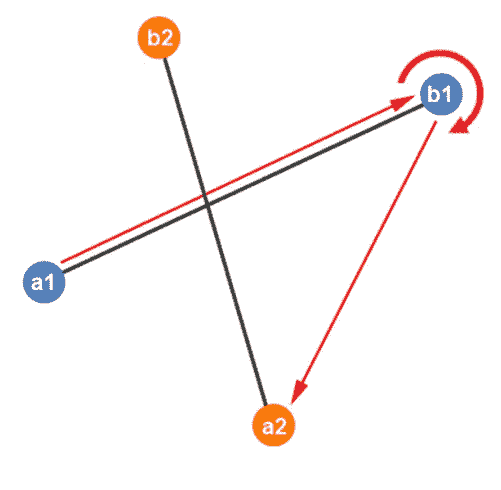
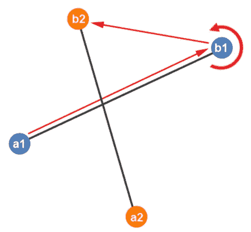
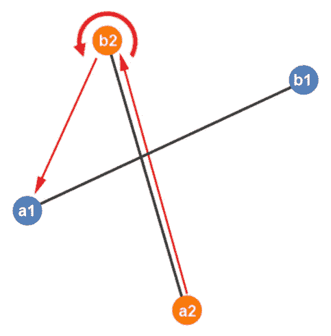
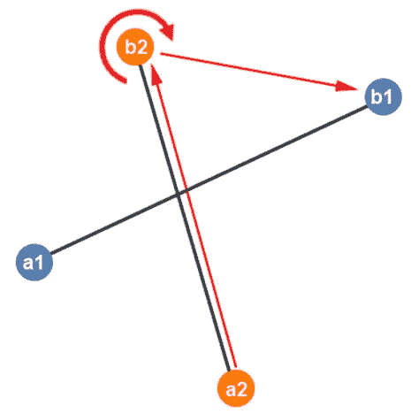

# 顺时针和逆时针线段交点

> 原文：<https://blog.devgenius.io/clockwise-and-counterclockwise-line-segment-intersection-b3317839534e?source=collection_archive---------17----------------------->

如果给你一个问题，要找出两条线段是否相交，有一个简单的方法。它包括找到线段的方向。如果它们不同，它们就会相交。

每条线段都有起点和终点。我们的第一条线将由(a *1* ，b *1* 表示，我们的第二条线将由(a *2* ，b *2* 表示。

为了测试它们是否相交，我们需要验证以下条件:

这到底是什么意思？让我们看一个例子来找出答案。

我们很清楚两条线段相交，但你的电脑却不清楚。我们需要在上述条件下测试它。让我们走过每一步。

首先我们来看一下(a *1* ，b *1* ，a *2* 的方位)。我们可以看到这个方向是顺时针的。

接下来，我们移动到(a *1* ，b *1* ，b *2* )。方位是逆时针的，因此，(a *1* ，b *1* ，a *2* )和(a *1* ，b *1* ，b *2* 的方位不同。

我们必须测试第二部分，以确保这些线对之间的方向也是不同的。(a *2* ，b *2* ，a *1* 的朝向为逆时针。

接下来，我们移动到(a *2* ，b *2* ，b *1* )。由于朝向为顺时针方向，因此，(a *2* ，b *2* ，a *1* )和(a *2* ，b *2* ，b *1* )朝向不同。

由于两者(a *1* ，b *1* ，a *2* )和(a *1* ，b *1* ，b *2* )的朝向不同，并且(a *2* ，b *2* ，a *1*

*如果你喜欢你所读的，看看我的书，* [*算法说明性介绍*](https://www.amazon.com/Illustrative-Introduction-Algorithms-Dino-Cajic-ebook-dp-B07WG48NV7/dp/B07WG48NV7/ref=mt_kindle?_encoding=UTF8&me=&qid=1586643862) *。*

迪诺·卡伊奇目前是 [LSBio(生命周期生物科学公司)](https://www.lsbio.com/)、[绝对抗体](https://absoluteantibody.com/)、 [Kerafast](https://www.kerafast.com/) 、[珠穆朗玛生物](https://everestbiotech.com/)、[北欧 MUbio](https://www.nordicmubio.com/) 和 [Exalpha](https://www.exalpha.com/) 的 IT 主管。他还担任我的自动系统的首席执行官。他有十多年的软件工程经验。他拥有计算机科学学士学位，辅修生物学。他的背景包括创建企业级电子商务应用程序、执行基于研究的软件开发，以及通过写作促进知识的传播。

你可以在 [LinkedIn](https://www.linkedin.com/in/dinocajic/) 上联系他，在 [Instagram](https://instagram.com/think.dino) 上关注他，或者[订阅他的媒体出版物](https://dinocajic.medium.com/subscribe)。

[*阅读迪诺·卡吉克(以及媒体上成千上万其他作家)的每一个故事。你的会员费直接支持迪诺·卡吉克和你阅读的其他作家。你也可以在媒体上看到所有的故事。*](https://dinocajic.medium.com/membership)