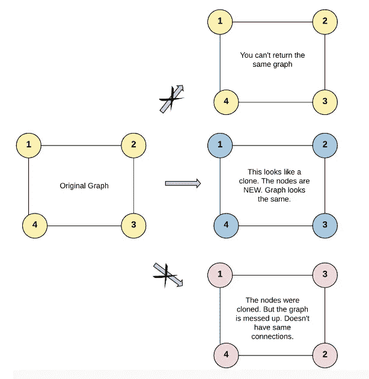

# 克隆一张图

> 原文：<https://blog.devgenius.io/clone-a-graph-b2b1e6e7e900?source=collection_archive---------14----------------------->


[M. B. M.](https://unsplash.com/@m_b_m?utm_source=medium&utm_medium=referral) 在 [Unsplash](https://unsplash.com?utm_source=medium&utm_medium=referral) 上拍照

嘿…不要以为这只是小孩子的游戏。这当然容易，但并不简单。

让我们看看问题陈述:-

**问题陈述:-** *给出一个* [***连通***](https://en.wikipedia.org/wiki/Connectivity_(graph_theory)#Connected_graph) *的无向图中的一个节点的引用。*

*返回一个* [***深度复制***](https://en.wikipedia.org/wiki/Object_copying#Deep_copy) *(克隆)的图形。*

*图中的每个节点都包含一个 val (* `*int*` *)和一个它的邻居列表(* `*List[Node]*` *)。*

```
class Node {
public:
    int val;
    vector<Node*> neighbors;

    Node() {
        val = 0;
        neighbors = vector<Node*>();
    }

    Node(int _val) {
        val = _val;
        neighbors = vector<Node*>();
    }

    Node(int _val, vector<Node*> _neighbors) {
        val = _val;
        neighbors = _neighbors;
    }
};
```

**假设:-** *为了简单起见，每个节点的值与节点的索引相同(1-indexed)。例如，第一个节点用* `*val = 1*` *，第二个节点用* `*val = 2*` *等等。该图在测试用例中使用邻接表来表示。*

***邻接表*** *是一组无序的* ***列表*** *用来表示一个有限图。每个列表描述了图中节点的邻居集。*

*给定的节点将始终是第一个带有* `*val = 1*` *的节点。必须返回给定节点* *的* ***副本，作为对克隆图形的引用。***

示例 1:



资料来源:www.leetcode.com

```
**Input:** adjList = [[2,4],[1,3],[2,4],[1,3]]
**Output:** [[2,4],[1,3],[2,4],[1,3]]
**Explanation:** There are 4 nodes in the graph.
1st node (val = 1)'s neighbours are 2nd node (val = 2) and 4th node (val = 4).
2nd node (val = 2)'s neighbours are 1st node (val = 1) and 3rd node (val = 3).
3rd node (val = 3)'s neighbours are 2nd node (val = 2) and 4th node (val = 4).
4th node (val = 4)'s neighbours are 1st node (val = 1) and 3rd node (val = 3).
```

在你开始狂热地观看我想与你分享的方法之前，我想敦促你花一些时间来思考解决方案。

下面是 LeetCode 的原问题链接，供你练习:- [克隆图](https://leetcode.com/problems/clone-graph/)

我想和你分享 BFS 和 DFS 解决这个问题的方法。
让我们从 DFS 开始:-

# **解决方案 1:深度优先搜索(DFS)**

由于我们只需要制作原始图节点的一个克隆节点，
我们创建原始图的每个节点到克隆图的每个节点的映射，然后在克隆节点之间制作相应的连接。

## *步骤:-*

1.  *处理边缘情况:-* 如果节点为空，则返回空
    例如:-如果 adjList 为[]，则输出应为[]，因为图为空。
2.  如果节点的克隆版本已经存在，则返回克隆节点。
3.  否则，使用与当前节点相同的数据创建一个新的克隆节点，并在映射中链接它们。
4.  遍历当前节点的每个邻居，并将邻居的克隆节点连接到当前节点的克隆节点。
5.  返回当前节点。

```
class Solution {
public:
    //to store mapping of   clone nodes with original graph nodes
    unordered_map<Node*, Node*> cloneLink;
    Node* cloneGraph(Node* node) 
    {
        //handle edge case is node is null
        if(node == NULL)
            return NULL;

        //clone node already exists then return it
        if( cloneLink[node])
            return cloneLink[node];

        //if doesn't exist then create a clone
        //node with same data of the current node
        Node* curr = new Node(node->val);

        //and link that node to the mapping
        cloneLink[node] = curr;

        //go through each neighbour of current node and 
        //push the clone nodes of the neighbour to the 
        //neighbor vector of the current node
        for(int i = 0; i < (node->neighbors).size(); i++)
            curr->neighbors.push_back( cloneGraph(
                                       node->neighbors[i]) );

        //return the current node
        return curr;
    }
};
```

# 解决方案 2:广度优先搜索(BFS)

让我用一种新方式来解释这些方法。我将解释这些步骤，并给出实现这些步骤的代码片段。

主要思想是从给定的节点开始，并像通常那样将它推入队列，以将当前节点的子节点推入队列。我们注意只推送队列中的原始图节点，因为最初只有那些节点包含其子节点的信息。然后对于每个孩子，如果它在队列中，就把它放入队列，如果它没有被放入队列，就克隆它

## 步骤:-

1.  *边缘案例处理:*如果节点为空，则返回空

```
if(node == NULL)
   return NULL;
```

2.我们维护一个访问过的向量来跟踪哪些节点被访问了，哪些没有被访问。

```
vector<int> visited(101, 0);
```

3.还要维护一个向量来保存指定节点值的克隆。如果还没有克隆节点值，那么它在那个位置将有 NULL。

```
vector<Node*> doesCloneExists(101, NULL);
```

4.克隆我们在函数调用中得到的根节点，并将其放入队列中进行 BFS。
注意:-仅将原始图节点推入队列，因为最初只有它们包含任何节点的子节点信息。

```
queue<Node*> q;
q.push(node);
```

5.将此节点标记为已访问，并将此克隆节点的引用存储在 doesCloneExists 向量中。

```
visited[node->val] = 1;
doesCloneExists[node->val] = root;
```

6.执行步骤 7 - 11，直到队列为空

7.将队列前面的节点存储为当前正在调查的节点。然后弹出来。

```
Node *curr = q.front();
q.pop();
```

8.对于当前节点的每个邻居，遵循步骤 9 到步骤 11

9.如果这个节点还没有被访问过，那么把它放入队列，并标记为已访问。

```
if(visited[neigh->val] == 0)
{
    q.push(neigh);
    visited[neigh->val] = 1;
```

10.检查此未访问节点的克隆是否存在。如果 clone 不存在，则制作一个克隆，并将其引用存储在 doesCloneExists 向量的相应索引值下。
结束步骤 9 的 if 块。

```
 if(doesCloneExists[neigh->val] == NULL)
     {
          Node* childClone = new Node(neigh->val);
          doesCloneExists[neigh->val] = childClone;
     }         
}
```

11.将相邻节点的克隆添加到正在调查的当前节点的邻居列表中。

```
doesCloneExists[curr->val]->neighbors.
                            push_back(doesCloneExists[neigh->val]);
```

12.最后返回根克隆节点。

这是我解释的完整 BFS 方法的完整演示。

```
Node* cloneGraph(Node* node) 
    {
        if(node == NULL)
            return NULL;
        vector<int> visited(101, 0);
        vector<Node*> doesCloneExists(101, NULL);

        Node *root = new Node(node->val);

        queue<Node*> q;
        q.push(node);
        visited[node->val] = 1;
        doesCloneExists[node->val] = root;

        while(!q.empty())
        {
            Node *curr = q.front();
            q.pop();

            for(Node *neigh : curr->neighbors)
            {

                if(visited[neigh->val] == 0)
                {
                    visited[neigh->val] = 1;
                    q.push(neigh);

                    if(doesCloneExists[neigh->val] == NULL)
                    {
                        Node* childClone = new Node(neigh->val);
                        doesCloneExists[neigh->val] = childClone;
                    }

                }
                doesCloneExists[curr->val]->neighbors.                                                  push_back(doesCloneExists[neigh->val]);
            }
        }

        return root;
    }
```

我希望我的解释能够帮助你理解这个问题的概念。然而，我愿意接受各种反馈。你可以通过发邮件到 jainlokesh318@gmail.com 很容易地联系到我。

# 快乐编码……..！！！！！！！！