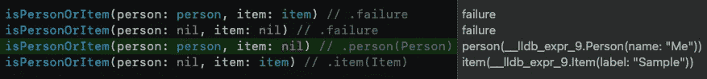

# 弥补代码中的漏洞——避免表现无效的场景

> 原文：<https://blog.devgenius.io/close-holes-in-your-code-avoid-representing-invalid-scenarios-9641e89b962e?source=collection_archive---------7----------------------->

## 一个好的 API 不容易崩溃

## 使用枚举设计 Swift 代码

保持这些孔关闭，这样你的用户就不会遇到干扰！

通常，在开发代码库时，您可能希望用两种可能结果中的一种来模拟一种情况。在 Swift 中，这通常意味着使用 optionals 作为方法的返回类型。想法是其中一个为零，另一个非零。

在这种情况下，您可以创建一个方法，返回一个带有两个可选参数的元组。不是零的那个是通过测试的那个。这解决了想知道哪个包含值的问题。对你来说不幸的是，这产生了一个新问题。

## 例如

您需要知道一个对象是`Item`还是`Person`。在这个特定的场景中，it *必须让*成为其中之一。使用上面的方法和这个精心设计的例子:

# 您刚刚创建了一个无效的路径…

## `(person: nil, item: nil)`这不是我们所期待的结果。

记住，当你设计一个 API 时，你应该考虑下一个开发者。如果你正在为自己开发一个应用程序，那么下一个开发者就是你。我已经数不清有多少次不得不跳回到我几个月甚至几年前创建的代码中——不知道部分代码发生了什么，或者仅仅是因为我不记得我的初衷而误用了一些东西。

说到下一个开发者，如果这个开发者决定也为`(person: person, item: item)`创建一个案例呢？这对于您设计 API 时所期望的结果也是无效的。

创建这样的无效路径的问题是，你已经为 bug 潜入代码库创造了可能性。如果下一个开发人员用`(person: nil, item: nil)`调用这个方法，但是他们期望一个非零结果，该怎么办？也许他们强行打开了它，现在我们遇到了麻烦…

希望这不会造成那么大的问题，因为我确信你已经将全面的单元测试集成到你的应用程序中了…对吗？即便如此，它也为不必要的错误留下了空间，我们应该避免这种事情。

## 可选方案增加了预期结果现场的复杂性

不要误解我，我是可选方案的强烈支持者—这是我如此喜欢 Swift 的原因之一…但它们确实增加了复杂性。通过使用选项，您将看到必须打开结果才能看到它包含的内容。它让你做更多的决定。我要强行打开它吗？我可以打开它吗？我使用零合并吗？你明白了…

# 那么，如何避免无效路径，但仍然达到您想要的结果呢？

作为第一步，您可以创建一个非常简洁但是非常强大的 enum，它封装了一个 person 案例、一个 item 案例和一个 failure 案例。人员和项目案例具有相关联的值`person(Person)`和`item(Item)`。失败案例也可以有一个像`Error`这样的值，但是在这个例子中我们没有这样做。这只给了我们 3 个可能的返回路径:`person(Person)`、`item(Item)`。还有`failure`。

现在我们可以返回`PersonItemResult`，而不是返回`(person: Person?, item: Item?)`。在我们的方法中，我们将打开人和物品。如果它们的值成功展开，我们将返回适当的案例。如果都没有展开，我们返回失败案例。

在我们的调用站点，这为我们提供了案例和(如果有的话)相关的值。然而，我们仍然有一个无效路径要处理。如果一个人和一个项目都被传入怎么办？我们说过非此即彼。虽然我们的返回值代表一个或另一个，但在`item`和`person`都有值的情况下，我们不会失败——我们将只返回`.person(person)`,因为第一种情况会通过。很简单，我们只需要确保`item`在第一次检查中为零，而`person`在第二次检查中为零。

不再有无效路径！

要在没有操场输出的帮助下判断出它是哪种类型，您可以像这样简单地打开返回值:

就是这样！您创建了一个枚举，它表示我们希望作为返回值表示的唯一事例，并且您阻止了无效事例返回有效值。

通过考虑我们的预期结果，我们可以很容易地防止错误潜入我们的代码库。像这样的枚举可以在许多不同的情况下与许多不同的类型一起使用，并且在转换一个闭包中的多个值时特别强大。

对于接下来的步骤，您可以创建一个 HTTP 客户机，它的 enum 只表示您希望客户机表示的`URLResponse`、`Data`和`Error`的可能组合，然后将其用于您的闭包类型。

评论里见！⏬