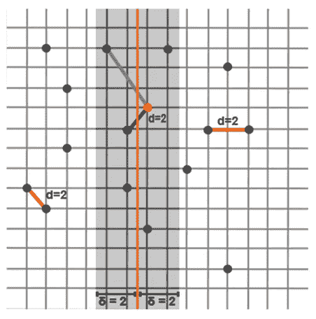

# 平面上最近的一对点—分而治之

> 原文：<https://blog.devgenius.io/closest-pair-of-points-on-a-plane-divide-and-conquer-ea622870a9a7?source=collection_archive---------2----------------------->

如果给我们一组位于一个平面上的点，我们如何计算出哪些点对是平面上最近的点对？这些点通常存储在一个数组中。一种方法是采取分而治之的方法。怎么会？按照下面的步骤:

*   数一数平面上的点数。
*   将这些点分成相等的两组，并在中间画一条线。*如果有奇数个点，那么一条线至少会穿过其中一个点。*
*   求左边两点间的最小距离和右边两点间的最小距离。
*   无论最小距离是多少，δ，在中线的左边和右边创建一个与该距离相等的区域。
*   从新创建区域的底部开始，比较左侧的点和右侧的点。注意，不是所有的点都要比较。

让我们看一个例子。我们有一架 16 分的飞机。

第一步是在中间画一条线，这样就可以创建左平面和右平面。左边 8 个点，右边 8 个点。

接下来，我们将在左侧找到最近的一对点，在右侧找到最近的一对点。

接下来，我们将找到两者之间的最小距离。因为它们都等于 2，所以我们设δ = 2。中线左侧δ = 2 的区域和中线右侧的区域都被加上阴影。

我们将从底部开始，然后向上移动。只有不在同一区域的点才会被比较，因为在同一区域的点已经被比较过了。将底部点与相对侧的下一个点进行比较，得出距离为 3。这一点将不包括在内。因为我们已经知道其他点离我们更远，所以没有必要去比较它们。

我们转到第二点。

第二个点的下一个最近点在同一区域，所以我们移动到第三个点。对面的下一个最近点在 2 个单位之外。由于它在最小距离约束内，我们将在计算点之间的最近距离时包括该点。

我们移动到点 4，找到到左边点 5 的距离。距离为 5，因此排除了路径。

最后，我们求出从左边的点 5 到右边的点 6 的距离。距离为 3，因此该路径也被排除。

我们到达终点。没有额外的点，我们可以找到距离，所以算法结束。两点之间最近的距离是 2。

如果你喜欢你所读的，看看我的书，**算法的说明性介绍。**

**

*Dino Cajic 目前是 [LSBio(寿命生物科学公司)](https://www.lsbio.com/)、[绝对抗体](https://absoluteantibody.com/)、 [Kerafast](https://www.kerafast.com/) 、 [Everest BioTech](https://everestbiotech.com/) 、 [Nordic MUbio](https://www.nordicmubio.com/) 和 [Exalpha](https://www.exalpha.com/) 的 IT 负责人。他还是我的自动系统公司的首席执行官。他有十多年的软件工程经验。他拥有计算机科学学士学位，辅修生物学。他的背景包括创建企业级电子商务应用程序、执行基于研究的软件开发，以及通过写作促进知识的传播。*

*你可以在 [LinkedIn](https://www.linkedin.com/in/dinocajic/) 上联系他，在 [Instagram](https://instagram.com/think.dino) 上关注他，或者[订阅他的媒体出版物](https://dinocajic.medium.com/subscribe)。*

*阅读 Dino Cajic(以及 Medium 上成千上万的其他作家)的每一个故事。你的会员费直接支持迪诺·卡吉克和你阅读的其他作家。你也可以在媒体上看到所有的故事。*