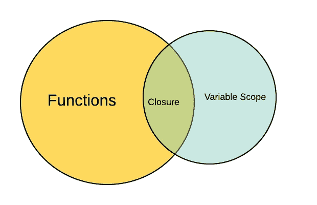

# JavaScript 中的闭包

> 原文：<https://blog.devgenius.io/closure-in-javascript-9fedc358a485?source=collection_archive---------1----------------------->

闭包是 JavaScript 中的一个概念，JavaScript 开发人员有时很难理解。这个问题在面试中经常被问到，人们却无法回答。所以在这篇文章中我们将理解这个概念。闭包是一个非常大的概念，我将尝试用简洁的方式来解释它。

闭包不是 JavaScript 独有的概念。这是 20 世纪 70 年代的一个概念，远在 JavaScript 出现之前。你可以在谷歌上搜索更多关于关闭历史的细节。

为什么它很重要？

今天，这个概念在函数式编程领域非常重要。此外，JavaScript 并不是一种完全面向对象的语言，尽管 ES-6 试图在两者之间架起一座桥梁。
所以如果你想在全局范围内隐藏你的变量，因为数据隐私，闭包同样是一个非常好的概念。

**注**

在深入这个概念之前，让我告诉你，JavaScript 中的每一件事，比如函数、类，都是变量。

所以我们有一个外部函数**和一个内部函数**。函数**内部**正在从外部作用域访问变量。现在在**外部**函数内部声明的**内部**函数被称为闭包。

现在我们将内部函数作为外部函数的参数返回。

现在这些东西真的很重要。

1.  当第一次调用 outer 函数时，它返回内部函数，值存储在变量 x 中。
2.  一般来说，一旦提供了返回值，该函数中的所有其他元素就变得无关紧要了。垃圾收集器收集这些值。简单地说，垃圾收集器应该收集 a=10 的值，我们以后不能使用它。
3.  但是在关闭的情况下不会发生这种情况。闭包函数(在本例中是函数 inner)仍然能够访问。

4.我们观察到，我们能够访问 a 的值，并且能够打印 a+b 的值。

所以这就是封闭的概念。很快我会更详细地解释这个概念。

**我希望你们喜欢这篇文章。请在这里订阅更多精彩的文章，并请给出一个👏如果你觉得这篇文章信息丰富。**