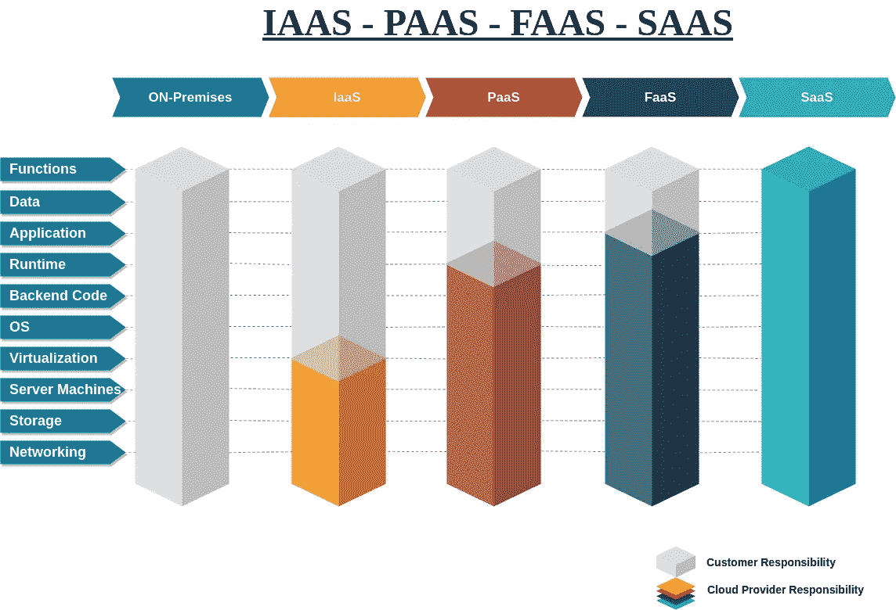

# 云计算

> 原文：<https://blog.devgenius.io/cloud-computing-b8f0736482a5?source=collection_archive---------54----------------------->

泰勒·维克在 [Unsplash](https://unsplash.com?utm_source=medium&utm_medium=referral) 上的照片

# 什么是云？

云是通过互联网交付给你的按需计算资源。这可以概括为公共互联网的另一个词。将大型计算任务从智能手机、电视、智能设备物联网和台式机转移到庞大的数据中心的过程。

> *云计算是一种计算方法，它利用按需、自我管理的虚拟基础架构的高效池* ***— VMware***

# 云的特征

是什么让云不同于内部或本地计算基础架构。

*   **弹性** —根据资源需求快速伸缩。
*   **计量** —按使用量付费。
*   **自助服务** —减少对 IT 专家的需求。无需设置物理硬件即可运行。
*   **可扩展** —在需要时易于扩展
*   **全球** —在全球多个地方拥有数据中心，打造全球影响力。
*   **安全** —云提供商提供顶级的物理安全性

**云计算的优势**

1.  可变费用的交易资本费用

2.从大规模经济中获益

3.停止猜测容量

4.提高速度和灵活性

5.不再花钱运行和维护数据中心

6.走向全球

# 云计算的类型

## 基础设施即服务(IaaS)

IaaS 是云计算的一种形式，通过互联网提供虚拟化资源。IaaS 为个人或企业提供了在架构层面管理平台的能力。借助 IaaS，用户管理和控制应用、数据、中间件和操作系统，而提供商管理服务器、硬盘和存储 **DigitalOcean、Linode、Rackspace、亚马逊网络服务(AWS)、思科 Metapod、微软 Azure、谷歌计算引擎**

**用例**

*   迁移工作负载
*   测试和开发
*   存储、备份和恢复

## 平台即服务(PaaS)

平台即服务(PaaS)是一个完整的开发和部署环境，其中的资源使您能够交付从简单的基于云的应用程序到复杂的支持云的企业应用程序的一切。这些主要的云服务面向希望在云中开发、运行和管理应用程序的开发人员。 **AWS Elastic Beanstalk、微软 Azure、Heroku、SalesForce.com、谷歌 App Engine、Apache Stratos、OpenShift**

**使用案例**

*   发展体系
*   分析或商业智能

## 作为服务的功能(FaaS)

FaaS 也知道“无服务器”是一种相对较新的云计算模式。该模型基于无服务器计算技术和架构，允许软件开发人员在云中轻松部署应用程序，而无需管理服务器。

## 软件即服务(SaaS)

软件即服务，也称为云应用服务，是云市场中企业最常用的选择。云为客户和组织提供主机应用程序，并通过互联网提供这些应用程序。 **Google Apps、Dropbox、Salesforce、思科 WebEx、Concur、GoToMeeting**

这是不同云类型的简要比较，以及客户和提供商之间如何分担资源责任

# 云部署模型

云部署模式定义了数据的存储位置以及您或您的客户与数据的交互方式。不同的模型将决定您对基础架构的控制程度。

这是不同云类型的简要比较，以及客户和提供商之间如何分担资源责任。

***私有云***

私有云也称为单租户环境，是一种由单个客户或公司租用计算资源的模式。这有时会产生本地基础设施和服务。

私有云的优势包括:

*   更高的安全性
*   增加灵活性
*   高度定制化
*   增强的可扩展性
*   效率更高

***公有云***

云服务通过公共互联网提供，由第三方提供商提供，称为公共云。这些服务是按需消费或基于订阅的模式。这是最常见的基础设施类型，如 AWS Azure、谷歌、数字海洋。

公共云的优势包括:

*   成本更低—因为不需要购买硬件或软件
*   无需维护，因为服务提供商负责维护
*   接近无限的可扩展性
*   提高可靠性

***混合云***

这是两种云基础架构公共云和私有云的结合。这也可能是内部私有数据中心资源与云服务提供商提供的资源的组合

混合云的优势包括:

*   灵活性
*   控制
*   成本效益
*   轻松过渡

**多云**

当一个组织使用多个经常连接的云服务来提高可伸缩性时，就称为多云。

***社区-云***

这是一个在社区内共享的基础设施，可以是跨组织的，也可以是有类似顾虑的公司。

# 云计算的使用

这是云的一些用途，但不限于:

**生产率**

我们与云的互动可能比我们想象的更频繁。使用工具，如使用**谷歌文档**、**微软 365** 、**语法上**等等，都是在互联网上使用的美国生产力工具。

**备份和恢复**

如果您想在灾难发生时安全地存储数据。云可以是通用的。如果需要使用，可以恢复这些数据。最受欢迎的云存储是 **Onedrive** ， **GoogleDrive Dropbox** 。

**大数据分析**

云必须拥有强大且有弹性的计算能力。这种能力可用于以比内部部署更快的速度分析大数据。

**网站托管**

云拥有可用于托管 web 应用程序到复杂的内部业务开发系统的资源。

## 架构良好的框架的五大支柱

**>** 成本优化

**>** 可靠性

**>** 卓越运营

**>** 性能效率

**>** 安全

**结论**

随着技术的进步，云正在统一公司和组织开展业务的方式。云正在为软件开发人员如何考虑解决这个具有挑战性的问题设定一个标准。