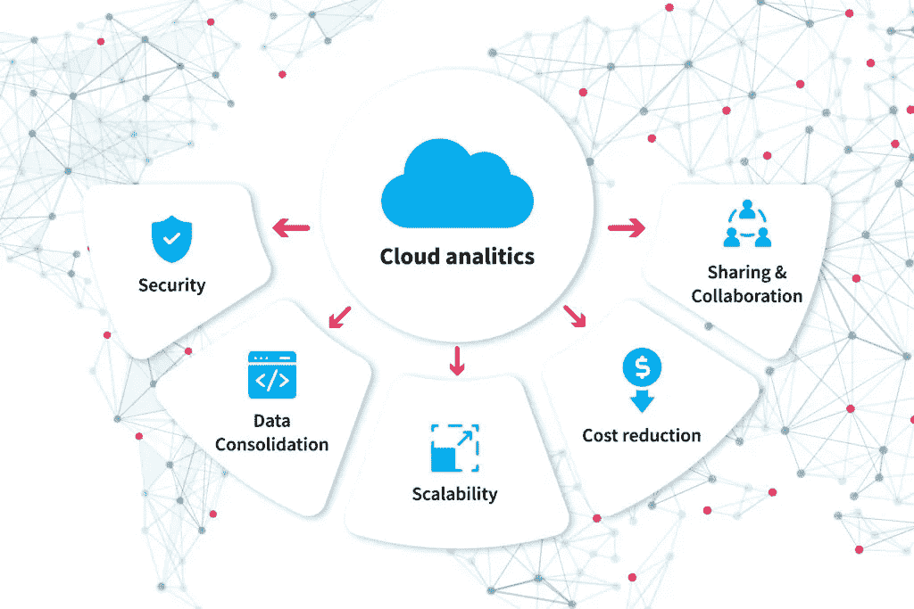
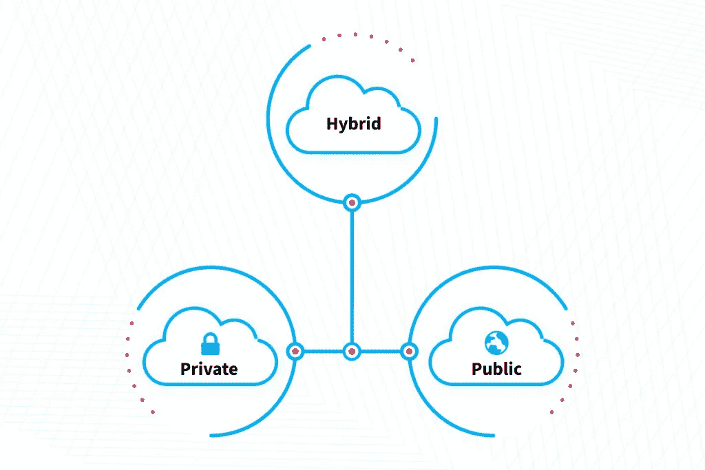

# 云数据分析:基础概述— NIX United

> 原文：<https://blog.devgenius.io/cloud-data-analytics-basics-overview-nix-united-7eca5387e4d?source=collection_archive---------8----------------------->

很难想象至少有一个行业不受云技术的影响。更准确地说，是一个没有云服务的世界。今天，任何企业，从花架到火箭制造商，都可以通过特定的云服务来提供服务。在相对较短的时间内，云已经成为世界各地公司的重要资源。

数据无处不在，但是如果没有合适的解决方案来分析数据，它实际上是无用的。一家[云服务提供商](https://nix-united.com/services/enterprise-it-integration-and-customization-services/)可以帮助您做到这一点，它将一个云系统集成到您的企业中，该系统在云中存储、收集和处理数据，然后提供信息来支持您公司的各个部门。让我们回顾一下企业主应该知道的云分析的关键细节。

在我们进入细节之前，我们需要先弄清楚一些基本的定义。那么，云计算中的云分析是什么，它如何帮助现代企业？

# 什么是云分析

技术发展趋势正在积极推动企业[向云](https://nix-united.com/blog/cloud-migration-main-benefits-strategies-and-process-stages/)迁移。

数据量的显著增加使得系统更加复杂和笨拙。然后需要增加 IT 专家的数量，这需要消耗更多的电力并增加维护成本。将公司数据存储在内部服务器上时，流程灵活性降低，业务可扩展性大大降低。

但随着云解决方案的使用，所有这些问题都很快得到解决。这为数据存储和分析提供了安全可靠的虚拟环境。

基于云的分析在 2022 年比以往任何时候都更受欢迎[。当我们谈论云分析时，我们指的是用于分析大量数据的软件，通常是在软件即服务(SaaS)的基础上提供的。这是技术、基础设施、分析解决方案和方法的结合，帮助客户在很短的时间内从收集的数据中提取必要的信息，实际上是实时的。](https://nix-united.com/blog/cloud-trends-for-2022-which-ones-are-worth-following/)

在云计算模型中，数据分析发生在云中，而不是本地。虽然本地分析或常规电子表格可能足以满足小型企业的需求，但云分析解决方案允许公司使用所有计算服务来处理大量数据，包括服务器、存储、数据库、网络、软件、人工智能和机器学习功能。

虽然云分析解决方案大多基于 SaaS，但有些也可以通过平台即服务(PaaS)模式提供。用户自己创建在云基础设施上运行的定制解决方案。它们是为特定的任务、业务基础设施和其他需求而定制的。在此期间，提供商维护中间件、操作系统、虚拟化功能、服务器、存储和网络组件。

借助基于云的分析，系统维护成本显著降低，生产率得以提高。这是因为所有的计算都不是在你自己或租用的设备上进行的，而是在云中进行的。由于远程集中化，每个员工都可以通过互联网访问可靠的数据。

# 云分析的工作原理

现代数据处理中心，也称为数据中心，是为创建和托管高性能 IT 基础设施而设计的服务器机房。它允许公司处理大量数据，帮助达到新的生产力水平，同时找到更好、更准确的结果。它为大多数企业提供了一个双赢的局面，使数据处理变得可负担和可访问。

云分析流程包括几个主要阶段:

1.  数据接收是从不同的源以不同的格式收集结构化和非结构化的数据源。它可以是任何东西——CSV 文件、来自物联网设备的遥测数据，甚至是视频和音频记录。
2.  数据处理，系统以不同的方式构造数据、合并和提炼数据，为分析算法准备信息。
3.  读取数据的分析软件。这用于各种目的，例如了解客户行为。
4.  以表格、图形、图表等形式向用户提供数据。例如，统计[病人就诊的医生](https://nix-united.com/blog/technology-in-healthcare-that-changes-the-industry-unrecognizably/)。

我们已经生活在一个连接到物联网的设备比人还多的世界。许多行业正在使用物联网来实时了解消费者需求，提高敏捷性，提高机器和系统的质量，简化运营，并找到创新的工作方式，作为其数字化转型工作的一部分。

例如，来自医疗物联网的流数据，如跟踪运动，睡眠和各种生命体征的可穿戴设备。

物联网应用用于解决许多现实世界的问题:交通拥堵、与城市服务的互动、经济发展、市民参与城市生活以及公共安全和安保。

再举一个例子:太阳能、风力等分布式网络资源通过物联网进行整合。和行为数据，如来自智能家居的数据，提高了便利性和安全性，并有助于开发定制服务。

以上所有数据都是企业每天收集的结构化和非结构化数据，它们的数量和速度各不相同。要从物联网的大数据中受益，你需要分析它，在云中使用它很方便:你不需要庞大的服务器机房来存储和处理数据。关键方法包括过滤、规范化、标准化、转换、聚合、关联和时间分析。

您可以找到满足所有业务需求的专用软件。基本工具可以执行原始功能，而人工智能和机器学习解决方案将处理最复杂的工作，以帮助业务。让我们仔细看看使用云分析的好处。

# 为什么您不会后悔选择云分析

# 改善决策

这是主要的好处。借助云分析，这一过程变得更快，并在尽可能短的时间内产生有效的结果。这就是为什么组织可以获得有价值的信息，从而提高决策的质量。

当 IT 部门进行自己的数据控制时，他们很难做出快速、明智的决策。借助云分析，IT 专业人员可以专注于逻辑，抛开所有基础架构问题。由于及时的信息，这使您能够实现您的目标:吸引新客户，增加收入，并使您的业务更快达到一个新的水平。

# 减少开支

虽然成本可能因公司而异，但与其他 IT 基础架构相比，云解决方案可能更具成本效益。这是因为，有了云计算，你只需为你使用的东西付费。因此，提供商提供帮助企业节省 IT 基础设施成本的工具。

通常通过以下方法实现成本节约:

*   获得更多样化的 IT 服务
*   更换本地设备和服务器机房
*   额外服务仅应要求提供
*   提高运营效率

迁移到云基础架构需要初始投资。但是有了正确的支出管理策略，良好的投资回报率是可以实现的。

# 提高灵活性

从根本上来说，云分析比本地计算更加灵活。如果您需要纵向扩展，无需集成额外的物理资源。事实上，在许多云计算方案中，您可以在需要时实时访问更多资源，然后削减以节省资源。

例如，如果你经营一家电子商店，你知道在黑色星期五会有更多的活动。云服务将在需要时解决这个问题，而不是全年维护服务器。

# 安全改进

许多人认为云中的数据是不安全的。企业主对云中的文件、程序和数据有多安全感兴趣——怎样才能防止黑客获取和访问这些数据？

服务提供商保证安全。最佳安全工具的组合:从静态数据加密和传输系统到多种安全设置的实施，可以提供非常可靠的基础架构。即使有数据泄露，也需要几分钟才能检测出来。

但是云服务的用户也应该非常小心，遵守所有的安全规则，尤其是在控制数据访问和管理安全密钥的时候。在您的内部和云基础架构中使用一致的安全性是确保安全性的最佳方式。

# 提高流动性

远程工作现已成为常态。这在疫情期间变得特别流行。想要保持竞争力的企业正在从世界各地雇佣熟练工人，无论是在公司所在的城市还是在地球的另一边。

云是一种互联网服务。这意味着云中的所有资源都可以通过互联网获得。用户需要登录帐户并访问云中的资源。员工不需要在现场工作就能获得工作所需的资源。

同事之间需要来回发送电子邮件来交换信息的日子已经一去不复返了。现在每个人都使用云存储，在编辑文件时实时更新文件。云协作软件最简单的例子就是 Google Docs，可以多人编辑。

云分析结合了所有公司数据源，以获得更完整的业务流程图。所有员工，无论他们的物理位置、时间和心情如何，都可以轻松地访问数据并与世界各地的员工共享数据。

# 改进的灾难恢复

今天，每个人都明白保护自己免受数据丢失是多么重要。因此，许多人备份文件、照片等。在云端。商业也是如此。

所有组织都需要意识到数据丢失会在某个时候发生。如果他们所有的重要文档和文件都存储在一个地方，一场灾难就可能毁掉整个组织。

云存储允许公司将大量数据保存在远离办公室的多个位置。如果发生事故，他们可以简单地打开他们的恢复协议，回到起点。为了防止数据丢失和应用程序停机，云提供商确保跨多个站点复制数据。这可以防止灾难或任何其他意外错误造成的损失。

另一个优点是，您不必坐在那里等待安装更新。云应用程序自动完成这项工作，无需 IT 人员的干预。这样可以节省时间和金钱。总的来说，这些工具非常容易使用；员工无需事先培训即可使用云分析工具。

# 减少对环境的危害

通常，云的这一优势被完全忽略了。但在现代现实中，当动物濒临灭绝，后代受到全球变暖的威胁时，事实上，云技术不像安装、维护和处理机器那样，对环境的危害要小得多。您只需在云中租用或购买一个地方，而不需要维护服务器机房，从而显著节省电力。

云基础设施是新的常态。技术已经取得了长足的进步，新的选择和解决方案已经出现，不容忽视。根据业务的特点和需求，您必须为分析平台选择一种云模型。这将是做出重要战略商业决策的良好开端。

# 云的类型

有三种主要类型的云:私有云、公共云和混合云。每种类型都有其优点，并适合于某些任务。让我们来了解一下他们。

# 公共云

公共云是虚拟资源和服务组合到一个基础架构中，并作为服务(IaaS)提供给客户。借助标准云计算模型，包括虚拟机、应用程序和数据存储在内的资源可供远程用户使用。

公共云的一个类比是当前流行的联合办公形式，在这种形式下，客户可以获得一个准备好的舒适的工作空间进行租赁。但是，它必须与邻居分享，而你无法选择他们。公共云的例子众所周知。这是一个网站，电子商店，或电子邮件处理，银行账户等 SaaS。

公共云保证了快速部署和扩展能力，而且不需要巨额成本。有时服务提供商可能会收取费用，但这仍然比部署自己的硬件和软件基础设施要便宜。

# 私有云

与公共云不同，私有云不是向所有用户提供的，而是只向私有网络内部的用户提供。当底层 IT 基础架构专用于具有完全隔离的访问权限的单个客户端时，云就变成了私有的。

与公共云一样，私有云分析提供可扩展性和自助服务，但它驻留在独立组织的数据中心或托管服务中。这提供了高水平的隐私和安全性。但是安装和维护网络和应用程序将比公共云服务更昂贵。

# 混合云

选择混合云时，部分基础架构托管在提供商的公共云中，部分托管在私有云中。他们一起工作。混合云基础架构由虚拟网络、服务器、虚拟化软件和云基础架构的其他元素组成。

通过这种组合，云环境之间的数据交换变得更加容易。选择混合云分析系统的企业使用公共云存储公共数据，使用安全的私有云存储敏感数据。

借助混合云，公司可以获得云分析的所有优势，包括可扩展性、安全性和低成本。

# 云分析是未来

在本文中，我们详细探讨了什么是云分析以及它给企业带来的诸多好处。公有云，私有云，还是混合云，都无所谓。数据量正以极快的速度增长，因此越来越多的公司正在转向云基础设施，如果您的公司不熟悉这一点，那么请考虑将 [NIX United 作为您可靠的合作伙伴](https://nix-united.com/blog/data-analytics-in-the-cloud-in-simple-words/#contact-us)。联系我们，了解有关云分析的更多信息。

*原载于 2022 年 5 月 20 日***。**