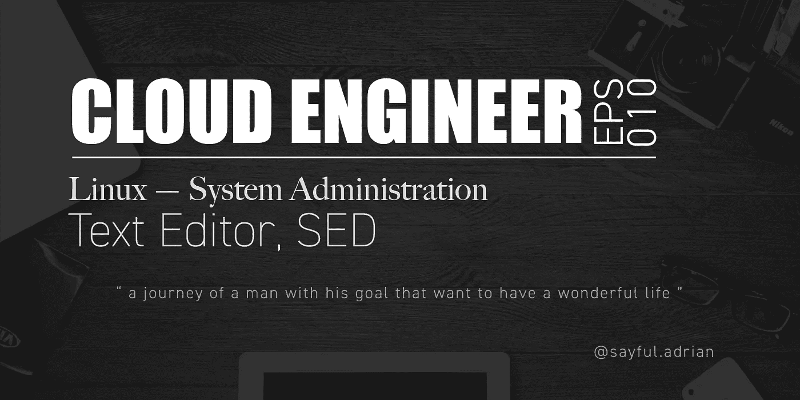
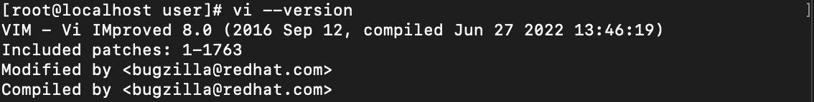

# 云工程师 Eps。10: Linux —系统管理

> 原文：<https://blog.devgenius.io/cloud-engineer-eps-10-linux-system-administration-e6872112936f?source=collection_archive---------15----------------------->

## LINUX 文本编辑器



# 简短介绍

## 什么是文本编辑器？

文本编辑器是一个平台，我们主要用来编辑任何包含文本的文件，用于脚本或编码目的。你听说过:**记事本**，**记事本++** ，或者**括号**吧？不，它们是文本编辑器的例子。

在 Linux 中，有 OS 本身自带的默认工具(不过要看是哪个 OS)。它们是:

```
Column 1: List of Text Editor in Linux.1\. vi         - VIsual Editor
2\. vim        - VIsual IMproved (Advanced vers. of vi)
3\. ed         - Standard Line Editor
4\. ex         - Extended Line Editor
5\. emacs      - Full Screen Editor
6\. pico       - Beginner's Editor
```

在本文中，我只是练习使用基本上是`vim`的`vi`。为什么？因为它们具有我们想要的特性，并且是系统管理中最常用的。

## 我们为什么不用另一个应用编辑器呢？

原因很简单:因为我们希望运行 Linux 的计算机运行得又快又稳定。

## SED 命令

Linux 中有另一个命令可以帮助你编辑文件中的文本，而不用真正打开它。

# VI 与 VIM

`vi`在最近的 Linux 或 Unix 系统中，运行`vi`也会把我们带到`vim`。当我在运行 **CentOS Stream 8** 的虚拟机中检查我的`vi`版本时，你可以看到我下面的截图，它显示的是`vim`而不是`vi`。



VI 命令运行 VIM。

## 差异

`vi`是作为 POSIX 标准的一部分开发的，而`vim`不是，尽管`vim`与`vi`兼容。下面是`vim`有而`vi`没有的特性。

1.  多级撤销
    `vim`最多可以记住 1000(一千)个动作。其中`vi`只支持一级撤销。
2.  多窗口
    `vim`也支持多窗口，可以垂直分割(使用`-O`选项)或水平分割(使用`-o`选项)。
3.  用标签打开，每个文件一个标签
    我用`-p`测试过，足以让我在一个命令中运行多个标签上的多个文件的编辑器。
4.  灵活插入模式
    在`vi`中您不能自由移动，所以您必须点击`esc`然后移动并再次点击`i`按钮进行编辑。
5.  水平和垂直滚动
    这也是最有用的功能，这也是`vi`如此强大的原因。

等等，如果你想了解更多关于`vim`相比`vi`的优势，你可以阅读[这篇文章](http://www.viemu.com/a-why-vi-vim.html)。用最简单的方式来说，主要区别如下:

主要区别

## `VIM`免费培训

因为`vim`对我们这样的系统管理员来说很重要，所以我发现免费的 vim 培训非常有用。我建议你也试试这个:

 [## 维姆格尼乌斯

### 使用 Vim Genius 提高您的速度和改善您的肌肉记忆，这是一款定时抽认卡式游戏，旨在让您…

vimgenius.com](https://vimgenius.com)  [## 交互式 Vim 教程

### 在这里你可以练习你所知道的，并学到更多。它将帮助你实现成为一名系统管理员的目标！

openvim.com](https://openvim.com) 

# SED 命令

这个命令是惊人的。不需要像`vim`一样打开文本编辑器，你可以做以下所有事情:

SED 命令功能

下面是一些`sed`命令的例子:

```
Column 2: Examples of SED command.sed 's/word before/word after/g' [filename]
//It will substitute (**s**) **word before** with **word after** globally (**g**), but only for the output and not saved in the file itselfsed -i 's/word before/word after/g' [filename]
//It will substitute (**s**) **word before** with **word after** globally (**g**) with the change saved in file. If you want to create a backup, behind option **-i** add the suffix. like **-i[0]**, it will create new file as the backupsed '/word to filter/d' [filename]
//It will remove every lines where **word to filter** resides, and only showing where **word to filter** is not presentsed '/^$/d' [filename]
//**SED** also capable on running **regex** (regular expression), so with this command, **SED** will remove every line with empty textsed '1,2d' [filename]
//**SED** will remove first two linessed 's/\t/ /g' [filename]
//This will remove all **tab** character in [filename], and replace it with space. As I mentioned before that, **sed** capable on reading **regex** and **\t** is a **regex** format.sed -n 12,18p [filename]
//It only will show line from 12 to 18\. Because -n is an option to choose which line we want the system to showsed 12,18d [filename]
//It is reversed output from above. It only will show everything, except line 12 to 18sed 'N!s/word before/word after/g'
//It will replace all **word before** with **word after** except line number **N**. 
```

另外，在`vim`中你也可以进行替换。类似地，通过运行`:%s/word before/word after/`会将文件中之前的所有**字替换为**之后的**字。**

# 结论

我从未想过在 Linux 中编辑文本和文件会很容易，但是..这实际上取决于文件和我们想要替换的内容本身。所以我会继续下去，继续钻研 Linux！我的下一篇文章再见！

```
 Read more of my stories Here!
[< My Previous Blog](/cloud-engineer-eps-9-linux-learn-the-basics-19d9205331e5)                                    [My Next Blog >](https://medium.com/@sayful.adrian/a-love-note-from-me-e751a9671789)
```