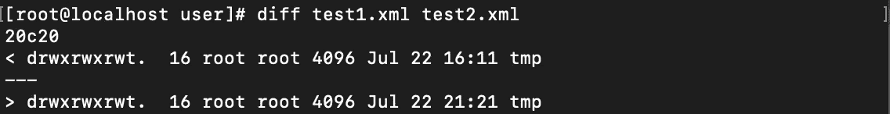
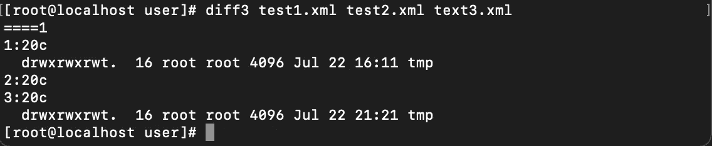
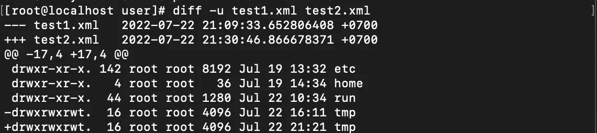
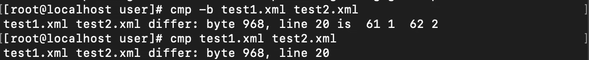
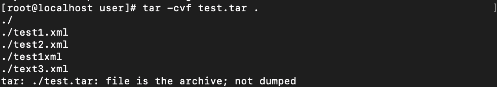
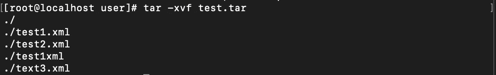
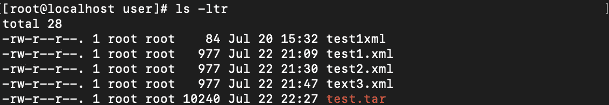
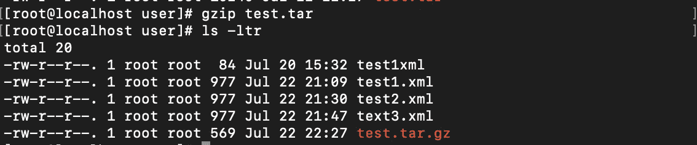
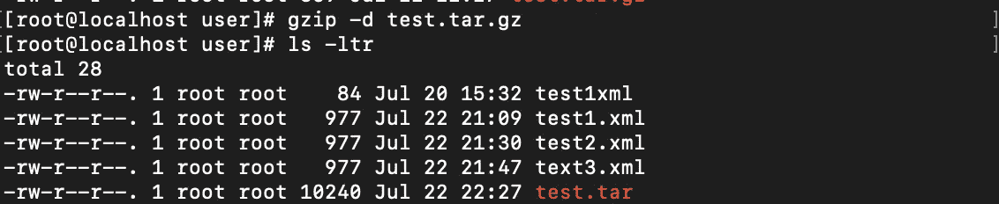
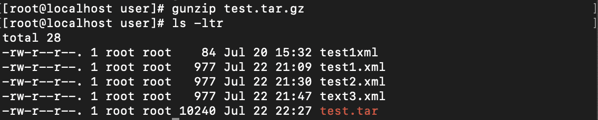

# 云工程师 Eps。8:Linux——学习基础知识

> 原文：<https://blog.devgenius.io/cloud-engineer-eps-8-linux-learn-the-basics-70dbb9c78da7?source=collection_archive---------11----------------------->

## 比较、涂焦油、取消压缩

# 简短介绍

我不知道如何把这些命令组合成一个类别，所以我只是把它们写成一个小标题。重要的注意事项是:这些命令对我们这些系统管理员来说很重要。

# 比较

我们直接进去吧！

## 差速器

有些人声称 Windows 没有这个功能。不，这是不对的！Windows 在命令行中有这个命令，叫做 *fc* ( [如果你想了解更多，点击这里](https://docs.microsoft.com/en-us/windows-server/administration/windows-commands/fc))。

在 Linux 中，我们可以使用 **diff** 或者 **diff3** 。以下是一些例子:

```
Column1: DIFF, DIFF3 CommandsFormat: 
diff [args] [filename1] [filename2]
diff3  [args] [filename1] [filename2] [filename3]
```



差异命令



DIFF3 命令

此外，您可以通过使用选项进行一些试验，例如:



带有-U 参数的 DIFF 命令精确显示文本

此外，您可以使用这个命令比较目录，这是 CMP 所不能做到的。

## 金属波纹管(Corrugated Metal Pipe)

CMP 的功能与 DIFF 不同。CMP 将只打印不同的字节。

```
Column2: CMP CommandFormat: 
cmp [args] [filename1] [filename2]
```



CMP 命令

# 塔灵

你听说过 **ZIP** ， **GZ** ， **7Z** ， **RAR** 吗？它们是压缩扩展，用于简化向同事或朋友发送多个文件的过程。在 Windows 中，我们通常使用的应用程序有: **winRAR** ， **winZIP** ， **7ZIP** 。

在 Linux 中，有工具可以用来压缩: **tar** ， **gz** ， **gunzip** 。这个活动叫做**涂焦油**(对我这样的一些人来说)或者**编译**和**提取**。

## TAR 编译

如果有许多文件或文件夹你想压缩，首先你必须把它们放入 1 个文件。

```
Column3: TAR CommandFormat: 
tar [args] [tar filename] [directory]
```



TAR 编译命令

如果 CVF 呢？(C)代表**创建** , (V)代表**详细** — *显示*执行什么系统，(F)代表**强制**

## 焦油提取物

你收到 TAR 文件，如果刚才我学习了如何把文件放入其中，那么如何把它解压到一个文件夹中呢？很简单。如果(C)代表**创建**，那么我们可以用(X)代表**提取**。



TAR 提取命令

# 取消压缩

我的标题让你困惑了吗？呵呵。我的意思是**压缩&解压缩**。我选择这些词只是为了使它少于普通词。

好的，在我们把文件编译成一个文件后，我们可以压缩它，这样 **TAR** 文件就会变小。是啊！这就像是**在 Windows 中通过应用程序压缩文件**！那么怎么做呢？

## 压缩

```
Column4: GZIP commandFormat:
gzip [args] [filename]
```



压缩前的 TEST.TAR

**test.tar**的大小为 10240 字节。所以我使用 **gzip** 命令来缩小它的大小。



测试。压缩后的焦油

现在，【test.tar】的改成了**的【test.tar.gz】的**，大小缩减到了 569 字节。

## 解压缩

现在，我们有了 **gz** 文件，如何解压缩？嗯，很简单。您可以使用 **gzip -d** 或 **gunzip** 。



使用 GZIP -D 解压缩



使用 GUNZIP 解压缩

他们之间有什么不同？我现在不知道。我只是看到它们都可以用来解压缩文件。但是，如果你知道什么，请告诉我你的评论！

# 结论

Linux 很神奇，Linux 很强大。我运行的 Linux 只有 1 GB 内存和 1 个 CPU，它有能力做这些事情。对于 Windows，我想我做不到。但是，如果我错了，请纠正我！

```
 Read more of my stories Here!
[< My Previous Blog](https://medium.com/@sayful.adrian/cloud-engineer-eps-7-linux-learn-the-basics-3a28bb2c9dbb)                                    [My Next Blog >](https://medium.com/@sayful.adrian/a-love-note-from-me-e751a9671789)
```