# 云工程师 Eps。9:Linux——学习基础知识

> 原文：<https://blog.devgenius.io/cloud-engineer-eps-9-linux-learn-the-basics-19d9205331e5?source=collection_archive---------14----------------------->

## 截断、合并和分割文件

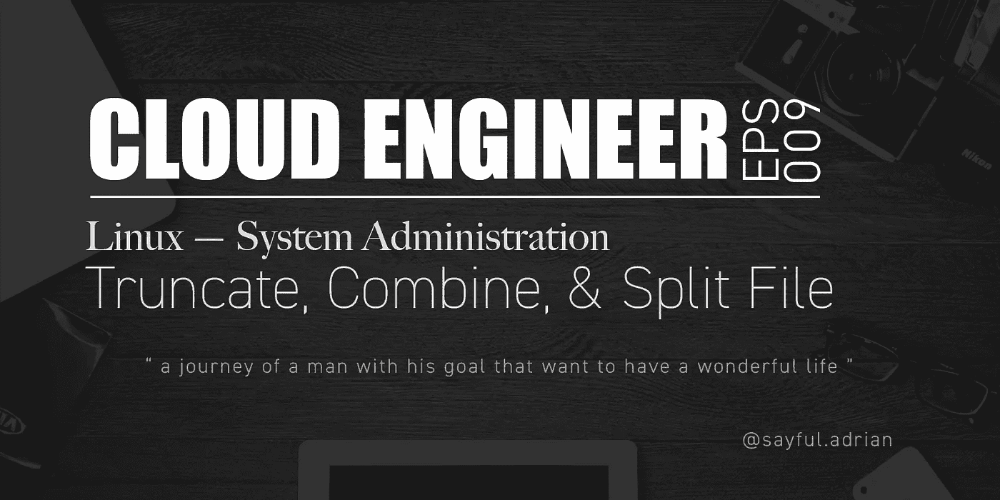

# 简短介绍

作为一名 IT 人员，有时我需要用准确的大小来测试发送、移动或复制。比如，测量从 A 点到 b 点的连接速度。不，这些命令可以帮助你做到这一点，而不仅仅是测试！

# 缩短

首先，让我们在测试目录中创建一个文件。通过使用我以前学过的命令。

```
Column 1: Create a filevi [filename]
//press "i" on your keyboard to change into input/insert mode
//fill some texts
//press "esc" and type :wq to "write" and "quit"
```

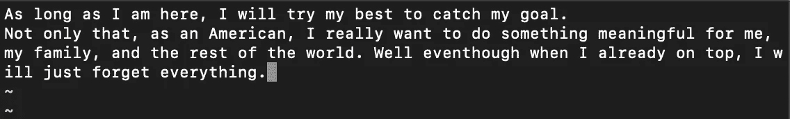

VI 命令来创建文件

现在该文件的大小为 247 字节

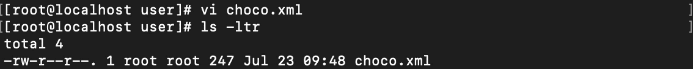

choco.xml 的 247 字节大小

## 增加尺寸

我们可以使用这个命令来添加大小，而不需要在那个文件中手动添加文本:***truncate[filename]—size[size in number(bytes)]***。

将您的测试文件放到命令中，在下面的例子中，我选择 500 作为文件的大小。当我检查时，该文件正好有 500 字节，并且通过使用 ***cat*** 命令，只显示我之前写的文本。

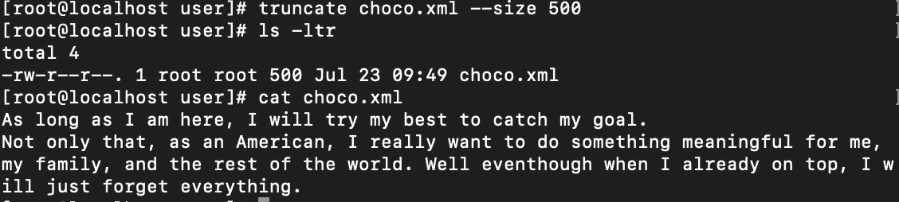

增加文件大小的截断命令

里面到底发生了什么？好了，让我们用 ***vi 编辑器*** 打开那个文件。让我们看看系统做了什么。

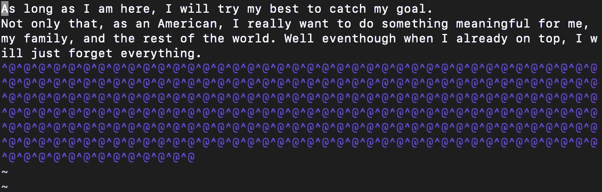

截断会添加更多不可读的字符，从而增加文件大小

系统在符号处写入**脱字符号**和**的重复字符，使文件比以前大。**

## 减少

我们可以使用这个命令减小文件大小吗？当然了。但是请在你的纸条上写下:

> 一旦通过 truncate 方法减小了文件大小，其中的初始数据或文本将被剪切，并且永远不会恢复，即使您使用此命令增加了文件大小。

把我刚才截取的文件设为默认大小。

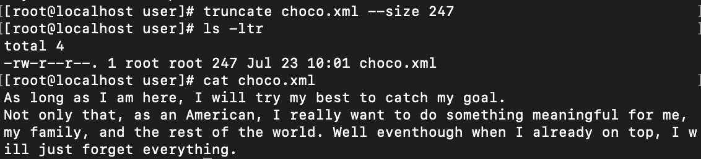

将文件设为默认大小。

让我们用 **truncate** 命令将文件缩小到 100 字节。

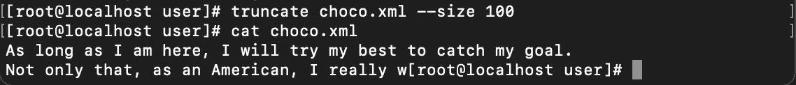

文本正在被剪切。即使再次使用此命令，剪切的文本也不会被检索。

现在文件大小已经减小，内容已经被截断。

# 结合

我运行这个命令来创建新文件:

```
Column1: Creating new filesls -ltr / > choco.xml
ls -ltr /home/localadmin > berry.xml
```

这将把 **/(根文件夹)**和 **/localadmin(用户文件夹)**上的目录列表输出到不同的文件中。

让我们把它们结合起来！

```
Column2: Combine files by using CAT commandFORMAT:
cat [args] [filename1] [filename2] > [filenameoutput]
```

是的， **choco.xml** 和 **berry.xml** 已经合并成一个新文件，命名为 **final.xml** 。我检查了输出文件，这里是:

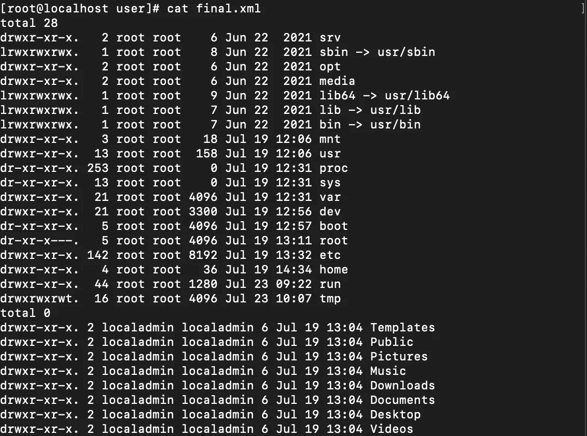

卡特彼勒命令联合收割机

# 使分离

不仅可以合并，我们还可以将文件拆分成多个文件，并且可以配置我们使用什么术语来拆分。如:基于**尺寸**或**线条**。我们还可以对输出文件进行编号。

从上面的 **final.xml** 开始，我将其重命名为 **final1.xml** 并复制到 **final2.xml** 。我想首先根据**字节**分割它们，然后根据**行**分割它们。这些文件各有 29 行和 1460 字节。

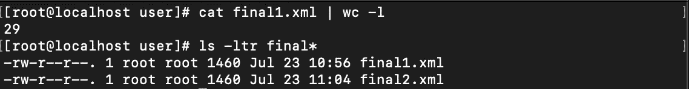

final.xml 文件

```
Column3: SPLIT commandFormat:
split [args] [filename]split -b [size] -d [suffix] [filename]
//this will split [filename], so the split files have the same [size] and give name [suffix]numbersplit -a [digitlength] -l [linelength] [filename]
//this will split [filename], so each file has [linelength] and give suffix [x][xx] -> this xx will look like [aa][ab][ac] and so onYou can run split --help or man help to know more
```

现在，该文件已按其大小进行了拆分:

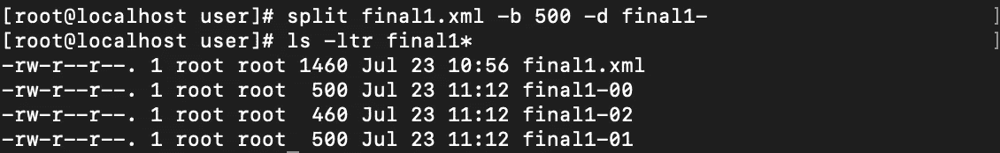

按大小分割文件

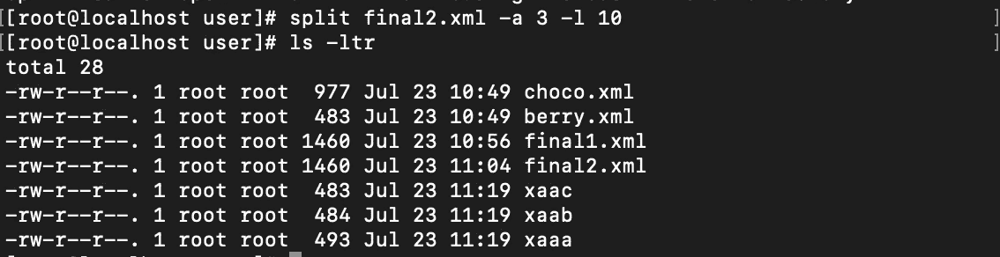

按行分割文件

# 结论

**卡特彼勒**命令不仅具有显示功能，还具有组合功能。很高兴知道！此外， **TRUNCATE** 是一个很好的工具，如果我需要测试一个文件的确切大小(我认为，当我已经在一个工作环境中时，会比这个大)。**组合**和**拆分**也很惊人！

祝大家有美好的一天！祝你愉快！

```
 Read more of my stories Here!
[< My Previous Blog](/cloud-engineer-eps-8-linux-learn-the-basics-70dbb9c78da7)                                    [My Next Blog >](/cloud-engineer-eps-10-linux-system-administration-e6872112936f)
```