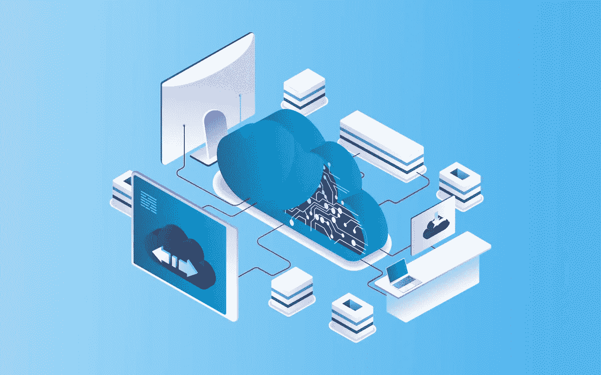

# 云迁移:主要优势、策略和流程阶段— NIX United

> 原文：<https://blog.devgenius.io/cloud-migration-main-benefits-strategies-and-process-stages-nix-united-5a884eb6ef23?source=collection_archive---------13----------------------->

当遗留的数据存储和处理系统不再能胜任任务、限制新技术的使用并阻碍商业生产力时，及时的系统现代化是最适当的措施。因此，您将能够采用更多促进业务发展的功能和工具，按照最佳市场实践存储和处理数据，并根据您公司或框架的扩展能力进行高效扩展。

与传统的专有数据管理解决方案相比，迁移到云计算环境可能是您的最佳选择，提供灵活的数据存储容量、高级安全性和显著的成本节约。最终，迁移到可靠的基于云的系统托管，您不必支付所有的软件实施、支持和维护成本，只需为按需服务付费。

但是，让我们深入主题，弄清楚云迁移的来龙去脉——您从中获得了什么，从哪里开始，如何更好地实现整个过程，选择正确的云迁移策略，等等。

# 云迁移的终极优势

通过及时、适当的内部云迁移，可以实现明显的具体成果和优势。尽管不同的公司可能会有所不同，但总的来说，这是你做出这一决定性努力的结果。

# 高级云机会

借助最新的云计算，您可以获得由智能技术支持的深度集成分析，帮助您的企业变得更加个性化，更有效地发现市场需求，并提高长期服务质量。人工智能和商业智能等先进技术也可能推动工作流程的彻底自动化，减轻员工的压力，他们必须处理大量繁琐、单调且容易出现人为因素错误的手动工作。

总体而言，与内部部署解决方案相比，您通常可以获得更高的整体性能，因为云容量几乎可以无限扩展，从长远来看，这对于最终的用户体验最为有利。一个决定性因素是，您的*租赁的*云数据中心在地理上可能位于您的目标人群附近，从而减少最终用户的网络延迟。

# 现成的安全性和法规遵从性

云环境的核心是安全和合规的，以便按需提供服务。这意味着是云托管提供商监控和加强所有安全方面。因此，符合所有主要数据法规是现成的，而最大的云平台提供商(包括微软、亚马逊、谷歌等。)当然要注意和加强数据保护机制和网络安全协议，以保持高端质量。

您可以放心，在规划和实施整个云迁移流程的过程中，通常会有一家知名公司来帮助您采用最久经考验的[云数据安全最佳实践](https://nix-united.com/blog/how-to-secure-your-business-in-the-cloud-best-practices/)。

# 方便的扩展机会

云系统可以方便地扩展，以支持更多的用户，处理更多的任务，并应对更高的性能强度，而不会出现重大的专有问题。这都是因为云容量可以在提供商方面扩展到几乎任何需要的程度。您实际上不需要为轻松扩展而费心处理所有服务器/存储/网络硬件和许可证。

# 更广泛的可及性和流动性

几乎可以通过任何连接到万维网的现有设备高度访问云解决方案。无论是客户还是员工，访问您的服务只需解锁智能手机、上网并启动您的应用程序。这正是员工所需要的灵活性，也是快速响应的 UX 现代用户所寻求的。总体而言，迁移到云是您企业高效数字化转型的重要组成部分，更不用说您获得的国际扩展机会了。

# 显著优化的开支

正如我们将要重复的，云提供商有责任处理所有的技术维护、支持、更新和软件问题，包括扩展工作和系统优化。您只需为所使用的功能付费(通常基于订阅模式)。这可能会帮助您将一些过多的 IT 运营相关成本转移到公司的创新或市场推广计划投资上。

# 关键云迁移策略考虑事项

我们可以看到，迁移到云可以为您的业务带来真正的改变。但是，您需要从一开始就理解的是，这是一个非常复杂、高度负责的计划，需要仔细的准备和考虑。在考虑选择迁移方法并开始准备之前，您需要知道以下几件事。

# 定义要迁移的数据位

当谈到云数据迁移时，即使全面的云/数字现代化/转型是主要目标，仍然可能有一些数据可以安全地删除，从而降低迁移工作流的复杂性，降低存储成本，并避免数据阻塞的风险。这涉及过时的归档数据、损坏的历史数据、陈旧的数据卷等等。云迁移是清理这一切的最佳时机。

# 想办法转移敏感数据

您可能已经在原有的本地存储中存储了大量机密和个人数据。加上人们提供的大量消费者个人数据(尤其是当你与广泛的目标受众合作时)，你就有了一个必要的任务来保证这些数据的安全和可靠。为此，您需要确保您收集、存储和处理这些数据的方式符合主要的数据隐私法规(您可能听说过其中的 GDPR)。

# 以云部署方式解决问题

基本上，云迁移方法的基本定义是从选择首选部署格式开始的。不同的方法可能适合不同的目标和项目细节。常见选项包括:

*   单一云部署—虽然选择单一公共云或私有云托管供应商可能不是最具成本效益的选择，但肯定是一致的选择。你肯定知道你在和谁打交道，不需要额外的整合努力和传播沟通。但是，您也仅限于一种云格式(并且只有一层好处)。
*   多云部署—这是指将两个或多个公共云结合在一起，让您节省成本，享受共享托管的所有云优势。这也是一个很好的选择，因为它支持可靠的备份，并允许集成许多不同的第三方提供商提供的不同功能和工具。
*   混合云部署——混合方法的要点是抓住所有好的部分(特性、模块等)。)并建立自己独特的复杂云托管解决方案。因此，私有云和公共云托管可以结合起来，让您两全其美。然而，这样的解决方案需要加强集成和管理工作(数据能力和员工的广泛地理分布在这里不会有太大的好处)。

最终决定应基于特定的项目细节，如预算、范围等，您的最佳选择是向合格的云工程师进行全面的项目咨询。

# 确定迁移后任务的优先级

为了获得项目最完整的图像，还必须计划好系统迁移后的状态。特别是，在迁移后的最终运行环境中正确部署和启动整个系统所需处理的任务将会像所有其他基础任务一样影响总体项目预算。您需要预先对它们进行概述并划分优先级(迁移后的主要任务之一是构建一个经过深思熟虑的用户访问权限层次结构)。

# 可供选择的云计算迁移的主要类型

根据特定的业务活动范围、需求以及所提供的服务类型，云计算能力可以通过多种方式部署。迁移到云战略的最终选择取决于您愿意并准备投入到整个项目中的预算范围和运营时间，以及其他特定需求。我们可以指出以下主要的云计算迁移策略。

# 基本的重新托管，也称为提升和移位

简而言之，您通过将现有应用程序从其内部托管环境中取出并部署到云服务器中来重新托管软件。这是最基本的迁移方式，因为它不需要改变应用程序的基本架构。您的系统只是在云环境中按原样重新部署。为此，您需要一个 IaaS(基础设施即服务)服务提供商来为您提供一个可以重新部署的云基础设施。

这种方法的主要优势包括:

*   简单——几乎不涉及额外的软件修补；
*   速度—重新托管可能是将工作负载迁移到云的最快方式；
*   一致性—您可以更好地保证所有移动的数据保持完整，这对于存储大量敏感数据并将其移动到云中的复杂系统尤其重要。

以上几点可能正好完美契合你的业务需求。然而，与此同时，您可能不得不牺牲一些基本的重新托管功能的灵活性，因为这通常并不意味着深入的定制软件修改。将此视为您的快速(几乎是*即插即用*)选项，将成本效益和短期迁移置于一切之上。

# 全面的平台迁移

完整的平台迁移是指将现有应用从其传统操作系统中完全迁移出来，并将其置于新的底层云平台上。这可能是重构的初始阶段，但这里的要点是在云中迁移到一个完全不同的底层操作系统，现有的应用程序可以与之兼容。这种方法的主要原因是有机会扩展功能，并采用一些新的特定于操作系统的功能，而无需对应用程序的代码进行太多的更改。

与基本的重新托管类似，完整的重新平台化也通过相当简单、快速的迁移过程降低了费用，但它可能会再次受到功能灵活性有限的影响。它可以被认为是简单的重新托管和复杂的重构之间的中点解决方案。

# 深度重构也称为提升-修补-&-转移

应用程序重构意味着通过硬编码和代码重构实现基本代码组件的现代化，以通过云实现与最新功能、安全性和企业需求和标准的兼容性和合规性。在这里，除了将应用从内部“挑选”出来并转移到云中，还在流程中对较低的编码级别进行了修补，以针对云环境进行定制、扩展和优化。

这是通过采用 PaaS(平台即服务)解决方案来实现的，这是一种租用的基于云的平台，其中应用程序的代码可以通过新的硬编码功能添加来重用，以实现改进的、更通用的和更好兼容的系统，作为应用程序迁移到云的结果。只有软件的核心架构保持不变。

这里的主要优势包括:

*   显著的性能提升——对应用程序代码的深入研究允许设置更高的性能和功能标准；
*   定制用户界面/UX 定制——应用程序的用户界面及其 UX 元素可以根据用户的特定需求或客户的要求进行定制；
*   集成灵活性——当谈到软件重构时，额外集成的范围实际上是无限的。

这是从根本上实现现代化的最终方式，但另一方面，重构是耗时的(相应地)，劳动密集型的，并且需要更大的财务投资。

# 更深入地评估战略

上述迁移的基本方法也可能基于几种基本的软件现代化技术，您可以根据您的技术和业务需求、需要和目标考虑采用这些技术。这些可以作为任何上述类型的云迁移策略的一部分来实现。

# 软件版本

重构的很大一部分是软件修订。现有软件在更深层次上进行调整和定制，增加/删除、重写或更改了一些特性和功能。然而，作为一个独立的概念，它也可以在某种程度上用于重新托管和重新平台化。通过全面的规划和适当的技术知识，可以通过修改软件来实现更高的云性能。

# 软件重建

您还可以在迁移之前实现完整的代码库替换。甚至比深入修订更进一步，留下了整个先前存在的应用程序代码库，以构建针对本机级别的云性能优化的新的健壮架构。如果你现有的系统从定义上来说是传统的，不再符合现代市场标准，你可能会多走一英里。这里适用各自的时间和成本要求。

# 软件替换

软件更换是指将数据迁移到云中，同时创建一个全新的本机应用程序来存储和处理新环境中的数据。基本上，您只需要将数据转移到全新的软件架构中。您首选的云供应商提供了一款新的预构建 SaaS(软件即服务)应用。

# 向云迁移的 4 个基本阶段

现在，我们已经了解了云计算迁移的基础知识，包括主要优势、策略和底层细节，让我们来看看整个过程本身，即其基本阶段。

# 规划和战略

如果没有仔细、周到的迁移项目规划，您很难享受到迁移到云的好处。从最表面的层面来看，云迁移项目计划的第一点应该是根据特定目标和所需软件现代化工作的范围，概述一个精选的策略。必须评估所有其他要求—安全性、应用程序互操作性、数据完整性、基础成本等。

迁移数据时，您是否仍需要访问数据？如果需要，您需要加密多少敏感数据？应该清理多少过时的遗留数据？在计划过程中也要澄清这些关键问题。

# 选择云托管提供商

有了完整的项目路线图，下一步就是与云托管供应商合作。Amazon Web Services、Microsoft Azure 和 Google Cloud 等最佳提供商提供了灵活的协作模型，它们可以根据您的业务能力、目标和需求定制底层软件和迁移流程机制。如果你准备单枪匹马建立自己的托管服务，CRM integration services 可以是一个选择，但前提是你有一个可靠的、合格的团队。

选择云托管供应商，确保从一开始就确定应该采用哪种类型的迁移环境—公共/私有云、多云还是混合云。在专业专家的帮助下制定和完善策略当然也是一个好主意。

# 实施软件/数据迁移

实施迁移本身的基本细微差别和挑战是保持现有的操作工作流(如果存在)不受整个迁移计划的影响。执行良好、长期有利可图的迁移是平稳、快速且经济高效的迁移。但是，由于这项任务主要由您的云提供商承担，因此您可以做的是分析和规划，以及创建现有数据库的可靠备份，以加快和简化工作。

# 迁移后支持和修补

某些迁移问题可能只有在完整迁移后才能发现。迁移后的优化和支持是可靠的云供应商必须提供的最重要的云服务之一。在所有其他方面，一旦您确定云运行良好，您可以完全关闭您的本地系统。

# 要克服的云数据迁移挑战

也就是说，基本上，您的“简单地迁移到云”不需要穷尽深入的技术细节，并且您必须仅使用这些见解来处理这个过程。这里有一些关于如何避免云迁移陷阱的专业技巧。

# 糟糕的策略

一个糟糕的、肤浅的云迁移计划就像是一个摇摇欲坠的基础——它不会让您的项目长期保持一致的状态，因此始终优先考虑规划和战略。

# 兼容性问题

让您现有的应用程序适应新的云环境可能会成为一个问题。一些额外的优化可能需要具备适当软件工程技能的额外人员。这需要不必要的开支，可以通过及时审计预迁移架构来避免。

# 供应商锁定问题

供应商锁定意味着您的操作灵活性仅限于供应商允许的范围。这里可能会出现某些定制和企业集成冲突。解决方案是使用面向客户的提供商的服务，这些提供商知道如何使用开源云框架。

# 潜在的安全问题

市场参与者经常提出云迁移安全性的问题——“我们如何才能确保我们所有的公司和机密数据都得到妥善处理，不会丢失或损坏？(尤其是医疗保健领域的[云计算](https://nix-united.com/blog/cloud-computing-the-future-of-healthcare-services/))。事实上，这一切都归结于事先创建的备份、精心规划的项目工作流程以及云供应商的可靠性—如果一切就绪，您的数据将会没事。

# 将 NIX United 视为您值得信赖的云迁移合作伙伴

NIX United 是一家成熟的云计算迁移服务提供商，为任何规模、目的和复杂性的项目提供灵活的机会。我们是您选择的[定制软件开发公司](https://nix-united.com/)，提供便捷的项目工作流程、有见地的咨询和创新的解决方案。

# 最后的想法

本文重点介绍了一些底层软件现代化方面的内容，希望能够帮助您简单地理解如何迁移到云。这个过程是一个非常负责任的过程，如果处理得当，它会带来巨大的好处。适当的基础知识和可靠的软件专家应该帮助你享受所有这些好处，并作为市场参与者进一步更好地成长。

# 什么是云迁移？

简而言之，它是通过将本地数据库和软件系统迁移到云环境来实现遗留系统的现代化或扩展现有软件容量。这通常是为了实现重要业务或其他类型系统的更高的移动性、可访问性和可伸缩性。

# 云迁移策略有哪些类型？

云迁移可以从不同的角度进行，并基于一组底层方面(迁移目标、需求、要求等)。)，您可以迁移到私有云或公共云环境(获得自己的专用云环境或采用共享云)、多云(组合公共云环境)或混合云(由许多集成组成的定制云环境)。

这方面的基本迁移策略包括重新托管(按原样使用现有应用程序，并将其设置在基于云的托管上)、重新平台化(做同样的事情，但在此过程中还要切换底层操作系统)和重构(在代码级别定制软件以适应云环境)，这些策略可能涉及也可能不涉及软件修订(更改软件的一些部分以针对云进行现代化和优化)、软件重建(从头开始创建全新的云系统)和软件替换(仅将数据迁移到专门预先构建的云解决方案)。

# 云迁移的目的是什么？

迁移到云的主要目的是实现运营能力的现代化，以便提供最新的性能和 UX 条件，以及方便地进行扩展(在供应商管理的云环境中，这几乎没有任何限制和难度)。

# 云迁移有哪些阶段？

云迁移意味着一些重要的项目工作流，这些工作流通常基于:1)初始规划和策略；2)云托管选择；3)实施数据和技术迁移；4)迁移后支持和优化。

*原载于 2021 年 12 月 17 日*[*【https://nix-united.com】*](https://nix-united.com/blog/cloud-migration-main-benefits-strategies-and-process-stages/)*。*