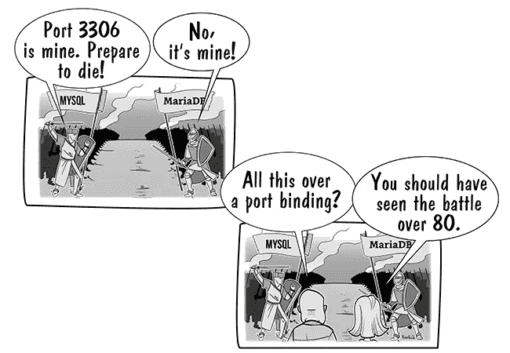

# 云原生应用-。网

> 原文：<https://blog.devgenius.io/cloud-native-app-net-862d173ff1f6?source=collection_archive---------2----------------------->

有一个很棒的[网站](https://12factor.net)，贡献了开发现代应用的概念。它被称为“12 因素应用程序”、“n 因素应用程序”或“云原生应用程序”。

> 十二要素应用程序是一种用于构建软件即服务应用程序的方法，它可以:
> 
> -使用**声明性**格式进行设置自动化，以最小化新开发人员加入项目的时间和成本；
> 
> -与底层操作系统签订**干净契约**，在执行环境之间提供**最大的可移植性**；
> 
> -适合在现代**云平台**上**部署**，消除对服务器和系统管理的需求；
> 
> **-最小化开发和生产之间的差异**，使**连续部署**实现最大的灵活性；
> 
> -并且能够**在不显著改变工具、架构或开发实践的情况下**扩大规模。

# 在本文中，我将尝试为**提供一个可能的实现视角。NET/Azure** 生态系统。

# 一、代码库

*在版本控制中跟踪一个代码库，部署多个。*

*   将代码库保存在您的企业 GIT 中
*   使用**主**分支部署生产就绪代码
*   使用发布分支来组织您的版本

# [二。依赖性](https://12factor.net/dependencies)

*明确声明并隔离依赖关系*

*   你所有的依赖项必须被组织成 nuget 包。
*   不要包含任何本地创建或外部提供的 dll。
*   如果您有内部库，将它们发布到您的 **enterprise nuget 服务器**，并使其成为您恢复过程的一部分。例如， [Azure Artifacts](https://azure.microsoft.com/en-us/services/devops/artifacts/) 可能是个不错的选择。
*   确保通过 olly 运行“ **dotnet restore** ”可以恢复所有的包。

# [III。配置](https://12factor.net/config)

*在环境中存储配置*

*   对于本地开发需求使用****。****
*   **对于**生产** —将您的配置保留为环境变量:检查[添加环境变量()](https://docs.microsoft.com/en-us/dotnet/api/microsoft.extensions.configuration.environmentvariablesextensions.addenvironmentvariables?view=dotnet-plat-ext-5.0#Microsoft_Extensions_Configuration_EnvironmentVariablesExtensions_AddEnvironmentVariables_Microsoft_Extensions_Configuration_IConfigurationBuilder_)**

# **[四世。后台服务](https://12factor.net/backing-services)**

***将后台服务视为附属资源***

*   **实现 [**依赖注入**](https://docs.microsoft.com/en-us/dotnet/core/extensions/dependency-injection) 模式，并使用它来访问任何本地或外部服务。**
*   **检查三。关于存储支持服务凭据的配置。**

# **[V .构建、发布、运行](https://12factor.net/build-release-run)**

***严格分离构建和运行阶段。***

***一个* [*代码库*](https://12factor.net/codebase) *通过三个阶段转化为一个(非开发)部署:***

*   ***构建阶段是一个转换过程，它将代码回购转换成一个称为构建的可执行包。在部署过程指定的提交时使用代码版本，构建阶段获取供应商* [*依赖关系*](https://12factor.net/dependencies) *并编译二进制文件和资产。***
*   ***发布阶段采用构建阶段生成的构建，并将其与部署的当前* [*配置*](https://12factor.net/config) *相结合。最终的发布包含了构建和配置，并且可以在执行环境中立即执行。***
*   ***运行阶段(也称为“运行时”)在执行环境中运行应用程序，通过启动应用程序的某组* [*进程*](https://12factor.net/processes) *来对抗选定的版本。***

**这个概念的实现可能看起来像:**

*   ****构建阶段**在 [Azure DevOps 中作为管道](https://docs.microsoft.com/en-us/azure/devops/pipelines/get-started/what-is-azure-pipelines?view=azure-devops)实现**
*   **对于构建阶段，我们通常在源代码库中有一个单独的分支，称为发布/构建。任何提交都会自动触发管道。**
*   ****发布阶段**以发布的形式在 Azure DevOps 中实现。**
*   ****运行阶段**也作为一个版本实现 Azure DevOps。**
*   **Azure DevOps 发布功能(管道的一部分)允许您为我们的阶段定义变量。**

# **[六世。流程](https://12factor.net/processes)**

***将应用作为一个或多个无状态进程执行***

*   **将其实现为. net 控制台应用程序。**
*   **请确保要成功执行您的应用程序，您只需要提供参数和/或环境变量。**
*   **不要在你的应用程序逻辑中安排时间。通常情况下，外部日程安排可以为您完成这项工作。例子: [Kubernets CronJob](https://kubernetes.io/docs/concepts/workloads/controllers/cron-jobs/) 。**
*   **如果您的流程使用后台服务，请确保它们能够支持几个同时运行的流程。**
*   **(可选)使用 [docker](https://docs.microsoft.com/en-us/dotnet/core/docker/build-container?tabs=windows) 容器作为 dotnet 核心运行时。**

# **[七。端口绑定](https://12factor.net/port-binding)**

***通过端口绑定导出服务***

****十二要素应用程序是完全独立的**并且不依赖于在运行时将 web 服务器注入执行环境来创建面向 web 的服务。”**

****

**[https://devops.com/12-factor-app-port-binding/](https://devops.com/12-factor-app-port-binding/)**

*   **使用[配置 ASP.NET 核心 Kestrel 网络服务器](https://docs.microsoft.com/en-us/aspnet/core/fundamentals/servers/kestrel/options?view=aspnetcore-5.0)的选项，并将端口定义为环境变量**
*   **对于 Docker 容器，将以下行添加到 Docker 文件中:**

*****ENV ASPNETCORE _ URLS = http://*:8080*****

*****揭露 8080*****

# **[八世。并发性](https://12factor.net/concurrency)**

***通过流程模式*横向扩展**

*   **其中一个可能的实现，如果你使用 Kubernetes，就是****。******
*   ****使用后台服务( [azure service bu](https://docs.microsoft.com/en-us/azure/service-bus-messaging/service-bus-messaging-overview) s，redis，sql database)来协调项目，这些项目必须是进程并保持状态。****

# ****[九世。一次性](https://12factor.net/disposability)****

*****通过快速启动和优雅关闭*最大限度提高鲁棒性****

******十二因素应用的** [**流程**](https://12factor.net/processes) **均为*一次性*流程，即可以随时启动或停止。**这有助于快速弹性扩展、快速部署[代码](https://12factor.net/codebase)或[配置](https://12factor.net/config)更改，以及生产部署的稳健性。”****

*   ****使用[ihostapplicationlife](https://docs.microsoft.com/en-us/dotnet/core/extensions/generic-host#ihostapplicationlifetime)优雅地停止您的服务****

# ****[X .开发/生产奇偶校验](https://12factor.net/dev-prod-parity)****

*****开发、分期、生产尽可能相似。*****

****这就是 CI/CD 可以帮助您的地方。****

*   ****对于 azure，您可以使用[蓝图](https://docs.microsoft.com/en-us/azure/governance/blueprints/overview)****
*   ****此外，还有许多商业工具可以简化这些任务:[可移植](https://www.ansible.com)、[地形](https://www.terraform.io)****

# ****[XI。日志](https://12factor.net/logs)****

*****将日志作为事件流处理。*****

****我建议使用其中一种或两种包装:****

*   ****[Audit.Net](https://discoverdot.net/projects/audit-net)****
*   ****[系列日志](https://serilog.net)****

****我们的基本要求是，必须至少使用 2 个日志目的地:****

*   ****本地日志文件****
*   ****集中式日志系统( [Azure 应用洞察](https://docs.microsoft.com/en-us/azure/azure-monitor/app/app-insights-overview)， [Splunk](https://www.splunk.com) ，……)****

# ****[十二。管理进程](https://12factor.net/admin-processes)****

*****将行政/管理任务作为一次性流程运行*****

****“一次性管理流程应该在与应用程序的常规[长期运行流程](https://12factor.net/processes)相同的环境中运行。它们针对一个[版本](https://12factor.net/build-release-run)运行，使用与任何针对该版本运行的流程相同的[代码库](https://12factor.net/codebase)和[配置](https://12factor.net/config)。管理代码必须与应用程序代码一起发布，以避免同步问题。****