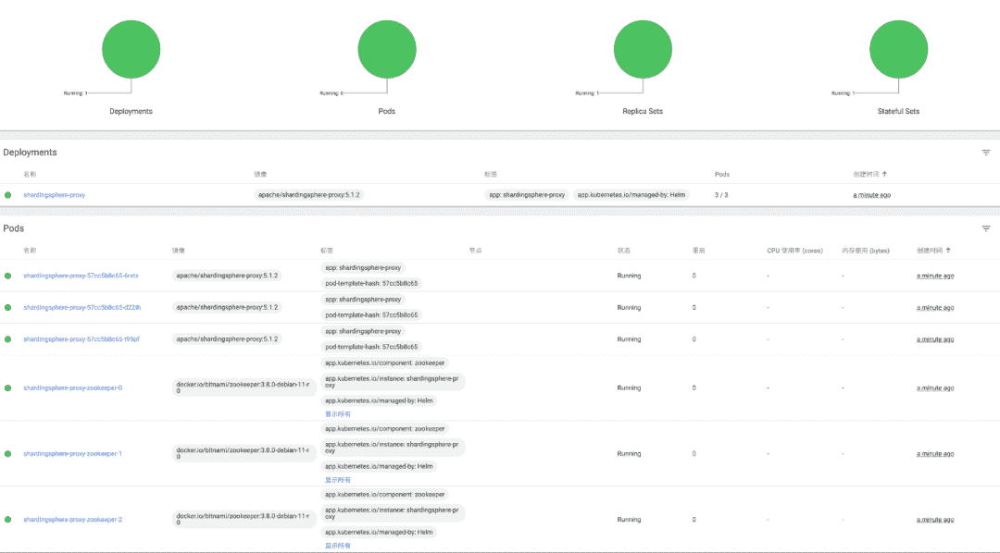
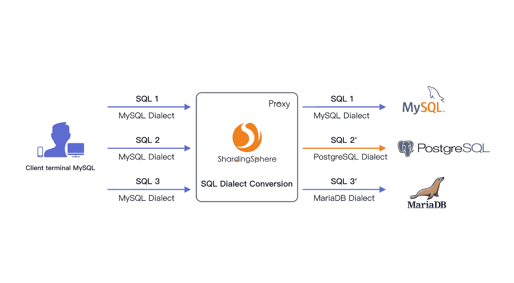
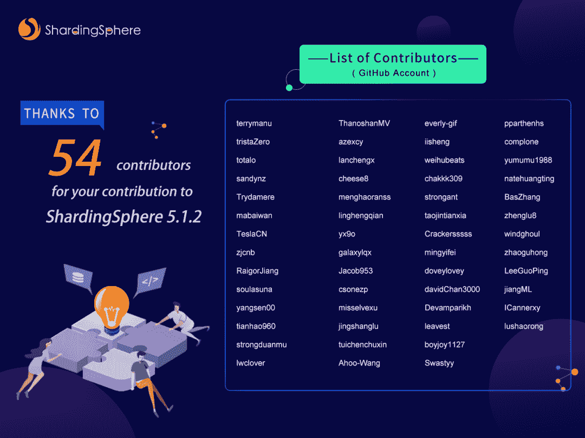

# 高性能数据网关的云原生部署+新的 API 驱动程序:Apache ShardingSphere 5.1.2 发布

> 原文：<https://blog.devgenius.io/cloud-native-deployment-for-a-high-performance-data-gateway-new-api-driver-apache-fdfd2839846?source=collection_archive---------6----------------------->

随着 Apache ShardingSphere 5.1.1 的发布，我们的社区整合了来自世界各地贡献者的 1028 个 pr，为您带来了最新的 5.1.2 版本。新版本在功能、性能、测试、文档、示例等方面做了很多改进。

突出的新功能包括:

*   代理掌舵图。
*   SQL 方言翻译。
*   使用 JDBC 作为驱动程序。

这些新功能增强了 ShardingSphere 的数据网关功能，使 ShardingSphere 能够部署在云上，同时优化用户体验。

除了上面提到的新特性，本次更新还在用户体验方面改进了对[PostgreSQL](https://www.postgresql.org)/[open gauss](https://opengauss.org/en/)schema、自动伸缩、事务和 [DistSQL](https://medium.com/nerd-for-tech/intro-to-distsql-an-open-source-more-powerful-sql-bada4099211) 的 SQL 解析支持、内核、运行时模式和弹性伸缩支持。

这篇文章将向你概述 ShardingSphere 5.1.2 的更新。

# 新功能

## 使用 Helm 的 sharding sphere-代理配置

ShardingSphere-Proxy 为容器中的部署提供了 Docker 映像。但是对于需要在 [Kubernetes](https://kubernetes.io) 上部署 ShardingSphere-Proxy 的人来说，你要经历一些数据库驱动挂载、配置挂载、自定义算法挂载等程序。，这使得部署过程相对繁琐，并导致较高的操作&维护成本。

此次更新带来了新的 ShardingSphere-Proxy Helm Chart，这是由企业级云原生数据增强计算产品和解决方案提供商 [SphereEx](https://www.sphere-ex.com) 捐赠给 Apache ShardingSphere 社区的一项新功能。这一发展允许 Apache ShardingSphere 拥抱云计算。



ShardingSphere 依靠注册表以集群模式存储元数据，ShardingSphere-Proxy 的 Helm Chart 可以自动部署 ZooKeeper 集群，允许您快速构建 ShardingSphere-Proxy 集群。

由于开源协议的限制，ShardingSphere-Proxy 的二进制分发包和 Docker 镜像没有与 MySQL JDBC 驱动打包在一起，因此用户需要手动将 MySQL JDBC 驱动添加到类路径中，以使用 MySQL 作为 ShardingSphere 的存储节点。

对于这种情况，ShardingSphere-Proxy Helm Chart 可以自动获取 Pod 的 Init 容器中的 MySQL JDBC 驱动程序，从而降低您的部署操作成本。

## SQL 方言翻译

随着数据库多样化的增加，多种类型的数据库共存已经成为常态。使用一种 SQL 方言访问异构数据库的场景正在成为一种趋势。

多个多样化数据库的存在，使得访问数据库的 SQL 方言难以标准化，意味着工程师需要针对不同类型的数据库使用不同的方言——缺乏统一的查询平台。

将不同类型的数据库方言自动翻译成后端数据库可以使用的一种方言，使工程师可以使用任何一种数据库方言访问所有后端异构数据库，从而大大降低了开发和维护成本。

Apache ShardingSphere 5.1.2 是构建高效数据网关的重要一步。此更新启用了新的 SQL 方言翻译功能，支持主要开源数据库之间的方言转换。

比如可以用一个 [MySQL](https://www.mysql.com) 客户端连接 ShardingSphere-Proxy，发送基于 MySQL 方言的 SQL，ShardingSphere 可以自动识别用户协议和存储节点类型完成 SQL 方言翻译，访问 PostgreSQL 等异构存储节点，反之亦然。



## 使用 JDBC 作为驱动程序

在过去的版本中，ShardingSphere-JDBC 以`Datasource`的形式提供给用户。以前不使用`Datasource`的项目或工具需要首先进行修改，以便能够引入 ShardingSphere-JDBC，这增加了开发成本。

在 Apache ShardingSphere 5.1.2 中，ShardingSphere-JDBC 实现了标准化的 JDBC 驱动程序接口，该接口允许您引入 ShardingSphere-JDBC 作为驱动程序。

用户可以通过`DriverManager`直接获得`Connection`:

```
Class.forName("org.apache.shardingsphere.driver.ShardingSphereDriver");
Connection conn = DriverManager.getConnection("jdbc:shardingsphere:classpath:config.yaml");
```

或者使用`Datasource`获得`Connection`:

```
*// Take HikariCP as an example*
HikariDataSource dataSource = new HikariDataSource();
dataSource.setDriverClassName("org.apache.shardingsphere.driver.ShardingSphereDriver");
dataSource.setJdbcUrl("jdbc:shardingsphere:classpath:config.yaml");
Connection conn = dataSource.getConnection();
```

# 现有功能的优化

## 核心

在这次更新中，ShardingSphere 合并了许多 PRs 来改进 SQL 解析支持。SQL 解析优化占据了更新日志的很大一部分。

ShardingSphere 在 5.1.1 中提供了对 PostgreSQL / openGauss schema 的初步支持。

在 5.1.2 更新中，对 PostgreSQL / openGauss 模式的内核、集群模式和自动伸缩支持得到了改进。例如，元数据对中增加了对模式结构的支持，内核和自动伸缩中也支持模式定制。

## sharding sphere-代理

随着使用 ARM CPUs 的服务器市场越来越受欢迎，ShardingSphere-Proxy 也在 Docker 上提供了 arm64 架构的图像。

谈到 MySQL，ShardingSphere-Proxy 修复了无法接收大于 8 MB 的数据包的问题，并进一步支持接收总计大于 16 MB 的数据。

## 自动缩放

除了支持 PostgreSQL 模式定制，自动缩放还实现了迁移 PostgreSQL 时自动创建表，并修复了 PostgreSQL 增量迁移遇到`null`字段值时会报告错误的问题。除了这些特性之外，自动伸缩还减少了迁移过程中的资源消耗，并在 openGauss 3.0 中提供了对增量迁移的支持。

# 发布说明

ShardingSphere 5.1.2 的完整发行说明可以在以下章节中找到。请注意，本次更新调整了少量 API，因此请参考 API 调整部分了解更多详细信息。

## 新功能

内核:MySQL 和 PostgreSQL 的 SQL 方言转换的 alpha 版本。

内核:支持 PostgreSQL 和 openGauss 定制模式。

内核:支持 PostgreSQL 和 openGauss `create` / `alter` / `drop`视图语句。

内核:支持 openGauss 游标语句。

内核:支持使用系统库定制。

内核:支持获取 openGauss 和 MySQL create table 语句。

内核:支持获取 PostgreSQL create table 语句。

访问终端:使用 Helm 正式支持 ShardingSphere-Proxy 集群的快速部署，其中包括 Kubernetes 中的 ZooKeeper 集群。

访问终端:支持 ShardingSphere JDBC 驱动程序。

自动缩放:支持 PostgreSQL 自动建表。

自动缩放:支持 PostgreSQL 和 openGauss 自定义模式表迁移。

自动缩放:支持字符串主键表的迁移。

运营模式:治理中心支持 PG/openGauss 三级架构。

运行模式:治理中心支持数据库级分布式锁定。

## 最佳化

内核:支持 PostgreSQL 和 openGauss copy 语句。

内核:支持 PostgreSQL alter/ drop index 语句。

内核:支持 MySQL 更新强制索引语句。

内核:支持 openGauss `create` / `alter` / `drop`模式语句。

内核:优化`RoundRobinReplicaLoadBalanceAlgorithm`和`RoundRobinTrafficLoadBalanceAlgorithm`算法逻辑。

内核:优化前端驱动数据库类型和后端不匹配时的元数据加载逻辑。

内核:重构元数据加载逻辑。

内核:show processlist 语句函数的优化。

内核:改进了涉及大量表的场景中的加载性能。

内核:支持注释语句执行

内核:支持 PostgreSQL 和 openGauss 分片场景中的视图语句执行。

内核:支持 Oracle `CREATE ROLLBACK SEGMENT`语句。

内核:支持解析 openGauss `DROP TYPE`

内核:支持解析 openGauss `ALTER TYPE`

内核:支持解析 Oracle `DROP DISKGROUP`

内核:支持解析甲骨文`CREATE DISKGROUP`

内核:支持解析 Oracle `DROP FLASHBACK ARCHIVE`

内核:支持解析 openGauss `CHECKPOINT`

内核:支持解析 Oracle `CREATE FLASHBACK ARCHIVE`

内核:支持解析 PostgreSQL `Close`

内核:支持解析 openGauss `DROP CAST`

内核:支持解析 openGauss `CREATE CAST`

内核:支持解析 Oracle `CREATE CONTROL FILE`

内核:支持解析 openGauss `DROP DIRECTORY`

内核:支持解析 openGauss `ALTER DIRECTORY`

内核:支持解析 openGauss `CREATE DIRECTORY`

内核:支持解析 PostgreSQL 检查点

内核:支持解析 openGauss `DROP SYNONYM`

内核:支持解析 openGauss `CREATE SYNONYM`

内核:支持解析 openGauss `ALTER SYNONYM`

内核:支持解析 PostgreSQL `CALL`语句

内核:支持解析 Oracle `CREATE PFILE`

内核:支持解析 Oracle `CREATE SPFILE`

内核:支持解析甲骨文`ALTER SEQUENCE`

内核:支持解析 Oracle `CREATE CONTEXT`

内核:支持解析 Oracle `ALTER PACKAGE`

内核:支持解析 Oracle `CREATE SEQUENCE`

内核:支持解析 Oracle `ALTER ATTRIBUTE DIMENSION`

内核:支持解析 Oracle `ALTER ANALYTIC VIEW`

内核:用 ShardingSphere Spi 加载`SQLVisitorFacade`

内核:用 ShardingSphere Spi 加载`DatabaseTypedSQLParserFacade`

内核:支持解析 Oracle `ALTER OUTLINE`

内核:支持解析 Oracle `DROP OUTLINE`

内核:支持解析 Oracle `drop edition`

内核:支持解析 SQLServer `WITH`公共表表达式

内核:在 with 语句中优化 SubquerySegment 的开始和结束索引

内核:重构`JoinTableSegment`

内核:支持解析 Oracle `DROP SYNONYM`

内核:支持解析甲骨文`CREATE DIRECTORY`

内核:支持解析 Oracle `CREATE SYNONYM`

内核:支持解析 SQLServer `XmlNamespaces`子句

内核:支持解析 Oracle `Alter Database Dictionary`

内核:支持解析`SELECT`语句的 SQLServer 子句

内核:支持解析 Oracle `ALTER DATABASE LINK`

内核:支持解析 Oracle `CREATE EDITION`

内核:支持解析 Oracle `ALTER TRIGGER`

内核:支持解析 SQLServer `REVERT`语句

内核:支持解析 PostgreSQL `DROP TEXT SEARCH`

内核:支持解析 PostgreSQL `drop server`

内核:支持解析 Oracle `ALTER VIEW`

内核:支持解析 PostgreSQL `drop access method`

内核:支持解析 PostgreSQL `DROP ROUTINE`

内核:支持解析 SQLServer `DROP USER`

内核:支持解析 Oracle `DROP TRIGGER`

内核:支持解析 PostgreSQL `drop subscription`

内核:支持解析 PostgreSQL `drop operator class`

内核:支持解析 PostgreSQL `DROP PUBLICATION`

内核:支持解析甲骨文`DROP VIEW`

内核:支持解析 PostgreSQL `DROP TRIGGER`

内核:支持解析 Oracle `DROP DIRECTORY`

内核:支持解析 PostgreSQL `DROP STATISTICS`

内核:支持解析 PostgreSQL `drop type`

内核:支持解析 PostgreSQL `DROP RULE`

内核:支持解析 SQLServer `ALTER LOGIN`

内核:支持解析 PostgreSQL `DROP FOREIGN DATA WRAPPER`

内核:支持解析 PostgreSQL `DROP EVENT TRIGGER`语句。

访问终端:ShardingSphere-Proxy MySQL 支持接收大小超过 16 MB 的请求包。

接入终端:ShardingSphere-Proxy 增加`SO_BACKLOG`配置项。

接入终端:ShardingSphere-Proxy `SO_REUSEADDR`默认启用。

访问终端:支持 aarch64 的 sharding sphere-代理 Docker 映像。

接入终端:ShardingSphere-Proxy MySQL 支持默认 MySQL 版本号。

访问终端:sharding sphere-Proxy PostgreSQL/open gauss 支持更多字符集。

接入终端:ShardingSphere-Proxy 添加默认端口配置项。

自动伸缩:在 openGauss 3.0 中启用 thread_pool 时，伸缩与 HA 端口兼容，用于数据同步。

自动缩放:优化`PipelineJobExecutor`中 Zookeeper 事件处理的逻辑，避免 zk 阻塞事件。

自动缩放:对于表名，缩放数据同步不区分大小写。

自动伸缩:改进的 PostgreSQL/openGauss 复制槽清理。

自动缩放:改进了准备阶段的锁定保护

自动缩放:改进删除相同记录后 PostgreSQL 重建场景中的数据同步。

自动缩放:通过缩放创建的数据源不会在底部缓存。

弹性伸缩:尽可能重用数据源，减少数据库连接占用。

DistSQL: `REFRESH TABLE METADATA`支持指定的 PostgreSQL 的模式。

DistSQL:在`ALTER SHARDING TABLE RULE`下添加绑定表检查

操作模式:ShardingSphere-JDBC 支持配置数据库连接名。

分布式事务:禁止在事务中执行 DistSQL。

分布式事务:autocommit = 0，DML 将自动打开 DDL 部分中的事务。

# 错误修复

内核:修复 PostgreSQL 和 openGauss show 语句解析异常。

内核:修复 PostgreSQL 和 openGauss 时间提取函数解析异常。

内核:修复 PostgreSQL 和 openGauss select mod 函数解析异常。

内核:修复读/写分离场景下多个 schema `join`语句的执行异常。

内核:修复了在加密场景中执行 create schema 语句时出现的异常。

内核:如果 exist 语句异常，修复删除模式。

内核:用`LAST_INSERT_ID()`修复路由错误

内核:修复在无数据源状态下使用数据库执行异常。

内核:用 set var 修复函数创建语句。

访问:修复由 sharding sphere-Proxy PostgreSQL/open gauss 中的字段大小写不匹配导致的空指针`Describe PreparedStatement`

Access:修复 sharding sphere-代理 PostgreSQL /openGauss 在模式 DDL 执行后未返回正确的标记。

自动缩放:修复 MySQL 在缩放过程中的无符号类型错误。

自动缩放:修复一致性检查无法创建数据源时的连接泄漏问题。

自动缩放:修复了`ShardingSphereDataSource`初始化过程忽略除分片以外的规则的问题。

自动缩放:支持在准备阶段关闭的作业。

自动缩放:修复数据源 url 和 jdbcurl 兼容性问题。

自动缩放:修复 openGauss 数据复制的创建时间问题，以避免可能的增量数据丢失。

自动伸缩:改善作业状态的持久性，以确保特殊情况不会被旧状态覆盖。

自动缩放:修复 PostgreSQL 在使用 TestDecoder 进行增量迁移时无法正确解析`null`的问题。

DistSQL: fix `SET VARIABLE`更改在独立模式和内存模式下不生效。

DistSQL:修复`SHOW INSTANCE LIST`与实际数据不一致的问题。

DistSQL:修复分片规则中区分大小写的问题。

运行模式:修复缩放功能改变分表规则后，新版本中元数据缺失的问题。

分布式事务:修复根据`catalog`得到的`indexinfo`为空的问题。

# 重构

自动扩展:重构`jobConfig`以促进新类型工作的重用和扩展。

运行模式:优化注册表中心计算节点的存储结构。

运行模式:使用`uuid`替换`ip@port`作为唯一的实例标识符。

# API 调整

DistSQL: `EXPORT SCHEMA CONFIG`调整为`EXPORT DATABASE CONFIG`

DistSQL: `IMPORT SCHEMA CONFIG`调整为`IMPORT DATABASE CONFIG`

运行模式:调整`db-discovery`算法配置。

DistSQL: `SHOW SCHEMA RESOURCES`调整为`SHOW DATABASE RESOURCES`

DistSQL: `COUNT SCHEMA RULES`调整为`COUNT DATABASE RULES`

权限:权限提供者`ALL_PRIVILEGES_PERMITTED`更新为`ALL_PERMITTED`

权限:权限提供者`SCHEMA_PRIVILEGES_PERMITTED` 更新为`DATABASE_PERMITTED`

# 社区大喊

感谢 54 位 ShardingSphere 贡献者的努力，他们总共提交了 1028 份 pr，使 ShardingSphere 5.1.2 版本成为可能。



# 相关链接:

[ShardingSphere Github](https://github.com/apache/shardingsphere/issues?page=1&q=is%3Aopen+is%3Aissue+label%3A%22project%3A+OpenForce+2022%22)

[ShardingSphere Twitter](https://twitter.com/ShardingSphere)

[切割球松弛度](https://join.slack.com/t/apacheshardingsphere/shared_invite/zt-sbdde7ie-SjDqo9~I4rYcR18bq0SYTg)

[投稿指南](https://shardingsphere.apache.org/community/cn/contribute/)

[下载链接](https://shardingsphere.apache.org/document/current/cn/downloads/)

[发行说明](https://github.com/apache/shardingsphere/blob/master/RELEASE-NOTES.md)

# 作者

> **吴伟杰**
> 
> **SphereEx 基础设施研发工程师，Apache ShardingSphere PMC**

韦杰重点关注 Apache ShardingSphere 的接入终端 R&D 和 ShardingSphere 的子项目 [ElasticJob](https://shardingsphere.apache.org/elasticjob/) 。