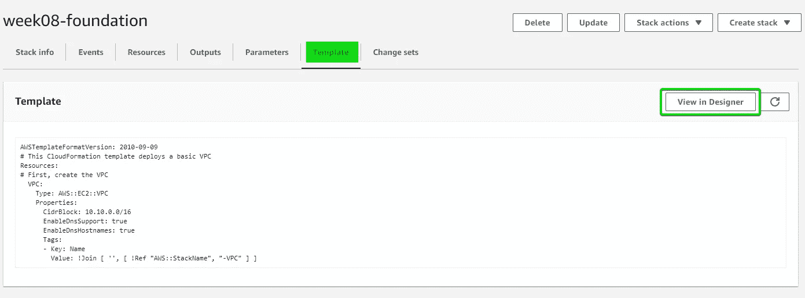
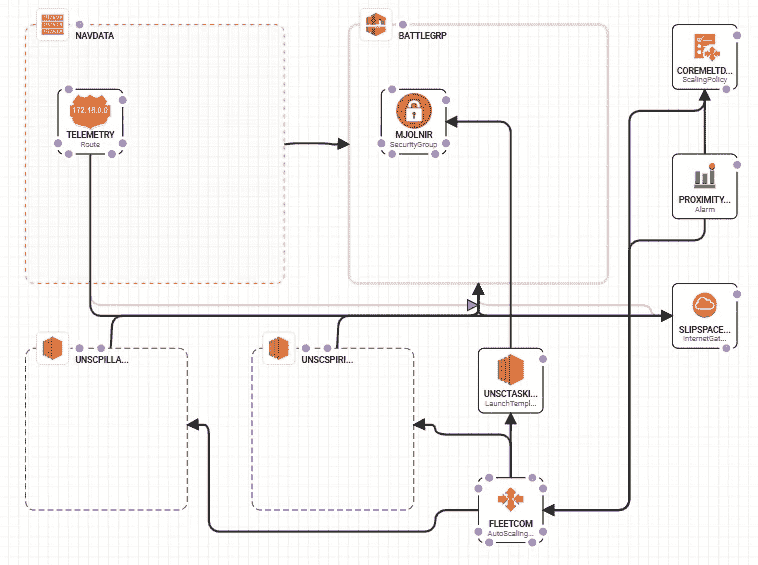
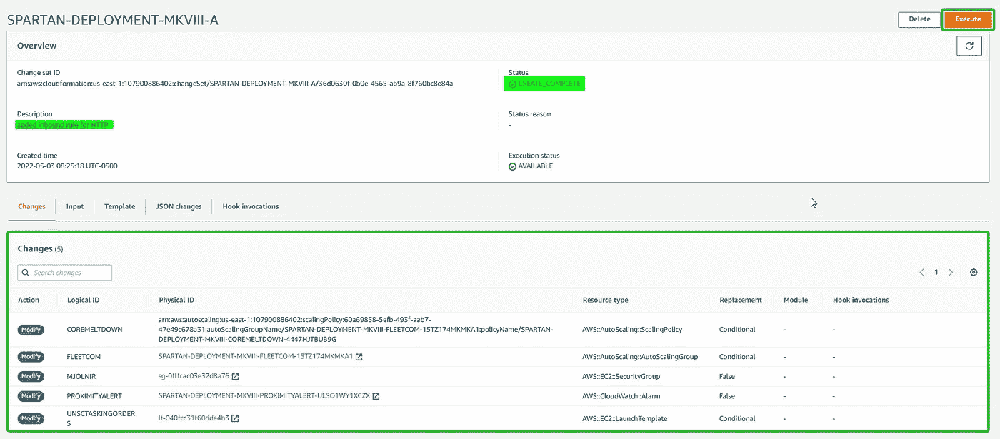
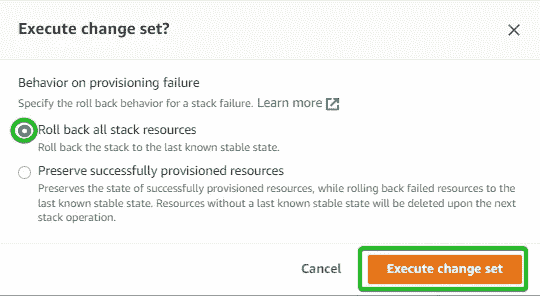
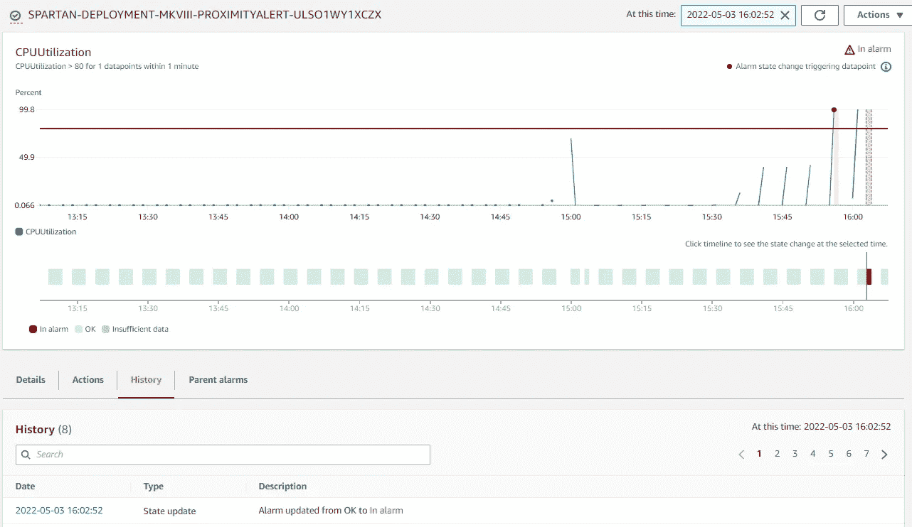

# 云在定制的 VPC 中形成自动扩展的 NGINX 服务器。

> 原文：<https://blog.devgenius.io/cloudforming-an-autoscaling-nginx-server-inside-a-custom-vpc-be3510012dd7?source=collection_archive---------9----------------------->

又见面了！本周，我们将构建一个 AWS CloudFormation 模板，它将构建一系列相关的 AWS 服务。这些服务包括:

*   VPC
*   自动缩放组
*   子网
*   路由表
*   互联网网关
*   安全组
*   启动模板
*   云观察
*   EC2

哇，太多了，为什么要形成云呢？原因很简单，它允许您创建一个模板，将所有这些服务放在一个“堆栈”中一起使用，并且允许您一次性部署所有这些服务，一起配置！创建这个文档需要大量的查找片段、复制/粘贴和深入研究 AWS CloudFormation 文档。但是别担心，我们会度过难关的！

云形成堆栈由几个不同的部分组成:

*   描述
*   [计]元数据
*   因素
*   规则
*   映射
*   情况
*   改变
*   资源
*   输出

然而，对于我们的项目，我们只需要资源和输出。*请注意，最佳实践也将利用参数，而不是“硬编码”某些值，但是我决定直接将这些值混合在一起。*

资源将是我们创造所有以下需求的地方。

输出将是我们让堆栈扔给我们一些值的地方，所以我们可以验证事情是否按预期工作！

让我们看一下我们的最终目标，然后我们将讨论如何实现它。

# 项目规格

对于这个项目，我们需要创建以下内容:

*   CIDR 为 10.10.0.0/16 的自定义 VPC
*   2 个子网
*   基于 CPU 使用率超过 80%的策略，自动扩展组可以从最少 2 个实例扩展到最多 5 个实例
*   EC2 实例，使用 t2.micros 并安装 NGINX 来显示测试页面。

该项目还基于几个假设:

*   您有一个拥有控制台访问权限的 AWS IAM 用户(非超级用户)
*   你有一个文本编辑器。最好是像 Visual Studio 代码这样的东西，它有一些很棒的特性，可以让生活变得更简单。

一旦我们将所有的拼图放入我们的 CloudFormation 文件(可以是 JSON 或 YAML)，我们将创建我们的堆栈，并运行一些验证测试。

# 我们开始吧！

我们已登录 AWS 控制台，让我们导航到 CloudFormation 并选择“创建堆栈”。

如上图所示，我们将使用自己的文件创建堆栈。不要担心，稍后您将看到文件的样子。向导将让我们命名堆栈，我们将继续点击 next，直到实际的堆栈创建开始。对于这些照片，我的云层模板只是创建了一个 VPC，没有别的。这让我们看到了成功的过程是什么样的！(提示:这个项目有很多不成功的堆栈创建。在这个项目的创建过程中，许多咖啡豆受到了伤害。)

给它几分钟，我们可以在“事件”标签中看到一些生命。

右边的小刷新按钮允许您查看运行中的流程。

万岁，今天是我们的了！

现在我们已经使用模板创建了一个简单的 VPC，我们有几个选项。

*   使用设计器通过文本编辑器查看和编辑我们的模板
*   使用设计器通过拖放资源图形化编辑我们的模板
*   在我们选择的编辑器中编辑模板，然后重新上传。

请注意，虽然第二种选择听起来容易得多……但是有一种简单的美，即在模板文件中没有一堆奇怪的元数据的情况下清理代码。但这只是我！

# 最长的一天

现在，在这个阶段，我们已经开始添加所有其他组件。老实说，这是这个项目最丑陋的部分。有这么多预先构建的模板，但是真正理解所有的部分是如何组合在一起的，当你需要为你的项目调整一个模板时，这是非常有价值的。

即使试图一次添加一个小组件，我也会遇到一个又一个错误。幸运的是，我有一个了不起的教练团队支持我，给我指明正确的方向。

这也是我学到的，有时候在官方文档中寻找比简单地使用谷歌更有效，因为不管你怎么说，你都会得到相同的页面。实际上并不是你所需要的页面！

但是继续，下面的代码是我目前的进展。我终于可以完全启动这个堆栈了，但是我仍然缺少一些参数来真正完成这个项目。

现在有很多代码，你可能会觉得眼睛交叉，但如果我们*做*上传我们的模板，然后在 Designer 中打开，我们可以得到所有部分的酷视觉，以及它们如何连接。

注意 MKVIII。这还不算在我决定加入我的光环天赋之前失败的那些。

# 最后冲刺！

现在我们已经成功地部署了我们的堆栈，在我们尝试压力测试之前，我还需要解决一些问题。

首先，我们需要调整我们的 MJOLNIR 安全组，允许我们看到 EC2 NGINX 服务器托管的 html 页面。为此，我们将创建一个“变更集”。变更集可用于推出云形成堆栈的不同“版本”。请注意，我们只能从成功部署的堆栈中创建变更集。

这将把我们带到一个现在熟悉的屏幕，在这里可以选择上传模板文件，或者转到 Designer。老实说，在整个项目过程中，我在这两种方法之间来回切换，我更喜欢在自己的编辑器中编辑文件，然后上传。但这是它在设计器中的样子:

这一次，我选择在 Designer 中打开模板，并进行更改(#1)。然后，我将通过选择页面顶部的复选标记(#2)来验证模板，获得我们当天的确认(#3)，最后，创建堆栈(#4)。

这将带我们命名变更集(通常用版本号或类似的东西)

创建的下一个屏幕显示了变更集的概述页面。如果一切正常，我们可以选择“执行”变更集。

如果一切都乱了，快速确认该做什么:

…我们做到了！

# 确认

现在，我们已经创建了所有的资源，点缀了所有的“我”,跨越了所有的“t”..让我们确保这东西能用！

首先，简单的测试页面…导航到我们的 EC2 仪表板，并获取我们的一个实例的公共 IP 或 DNS，太棒了！

是不是很美？

测试一个完整的✅

最后，压力测试。在一系列启动命令中，有一个命令让我有点崩溃:`sudo install stress`

作为参考，我必须运行的完整命令链如下:

*   `sudo amazon-linux-extras install epel -y`
*   `sudo yum install stress -y`
*   `sudo stress --cpu 8 --vm-bytes $(awk '/MemAvailable/{printf "%d\n", $2 * 0.9;}' < /proc/meminfo)k --vm-keep -m 1`

我打开了我的 EC2/Instances 仪表板和 CloudWatch 警报仪表板，这样我就可以看到这种情况发生，几分钟后，我们成功了！

花了不少时间才到达那里！

正如所料，第三个实例已经初始化

让我们一起去看云吧…

这里我们可以看到我们创建的警报何时被触发！

…以及正在执行的操作。

# 结论

朋友们，这是我迄今为止最大的挑战。我希望我能够在写作中保持足够的连贯性，因为项目的执行肯定不是这样！

但现在我们可以看到如何创建一个使用各种服务的云形成模板，到目前为止，我们真的只与小团体一起玩。谢谢你坚持和我在一起！

精益求精！