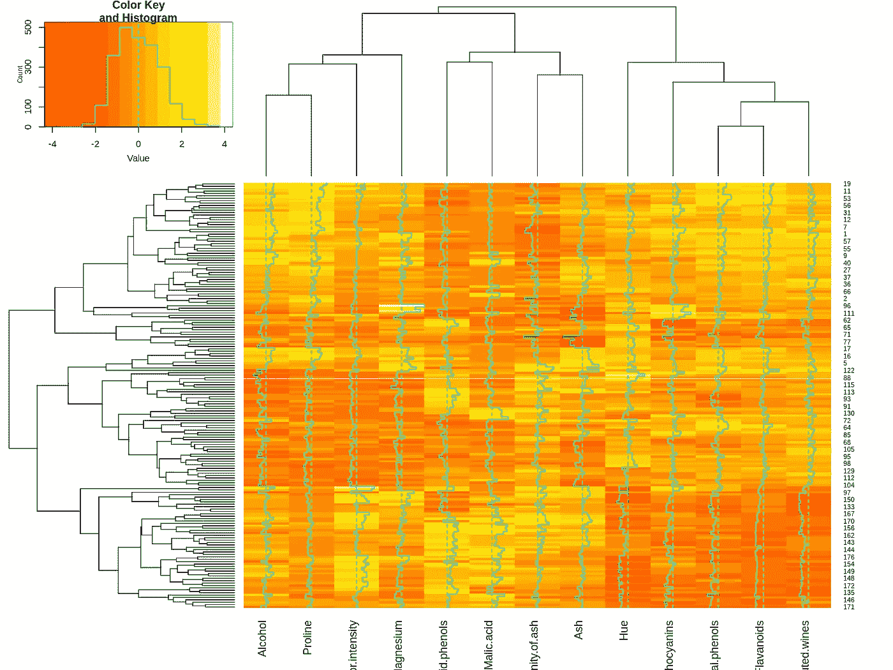

# R 中聚类分析的探讨

> 原文：<https://blog.devgenius.io/cluster-analysis-in-r-b04b628b4bca?source=collection_archive---------5----------------------->

## 如何处理 R 中的无监督学习问题？

在这篇博客中，我将解释我们如何在 ***R 编程语言中处理* ***聚类分析问题。*** *我在这里的方法是彻底调查我们可以遵循的过程和方法，以得出我们的结论。***

> 读完这篇文章后，你将能够回答以下问题:-
> 
> **问:聚类问题的数据预处理？**
> 
> **问:聚类问题应遵循的单变量 EDA 技术？**
> 
> **问:双变量 EDA 技术可用于聚类问题吗？**
> 
> **问:多变量 EDA 技术可用于聚类问题吗？**
> 
> **问:如何决定最佳聚类数？**
> 
> **问:如何做 k-means 聚类？**
> 
> **问:如何进行 k-medoids 聚类？**
> 
> **问:如何做高斯混合模型聚类？**
> 
> **问:如何做层次聚类？**
> 
> **问:如何可视化获得的集群？**
> 
> **问:如何可视化和解释聚类数据集？**
> 
> **问:如何比较车型？**
> 
> **问:如何进行特征约简？**

那么，让我们开始吧

> 这是数据集的原始来源:- [葡萄酒数据集。](https://archive-beta.ics.uci.edu/ml/datasets/wine)
> 
> 我所使用的数据集不包含“类”列，它包含数据集中的功能名称。你可以在这里看一下数据集:- [葡萄酒数据集](https://raw.githubusercontent.com/kundan1rao/ml-wine-clustering/master/Wine%200.csv%20-%20Wine%200.csv.csv)

*我们会尝试聚类，找出* [*这个葡萄酒数据集*](https://raw.githubusercontent.com/kundan1rao/ml-wine-clustering/master/Wine%200.csv%20-%20Wine%200.csv.csv) *中有多少种葡萄酒类型。如果你观察，你会发现有 178 种葡萄酒，每种都有 13 种特征。利用这些特征，我们需要对葡萄酒进行聚类。因此，我们可以将我们的目标定义为:-*

**目标:-** 找出上述葡萄酒数据集中存在的葡萄酒类型(聚类)。最后，我们可以通过哪些最基本的特征轻松识别特定葡萄酒的类别。

**我在分析过程中遵循的主要步骤包括:-**

1.  **数据探索和清理**
2.  **单变量 EDA**
3.  **多元 EDA**
4.  **主成分分析和特征探索**
5.  **K 均值聚类**
6.  **K-medoids 聚类**
7.  **高斯混合模型聚类**
8.  **层次聚类**
9.  **比较型号**
10.  **特征约简和模型选择**
11.  **结论**

开始了，

如果你想一次完成整个项目，可以看看我的 Google colab 笔记本。为了更好、更深入地理解聚类算法，我强烈建议您阅读项目末尾提到的参考资料。

[](https://colab.research.google.com/drive/1egzFpDFoqXKzYbKyMtc_x-RJoaDcY1nZ#scrollTo=ZohJvCId9ZFu) [## 谷歌联合实验室

### R 中的聚类分析

colab.research.google.com](https://colab.research.google.com/drive/1egzFpDFoqXKzYbKyMtc_x-RJoaDcY1nZ#scrollTo=ZohJvCId9ZFu) 

# **1。数据探索和清理:-**

我们可以通过以下代码加载数据并检查数据类型:-

```
# importing the wine dataset# library for read.csv() function
library(readr)data<-read.csv("https://raw.githubusercontent.com/kundan1rao/ml-wine-clustering/master/Wine%200.csv%20-%20Wine%200.csv.csv")# Checking structure of the dataset and data types of variables
str(data)
```

数据集的结构如下所示


我们观察到

*1。每个变量都是数字(双精度)数据类型*

*2。13 个变量有 178 个观测值*

*3。“数据”在“data.frame”类中*

> -上面的代码在本地可以很好地工作，并且我已经在我的 GitHub 帐户上托管了数据集。
> 
> -安装软件包，并在需要时加载它们。

我们可以通过下面的命令来查看变量的名称、顶部的几行以及底部的几行

```
# names
names(data)# head
head(data)# tail
tail(data)
```

数据集的头部看起来像:-


现在，我们可以通过下面的代码检查数据集中是否有 NA、NaN 或 infinity 值

```
# Checking for null and other types of missing data
library(dplyr) # library for data manipulation# total NAs
f <- function(x){sum(is.na(x))}
sapply(data,f)%>%as.data.frame() # Checking for total infinite values
f <- function(x){sum(is.infinite(x))}
sapply(data,f) %>% as.data.frame() # total NaN values
f <- function(x){sum(is.nan(x))}
sapply(data,f)%>%as.data.frame()
```

我们可以观察到:-

*   整个数据集中的任何变量既没有无穷大、NA、Null 值，也没有 NaN 值。

# **2。单变量 EDA:-**

我们从总结开始，然后检查每个特征的均值和方差。稍后，我们绘制特征的箱线图，并查看这些特征的比例是否一致

```
# summary of the data
summary(data)# mean of the features
apply(data,2,mean) %>% as.data.frame()# variance of the features
apply(data,2,var)%>%as.data.frame()# boxplot of features
boxplot(data, xlab="features",ylab="values", main ="Boxplot of features", col = "green",border = "blue",cex.axis=.5)
```

箱线图看起来如下


我们观察到特征没有很好地缩放以应用聚类算法。因此，我们缩放这些特征，使得每个特征的平均值变为 0，标准偏差变为 1。

```
# scaling the data set
data.scaled <- scale(data)# summary of scaled data
summary(data.scaled)# mean of the scaled data set
apply(data.scaled,2,mean)%>%as.data.frame()# variance of the scaled dataset
apply(data.scaled,2,var)%>%as.data.frame()# boxplot of scaled features
boxplot(data.scaled, xlab="features",ylab="values", main ="Boxplot of features", col = "green",border = "blue",cex.axis=.5)
```

缩放特征的箱线图看起来如下:-


观察:-

*   现在，这些特性已经很好地进行了缩放，可以随时进行比较和使用

现在，我们将做单变量直方图和密度图，以查看各个特征中可能的聚类数

r 代码制作图:-

```
# function to make the plots# required library
library(stringr)
library(ggplot2)# function to create histogram and density plot
histf<-function(z){
feature=str_replace_all(deparse(substitute(z)),"[data$]","")
ggplot(data) +
aes(x = z) +
geom_histogram(aes(y=..density..), position="identity", alpha=0.5,bins = 14L, fill = "#497AD2", colour = "blue") +
geom_density(alpha=0.2, fill = "#4411D2", colour = "#4411D2")+
labs(x =  paste("Feature: ",feature),y = "No Of Obeservation",
title = paste("Histogrem Plot Of ",feature),
subtitle = paste("Distribution Of Feature ",feature),
caption = "wine dataset") +
theme_grey()
}# calling function for different features
histf(data$Alcohol)
histf(data$Malic.acid)
histf(data$Ash)
histf(data$Alcalinity.of.ash)
histf(data$Magnesium)
histf(data$Total.phenols)
histf(data$Flavanoids)
histf(data$Nonflavanoid.phenols)
histf(data$Proanthocyanins)
histf(data$Color.intensity)
histf(data$Hue)
histf(data$OD280.OD315.of.diluted.wines)
histf(data$Proline)
```


酒精的直方图和密度图


苹果酸的直方图和密度图


灰分的直方图和密度图


灰分碱度的直方图和密度图


镁的直方图和密度图


总酚的直方图和密度图


黄酮类化合物的直方图和密度图


非类黄酮酚的直方图和密度图


原花青素的直方图和密度图


颜色强度的直方图和密度图


色调的直方图和密度图


稀释葡萄酒的 OD280 OD315 直方图和密度图


脯氨酸的直方图和密度图

观察:-

> 直方图或密度图的峰值意味着存在可能的聚类。

*   **酒精**似乎聚集成了 **2 簇**。
*   **苹果酸**似乎聚集成 **3 个不同的簇**。
*   **灰**好像有**多于 3 簇**。
*   **灰分的碱度**似乎呈正态分布。因此，我们可以说可能有三个聚类，两个相似类型具有低和高含量，一个聚类具有平均含量。
*   **镁**似乎聚集在 **3 个簇**中，其中两个有些相似，具有中等镁含量，另一个具有高镁含量。
*   **总酚**似乎聚集在 **2 簇**中。
*   **黄酮类化合物**似乎聚集在 **3 簇**中。
*   **非类黄酮酚类**似乎聚集在 **3 簇**中。
*   **原花青素**似乎聚集在 **3 簇**中。
*   **颜色强度**似乎聚集在 **3 簇**中。
*   **色相**似乎聚集在 **2 簇**中。
*   **稀释酒**的 OD280 OD315 似乎聚集在 **2 簇**中。
*   **脯氨酸**似乎聚集在 **3 簇**中。
*   这个葡萄酒数据集中似乎有 **2 或 3 个聚类**。现在我们将探讨多变量分析。

# **3。多元 EDA:-**

我们将以相关性开始多元 EDA

```
suppressPackageStartupMessages(
library(dplyr)  # library for data manipulation
)
library(knitr)   # for using kable() function to render table# correlation among the features
cor(data.scaled) %>% kable()
```

输出表如下所示


让我们看看所有特征的散点图:-

```
#install.packages("GGally")library(GGally)
ggpairs(data)
```


特征散点图

现在让我们看看相关图:-

```
# correlation plot
options(repr.plot.width=12, repr.plot.height=9)
ggcorr(data)
```


特征的相关图

从上表和曲线图中，我们可以观察到:-

*   酒精和脯氨酸似乎正相关
*   酒精和颜色强度似乎是正相关的
*   苹果酸和色调似乎是负相关的
*   还有许多相关的特性，这些特性提供了这些特性如何相互关联的总体思路

现在，让我们看看热图和相异矩阵图，以了解聚类趋势:-

热图:-

```
# heatmap

#install.packages("gplots")
library("gplots")
heatmap.2(as.matrix(data.scaled),scale = "none")
```



数据集的热图

相异矩阵图:-

```
# Disimilarity matrixdist.eucl <-dist(data.scaled, method = "euclidean")# Visualising disimiarity matrix
#install.packages("factoextra")
library(factoextra)   # useful library for visualising cluster analysisfviz_dist(dist.eucl)+labs(title="Wine data")
```


数据集的相异矩阵图

观察:-

*   上面的两个图，热图和相异矩阵图给出了我们的数据集中如何以及有多少聚类的总体概念。
*   现在下结论还为时过早，但我们的数据集中似乎有三个潜在的聚类(可以通过查看热图中的聚类模式和相异矩阵图中的矩形框数量得出结论)。

# **4。主成分分析和特征探索**

现在，我们将进行主成分分析，以找出能够解释数据集最大可变性的最少数量的特征，并通过绘制主成分来查看聚类趋势。

寻找主成分:-

```
#principle componentpca.out<-prcomp(data.scaled)
summary(pca.out)
```

这给出了输出:-


主成分总结

图(由每个主成分解释的方差比例):-

```
#PVE proportion of variance explained by each principle componentspr.var <- pca.out$sdev^2
pve <- pr.var/sum(pr.var)# plot of PVE explained by each principle component
plot(pve, xlab="Principle Component", ylab = "Proportion of variance explained", ylim=c(0,1), type="b")
```

获得的图是:-


图(解释方差的累积比例):-

```
# Cumulative proportion of variance explainedplot(cumsum(pve), xlab="principle component",ylab="Cumulative proportion of variance explained", ylim=c(0,1), type="b")
```

获得的输出图为:-


观察:- *我们可以观察由每个主成分解释的变异性的累积比例。PC1 到 PC9 解释了数据可变性的 0.9424 比例。*

现在，我们将通过可视化主成分来看到聚类趋势。

```
# biplotfviz_pca_biplot(pca.out)
```


双波特

观察:-

1.  酒精、颜色强度、脯氨酸、镁、灰分似乎影响簇的形成。
2.  稀释葡萄酒的色调、总酚、黄酮类化合物、0D280/0D315 似乎影响另一个集群的形成。
3.  苹果酸、非类黄酮酚、灰分的碱性似乎影响又一个簇的形成。

# **5。k 均值聚类**

现在我们将对葡萄酒数据集进行 kmeans 聚类。这些步骤包括

1.寻找 kmeans 的最佳聚类数

2.接下来，将进行 kmeans 聚类

3.接下来，将显示集群

4.接下来，将进行总结

最佳聚类数(肘形法):-

```
# k-means clustering
# deciding optimul number of cluster
# Elbow methodfviz_nbclust(data.scaled, kmeans, method = "wss")+
geom_vline(xintercept = 3, linetype = 2)+labs(subtitle = "Elbow method")
```


观察:-我们可以在 k = 3 处看到肘部。

最佳聚类数(剪影法):-

```
# Silhouette methodfviz_nbclust(data.scaled, kmeans, method = "silhouette")+labs(subtitle = "Silhouette method")
```


最佳聚类数(差距统计):-

```
# Gap statistic
# nboot = 50 to keep the function speedy.
# recommended value: nboot= 500 for your analysis.
# Use verbose = FALSE to hide computing progression.set.seed(123)
fviz_nbclust(data.scaled, kmeans, nstart = 25, method = "gap_stat", nboot = 50)+labs(subtitle = "Gap statistic method")
```


最佳聚类数(nb cluster()方法，多数法则):-

> nb cluster()使用两个统计信息来决定最佳的集群数量
> 
> **休伯特指数:-** 这是一种确定聚类数的图形方法。在休伯特指数图中，我们寻找对应于测量值显著增加的显著拐点，即休伯特指数二阶差图中的显著峰值。
> 
> **D 指数:** -这是一种确定聚类数的图形方法。在 D 指数图中，我们寻找对应于测量值显著增加的显著拐点(din index 二阶差图中的显著峰值)。
> 
> 要了解更多详细信息，您可以参考他们的官方软件包文档。

```
#install.packages("NbClust")library(NbClust)
nb <- NbClust(data.scaled, distance = "euclidean", min.nc = 2,
max.nc = 10, method = "kmeans")suppressWarnings(
# visualising the result
fviz_nbclust(nb)
)
```

我们得到的输出如下:-


*观察:-我们看到了确定 k 均值聚类的最佳聚类数的不同方法，最大值算法给出了 k=3 作为 k 均值聚类的最佳聚类数。*

现在让我们做 k 均值聚类:-

```
# Compute k-means with k = 3set.seed(123)
km.res <- kmeans(data.scaled, 3, nstart = 25)
```

可视化 k-means:-

```
# visualising k-means resultfviz_cluster(km.res, data = data.scaled,
palette = c( "#00AFBB", "#E7B800", "#FC4E07"),
ellipse.type = "euclid", # Concentration ellipse
star.plot = TRUE, # Add segments from centroids to items
repel = TRUE, # Avoid label overplotting (slow)
ggtheme = theme_minimal())
```


kmeans 集群可视化

分类汇总(平均)表:-

```
# making cluster as factor
km.res$cluster <- as.factor(km.res$cluster)# assining cluster to the original wine data set
data.clust.kmeans <- cbind(data, cluster = km.res$cluster)# aggregating the feature by cluster
aggar.kmeans <- aggregate(data.clust.kmeans[,1:13], by=list(data.clust.kmeans$cluster), mean) %>% as.data.frame()aggar.kmeans%>%kable()
```

该表看起来如下


可视化聚类数据:-

```
suppressWarnings( ggpairs(data.clust.kmeans,aes(color=cluster, alpha=0.5),lower = list(combo = wrap("facethist", binwidth = 0.1))))
```


# **6。K Medoids 聚类**

现在，我将对葡萄酒数据集进行 k-medoids 聚类。这些步骤包括

1.  寻找 k-medoids 的最佳簇数
2.  接下来，将进行 k-medoids 聚类
3.  接下来，将显示集群
4.  接下来，将进行总结

> 注意:- k-medoids 算法也称为 PAM(medoids 周围的分区)。

pam 的最佳聚类数(肘形法):-

```
# Elbow methodfviz_nbclust(data.scaled, pam, method = "wss") +
geom_vline(xintercept = 3, linetype = 2)+
labs(subtitle = "Elbow method")
```


pam 中的最佳聚类数(剪影法):-

```
# Silhouette methodfviz_nbclust(data.scaled, pam, method = "silhouette")+
labs(subtitle = "Silhouette method")
```


pam 中的最佳聚类数(间隙统计):-


*观察:-我们看到上面的算法给出了 k=3 作为数据集中 k-medoids 聚类的最佳聚类数。*

现在我们将进行 k-medoids 聚类:-

```
# pam with k=3
pam.res <- pam(data.scaled, 3)
```

可视化 k-medoids 集群:-

```
# visualising the clustersfviz_cluster(pam.res,
palette = c("#00AFBB", "#FC4E07","#00AB33"), # color palette
ellipse.type = "t", # Concentration ellipse
repel = TRUE, # Avoid label overplotting (slow)
ggtheme = theme_classic()
)
```


kmedoids 集群可视化

分类汇总(平均)表:-

```
# making cluster as factor
pam.res$cluster <- as.factor(pam.res$cluster)# assining cluster to the original wine data set
data.clust.pam <- cbind(data, cluster = pam.res$cluster)# aggregating the clustered data by cluster
aggregate(data.clust.pam[,1:13], by=list(cluster=km.res$cluster), mean)%>%kable()
```

输出如下所示


可视化聚类数据:-

```
suppressMessages( ggpairs(data.clust.pam,aes(color=cluster, alpha=0.5),lower = list(combo = wrap("facethist", binwidth = 0.1))))
```


聚类数据集可视化(kmedoids)

# **7。高斯混合模型聚类**

现在，我将对葡萄酒数据集进行高斯混合模型聚类。这些步骤包括

1.  我将使用 Mclust 包中的 mclust()函数。它会自动找到一个最佳 k(聚类数),并将该聚类分配给观测值。
2.  接下来，将显示集群
3.  接下来，将进行总结

```
# model based clustering
#install.packages("mclust")library(mclust)
mc<-Mclust(data.scaled)mc$G
```

*我们再次看到 k=3 的最佳集群数。*

可视化集群:-

```
# Classification: plot showing the clusteringfviz_mclust(mc, "classification", geom = "point",pointsize = 1.5, palette = "jco")
```


集群可视化(GMM)

分类汇总(平均)表:-

```
# making cluster as factor
mc$classification <- as.factor(mc$classification)# assining cluster to the original wine data set
data.clust.gmm <- cbind(data, cluster = mc$classification)# aggregating the clustered data by cluster
aggregate(data.clust.gmm[,1:13], by=list(data.clust.gmm$cluster), mean)%>%kable()
```

输出表如下所示


可视化聚类数据:-

```
suppressMessages( ggpairs(data.clust.gmm,aes(color=cluster, alpha=0.5),lower = list(combo = wrap("facethist", binwidth = 0.1))))
```


聚类数据集可视化(GMM)

# **8。层次聚类**

为了简单起见，我们将使用以下内容。

**距离矩阵的方法:-**

欧几里得的

**聚类算法中的联动方法:-**

1.完成

2.沃德。D2

3.平均的

连锁方法影响最佳聚类数，但上述方法更一致且使用更广泛。因此，从现在开始，我将坚持这样做。

*   首先，我将找出上述链接方法的最佳聚类数，
*   然后将进行聚类
*   然后将聚类可视化(树状图)
*   然后会将该群集分配给原始数据集
*   然后，我将展示汇总表格

用肘法进行层次聚类的最佳聚类数:-

```
# Elbow methodfviz_nbclust(data.scaled, hcut, method = "wss") +
geom_vline(xintercept = 3, linetype = 2)+
labs(subtitle = "Elbow method")
```


剪影法聚类的最佳聚类数:-

```
# Silhouette methodfviz_nbclust(data.scaled, hcut, method = "silhouette")+
labs(subtitle = "Silhouette method")
```


间隙统计法系统聚类的最佳聚类数:-

```
# Gap statistic
# nboot = 50 to keep the function speedy.
# recommended value: nboot= 500 for your analysis.
# Use verbose = FALSE to hide computing progression.set.seed(123)fviz_nbclust(data.scaled, hcut, nstart = 25, method = "gap_stat",
nboot = 50)+
labs(subtitle = "Gap statistic method")
```


*观察:-我们看到，在分级聚类情况下，总体最佳聚类似乎也是 3。*

现在，我将通过 **NbClust** 包，从特定链接的角度更深入地探讨最佳集群。

多数法则下“完全连锁”系统聚类的最佳聚类数

```
#optimum k
# complete linkagenb.complete <- NbClust(data.scaled, distance = "euclidean", min.nc = 2,max.nc = 10, method = "complete")
# visualising the result
suppressWarnings( fviz_nbclust(nb.complete))
```

我们得到的输出如下:-


*观察:-这里最佳聚类数也是 k=3。*

多数法则下“沃德连锁”系统聚类的最佳聚类数

```
# ward linkagenb.ward2 <- NbClust(data.scaled, distance = "euclidean", min.nc = 2,max.nc = 10, method = "ward.D")
options(repr.plot.width=12, repr.plot.height=9)# visualising the result
suppressWarnings( fviz_nbclust(nb.ward2))
```

我们得到以下输出:-


观察:-同样，最佳聚类数为 k=3。

多数法则下“平均连锁”系统聚类的最佳聚类数

```
# average linkage
nb.avg <- NbClust(data.scaled, distance = "euclidean", min.nc = 2,max.nc = 10, method = "average")# visualising the result
suppressWarnings(fviz_nbclust(nb.avg))
```

我们得到的输出如下:-


*观察:-此处最佳聚类数为 k=2，尽管 k=8 也是成为最佳数的良好候选。我将通过可视化树状图来探索它。*

现在，我将根据获得的最佳 k 值进行聚类，并相应地可视化和切割树状图。

进行层次聚类:-

```
# hierarchical clustering# distance matrix
dist.mat <- dist(data.scaled, method = "euclidean")# doing the hierarchical clustering for diffrent linkage
hc.comp<-hclust(dist.mat,method = "complete")
hc.ward<-hclust(dist.mat,method = "ward.D2")
hc.avg<-hclust(dist.mat,method = "average")
```

绘制树状图和聚类图

完全联动(k=3):-

```
# Complete linkage (k=3)suppressWarnings(
# Cut in 3 groups and color by groups
fviz_dend(hc.comp, k = 3, # Cut in three groups
cex = 0.5, # label size
k_colors = c("#2E00DF", "#55AFBB", "#E7B800"),
color_labels_by_k = TRUE, # color labels by groups
rect = TRUE, # Add rectangle around groups
rect_border = c("#2E66DF", "#00AFBB", "#E7B800"),
rect_fill=F,main = "Dendrogram - Complete (k=3)",
xlab = "Objects", ylab = "Distance", sub = "",
ggtheme = theme_minimal()
)
)
```


沃德。D2 连接(k=3):-

```
# Ward.D2 linkage (k=3)suppressWarnings(
# Cut in 3 groups and color by groupsfviz_dend(hc.ward, k = 3, # Cut in three groups
cex = 0.5, # label size
k_colors = c("#2E66DF", "#00AFBB", "#E7B800"),
color_labels_by_k = TRUE, # color labels by groups
rect = TRUE, # Add rectangle around groups
rect_border = c("#2E66DF", "#00AFBB", "#E7B800"),rect_fill = F,
main = "Dendrogram - ward.D2",xlab = "Objects", ylab = "Distance", sub = "",ggtheme = theme_minimal()
)
)
```


平均链接(k=2):-

```
# Average linkage (k=2)suppressWarnings(
# Cut in 2 groups and color by groupsfviz_dend(hc.avg, k = 2, # Cut in two groups
cex = 0.5, # label size
k_colors = c("#2E9F00", "#00AFBB"),
color_labels_by_k = TRUE, # color labels by groups
rect = TRUE, # Add rectangle around groups
rect_border = c("#2E66DF", "#00AFBB"),rect_fill = F,main = "Dendrogram - Average(k=2)",
xlab = "Objects", ylab = "Distance", sub = "",
ggtheme = theme_minimal()
)
)
```


平均链接(k=8):-

```
# Average linkage (k=8)suppressWarnings(
# Cut in eight groups and color by groupsfviz_dend(hc.avg, k = 8, # Cut in eight groups
cex = 0.5, # label size
color_labels_by_k = TRUE, # color labels by groups
rect = TRUE, # Add rectangle around groups
rect_fill =F,main = "Dendrogram - Average(k=8)",xlab = "Objects", ylab = "Distance", sub = "",ggtheme = theme_minimal())
)
```


观察:-

*   从树状图中我们可以看出，k=3 的最优值更有意义，似乎是最佳的聚类数。
*   虽然我得到了 k=2 和 k=8 作为平均连锁最佳聚类数，但从图中可以清楚地看出，k=3 的聚类对该连锁似乎也更准确。
*   因此，我将选择 k=3 的聚类作为(一般)层次聚类的最佳聚类，并做进一步的分析。

分类汇总(平均)表:-

```
# cutting the dendrogram (complete linkage) at k=3
grp.comp <- cutree(hc.comp,3)# making cluster as factor
grp.comp <- as.factor(grp.comp)# assining cluster to the original wine data set
data.clust.hier <- cbind(data, cluster = grp.comp)# aggregating the clustered data by cluster
aggregate(data.clust.hier[,1:13], by=list(data.clust.hier$cluster), mean)%>%kable()
```

输出表如下所示


可视化聚类数据集:-

```
suppressMessages( ggpairs(data.clust.hier,aes(color=cluster, alpha=0.5),lower = list(combo = wrap("facethist", binwidth = 0.1))))
```


# **9。比较型号**


***观察:-*** *在上面所有用不同方法得到的聚类列联表中我们可以看到最大数量的聚类出现的频率要么位于对角线上，要么位于不同的行和列上，这意味着几乎所有模型中的聚类分配都是好的。*

# **10。特征简化和模型选择**

现在，我将检查并选择满足“clValid”软件包提供的大多数参数的型号。有些是内部措施，有些是稳定措施。

内部措施:-

```
#install.packages("clValid")# library for model selection
suppressPackageStartupMessages( library(clValid))# Computing clValid
clmethods <- c("hierarchical","kmeans","pam","model")  # different modelssuppressWarnings( intern <- clValid(data.scaled, nClust = 2:8,clMethods = clmethods, validation = "internal",method="complete"))# Summary
suppressWarnings( summary(intern))
```


*观察:-
k = 3 的 k-means 在这里似乎很好用。*

稳定性措施:-

```
# Stability measuresclmethods <- c("hierarchical","kmeans","pam","model")  # different modelssuppressWarnings( stab <- clValid(data.scaled, nClust = 2:8, clMethods = clmethods,validation = "stability",method="complete"))# Display only optimal Scores
optimalScores(stab)%>%kable()
```


同样，k=3 的 k-means 在这里似乎也很有效。

**减少特征以提高模型的可解释性:-**

```
#devtools::install_github("o1iv3r/FeatureImpCluster")
#install.packages("flexclust")
library(FeatureImpCluster)
library(flexclust)set.seed(10)
res <- kcca(data.scaled,k=3)
FeatureImp_res <- FeatureImpCluster(res,as.data.table(data.scaled))
plot(FeatureImp_res)
```


***观察:-*** *我们可以观察到误分类率最高的是“酒精”，其次是“脯氨酸”和“颜色强度”。因此，我们最终可以选择这些特征作为聚类的主要特征。现在，让我们基于这三个特性进行 kmeans 聚类，并将其与 kmeans 模型的所有特性进行比较，看看它在聚类方面是否工作良好。*

**基于简化特征的 k 均值聚类:-**

```
# making new data framed of reduced features
data.scaled <- as.data.frame(data.scaled)# data (with reduced features) containing unscaled values of feature
data.reduced <- data[c("Alcohol","Proline","Color.intensity")]# data (with reduced feature) containing scaled fratures
data.scaled.reduced <- data.scaled[c("Alcohol","Proline","Color.intensity")]# Compute k-means for reduced features with k = 3
set.seed(123)
km.res.reduced <- kmeans(data.scaled.reduced, 3, nstart = 25)
```

可视化简化特征的集群:-

```
# visualising k-means resultsuppressWarnings(fviz_cluster(km.res.reduced, data = data.scaled.reduced,
palette = c( "#00AFBB", "#E7B800", "#FC4E07"),
ellipse.type = "euclid", # Concentration ellipse
star.plot = TRUE, # Add segments from centroids to items
repel = TRUE, # Avoid label overplotting (slow)
ggtheme = theme_minimal())
)
```


具有简化特征的聚类(kmeans)可视化

***观察:-*** *看起来类似于用所有特征进行聚类得到的聚类。这是一个很好的观点，表明我们减少的功能是好的。让我们更深入地探索它。*

分类汇总(平均)表:-

```
# making cluster as factor
km.res.reduced$cluster <- as.factor(km.res.reduced$cluster)# assining cluster to the original wine data set
data.clust.reduced.kmeans <- cbind(data.reduced, cluster = km.res.reduced$cluster)# Aggregating the clustered data (reduced feature) by cluster
aggar.reduced.kmeans <- aggregate(data.clust.reduced.kmeans[,1:3], by=list(data.clust.reduced.kmeans$cluster), mean) %>% as.data.frame()aggar.reduced.kmeans %>% kable()
```


可视化聚类数据(具有简化的特征):-

```
suppressMessages( ggpairs(data.clust.reduced.kmeans,aes(color=cluster, alpha=0.5),lower = list(combo = wrap("facethist", binwidth = 0.1))))
```


**观察:-**
**聚类 1:-** 酒精度高，颜色强度最高，脯氨酸含量低。
**聚类 2:-** 酒精最高，脯氨酸最高，颜色强度中等。
**集群 3:-** 一切最低。

识别和分类葡萄酒的表格形式(从现在开始可以通过视觉和味觉):-

```
Cluster <- c("Cluster 1","Cluster 2","Cluster 3")
Alcohol <- c("High","Highest","Lowest")
Proline <- c("Low","Highest","Lowest")
Colour.intensity <- c("Highest","Medium","Lowest")
df<-data.frame(Cluster,Alcohol,Proline,Colour.intensity)
df %>% kable()
```


将简化特征的 k 均值与所有特征的 k 均值进行比较:-


列联表给出了良好的结果，因为对角线条目意味着两个结果中匹配的聚类远远大于不匹配的聚类。

> **最终模型选择:-**
> ***因此，我们最终为这个葡萄酒数据集选择了 kmeans 模型，用“酒精”、“脯氨酸”和“颜色强度”作为我们的简化特征。***

# 11。结论

我严格探索了用于葡萄酒数据集聚类的不同聚类算法(kmeans、kmedoids、hierarchical、gaussian mixture model)。
从一开始，在进行多变量分析时，数据集中似乎有三个聚类，最后我们通过深入分析确认了这一点。
最后我选择了 k-means 算法作为这个数据集的最佳聚类算法，该数据集具有简化的特征，即“酒精”、“脯氨酸”和“颜色强度”。

因此，在给定的数据集中，我们可以通过下表识别出三个聚类:-


# **参考文献:-**

1.  统计学习导论([https://www.statlearning.com/](https://www.statlearning.com/))
2.  R 中聚类分析实用指南([http://www . sth da . com/English/articles/25-Cluster Analysis-in-R-practical-Guide/](http://www.sthda.com/english/articles/25-clusteranalysis-in-r-practical-guide/))
3.  cran.r-project 网站上的聚类分析包([https://cran.r-project.org/view=Cluster](https://cran.r-project.org/view=Cluster))
4.  葡萄酒。(1991).UCI 机器学习知识库。([https://archive-beta.ics.uci.edu/ml/datasets/wine](https://archive-beta.ics.uci.edu/ml/datasets/wine))

# **确认**

我要感谢[奇恩塔统计与数据科学学院](https://datascience.cheenta.com/)和[斯里吉特慕克吉](https://medium.com/u/a4bc34279e8?source=post_page-----b04b628b4bca--------------------------------)的指导和宝贵建议。

如果你喜欢看这样的东西，你可以关注我的[昆丹·k·饶](https://medium.com/u/cb15bfdd2b54?source=post_page-----b04b628b4bca--------------------------------)(中)、[昆丹·k·饶](https://www.linkedin.com/in/kundan1rao/) (Linkedin)。

谢谢你的来访。继续学习！

谢谢你。