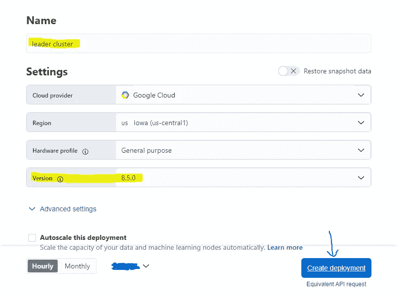
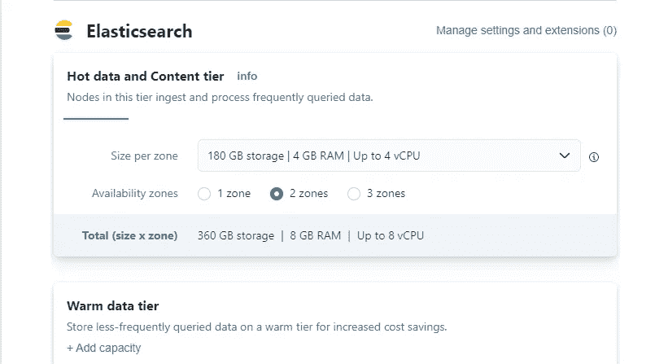
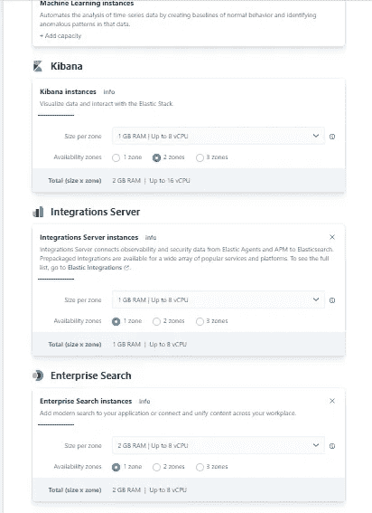
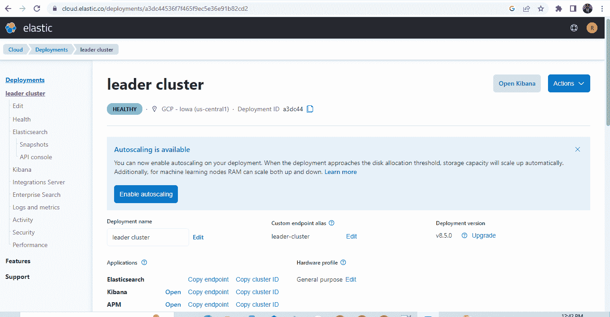
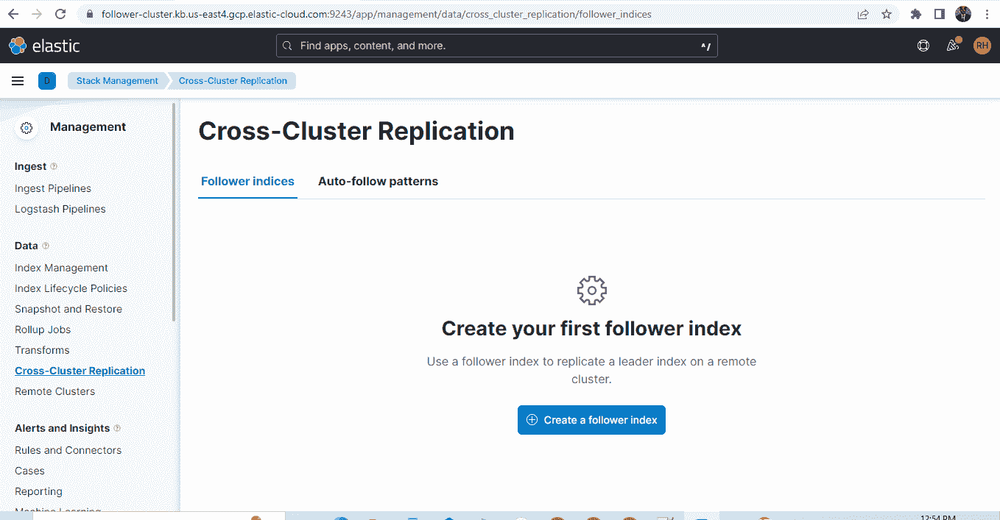
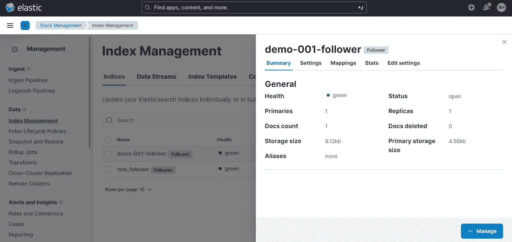

# 群集关闭，不要担心弹性覆盖您的数据。

> 原文：<https://blog.devgenius.io/cluster-gone-off-dont-worry-elastic-got-your-data-covered-a1d7b90e6ea?source=collection_archive---------11----------------------->


本博客重点介绍 ***如何在弹性云上实现跨集群复制。***

数据可用性和灾难恢复是市场上任何用于生产的可靠数据存储库的两大支柱，Elasticsearch 在这些方面也不例外。

Elastic 使用的技术被称为**跨集群复制(CCR)。**根据弹性最佳实践，在生产环境中处理有价值的敏感数据时，总是建议在两个不同的区域启动两个不同的集群，并在其中启用 CCR。

通过在集群设置中启用 CCR，在后端使用 Elasticsearch 的应用程序将不会在托管具有所有主数据的弹性集群的任何数据中心发生不可预见的自然或人为灾难/中断事件时停机。

在本博客后面解释跨集群复制时使用的一些技术术语是-

1.  ***Leader index-*** 将保存主集群上所有主要数据的索引。
2.  ***跟随者索引-*** 将在不同集群上复制的一个或多个索引，将保存来自领导者索引的所有数据。领导者和追随者索引之间的复制过程不仅发生在索引级别，也发生在碎片级别。

跨集群复制可以有单向和双向设置，在本博客的演示中，它显示了前一种。

遵循下面解释的演示的先决条件:-

1.  ***你应该有一个 14 天的弹性云轨迹启用*** 来访问它这里是[链接](https://cloud.elastic.co/login)。
2.  请检查[版本兼容性矩阵](https://www.elastic.co/guide/en/elasticsearch/reference/current/xpack-ccr.html#xpack-ccr)，以确保包含追随者索引的集群必须运行与远程集群相同或更新的**版本的 Elasticsearch。为了便于演示，具有领导者和跟随者索引的两个集群的版本都保持为 8.5.0 版本**

**步骤 1-** 在 8.5.0 版本的两个不同区域中，创建两个不同的弹性集群，一个命名为 leader 集群，其中包含 leader 索引，另一个命名为 follower 集群，其中包含 follower 索引。两个集群的硬件配置保持相同。



**步骤 2-** 转到跟随者集群，然后将领导者集群注册为远程集群。应能看到已连接的远程集群的状态，以验证连接是否已建立，详细过程如下面的 gif-所示



**步骤 3-** 创建一个名为 test inside leader index 的索引作为主索引，并通过定义该索引的适当映射和设置在其中插入一些随机数据。

```
#Create a test index
PUT test
{
  "settings": {
    "number_of_replicas": 1
  },
  "mappings": {
    "properties": {
      "name": {
        "type": "text"
      },
      "age": {
        "type": "integer"
      }
    }
  }
}

# Now to insert a dummy document into test index inside leader cluster

POST test/_doc
{
  "name": "harry",
  "age": 55
}
```

**步骤 4-** 在名为“跟随者集群”的集群上执行以下步骤-

***步骤 4.1-*** 单击堆栈管理，然后单击跨集群复制

***步骤 4.2-*** 在跨集群复制下点击跟随者索引。

***步骤 4.3-*** 填写所需详细信息，给出远程集群和跟随者索引名称的详细信息。

***步骤 4.4-*** 启用复制，然后检查创建的跟随者索引是否可见，这可以通过索引管理- >索引进行检查，然后您可以在那里看到名为“test_follower”的跟随者索引。

这样做的详细过程显示在下面给出的 gif 中-



**步骤 5-** 另一种无需人工干预的创建追随者指数的方法是使用自动追随者模式。自动跟随模式的工作方式是，每次在遵循特定模式的领导者集群上创建领导者索引时，都会自动在跟随集群上创建其跟随者。这样做的详细过程如下所示-

***步骤 5.1-*** 在从机集群上，在开发工具中运行该命令-

```
PUT /demo-001-follower/_ccr/follow
{
  "remote_cluster": "leader_cluster",
  "leader_index": "demo-001",
  "max_read_request_operation_count": 5120,
  "max_outstanding_read_requests": 12,
  "max_read_request_size": "32mb",
  "max_write_request_operation_count": 5120,
  "max_write_request_size": "9223372036854775807b",
  "max_outstanding_write_requests": 9,
  "max_write_buffer_count": 2147483647,
  "max_write_buffer_size": "512mb",
  "max_retry_delay": "500ms",
  "read_poll_timeout": "1m"
}
```

***步骤 5.2-*** 在主集群上，在开发工具中运行以下命令-

```
# An index named demo-001 is created on the leader cluster

PUT demo-001 
{
  "settings": {
    "number_of_replicas": 1
  },
  "mappings": {
    "properties": {
      "VehicleID": {
        "type": "text"
      },
      "VehicleName": {
        "type": "integer"
      }
    }
  }
}

POST demo-001/_doc
{
  "VehicleID": "88XYZ",
  "type": 2
}

GET demo-001/_search
```

***步骤 5.3-*** 在跟随者集群上，请查看堆栈管理下的索引管理，您应该能够看到名为“demo-001-跟随者”的索引



除了复制数据用于灾难恢复之外，CCR 还有其他优势，即通过增加用户与集群的地理接近度来减少搜索延迟，并防止搜索量影响索引吞吐量。

您刚刚看到了跨集群复制过程是如何以两种方式工作的，即分别通过跟随者索引和自动跟随者模式方法，还有助于在保存所有宝贵数据的数据中心发生停机或永久损坏时防止任何数据丢失。

这里有一个[链接](https://www.elastic.co/guide/en/elasticsearch/reference/current/xpack-ccr.html#xpack-ccr)到与 CCR 相关的 Elastic 的官方文档，供你探索更多。

如果你喜欢我的博客，请喜欢，分享和评论我的博客，并提供宝贵的反馈，不要忘记关注我，在弹性技术栈上获得更多这样令人兴奋的内容。

谢谢大家！