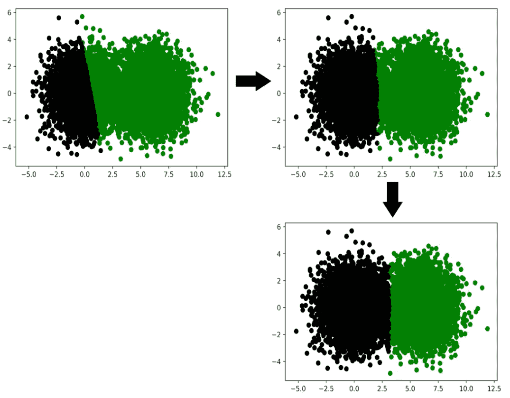
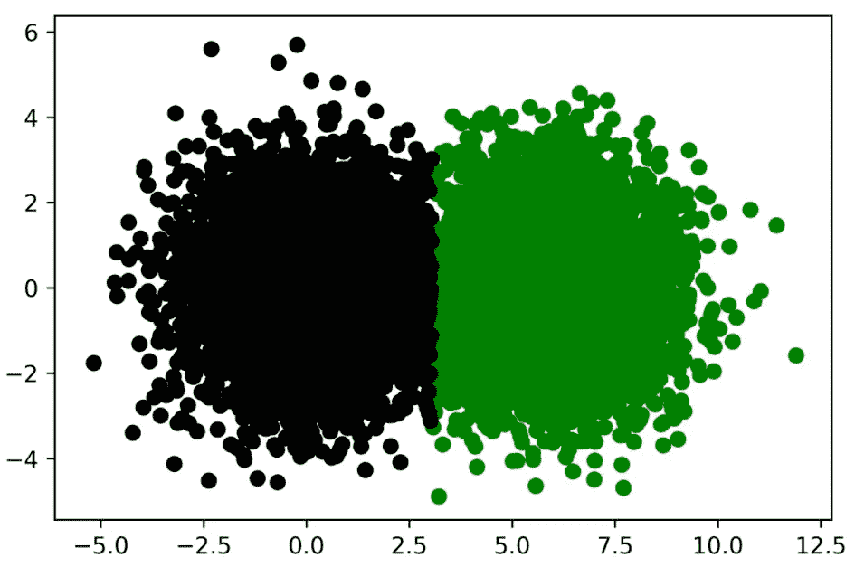
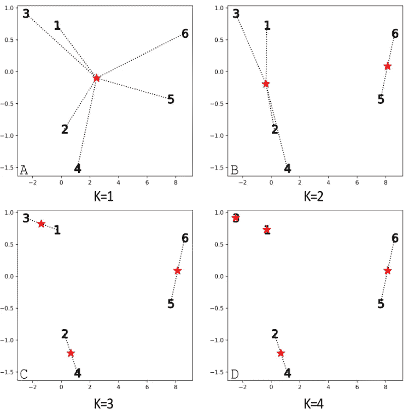
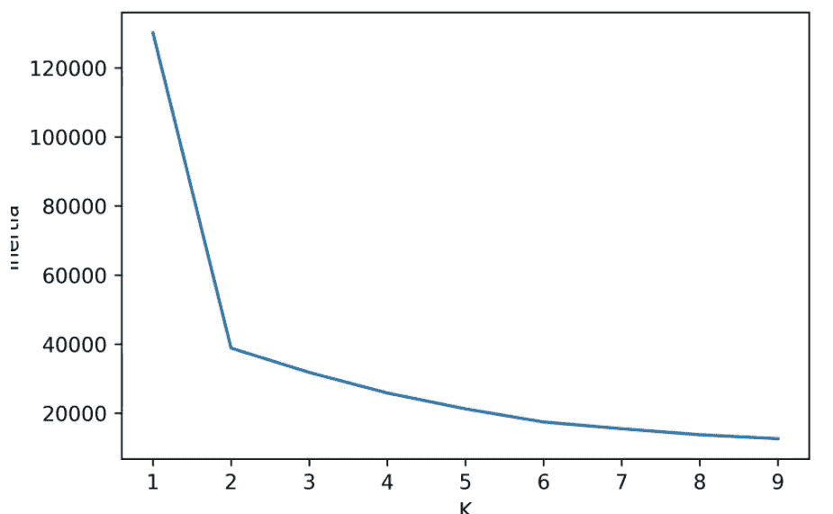
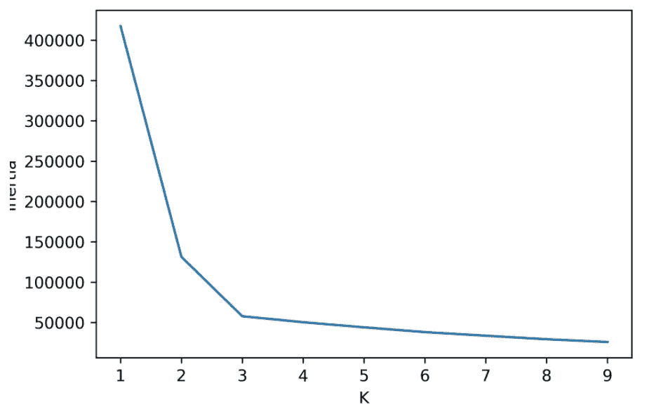
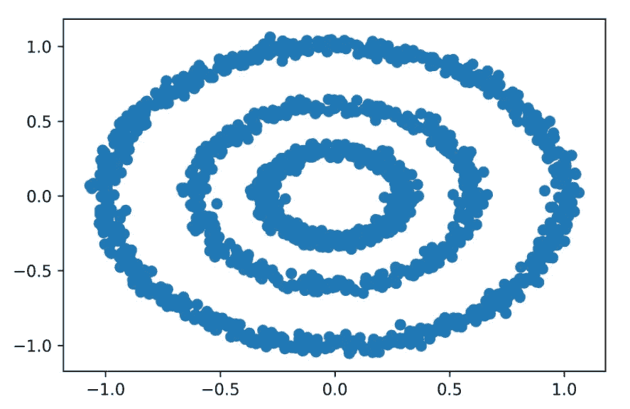
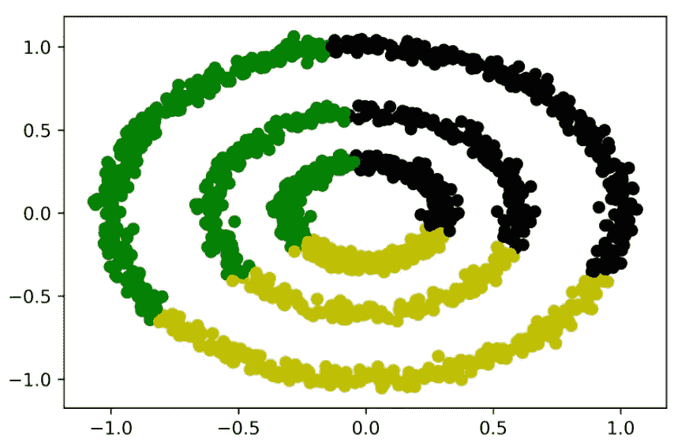

# 将数据分组，第 2 部分

> 原文：<https://blog.devgenius.io/clustering-data-into-groups-part-2-3f7e1d25e67e?source=collection_archive---------8----------------------->

## 文章

## *来自* [*数据科学图书营*](https://www.manning.com/books/data-science-bookcamp?utm_source=medium&utm_medium=organic&utm_campaign=book_apeltsin_data_9_6_19) *作者 Leonard Apeltsin*

*这个由 3 部分组成的文章系列包括:*

*   *通过中心性对数据进行聚类*
*   *按密度聚类数据*
*   *聚类算法之间的权衡*
*   *使用 scikit-learn 库执行聚类*
*   *使用熊猫遍历集群*

在[manning.com](https://www.manning.com/?utm_source=medium&utm_medium=organic&utm_campaign=book_apeltsin_data_9_6_19)的结账处，将 **fccapeltsin** 输入折扣代码框，即可享受 [*数据科学图书营*](https://www.manning.com/books/data-science-bookcamp?utm_source=medium&utm_medium=organic&utm_campaign=book_apeltsin_data_9_6_19)35%的折扣。

如果你错过了，你可以在这里查看[第一部分](https://manningbooks.medium.com/clustering-data-into-groups-part-1-2a438c46de95)。

## **K-means:用于将数据分组为 K 个中心组的聚类算法**

K-means 算法假设输入的数据点围绕 *K* 不同的中心旋转。每个中心坐标就像一个隐藏的靶心，被分散的数据点所包围。该算法的目的是揭示这些隐藏的中心坐标。

我们通过首先选择 *K* 来初始化 K-means，这是我们将搜索的中心坐标的数量。在我们的镖靶分析中， *K* 被设置为 2，尽管通常 *K* 可以等于任何整数。该算法随机选择 *K* 个数据点。这些数据点被视为真正的中心。然后，算法通过更新选择的中心位置进行迭代，数据科学家称之为*质心*。在单次迭代中，每个数据点被分配到其最近的中心，导致形成 *K* 组。接下来，更新每个组的中心。新的中心等于组坐标的平均值。如果我们重复这个过程足够长的时间，组均值将收敛到 *K* 个代表中心(图 6)。收敛性在数学上是有保证的。然而，我们无法预先知道收敛所需的迭代次数。一个常见的技巧是，当新计算的中心都没有明显偏离其前身时，停止迭代。



图 6。K-means 算法从两个随机选择的质心迭代收敛到实际的靶心质心

K-means 也不是没有局限性。该算法基于我们对 K 的了解:要寻找的聚类数。通常，这种知识是不存在的。此外，虽然 K-means 通常可以找到合理的中心，但从数学上来说，它不能保证找到数据中可能的最佳中心。有时，K-means 会由于算法初始化阶段随机质心选择不当而返回非直觉或次优组。最后，K-means 假设数据中的聚类实际上围绕 *K* 中心位置旋转。但是正如我们在本节后面所了解到的，这个假设并不总是成立的。

## **使用 scikit-learn 的 K 均值聚类**

如果 K-means 算法被有效地实现，它可以在合理的时间内运行。通过外部 scikit-learn 库可以快速实现该算法。Scikit-learn 是一个非常流行的机器学习工具包，构建在 NumPy 和 SciPy 之上。它具有各种核心分类、回归和聚类算法，当然包括 K-means。让我们安装库。然后我们导入 scikit-learn 的`KMeans`集群类。

从命令行终端调用`pip install scikit-learn`来安装 scikit-learn 库。

**清单 8。从 scikit 导入**`**KMeans**`**-学习**

```
from sklearn.cluster import Kmeans
```

将`KMeans`应用到我们的`darts`数据很容易。首先我们需要运行`KMeans(n_clusters=2)`，这将创建一个能够找到两个靶心的`cluster_model`对象。然后我们可以通过运行`cluster_model.fit_predict(darts)`来执行 K-means。该方法调用将返回一个存储每个飞镖的靶心索引的`assigned_bulls_eyes`数组。

**清单 9。使用 scikit-learn 的 K-means 聚类**

```
cluster_model = KMeans(n_clusters=2) ❶
 assigned_bulls_eyes = cluster_model.fit_predict(darts) ❷

 print("Bull's-eye assignments:")
 print(assigned_bulls_eyes)
 Bull's-eye assignments:
 [0 0 0 ... 1 1 1]
```

❶ **创建一个聚类模型对象，其中中心的数量被设置为 2**

❷ **使用 K-means 算法优化两个中心，并返回为每个镖分配的聚类**

让我们根据它们的聚类分配来给我们的飞镖着色，以验证结果(图 7)。

**清单 10。绘制 K-均值聚类分配图**

```
for bs_index in range(len(bulls_eyes)):
     selected_darts = [darts[i] for i in range(len(darts))
                       if bs_index == assigned_bulls_eyes[i]]
     x_coordinates, y_coordinates = np.array(selected_darts).T
     plt.scatter(x_coordinates, y_coordinates,
                 color=['g', 'k'][bs_index])
 plt.show()
```



图 7。scikit-learn 返回的 K-means 聚类结果与我们的预期一致。

我们的聚类模型已经定位了数据中的质心。现在我们可以重用这些质心来分析模型以前没有见过的新数据点。执行`cluster_model.predict([x, y])`将质心分配给由`x`和`y`定义的数据点。我们使用`predict`方法对两个新数据点进行聚类。

**清单 11。使用** `**cluster_model**` **对新数据进行聚类**

```
new_darts = [[500, 500], [-500, -500]]
 new_bulls_eye_assignments = cluster_model.predict(new_darts)
 for i, dart in enumerate(new_darts):
     bulls_eye_index = new_bulls_eye_assignments[i]
     print(f"Dart at {dart} is closest to bull's-eye {bulls_eye_index}")
 Dart at [500, 500] is closest to bull's-eye 0
 Dart at [-500, -500] is closest to bull's-eye 1
```

## **使用肘法选择最佳 K**

K-means 依赖于输入的 *K* 。当事先不知道数据中真实聚类的数量时，这可能是一个严重的障碍。然而，我们可以使用称为*弯头法*的技术来估计 *K* 的适当值。

肘方法依赖于一个叫做*惯性*的计算值，它是每个点和它最近的 K 均值中心之间距离的平方和。如果 *K* 为 1，那么惯性等于到数据集均值的所有平方距离的总和。如第 5 节所述，该值与方差成正比。方差反过来是离差的度量。因此，如果 *K* 为 1，则惯性是对离差的估计。即使 *K* 大于 1，该属性也成立。基本上，惯性估计了我们计算的平均值周围的总离差。

通过估计离差，我们可以确定我们的 *K* 值是太高还是太低。例如，假设我们将 *K* 设为 1。潜在地，我们的许多数据点将位于离一个中心太远的地方。我们的离差会很大，惯性也会很大。当我们将 K 向一个更合理的数值增加时，额外的中心将导致惯性减小。最终，如果我们走极端，将 *K* 设置为等于点的总数，每个数据点都将落入自己的私有簇中。色散将被消除，惯性将下降到零(图 8)。



图 8。编号为 1 到 6 的六个点被标绘在 2D 空间中。由星星标记的中心是通过不同的 *K* 值计算出来的。从每个点到最近的中心画一条线。惯性是通过将六条线的平方长度相加计算出来的。*(A)K*= 1。所有六条线都从一个中心延伸出来。惯性挺大的。(B) *K* = 2。点 5 和 6 非常靠近第二个中心。惯性减小。 *K* = 3。点 1 和 3 基本上更靠近新形成的中心。点 2 和 4 也基本上更靠近新形成的中心。惯性已经急剧下降。(D) *K* = 4。点 1 和 3 现在与其中心重叠。它们对惯性的贡献已经从非常低的值转移到零。其余四个点及其相关中心之间的距离保持不变。因此，将 *K* 从 3 增加到 4 会导致惯性非常小的降低。

有些惯性值太大。其他的太低了。介于两者之间的某个值可能正好合适。我们如何找到它？

让我们想出一个解决办法。我们首先在大范围的 *K* 值上绘制我们的镖靶数据集的惯性(图 9)。为每个 scikit-learn `KMeans`对象自动计算惯性。我们可以通过模型的`_inertia`属性来访问这个存储值。

**清单 12。绘制 K-均值惯性**

```
k_values = range(1, 10)
 inertia_values = [KMeans(k).fit(darts).inertia_
                   for k in k_values]

 plt.plot(k_values, inertia_values)
 plt.xlabel('K')
 plt.ylabel('Inertia')
 plt.show()
```



图 9。包含两个靶心目标的飞镖靶模拟的惯性图。这个情节就像一只胳膊在肘部弯曲。肘部直接指向 2 的一个 *K* 。

生成的图类似于肘部弯曲的手臂，肘部指向的 *K* 值为 2。正如我们已经知道的，这个 *K* 精确地捕捉了我们已经预编程到数据集中的两个中心。

如果现有中心的数量增加，这种方法还适用吗？我们可以通过在投掷飞镖模拟中添加一个额外的靶心来找出答案。在我们将集群数量增加到三个之后，我们重新生成我们的惯性图(图 10)。

清单 13。绘制 3 镖靶模拟的惯性图

```
new_bulls_eye = [12, 0]
 for _ in range(5000):
     x = np.random.normal(new_bulls_eye[0], variance ** 0.5)
     y = np.random.normal(new_bulls_eye[1], variance ** 0.5)
     darts.append([x, y])

 inertia_values = [KMeans(k).fit(darts).inertia_
                   for k in k_values]

 plt.plot(k_values, inertia_values)
 plt.xlabel('K')
 plt.ylabel('Inertia')
 plt.show()
```



图 10。包含三个靶心目标的飞镖靶模拟的惯性图。这个情节就像一只胳膊在肘部弯曲。弯头的最低部分指向 3 的 K。

添加第三个中心导致新弯头的最低倾斜度指向 3 的 *K* 值。本质上，我们的肘形图描绘了每个增量 *K* 捕获的离差。连续的 *K* 值之间惯性的快速下降意味着分散的数据点已经被分配到更紧密的聚类中。随着惯性曲线变平，惯性的减小逐渐失去其影响。这种从垂直下降到较平缓角度的过渡导致我们的图中出现一个肘形。我们可以使用肘部的位置在 K-means 算法中选择一个合适的 *K* 。

肘方法选择标准是一个有用的启发，但并不保证在所有情况下都有效。在某些情况下，肘部在多个 *K* 值上缓慢变平，这使得很难选择单个有效的聚类计数。

还有更强大的 *K* 选择方法，比如*剪影得分*，它捕捉每个点到相邻聚类的距离。对剪影配乐的彻底讨论超出了本书的范围。然而，我们鼓励你使用`sklearn.metrics.silhouette_score`方法自己探索乐谱。

## k-均值聚类方法

*   `k_means_model = KMeans(n_clusters=K)` —创建一个 K 均值模型来搜索 *K 个*不同的质心。我们需要将这些质心与输入的数据相匹配。
*   `clusters = k_means_model.fit_predict(data)` —使用初始化的`KMeans`对象对输入的数据执行 K-means。返回的`clusters`数组包含范围从 0 到 *K* 的簇 id。`data[i]`的集群 ID 等于`clusters[i]`。
*   `clusters = KMeans(n_clusters=K).fit_predict(data)` —在单行代码中执行 K-means，并返回结果聚类。
*   `new_clusters = k_means_model.predict(new_data)`-使用数据优化`KMeans`对象中的现有质心，找到与以前未见过的数据最近的质心。
*   `inertia = k_means_model.inertia_` —返回与数据优化的`KMeans`对象相关联的惯性。
*   `inertia = KMeans(n_clusters=K).fit(data).inertia_` —在单行代码中执行 K-means，并返回结果惯量。

肘方法并不完美，但是如果数据集中在 *K* distinct means 上，它表现得相当好。当然，这假设我们的数据集群由于中心性而不同。然而，在许多情况下，由于空间中数据点的密度不同，数据聚类也不同。让我们探讨一下密度驱动的集群的概念，它不依赖于中心性。

## **使用密度发现集群**

假设一位天文学家在太阳系遥远的边缘发现了一颗新行星。这颗行星很像土星，有多个环围绕其中心在恒定的轨道上旋转。每个环都是由成千上万的岩石形成的。我们将这些岩石建模为由 x 和 y 坐标定义的独立点。让我们使用 scikit-learn 的`makes_circles`函数生成三个由许多岩石组成的岩石环(图 11)。

**清单 14。模拟行星周围的光环**

```
from sklearn.datasets import make_circles

 x_coordinates = []
 y_coordinates = []
 for factor in [.3, .6, 0.99]:
     rock_ring, _ = make_circles(n_samples=800, factor=factor, ❶
                                 noise=.03, random_state=1)
     for rock in rock_ring:
         x_coordinates.append(rock[0])
         y_coordinates.append(rock[1])

 plt.scatter(x_coordinates, y_coordinates)
 plt.show()
```

❶**make _ circles 函数在 2D 中创建两个同心圆。较小圆的半径相对于较大圆的比例由“因子”参数决定。**



图 11。围绕一个中心点的三个岩石环的模拟

三个环组清楚地出现在图中。让我们通过将 *K* 设置为 3 来使用 K-means 搜索这三个集群(图 12)。

**清单 15。使用 K-均值聚类环**

```
rocks = [[x_coordinates[i], y_coordinates[i]]
           for i in range(len(x_coordinates))]
 rock_clusters = KMeans(3).fit_predict(rocks)

 colors = [['g', 'y', 'k'][cluster] for cluster in  rock_clusters]
 plt.scatter(x_coordinates, y_coordinates, color=colors)
 plt.show()
```



图 12。k-均值聚类未能正确识别三个不同的岩石环。

输出是一个彻底的失败！K-means 将数据分解成三个对称的段，每个段跨越多个环。这个解决方案不符合我们的直觉预期，即每个环都应该属于自己独特的组。哪里出了问题？K-means 假设三个星团由三个独特的中心定义，但实际的环围绕一个中心点旋转。集群之间的差异不是由中心性驱动的，而是由密度驱动的。每一个环都是由密集的点构成的，人口稀少的空白区域作为环之间的边界。

我们需要设计一种算法，在密集的空间区域聚集数据。这样做要求我们定义一个给定的区域是密集的还是稀疏的。*密度*的一个简单定义如下:只有当一个点位于 *Y* 其他点的距离 *X* 内时，该点才处于密集区域。我们将把 *X* 和 *Y* 分别称为`epsilon`和`min_points`。以下代码将`epsilon`设置为 0.1，将`min_points`设置为 10。因此，如果我们的岩石在至少 10 个其他岩石的 0.1 半径范围内，它们就存在于空间的密集区域。

**清单 16。指定密度参数**

```
epsilon = 0.1
 min_points = 10
```

让我们分析一下`rocks`列表中第一块岩石的密度。我们从搜索`rocks[0]`的`epsilon`个单位内的所有其他岩石开始。我们将这些相邻岩石的索引存储在一个`neighbor_indices`列表中。

**清单 17。**寻找邻居`**rocks[0]**`

```
neighbor_indices = [i for i, rock in enumerate(rocks[1:])
                     if euclidean(rocks[0], rock) <= epsilon]
```

现在，我们将邻居的数量与`min_points`进行比较，以确定`rocks[0]`是否位于密集的空间区域。

**清单 18。检查**的密度`**rocks[0]**`

```
num_neighbors = len(neighbor_indices)
 print(f"The rock at index 0 has {num_neighbors} neighbors.")

 if num_neighbors >= min_points:
     print("It lies in a dense region.")
 else:
     print("It does not lie in a dense region.")
 The rock at index 0 has 40 neighbors.
 It lies in a dense region.
```

指数为 0 的岩石位于稠密的空间区域。`rocks[0]`的邻居也共享那个密集的空间区域吗？这是一个很难回答的问题。毕竟，有可能每个邻居的邻居都少于自己的邻居。根据我们严格的密度定义，我们不会认为这些邻居是密集点。然而，这将导致一种可笑的情况，其中密集区域仅由一个点组成:`rocks[0]`。我们可以通过更新密度定义来避免这种荒谬的结果。让我们正式定义*密度*如下:

*   如果一个点位于`min_point`邻居的`epsilon`距离内，则该点位于空间的密集区域。
*   一个密集空间区域中的一个点的每个邻居也聚集在该空间中。

基于我们更新的定义，我们可以将`rocks[0]`和它的邻居组合成一个单一的密集集群。

**清单 19。创建密集集群**

```
dense_region_indices = [0] + neighbor_indices
 dense_region_cluster = [rocks[i] for i in dense_region_indices]
 dense_cluster_size = len(dense_region_cluster)
 print(f"We found a dense cluster containing {dense_cluster_size} rocks")
 We found a dense cluster containing 41 rocks
```

指数为 0 的岩石和它的邻居形成了一个 41 元素的致密星团。是否有邻居的邻居属于空间的密集区域？如果是这样，那么按照我们更新的定义，这些岩石也属于致密星团。因此，通过分析额外的邻近点，我们可以扩展`dense_region_cluster`的大小。

**清单 20。扩展密集集群**

```
dense_region_indices = set(dense_region_indices) ❶
 for index in neighbor_indices:
     point = rocks[index]
     neighbors_of_neighbors = [i for i, rock in enumerate(rocks)
                               if euclidean(point, rock) <= epsilon]
     if len(neighbors_of_neighbors) >= min_points:
         dense_region_indices.update(neighbors_of_neighbors)

 dense_region_cluster = [rocks[i] for i in dense_region_indices]
 dense_cluster_size = len(dense_region_cluster)
 print(f"We expanded our cluster to include {dense_cluster_size} rocks")
 We expanded our cluster to include 781 rocks
```

❶ **将密集区域索引转换为集合。这允许我们用额外的索引更新集合，而不用担心重复。**

我们遍历了邻居的邻居，将我们的密集集群扩展了近 20 倍。为什么停在那里？通过分析新遇到的邻居的密度，我们可以进一步扩展我们的集群。反复重复我们的分析将增加我们的聚类边界的宽度。最终，边界会扩展到完全包围我们的一个岩石环。然后，由于没有新的邻居要吸收，我们可以对到目前为止还没有分析过的`rocks`元素重复迭代分析。这种重复将导致更多致密环的聚集。

刚刚描述的过程被称为 DBSCAN。DBSCAN 算法根据数据的空间分布来组织数据。

点击查看[第三部分。感谢阅读。](https://manningbooks.medium.com/clustering-data-into-groups-part-3-7369148da274)