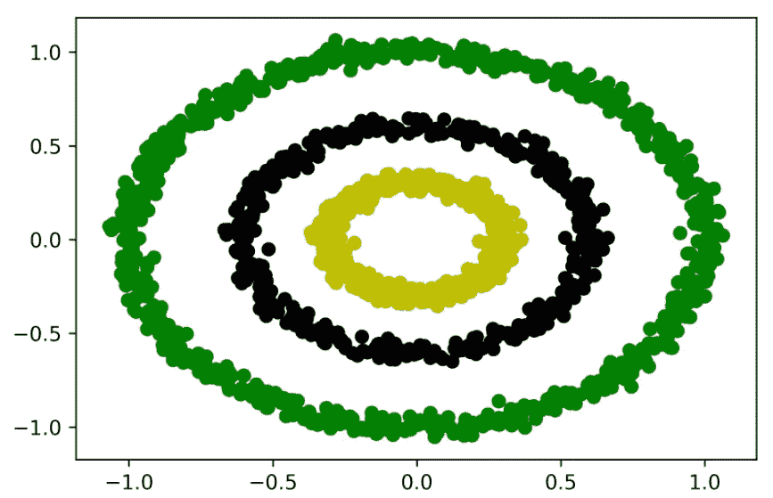
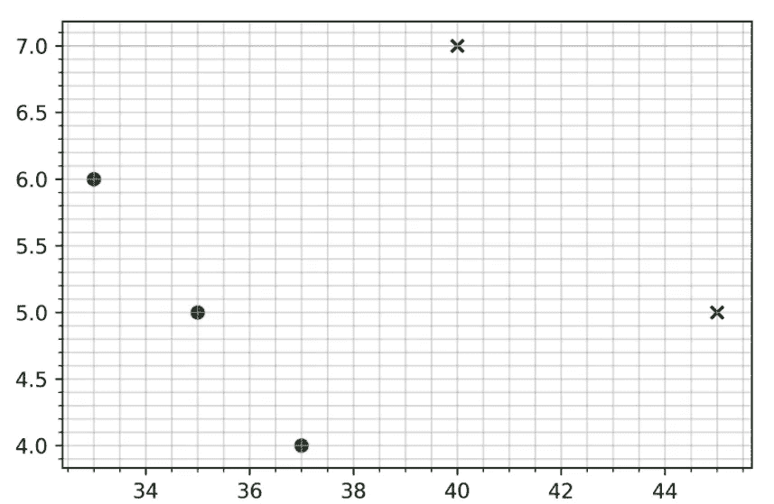
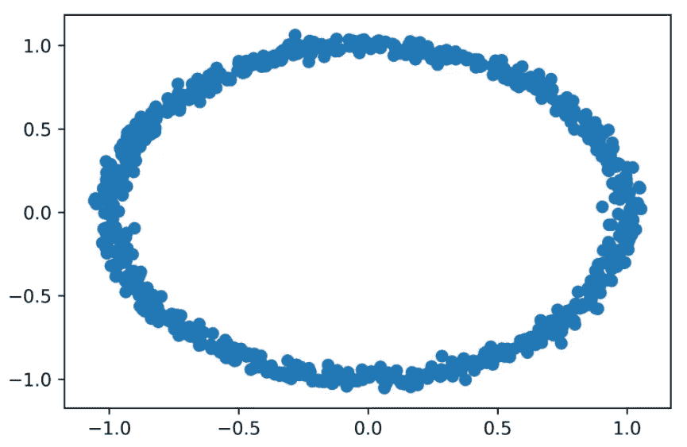
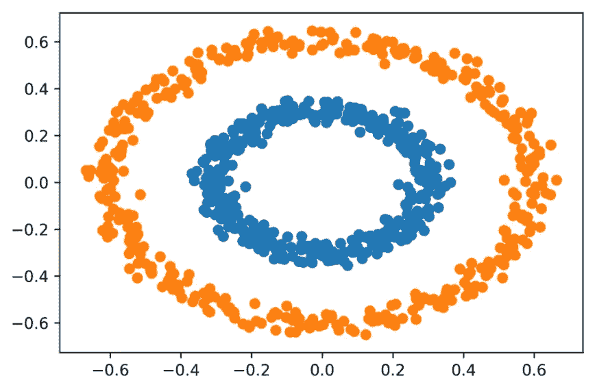

# 将数据分组，第 3 部分

> 原文：<https://blog.devgenius.io/clustering-data-into-groups-part-3-7369148da274?source=collection_archive---------4----------------------->

## 文章

## 来自 Leonard Apeltsin 的[数据科学夏令营](https://www.manning.com/books/data-science-bookcamp?utm_source=medium&utm_medium=organic&utm_campaign=book_apeltsin_data_9_6_19)

*这个由 3 部分组成的文章系列包括:*

*   *通过中心性对数据进行聚类*
*   *按密度聚类数据*
*   *聚类算法之间的权衡*
*   *使用 scikit-learn 库执行聚类*
*   *使用熊猫遍历集群*

在[manning.com](https://www.manning.com/?utm_source=medium&utm_medium=organic&utm_campaign=book_apeltsin_data_9_6_19)的结账处，将 **fccapeltsin** 输入折扣代码框，即可享受 [*数据科学图书营*](https://www.manning.com/books/data-science-bookcamp?utm_source=medium&utm_medium=organic&utm_campaign=book_apeltsin_data_9_6_19)35%的折扣。

如果你错过了它们，检查一下[第一部分](https://manningbooks.medium.com/clustering-data-into-groups-part-1-2a438c46de95)和[第二部分](https://manningbooks.medium.com/clustering-data-into-groups-part-2-3f7e1d25e67e)。

## **DBSCAN:一种基于空间密度对数据进行分组的聚类算法**

DBSCAN 是首字母缩写词，代表*带有噪声的应用程序的基于密度的空间聚类*。对于本质上非常简单的技术来说，这是一个长得可笑的名字:

1.  从`data`列表中选择一个随机的`point`坐标。
2.  获取在那个`point`的`epsilon`距离内的所有邻居。
3.  如果发现的邻居少于`min_points`，使用不同的随机点重复步骤 1。否则，将`point`和它的邻居组成一个集群。
4.  对所有新发现的邻居重复步骤 2 和 3。所有相邻的密集点被合并到聚类中。在群集停止扩展后，迭代终止。
5.  提取整个聚类后，对尚未分析密度的所有数据点重复步骤 1-4。

DBSCAN 程序可以用不到 20 行代码编写。然而，在我们的`rocks`列表中，任何基本的实现都会运行得非常慢。编程一个快速的实现需要一些非常细微的优化来提高邻居遍历速度，这超出了本书的范围。幸运的是，我们不需要从头开始重建算法:scikit-learn 提供了一个快速的`DBSCAN`类，我们可以从`sklearn.cluster`导入它。让我们通过使用`eps`和`min_samples`参数分配`epsilon`和`min_points`来导入并初始化这个类。然后，我们利用`DBSCAN`来聚集我们的三个环(图 13)。

**清单 21。使用** `**DBSCAN**` **来群集环** s

```
from sklearn.cluster import DBSCAN
 cluster_model = DBSCAN(eps=epsilon, min_samples=min_points) (1)
 rock_clusters = cluster_model.fit_predict(rocks) (2)
 colors = [['g', 'y', 'k'][cluster] for cluster in rock_clusters]
 plt.scatter(x_coordinates, y_coordinates, color=colors)
 plt.show()
```

❶ **创建一个 cluster_model 对象进行密度聚类。使用 eps 参数传入ε值 0.1。使用 min_samples 参数传入 min_points 值 10。**

❷ **根据密度对岩石环进行聚类，并返回每个岩石的指定聚类**



图 13。DBSCAN 聚类准确地识别了三个不同的岩石环。

DBSCAN 已经成功识别了三个岩石环。该算法在 K-means 失败的地方成功。

## **比较 DBSCAN 和 K-means**

DBSCAN 是一种用于聚类由弯曲和密集形状组成的数据的有利算法。此外，与 K-means 不同，该算法在执行之前不需要近似的聚类数。此外，DBSCAN 可以过滤位于稀疏空间区域的随机异常值。例如，如果我们添加一个位于环边界之外的异常值，DBSCAN 将为它分配一个-1 的簇 ID。负值表示异常值不能与数据集的其余部分聚类在一起。

与 K-means 不同，拟合的 DBSCAN 模型不能重新应用于全新的数据。相反，我们需要结合新旧数据，从头开始执行集群。这是因为计算的 K 均值中心可以很容易地与附加数据点进行比较。但是，额外的数据点可能会影响以前看到的数据的密度分布，这将迫使 DBSCAN 重新计算所有聚类。

**清单 22。使用 DBSCAN 查找异常值**

```
noisy_data = rocks + [[1000, -1000]]
 clusters = DBSCAN(eps=epsilon,
                   min_samples=min_points).fit_predict(noisy_data)
 assert clusters[-1] == -1
```

DBSCAN 技术的另一个优点是它不依赖于平均值。同时，K-means 算法要求我们计算分组点的平均坐标。正如我们在第 5 节中所讨论的，这些平均坐标使到中心的距离的平方和最小。只有当距离的平方是欧几里德距离时，最小化性质才成立。因此，如果我们的坐标不是欧几里得的，平均值就不是很有用，K-means 算法就不应该应用。然而，欧几里德距离并不是测量两点之间距离的唯一度量标准——定义距离的度量标准有很多。我们将在接下来的小节中探讨其中的一些。在这个过程中，我们学习如何将这些指标集成到我们的 DBSCAN 集群输出中。

## **基于非欧几里德距离的聚类**

假设我们正在游览曼哈顿，想知道从帝国大厦到哥伦布圆环的步行距离。帝国大厦位于第 34 街和第五大道的交叉口。与此同时，哥伦布圆环位于第 57 街和第八大道的交叉口。曼哈顿的街道总是相互垂直。这使我们可以将曼哈顿表示为 2D 坐标系，街道位于 x 轴上，大道位于 y 轴上。在这种表示下，帝国大厦位于坐标(34，5)，哥伦布圆环位于坐标(57，8)。我们可以很容易地计算出两个坐标点之间的直线欧几里德距离。然而，最终的长度将是不可逾越的，因为高耸的钢铁建筑占据了每个城市街区所勾勒出的区域。更正确的解决方案是限定一条穿过形成城市网格的垂直人行道的道路。这样的路线要求我们在第五大道和第三大道之间走三个街区，然后在第 34 街和第 57 街之间走 23 个街区，总距离为 26 个街区。曼哈顿的平均街区长度为 0.17 英里，因此我们可以估计步行距离为 4.42 英里。让我们使用一个广义的`manhattan_distance`函数直接计算步行距离。

**清单 23。计算曼哈顿距离**

```
def manhattan_distance(point_a, point_b):
     num_blocks = np.sum(np.absolute(point_a - point_b))
     return 0.17 * num_blocks

 x = np.array([34, 5])
 y = np.array([57, 8])
 distance = manhattan_distance(x, y) (1)

 print(f"Manhattan distance is {distance} miles")
```

❶ **我们也可以通过从 scipy.spatial.distance 导入 cityblock，然后运行. 17 * cityblock(x，y)来生成这个输出。**

```
Manhattan distance is 4.42 miles
```

现在，假设我们希望聚集两个以上的曼哈顿位置。我们假设每个聚类都包含一个点，该点与其他三个聚类点的距离都在一英里以内。这个假设让我们可以使用 scikit-learn 的`DBSCAN`类来应用 DBSCAN 集群。在 DBSCAN 初始化期间，我们将`eps`设置为 1，将`min_samples`设置为 3。此外，我们将`metric= manhattan_distance`传递给初始化方法。`metric`参数将欧几里得距离替换为我们自定义的距离度量，因此聚类距离正确地反映了城市中基于格网的约束条件。下面的代码集群曼哈顿坐标，并把它们和它们的集群名称一起绘制在一个网格上(图 14)。

**清单 24。使用曼哈顿距离聚类**

```
points = [[35, 5], [33, 6], [37, 4], [40, 7], [45, 5]]
 clusters = DBSCAN(eps=1, min_samples=3,
                   metric=manhattan_distance).fit_predict(points) ❶

 for i, cluster in enumerate(clusters):
     point = points[i]
     if cluster == -1:
         print(f"Point at index {i} is an outlier")
         plt.scatter(point[0], point[1], marker='x', color='k') ❷
     else:
         print(f"Point at index {i} is in cluster {cluster}")
         plt.scatter(point[0], point[1], color='g')

 plt.grid(True, which='both', alpha=0.5) ❸
 plt.minorticks_on()

 plt.show()
```

❶**Manhattan _ distance 函数通过 metric 参数传递给 DBSCAN。**

❷ **异常值使用 x 形标记绘制。**

❸ **网格法显示了我们计算曼哈顿距离的矩形网格。**

```
Point at index 0 is in cluster 0
 Point at index 1 is in cluster 0
 Point at index 2 is in cluster 0
 Point at index 3 is an outlier
 Point at index 4 is an outlier
```



图 14。使用曼哈顿距离对矩形网格中的五个点进行了聚类。网格左下角的三个点属于一个簇。剩下的两点是异常值，用 x 标记。

前三个位置属于单个聚类，其余的点是异常值。我们可以使用 K-means 算法检测到这个集群吗？也许吧。毕竟，我们的曼哈顿块坐标可以平均，使它们与 K-means 实现兼容。如果我们把曼哈顿距离换成一个不同的度量标准，那么平均坐标就不那么容易获得了。让我们定义一个具有以下性质的非线性距离度量:如果两个点的所有元素都是负的，则这两个点相距 0 个单位，如果它们的所有元素都是非负的，则相距 2 个单位，否则相距 10 个单位。给定这个荒谬的距离度量，我们能计算任意两点的平均值吗？我们不能，K-means 也不能应用。该算法的缺点是它依赖于平均距离的存在。与 K-means 不同，DBSCAN 算法不要求我们的距离函数是线性可分的。因此，我们可以使用荒谬的距离度量轻松运行 DBSCAN 集群。

**清单 25。使用荒谬的距离度量进行聚类**

```
def ridiculous_measure(point_a, point_b):
     is_negative_a = np.array(point_a) < 0 ❶
     is_negative_b = np.array(point_b) < 0
     if is_negative_a.all() and is_negative_b.all(): ❷
         return 0
     elif is_negative_a.any() or is_negative_b.any(): ❸
         return 10
     else: ❹
         return 2

 points = [[-1, -1], [-10, -10], [-1000, -13435], [3,5], [5,-7]]

 clusters = DBSCAN(eps=.1, min_samples=2,
                   metric=ridiculous_measure).fit_predict(points)

 for i, cluster in enumerate(clusters):
     point = points[i]
     if cluster == -1:
         print(f"{point} is an outlier")
     else:
         print(f"{point} falls in cluster {cluster}")
```

❶ **返回一个布尔数组，其中如果 point_a[i] < 0** 则 is_negative_a[i]为真

❷ **点 a 和点 b 的所有元素都是负的。**

❸ **消极因素是存在的，但并不是所有的因素都是消极的。**

❹ **所有的元素都是非负的。**

```
[-1, -1] falls in cluster 0
 [-10, -10] falls in cluster 0
 [-1000, -13435] falls in cluster 0
 [3, 5] is an outlier
 [5, -7] is an outlier
```

使用我们的`ridiculous_measure`度量运行 DBSCAN 会将负坐标聚集成一个组。所有其他坐标都被视为异常值。这些结果在概念上是不实际的，但是度量选择的灵活性是非常受欢迎的。我们在度量标准的选择上不受限制！例如，我们可以根据地球的曲率设置度量来计算遍历距离。这种度量对于地理位置的聚类特别有用。

## DBSCAN 聚类方法

*   `dbscan_model = DBSCAN(eps=epsilon, min_samples=min_points)` —创建一个 DBSCAN 模型，按密度进行聚类。密集点被定义为在`epsilon`的距离内至少有`min_points`个邻居。相邻点被视为与点属于同一个聚类的一部分。
*   `clusters = dbscan_model.fit_predict(data)` —使用初始化的`DBSCAN`对象对输入数据执行 DBSCAN。`clusters`数组包含集群 id。`data[i]`的集群 ID 等于`clusters[i]`。未聚类的离群点被赋予-1 的 ID。
*   `clusters = DBSCAN(eps=epsilon, min_samples=min_points).fit_predict(data)` —在单行代码中执行 DBSCAN，并返回结果集群。
*   `dbscan_model = DBSCAN(eps=epsilon, min_samples=min_points, metric=metric_function)`-创建 DBSCAN 模型，其中距离度量由自定义度量函数定义。`metric_function`距离度量不必是欧几里得的。

DBSCAN 确实有某些缺点。该算法旨在检测具有相似点密度分布的聚类。然而，真实世界的数据在密度上有所不同。例如，曼哈顿的比萨饼店比加利福尼亚州奥兰治县的比萨饼店分布得更密集。因此，我们可能很难选择密度参数来对这两个位置的商店进行聚类。这突出了算法的另一个限制:DBSCAN 需要有意义的参数值。特别是，变化的`eps`输入将极大地影响聚类的质量。不幸的是，没有一个可靠的程序来估计合适的`eps`。虽然文献中偶尔会提到某些启发法，但它们的好处是微乎其微的。大多数时候，我们必须依靠我们对问题的直觉理解来为两个 DBSCAN 参数分配实际输入。例如，如果我们要对一组地理位置进行聚类，我们的`eps`和`min_samples`值将取决于这些位置是分布在整个地球上，还是局限于单个地理区域。在每一种情况下，我们对密度和距离的理解都会有所不同。一般来说，如果我们对散布在地球上的随机城市进行聚类，我们可以将`min_samples`和`eps`参数分别设置为三个城市和 250 英里。这假设每个集群拥有一个距离至少三个其他集群城市 250 英里以内的城市。对于更区域性的位置分布，需要更低的`eps`值。

## **使用熊猫分析聚类**

到目前为止，我们一直将数据输入和聚类输出分开。例如，在我们的 rock ring 分析中，输入数据在`rocks`列表中，聚类输出在`rock_clusters`数组中。跟踪坐标和集群需要我们映射输入列表和输出数组之间的索引。因此，如果我们希望提取集群 0 中的所有岩石，我们必须获得`rocks[i`的所有实例，其中`rock_clusters[i] == 0`。这种指数分析令人费解。通过将坐标和聚类一起放在一个 Pandas 表中，我们可以更直观地分析聚类的岩石。

下面的代码创建了一个包含三列的熊猫表:`X`、`Y`和`Cluster`。表格中的第 *i* 行包含 x 坐标、y 坐标和位于`rocks[i]`的岩石群。

**清单 26。在表格中存储集群坐标**

```
import pandas as pd
 x_coordinates, y_coordinates = np.array(rocks).T
 df = pd.DataFrame({'X': x_coordinates, 'Y': y_coordinates,
                    'Cluster': rock_clusters})
```

我们的熊猫桌让我们可以轻松地访问任何集群中的岩石。让我们使用第 8 节中描述的技术绘制属于第 0 类的岩石(图 15)。

**清单 27。使用熊猫绘制单个集群**

```
df_cluster = df[df.Cluster == 0] ❶
 plt.scatter(df_cluster.X, df_cluster.Y) ❷
 plt.show()
```

❶ **只选择聚类列等于 0 的那些行**

❷ **绘制所选行的 x 和 y 列。注意，我们还通过运行 df_cluster.plot.scatter(x='X '，y='Y ')来执行散点图。**



图 15。属于第 0 类的岩石

Pandas 允许我们获得一个包含来自任何单个集群的元素的表。或者，我们可能希望获得多个表，每个表映射到一个集群 ID。在熊猫身上，这是通过叫`df.groupby('Cluster')`来实现的。`groupby`方法将创建三个表:每个集群一个。它将通过集群 id 和表之间的映射返回一个 iterable。让我们使用`groupby`方法来迭代我们的三个集群。我们随后将绘制聚类 1 和聚类 2 中的岩石，但不绘制聚类 0 中的岩石(图 16)。

调用`df.groupby('Cluster')`不仅仅返回一个 iterable:它还返回一个`DataFrameGroupBy`对象，为集群过滤和分析提供了额外的方法。

清单 28。使用熊猫对集群进行迭代

```
for cluster_id, df_cluster in df.groupby('Cluster'): ❶
     if cluster_id == 0:
         print(f"Skipping over cluster {cluster_id}")
         continue

     print(f"Plotting cluster {cluster_id}")
     plt.scatter(df_cluster.X, df_cluster.Y)

 plt.show()
 Skipping over cluster 0
 Plotting cluster 1
 Plotting cluster 2
```

❶**df . group by(' cluster ')返回的 iterable 的每个元素都是一个元组。元组的第一个元素是从 df.Cluster 获得的集群 ID。集群等于集群 ID。**



图 16。属于第 1 类和第 2 类的岩石

Pandas `groupby`方法让我们反复检查不同的集群。这在我们的案例研究 3 分析中可能证明是有用的。

## **总结**

*   *K-means* 算法通过搜索*K*质心对输入的数据进行聚类。这些质心代表发现的数据组的平均坐标。通过选择 *K 个*随机质心来初始化 K-means。然后，基于每个数据点最近的质心对其进行聚类，并迭代地重新计算质心，直到它们收敛到稳定的位置。
*   K-means 保证收敛到一个解。然而，该解决方案可能不是最佳的。
*   K-means 需要欧几里德距离来区分点。该算法不打算聚类非欧几里德坐标。
*   在执行 K-means 聚类之后，我们可以计算结果的*惯性*。惯性等于每个数据点与其最近中心之间距离的平方之和。
*   绘制一系列 *K* 值的惯性会生成一个*弯头图*。肘形图中的肘分量应向下指向合理的 *K* 值。使用肘图，我们可以试探性地为 K 均值选择一个有意义的 *K* 输入。
*   *DBSCAN* 算法根据密度对数据进行聚类。使用`epsilon`和`min_points`参数定义密度。如果一个点位于`min_point`邻居的`epsilon`距离内，那么该点位于空间的密集区域。一个密集空间区域中一个点的每一个邻居也聚集在那个空间中。DBSCAN 迭代地扩展密集空间区域的边界，直到检测到完整的集群。
*   DBSCAN 算法不会对非密集区域中的点进行聚类。它们被视为异常值。
*   DBSCAN 是一种用于聚类由弯曲和密集形状组成的数据的有利算法。
*   DBSCAN 可以使用任意的非欧几里德距离进行聚类。
*   没有可靠的试探法来选择合适的`epsilon`和`min_points`参数。但是，如果我们希望对全球城市进行聚类，我们可以将这两个参数分别设置为 250 英里和三个城市。
*   在 Pandas 表中存储集群数据允许我们用`groupby`方法直观地迭代集群。

这个系列就说到这里。如果你想了解这本书的更多信息，可以在曼宁的 liveBook 平台上查看[这里](https://livebook.manning.com/book/data-science-bookcamp?origin=product-look-inside&utm_source=medium&utm_medium=organic&utm_campaign=book_apeltsin_data_9_6_19)。