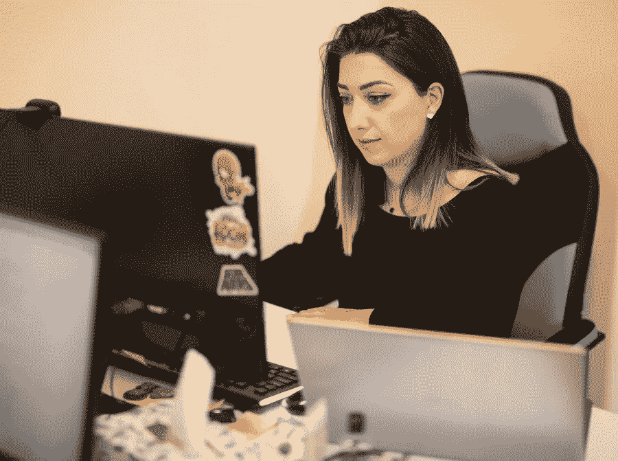
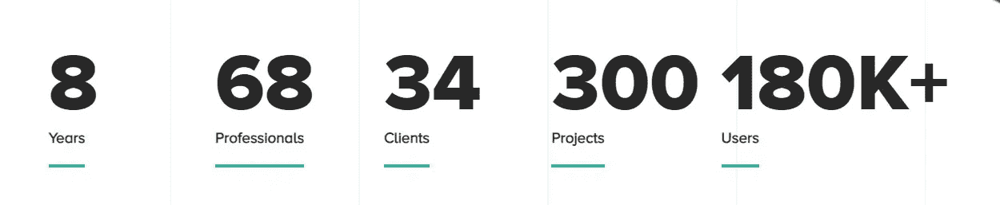

# Clutch 将 CodeRiders 评为亚美尼亚最好的定制软件开发公司之一

> 原文：<https://blog.devgenius.io/clutch-names-coderiders-as-one-of-the-best-custom-software-development-companies-in-armenia-ed49616d1e1b?source=collection_archive---------5----------------------->

CodeRiders 软件外包公司对交付高质量软件解决方案的奉献和热情再次在离合器 2021 年奖中占据一席之地。我们最近被他们的团队指定为亚美尼亚领先的[定制软件开发](https://www.coderiders.am/services/custom-software-development)公司之一，我们非常高兴与您分享这一消息。

这并不是第一次，一个卓越的和受人尊敬的数据驱动的商业购买决策指南，[离合器](https://clutch.co/)将 CodeRiders 列为最佳外包公司。

我们的业务发展主管 Anna Khachatrian 很荣幸获得该奖项，并分享了她的感谢信:

*“我们非常高兴成为 Clutch 在亚美尼亚的顶级公司之一。被像 Clutch 这样的著名目录所认可是我们的荣幸。作为一家在全球范围内外包 web 和移动开发服务的亚美尼亚软件开发公司，我们很自豪能够名列前茅，并积极为全球客户提供更复杂的解决方案和服务。”*

**code riders 的简短描述**

CodeRiders 是一家总部位于亚美尼亚的离岸软件开发公司。该公司最初成立于 2013 年，当时是一所软件开发学校。CodeRiders 软件开发学校在一年内培养了 800 多名校友，其中 15 人从 2014 年开始成为 CodeRiders 的现任软件工程师。

CodeRiders 的一些软件开发服务包括:

●网页开发和设计

●定制软件开发

●移动应用程序开发

●外包和信息技术咨询

该公司拥有为以下领域构建软件解决方案的经验:

●电子商务，

●客户支持(为 CRM 系统提供远程软件工程师)，

●电子学习/教育技术，

●医院和医疗保健/健康技术，

●媒体和娱乐，

●金融服务，

●物流，

●旅行和旅游，而不仅仅是。

该公司的使命很简单:*我们用最先进的技术和创新来构建简单强大的系统，以实现业务流程的自动化。*

我们的愿景目标明确: ***时间宝贵。自动化应该保存它*** *。*

我们的员工关系和我们的企业管理耐力定义了我们的座右铭:*我们渴望。我们一起实现！*

**谁是离合器**

离合器是一个备受尊敬的评级和评论平台，来自华盛顿 DC。在我们的个人资料上查看 CodeRiders [过去的项目和客户](https://clutch.co/profile/coderiders)！你可以看看我们从真实客户那里收到的最新反馈和评论等等。

Clutch 最初的目标是介绍最好的软件外包公司，并根据其诚实的评论和经验对每个离岸软件开发公司进行排名。

**数字码骑手**

**CodeRiders 的历史**

2013 年 CodeRiders 软件开发学校成立。我们迎来了 800 多名成为认证软件工程师的学生。

2014 年 CodeRiders 软件开发公司成立。

2014 年至 2015 年，由 CodeRiders 学生创建的团队在美国、加拿大、英国、澳大利亚、新西兰、欧洲等地从事 web 开发项目。

2016–2017-该团队致力于电子商务、大数据分析和商业智能项目。

2018—code riders 团队成功完成了一个大型项目，该项目后来聚集了 18 万多用户。

2019 年— CodeRiders 获得 EASA 颁发的[地区最佳软件开发合作伙伴](https://www.coderiders.am/blog/coderiders-is-awarded-as-best-software-development-partner-by-easa)奖

2020–2021—code riders 欢迎 6 名新员工加入我们的软件开发团队。

**如何从 CodeRiders 开始？**

**你问**

请联系我们了解您的项目需求和问题。为了加快流程，您可以与我们分享您的工作范围(SOW)文档。我们提供了一个指南，指导您完成编写简单有效的 SOW 文档的每一个步骤。最后，您还会发现一个插入了需求的真实样本。

 [## 如何撰写可靠的工作范围| code riders 白皮书

### 里面是什么？

www.coderiders.am](https://www.coderiders.am/white-papers/how-to-write-a-solid-scope-of-work) 

**我们继续**

我们的业务发展专家将在 1 个工作日内与您联系。我们深入研究您的需求，如果它们符合我们的软件开发服务和解决方案，我们就跳到第 3 步。

**我们开始实际的谈判过程**

我们讨论并阐明您的项目需求，概述项目路线图，并展示我们的软件解决方案。我们安排了一次与您的业务通话(或多次通话，如果需要的话),以讨论所有项目细节。欢迎您与我们的软件工程师和其他员工交流，了解他们的专业水平和沟通技巧。

点击下面的链接，继续阅读 CodeRiders 博客上的文章。

 [## 离合器承认最佳软件供应商中的 CodeRiders

### CodeRiders 软件外包公司对交付高质量软件解决方案的奉献精神和热情吸引了…

www.coderiders.am](https://www.coderiders.am/blog/clutch-names-coderiders-as-one-of-the-best-custom-software-development-companies-in-armenia) 

需要说话吗？请留下您的信息，我们将在 1 个工作日内回复您。

 [## 软件开发公司-联系我们| CodeRiders

### 让我们谈谈您在定制软件开发、网页开发和设计、软件外包方面的业务需求…

www.coderiders.am](https://www.coderiders.am/contact-us)