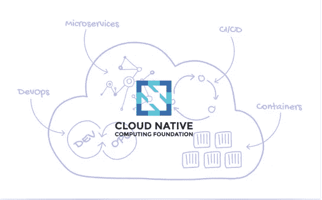
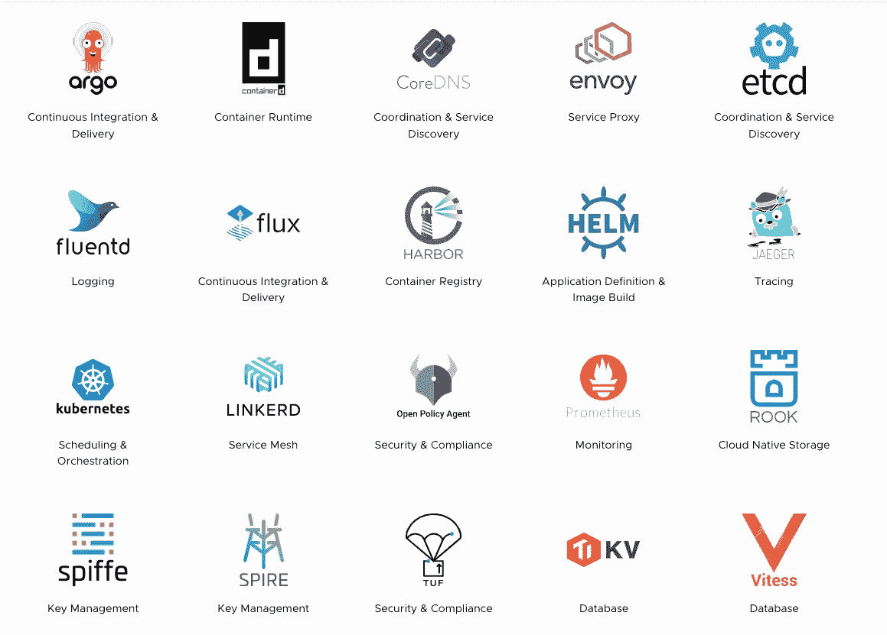
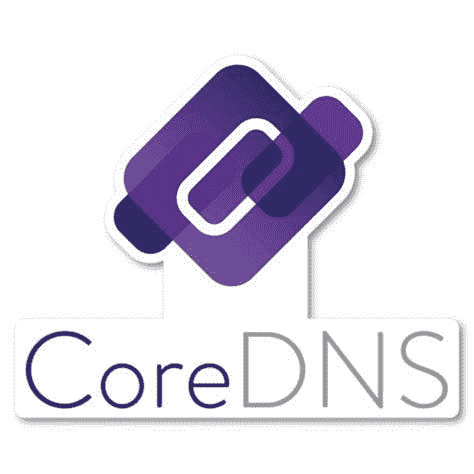
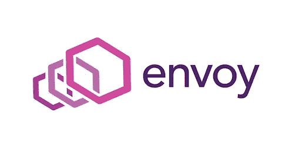
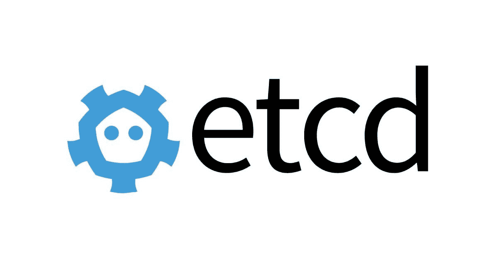
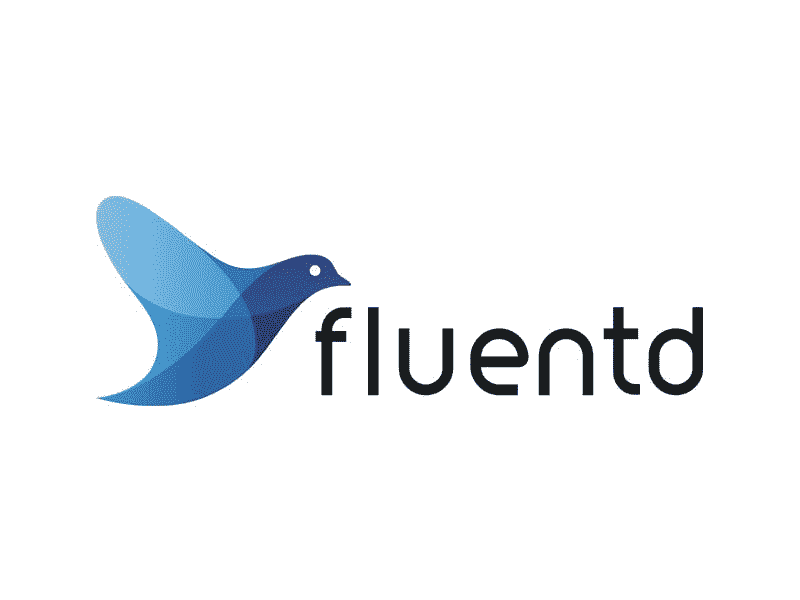
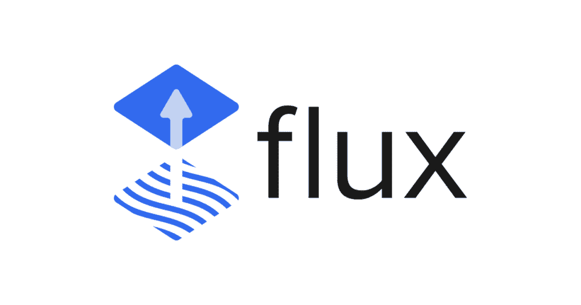
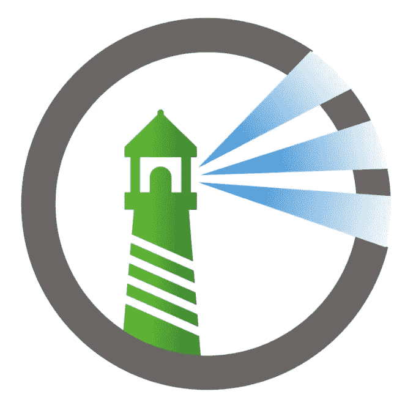
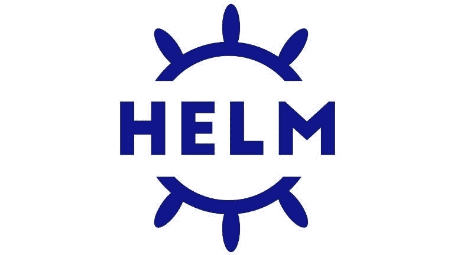
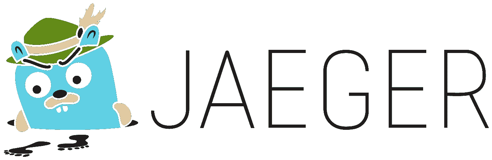

# CNCF 2022 毕业设计年终回顾，第一部分

> 原文：<https://blog.devgenius.io/cncf-2022-graduated-projects-year-end-review-part-one-95d27c77983c?source=collection_archive---------1----------------------->

## CNCF 2022 毕业项目更新

2022 年，云原生生态系统继续飙升。2022 年底，CNCF 是一个有远见的项目和人员的发电站，主办了 **157 个项目**，超过 **178，000 名贡献者**代表 **189 个国家。**

本文总结了 CNFS 在 2022 年主持的 **20 个毕业项目**(毕业项目被认为是稳定的，并在生产环境中成功使用)。你在 2022 年听过或用过多少？如果你大部分都没听过或者没用过，你大概是想在 2023 年迎头赶上，不落在云原生游戏后面吧！:)

让我们先来看看整个毕业项目的情况:

图片来自 [CNCF](https://www.cncf.io/)

# 1.南船星座

图片来自 [argoproj](https://argoproj.github.io/)

Argo([https://argoproj.github.io/](https://argoproj.github.io/))是 K8s-运行工作流、管理集群和正确执行 GitOps 的原生工具。Argo 于**2020 年**3 月 26 日被 CNCF 接受，并处于**毕业**项目成熟度级别。

Argo 有以下四种开源工具:

*   **Argo 工作流:**K8s-支持 DAG 和基于 step 的工作流的原生工作流引擎。
*   Argo CD: 声明式连续交付，用户界面满载。
*   **Argo 推出:**先进的 K8s 部署策略，如 Canary 和 Blue-Green 使之变得简单。
*   **Argo 事件:**Kubernetes 的基于事件的依赖性管理。

# 2.集装箱 d

图片来自 linux2aix.com

container d([https://containerd.io/](https://containerd.io/))是一个开放可靠的容器运行时。它于 2017 年 3 月 29 日被 CNCF 大学接受，处于毕业项目成熟度级别。

Containerd 是一个行业标准的容器运行时，强调简单性、健壮性和可移植性。

# 3.CoreDNS

图片来自 [store.cncf.io](https://store.cncf.io/collections/core-dns)

CoreDNS([https://CoreDNS . io)](https://coredns.io/)是一个链接插件的 DNS 服务器。于 2017 年 2 月 27 日**被 CNCF 验收，处于**毕业**项目成熟度级别。**

CoreDNS 是一个 DNS 服务器，用 Go 编写。由于其灵活性，它可以在多种环境中使用。CoreDNS 是在 Apache 许可证版本 2 下授权的，并且是完全开源的。

# 4.使者

图片来自[特使](https://www.envoyproxy.io/)

特使(【https://www.envoyproxy.io/】)是一款云原生的高性能边缘/中间/服务代理工具。特使于 2017 年 9 月 13 日**被 CNCF 接受**，并处于**毕业**项目成熟度级别。

Envoy 最初构建于 Lyft，是一款高性能 C++分布式代理，专为单一服务和应用而设计，也是一款通信总线和“通用数据平面”，专为大型微服务“服务网格”架构而设计。

# 5.Etcd

来自 [etcd](https://etcd.io/) 的图片

etcd([https://etcd.io/](https://etcd.io/))是一个分布式可靠的键值存储，用于存储分布式系统中最关键的数据。etcd 于**2018 年**12 月 11 日被 CNCF 接受，处于**毕业**项目成熟度级别。

etcd 是一个高度一致的分布式键值存储，它提供了一种可靠的方式来存储需要由分布式系统或机器集群访问的数据。它优雅地处理网络分区期间的领导者选举，并且可以容忍机器故障，甚至在领导者节点中。

# 6.流体 d

来自[流体的图片](https://www.fluentd.org/)

fluent d([https://www.fluentd.org/](https://www.fluentd.org/))是统一测井层(CNCF 项目)。于 2016 年**11 月 8 日**通过 CNCF 验收，处于**毕业**项目成熟度级别。

Fluentd 是一个用于统一日志记录的开源数据收集器，它允许您统一数据收集和消费，以便更好地使用和理解数据。

# 7.流量

来自[通量](https://fluxcd.io/)的图片

flux([https://fluxcd.io/](https://fluxcd.io/))是一个开放的、可扩展的 K8s 持续交付解决方案。它由 GitOps Toolkit 支持。Flux 于 2019 年 7 月 15 日**被 CNCF 接受，并处于**毕业**项目成熟度级别。**

Flux 是一种工具，用于保持 K8s 集群与配置源(如 Git 存储库和 OCI 工件)同步，并在有新代码要部署时自动更新配置。

# 8.海港

图片来自[港口](https://goharbor.io/)

harbor(【https://goharbor.io/】T2)是一个开源的可信云本地注册项目，用于存储、签名和扫描内容。Harbor 于 2018 年 7 月 31 日**通过 CNCF 验收，处于**毕业**项目成熟度级别。**

Harbor 可以安装在任何 Kubernetes 环境或支持 Docker 的系统上。它提供了合规性、性能和互操作性，以帮助您跨云原生计算平台(如 K8s 和 Docker)一致且安全地管理工件。

# 9.舵

图片来自[舵](https://helm.sh/)

赫尔姆([https://helm.sh/](https://helm.sh/))是 K8s 包经理。Helm 于**2018 年**6 月 1 日被 CNCF 接受，处于**毕业**项目成熟度级别。

Helm 是寻找、分享和使用 K8s 软件的最佳方式。Helm 将打包的应用程序部署到 K8s，并将它们组织成图表。这些图表将所有预配置的应用程序资源以及所有版本包含在一个易于管理的包中。

Helm 通过简单的 CLI 命令简化了 Kubernetes 上的安装、升级、获取依赖项和配置部署。

# 10.贼鸥

图片来自[耶格](https://www.jaegertracing.io/)

耶格([https://www.jaegertracing.io/](https://www.jaegertracing.io/))是一个分布式追踪平台。耶格于 2017 年 9 月 13 日被 CNCF 录取，并处于**毕业**项目成熟度级别。

Jaeger 是一个分布式追踪系统，由优步技术公司开源发布。它用于对基于微服务的分布式系统进行监控和故障排除，包括:

*   分布式上下文传播
*   分布式事务监控
*   根本原因分析
*   服务依赖分析
*   性能/延迟优化

# 参考

*   [https://www.cncf.io/reports/cncf-annual-report-2022/](https://www.cncf.io/reports/cncf-annual-report-2022/)