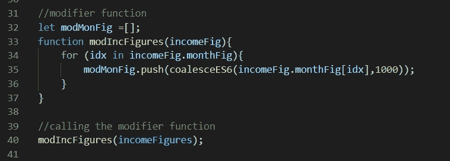
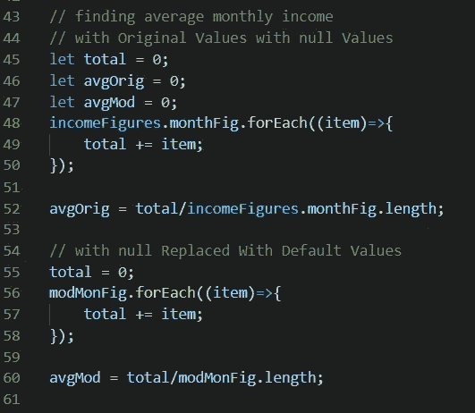

# 合并——如何在 JS 中找到函数中的第一个非空/非未定义参数

> 原文：<https://blog.devgenius.io/coalescing-how-to-find-the-first-non-null-non-undefined-argument-in-a-function-in-js-b9c71d171ec4?source=collection_archive---------7----------------------->

当我们想在一个函数调用中找到第一个非空/非未定义的参数时，有很多用例。

我们称这样的特性为合并(它的名字来源于 SQL 合并函数)。

稍后我们将看两个常见的用例。

首先，让我们实现合并功能的逻辑。

专家提示:结尾有美味的 ES11 鱼子酱，让我们在微风中相聚！请继续阅读！

1.  **PreES6 合并实现:**

这看起来像来自古代，但是让我们快速地看一下在过去的 6 天里我们是如何结合的。

PreES6 合并

这里的逻辑非常简单。

我们迭代*参数*对象，直到找到第一个非空值。

2. **ES6 合并:**

ES6 强大的函数式编程特性让我们在一行优雅的代码中实现了合并。像这样:

ES6 合并

我们来分解一下这里的逻辑:

1.  首先，我们用 REST 操作符收集所有参数
2.  然后我们用 *find* 函数遍历参数数组。
3.  对 *find* 的回调检查第一个非空且非未定义的值并返回它。

整洁！

但还有更多！

ES11 让我们只用一个*操作员*就能完成所有这些！

3. **ES11 零化合并算子:**

ES11(或 ECMA 脚本 2020)引入了零合并运算符。它的符号是**两个问号，’？?'**。

零合并运算符采用两个操作数，其行为如下:

1.  如果不是空值或未定义的值，则返回左侧操作数**。**
2.  如果左操作数为空或未定义，则返回**右操作数。**

ES11 零化合并运算符

瞧啊。JavaScript 越来越好了！

现在让我们看看我们之前承诺的两个联合用例。

1.  **使用我们的数据时填写空值/未定义值:**

当我们在应用程序中提取数据时，显示结果中会出现空值/未定义的值。

我们希望用一些其他值来替换它们，以使输出有意义。像这样:

数据中的空值显示在输出中

Coalesce 用有意义的文本替换了 null

以下是上述用例的代码:

产品对象

更改产品对象并将其嵌入到 HTML 中

下面是附带的 HTML 文件:

2.**用数值计算的默认值替换空值/未定义值:**

数字数据中的空值会导致错误的计算结果。

用一些缺省值替换它们会得到一个合理的输出。像这样:

空值会导致不合理的计算结果

以下是这个用例的代码:

原始数据有许多空值

修饰功能

寻找每月平均数字

用 HTML 更新 DOM

这就是美丽的凝聚功能！非常感谢您的阅读，我相信您会喜欢在您的代码中使用这个特性！