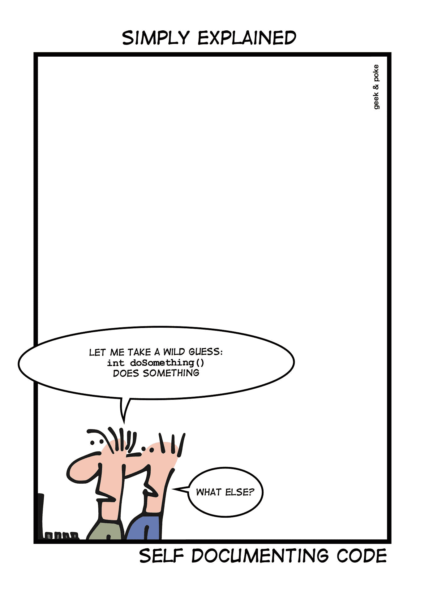

# 代码注释是你的代码自传

> 原文：<https://blog.devgenius.io/code-comments-are-your-code-autobiography-7202c45b5e37?source=collection_archive---------4----------------------->

尼克·莫里森在 [Unsplash](https://unsplash.com?utm_source=medium&utm_medium=referral) 上拍摄的照片

写你的代码是多余的；你只需要代码。我可以把我的时间投入到单元测试或开发其他功能上，以及其他关于为什么写代码注释是浪费时间的**借口**。这是开发人员的普遍看法。

好吧，你已经投入了所有的精力来培养你的代码的设计，你为什么要评论它，对不对？因此，代码文档要么不存在，要么毫无用处。

虽然在某些情况下，编写代码注释可能会适得其反。然而，如果做得好，我们是唯一能够从中受益最多的人。

## 将注释编码为契约

自我记录的代码并不存在。你可以写有意义的变量名、方法、类等等。但是尽管它很好，它也不能让你的代码自动描述它的意思。

是的，当然在实施过程中，当你把它变得完美时，你是在它的环境中，但是一个月后会发生什么呢？你会记得多少？你能相信未来的自己在接近它时会有同样的心态吗？

意识到你写这段代码时的想法会对你今后的工作有所帮助。正确的代码文档是与维护者签订合同，维护者可能就是你。

## 代码注释是干净代码的固有部分

在某些情况下，代码注释可以指出代码的味道。如果在编写方法的代码文档时，您发现自己在编写方法做这个做那个。您可能应该重构这个方法，因为它必须做一件事情，而且只能做一件事情。因此，将代码分成两个方法，并立即修改代码注释以适应变化。这样，你就坚持了一个清晰的代码概念。

此外，钻研代码以更好地理解方法的上下文是不必要的时间浪费，而您可以很容易地阅读方法头并快速回忆起方法的*什么(*明显)和*为什么*部分，并特别关注*它如何*做它为*编写的事情。*

以下面要点中的注释为例，它只是陈述了显而易见的内容，并说明了它的作用——基本上，它重复了属性的名称，这使它变得多余。而删除它将与一开始不写它具有相同的效果:

一个更好的注释会有更多的细节，说明代码不能告诉我们什么。嗯，你可以说——我为什么要写？该属性的名称和逻辑很简单；它只是返回*重量*。但是，嘿，在软件中没有什么是简单的。一个有用的注释可以节省我们的时间和认知努力，让我们更深入地了解方法上下文的代码，如下所示:

这种方法有一个不同的思维模式，你应该采用。每种方法都有一些东西要讲，至少有一个新的细节是代码没有陈述的，无论是副作用、限制还是任何其他异常。写下这些细节会让开发人员直面实现中隐藏的细节，有时会重构*“代码味道”*部分。因此，它不仅有助于未来的代码读者，也有助于作者更好地理解其实现并加以改进。

## "代码从不说谎，但注释有时会说谎."——[**罗恩·杰弗里斯**](https://www.azquotes.com/author/30249-Ron_Jeffries)

你听过那句话吗？事实上，当代码改变时，注释就会过时。事实上，他们这样做是因为他们没有被认为是代码本身的一部分，而他们应该这样做。代码注释与之相关联。开发人员也有责任更新它。在代码审查期间，应该检查一个事实。

由 [geekandpoke](http://geek-and-poke.com/geekandpoke/2013/2/14/self-documenting-code.html) 编写的自文档代码

最后一点，代码的范围与你是否应该给它加注释无关。我的意思是，私有访问修改的代码也应该被记录。否则，我们忽视了它的实际使用者，我们自己。

毫无疑问，对于一些开发人员来说，这需要时间、实践和习惯这种新的思维方式。但是，从长远来看，你会得到回报——在代码质量和更好地理解你的代码环境方面，最终，你的代码会讲述他的故事，它的自传。