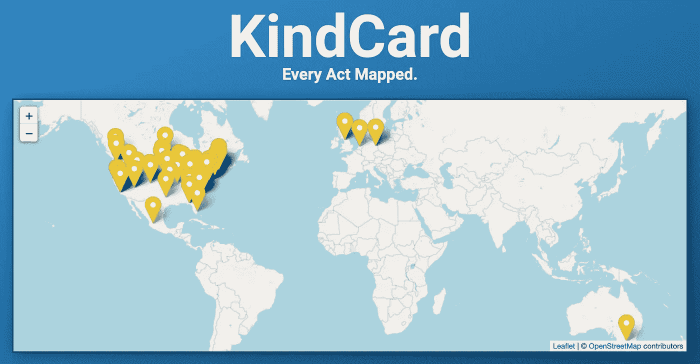
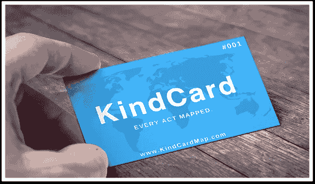
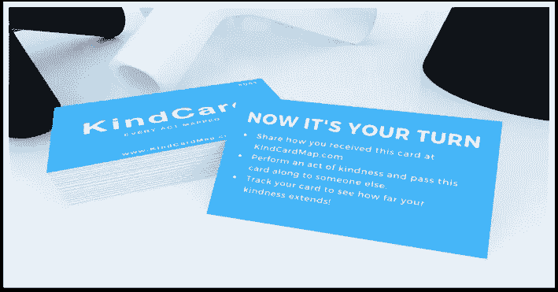
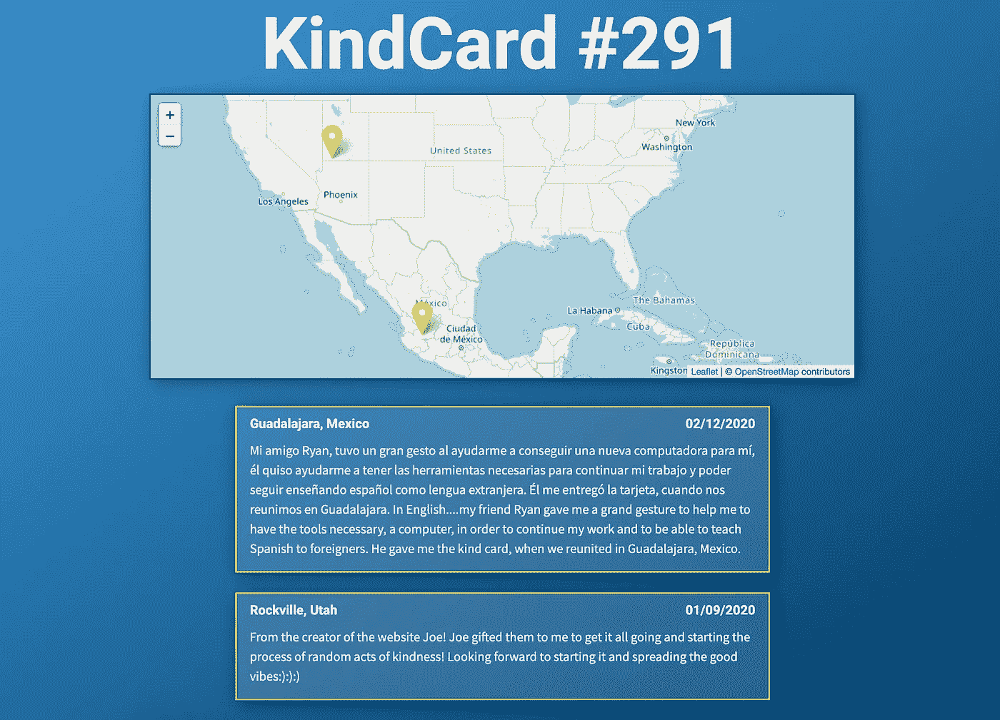
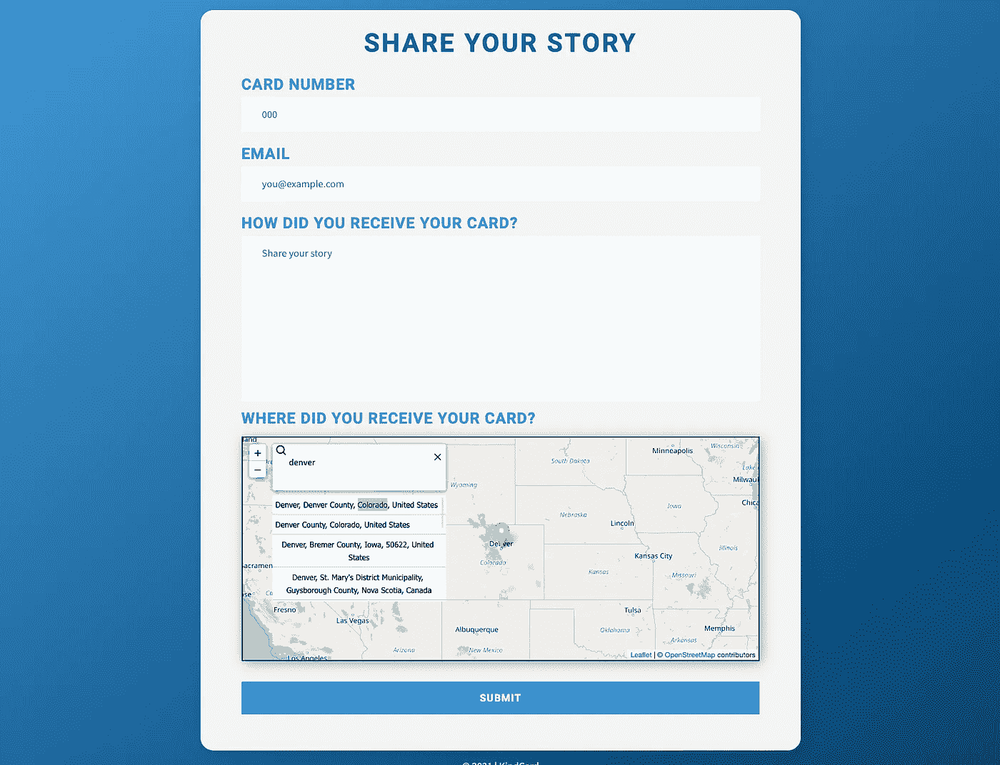
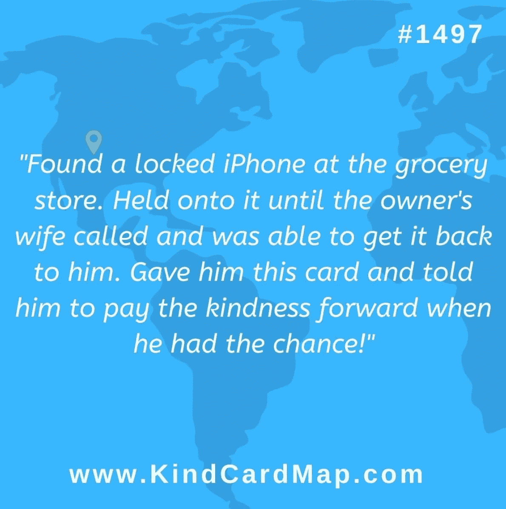

# 善良的代码:善良可以衡量吗？

> 原文：<https://blog.devgenius.io/code-for-good-can-kindness-be-measured-ae502d41ad08?source=collection_archive---------3----------------------->

所有 KindCard 提交的全球地图。

我一生都被陌生人迷住了。

无论是在旅行、搭便车、睡在陌生人家里的地板上时感受到他人的慷慨；或者只是坐在公园里，当人们走过时，看着他们，好奇他们的生活。

我特别喜欢为陌生人做好事的感觉。

我喜欢听关于其他人通过善举联系在一起的故事，我不断受到将人们聚集在一起的项目的启发，如纽约人、沙发冲浪或像艾伦·德杰尼勒斯这样的慈善名人。

我真的相信一个善举可以产生一种“涟漪效应”,促进更多的善举。

但是我一直在想……有没有可能量化这个抽象的概念？我们该如何回答这个问题——“一个善举能产生多大的影响？”

> "一次善举能产生多大的影响？"

所以…我创造了 KindCard。这个项目鼓励人们通过善意的行为联系起来，并亲眼看看一个善意的行为能走多远。

贺卡的正面。

到今天为止，至少有几百张这样的卡在七个不同的国家流通。

每张卡上都印有一个唯一的 ID，这样当有人通过一种善意的行为收到卡时，他们可以访问该网站，分享他们是如何以及在哪里收到卡的。

KindCard 背面的说明。

一种行为导致下一种行为，人们可以看到他们的卡所到之处。

一张地图展示了一张卡片的旅程。

每张 KindCard 都有一个页面，在那里你可以看到这张卡片走过的所有地方，以及人们在收到它时提交的故事。例如，上面的卡片开始于犹他州，然后一个月后在墨西哥被伪造。

一个交互式地图允许用户在提交一个新故事时精确定位他们收到 KindCard 的位置:

KindCard 提交表单。

由于 OpenStreetMap API，提交表单上的地图可以处理全球范围内的各种用户输入，包括特定的地址、邮政编码、城市，甚至是地标，如埃菲尔铁塔或大峡谷。

# **制作过程**

该网站的整个前端是用 React 构建的，它提供了与任何地图、标记或故事提交的快速交互。

在后端，该站点使用 Node.js with Express，Objection 作为 ORM，Bcrypt 用于验证用户。

创建登录功能是为了给经常使用的用户提供一个个性化的“我的地图”页面，向他们显示他们的 KindCards 到过的所有地方。

其他一些工具，如 MailChimp 和 MailGun，用于向网站用户发送确认和营销电子邮件，以及在新故事提交时提醒我。

主机由 DigitalOcean 提供。

# 成功

与我开始这个项目的原因一致，对我来说，KindCard 最大的成功是与人有关的。

每当我收到一个新的提交贺卡的故事，或者有人主动联系我，表示有兴趣接受几张贺卡进行赠送时，我都会想起善良的力量和重要性。

KindCard 故事提交。

通过社交媒体，特别是 [KindCard 的 Instagram 页面](https://www.instagram.com/kindcard_ig/)，我与许多激励我的人和项目建立了联系，并通过分享一些我最喜欢的 KindCard 故事，如上面的故事，传播了一些积极的信息。

虽然需要一个完整的项目来尝试和衡量在社交媒体上传播温暖人心的故事的影响，但我喜欢认为阅读积极向上的东西对*有一些*好处。

也许有几个人在听说 KindCard 后，决定为他们遇到的某个人做点好事。即使只有几个人是这样，这也是值得的。

# 挑战

在 KindCard 的早期，我对这个项目有很多长期的想法，比如分析这个国家(或世界)的哪些地方会更频繁地使用卡片，卡片从一个人传递到另一个人需要多长时间，在卡片消亡之前提交的平均链/长度是多少，等等。

我仍然认为衡量所有这些荣誉是一个很酷的想法，但是尽管为某人做些好事并给他们送张卡片并不是世界上最大的要求，但这似乎比我预期的要大得多。

超过 1500 张 KindCards 已经被印刷并分发出去，但是只有不到 200 张卡片在网站上为他们提交了故事。

在确实有故事提交的卡片中，只有少数被记录了 2-3 次以上。

我自己也不得不花费大量的时间和精力推销 KindCard，以便让任何人联系我并向我索要卡片。当我不在 Instagram 上发布这个项目时，整个轮子几乎停止转动。

# 那么下一步是什么？

我不太确定。

我的乐观(或许还有天真)加上我的耐心，让我很难让 KindCard 彻底消亡。

虽然在过去的几个月里，我没有花太多时间积极地发展这个项目，但似乎每次我考虑结束这个项目时，我心里都有一种想法在说，“但是如果……”

COVID 疫情粉碎了我将 KindCard 引入大型面对面活动的几个计划，总的来说，这不是敦促人们与陌生人更密切互动的最佳时机。

我觉得 KindCard 有很多机会尚未开发，但有时我怀疑自己是否是领导这个项目的最佳人选。

虽然我对 KindCard 的使命和目标深信不疑，但所有的社交推广活动都有一些部分让我觉得恶心。唉，也许这一切都是当今行善不可避免的罪恶。

如果你有兴趣了解更多关于 KindCard 的信息，或者想收到自己的卡片进行赠送，你可以关注 Instagram 上的项目[。](https://www.instagram.com/kindcard_ig/)

我很想听听你对这个项目的想法，并欢迎你对让更多人参与进来的任何建议或想法。

我仍然不确定“一个善举能产生多大的影响”,但是我希望通过更多的人我们能找到答案。