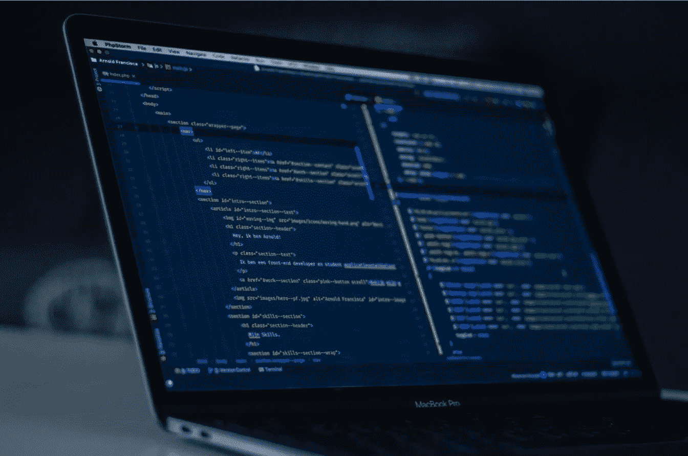
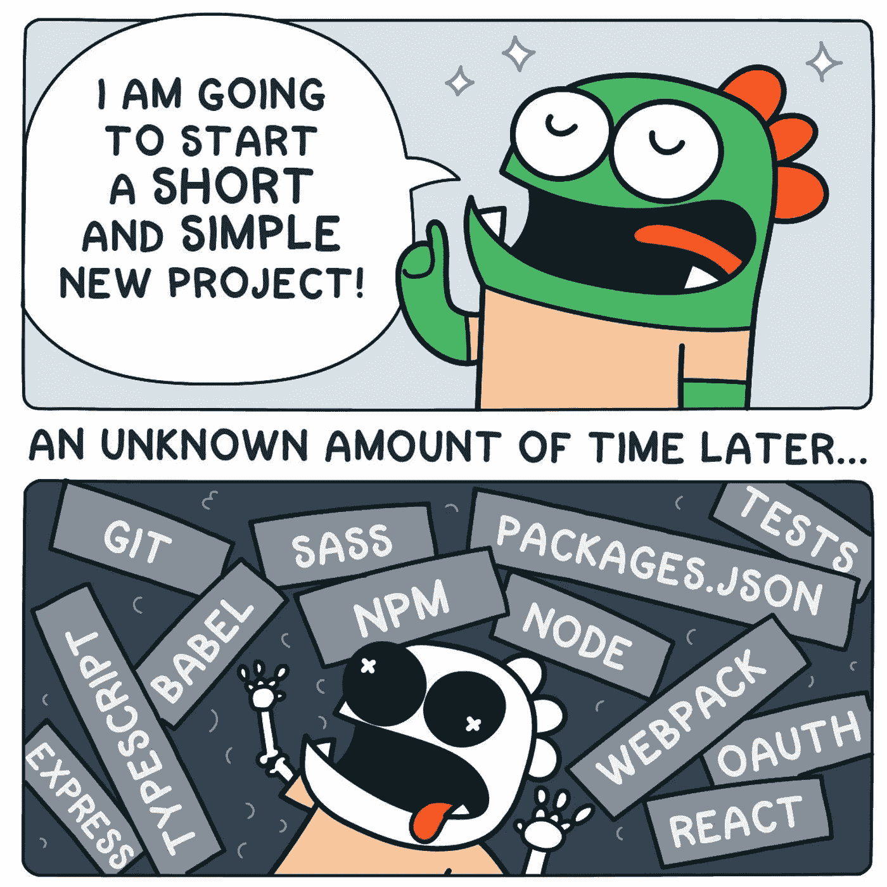
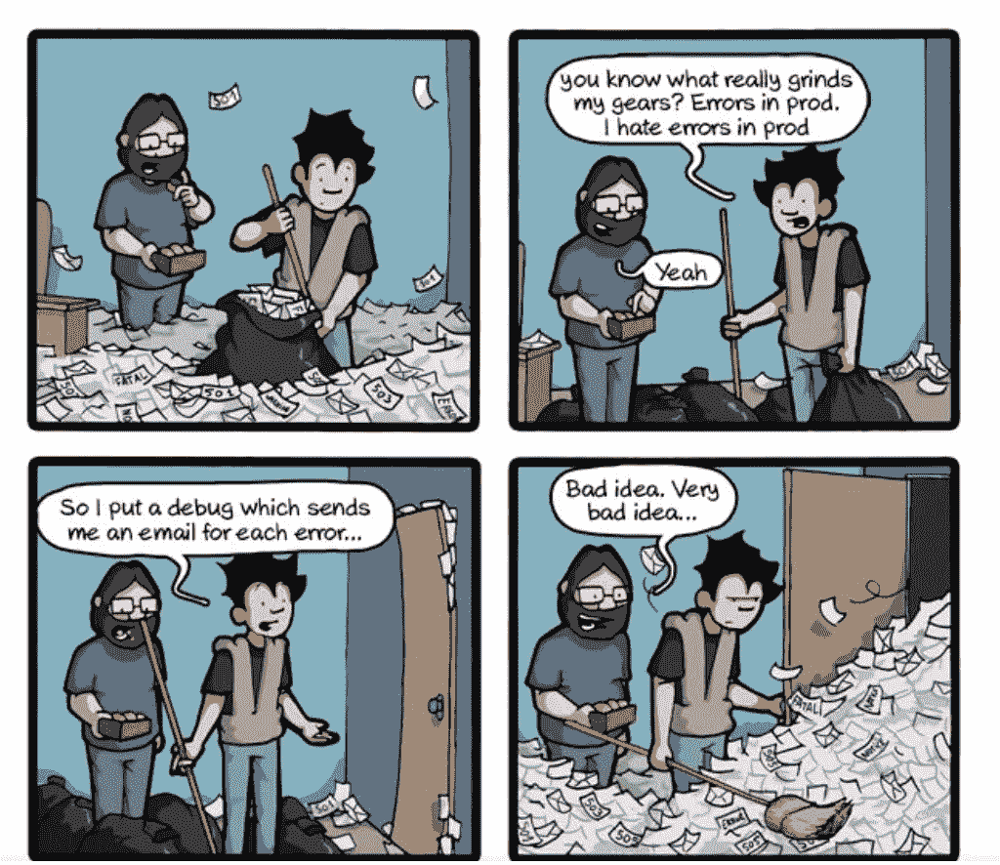

# 代码质量和代码评审(包括敏捷性)

> 原文：<https://blog.devgenius.io/code-quality-and-code-reviews-includes-agility-8b98b53c501f?source=collection_archive---------7----------------------->

软件开发是一个热门话题。然而，有许多大规模的产品，这些产品是无用的，无利可图的，缺乏远见，令人失望。软件工程师有能力改变现状，通过提高代码质量和定期进行代码评审来改变现状。

开发人员应该花更多的时间来编写可读的、可测试的、可维护的和简单的(微)代码。代码质量和编写代码的风格之间有着天壤之别。我想谈谈创建良好质量和美化大量代码块的一些技巧。不要忘记，它包括敏捷性！

# 编写可读、可测试、可维护且简单的(微)代码

*   **灵活性**:想得深一点，试着看到大局。不要浪费时间，给产品的功能带来真正的灵活性。
*   **可读**:使项目可读。例如，使用有意义的变量名，这样其他人可以容易地理解。每个变量名都应该按照一个通用的结构来命名。检查项目的一般基础设施，遵守一般规则。如果可能的话，在需要的时候创建/改变通用规则并在任何地方重构。应用有意义和强有力的策略为大型项目/产品创建适当的基础设施。
*   **干净的代码:**做一些关于架构设计的研究，学习如何编写干净的代码。考虑到您的业务需求和特点，决定什么是最好的。应用最佳实践。经过一点挑战后，如果您创建一个适当的架构设计并实现它，您将看到项目性能方面的改进。
*   **化繁为简(微功能)**:把大的特征剪开，变小，根据它们的属性和功能逐一识别。修复和/或重构它们。使它简单，这样可以很容易地发现和修复错误。每个功能应该只有一个特定的使命。以便将来您也可以灵活地更改功能。如果可能的话，使用 jira 将大函数拆分成小函数。你可以看到你的待办事项，这将更容易估计你将在每一个具体的子任务上花费的精力。
*   **根据小块功能区分**子任务和新需求的优先级。这里有一个循环，考虑一下灵活性，从第一步开始。如果可能的话，根据优先级排序你的子任务(在 jira 上)。

# 读写文档

*   如果你运行一个新项目，你应该从阅读和决定基础设施开始。和你的同事争论，同意你需要做的事情。当您准备好开始并设计好适当的基础设施时，创建一个关于项目基础设施的文档并对其进行更新。您可以重新绘制软件生命周期，但是不要忘记记录每一个强制性的变更。
*   如果你要处理大量的代码，那就让它变得简单。从调试代码开始。尝试理解它是如何工作的，并尝试编写关于当前基础架构的文档。与您的同事分享您的想法，并为基础架构找到合适的解决方案。
*   总的来说，感受敏捷的力量，并准备让它变得简单:当你准备好做出改变时，从重构开始。简单点，比如从类名、变量、函数开始。试着把大功能分成小功能，然后开始一个接一个的替换。这将帮助你把庞大的项目变得简单而强大。尝试实现最佳实践，不要分配超出其应该完成的功能或类。

*   发展你的调试技能，持续监控问题并尝试找到一致的解决方案。永远不要放弃，寻求帮助，试着理解别人的观点。调试时记笔记，以防迷失在大量代码中。写出案例并画出你陷入其中的情景。然后喝杯咖啡，读读你写的东西。这将有助于你清晰地找到问题或解决方案。(非常感谢[凯末尔·坎·凯纳克](https://medium.com/u/4bfefddbe096?source=post_page-----8b98b53c501f--------------------------------)支持我完成这个动作。)
*   问自己为什么，试着解释原因。通过提问和回答，您可以创建代码质量和强大的基础设施。当你编码的时候，继续搜索和学习。永远不要害怕说“我不知道”。你不需要知道所有的事情，但是你可以搜索和学习。你应该有上进心，永远不要觉得自己是个失败者。在这一过程的最后，你会找到作品并创造出你自己的诀窍。

# 代码审查

首先，不要害怕审查你代码的人。另外，不要害怕作为评审者的责任。在这两种情况下，你都可以发展你技能，拓展你的视野。

PS:我所说的所有步骤都是敏捷的一部分和要求。

*   **解释度量标准并检查规则:**如果你没有度量标准，问问你应该如何正确地做。此外，如果可能的话，您可以研究最佳实践，并与您的同事(包括团队领导)一起创建指标。写一份关于指标的文档。PR(拉式请求)应该包括什么，应该如何创建，在 PR 之前应该做什么。
*   **提问:**在这两种情况下，做评审或创造公关都会给你学习的秘密力量。如果你不确定，问一下为什么，问一下怎样做更好，试着和你的同事一起研究。你有机会做结对编程，扩展开发的视角(功能或解决问题都无所谓，对吧？).你也可以询问项目的基础设施和适当的公关方式。根据我的经验，我通过成对编程和通过提问进行代码评审学到了很多东西。这只是成为一个朋友，而不是一个自私的人，并在适当的时候提出合理的问题。你有机会学到更多，发展你的技能。
*   **文档**:当你解释度量标准和检查规则时，你应该写下来。您可以使用 Confluence 为文档创建页面。当您需要更改度量和/或规则时，您应该更新文档。此外，向团队成员解释项目结构也很容易。这将对所有人都有用:如果项目细节被记录，如果有问题或疑问，文档将引导人们找到答案:)
*   不要把反馈当成个人问题，尽量做到最好:)不要忘记享受乐趣和交朋友:)