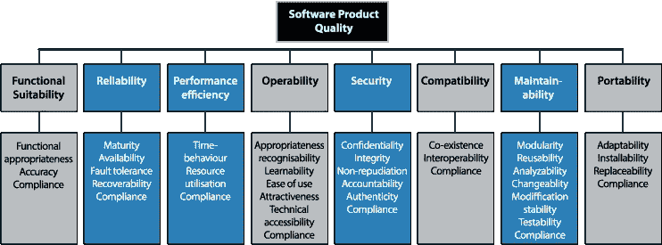
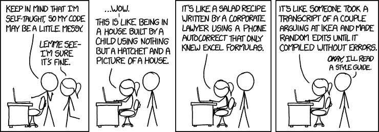
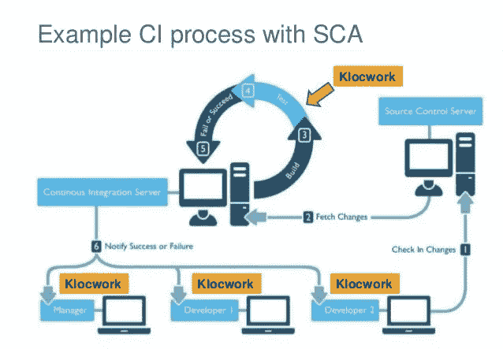
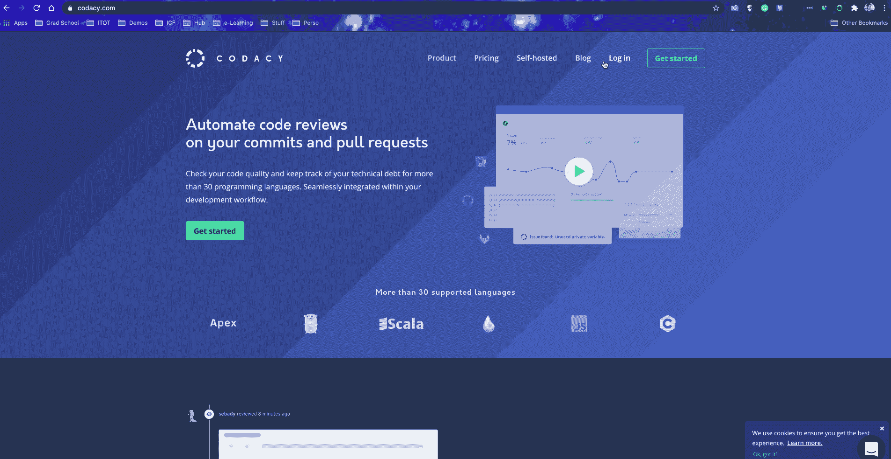

# 代码质量保证？“用简单的英语”

> 原文：<https://blog.devgenius.io/code-quality-assurance-in-simple-english-83209443099f?source=collection_archive---------7----------------------->

> **静态代码分析简介**

让我们先来看看当今一些令人惊叹和着迷的技术、应用、软件、平台和大公司。比如机器学习、物联网、Instagram、优步、网飞、谷歌搜索引擎、亚马逊、Telsa、Spotify、视频游戏等。

现在，想想是什么让他们如此神奇和迷人…🤔…可以肯定地说，他们所做的事情以及他们是如何做到的，才是令人惊叹的。也就是说，所有这些都是通过软件实现的。

图片来源:【twenty20.com —图片由 [@IrinaKashaeva](https://www.twenty20.com/IrinaKashaeva?t20p=photo.index) 拍摄

大约始于 1980 年**的数字革命，伴随着互联网以及随后的移动设备、社交网络、大数据和计算云，彻底改变了每个行业的工作实践；到了如今的地步“**每个公司都是软件公司”。今天，大多数成功的大公司都是软件公司。所有其他不开发软件的组织或公司都在使用它。他们的商业成功来自并很大程度上依赖于软件。****

很长一段时间以来，IT 基础设施的监控方面一直集中在 IT 运营方面，以确保应用程序的可用性和可靠性。同样重要的一点是应用程序代码监控。因此，我们不仅要监控我们如何向最终用户交付软件或应用程序，还要监控我们所发布产品的质量。

## 什么是软件质量？

软件开发或软件工程； ***软件质量*** 是指或可以基于以下概念进行评估:

*   ***功能需求质量***——简单来说，软件做了它应该做的事情，做得有多好或多有效率。
*   *非功能性需求质量——这些都是支持功能性需求交付的东西，比如可读性、运行时性、可维护性。等等。*

*有两个主要的类别，在这两个类别下我们可以接近软件质量概念；缺陷管理和质量属性。*

> ***缺陷管理***

*软件缺陷是指任何未能满足最终用户需求的情况。软件缺陷通常是由设计错误、编码错误(验证，尤其是逻辑错误)、误解的需求、数据关系、处理时间(完成一项操作需要太长时间)等因素造成的。*

> ***质量属性***

*软件质量属性是促进软件产品性能测量的特征。这些特性包括可用性、互操作性、正确性、可靠性、可学性、健壮性、可维护性、可读性、可扩展性、可测试性、效率和可移植性等属性。ISO/IEC 25010 于 2011 年推出，是用于企业软件开发的流行模型之一。*

**

*图片来源:[it-cisq.org](https://www.it-cisq.org/cisq-supplements-isoiec-25000-series-with-automated-quality-characteristic-measures/)*

*在**软件质量属性**中的高分使软件架构师能够保证软件应用程序将按照客户提供的规范运行。—来源:[*codoid.com*](https://codoid.com/software-testing/the-basics-of-software-quality-attributes/)*

## *代码分析*

> ****什么是代码？****
> 
> *简单来说，代码就是软件的定义。用更简单的英语；代码是指脚本、应用程序、程序或软件；就像水对于冰雕、雪人、湖泊、冰川等一样。你明白了！*

*假设您有一个开发团队，正在为 NodeJS API 后端应用程序编写代码。以上和后面只是检查应用程序"*是否工作*，执行代码分析包括检查如下内容:*

*   *应用程序代码是安全的和无错误的吗？*
*   *代码是否遵循正确的数据结构和[面向对象的编程概念](https://yannmjl.medium.com/object-oriented-programming-concepts-in-simple-english-3db22065d7d0)？*
*   *什么是代码[复杂度和效率](https://blog.bitsrc.io/algorithms-efficiency-big-o-in-simple-english-adbaedbcdfcf)？*
*   *如果应用程序代码的不同部分是由团队中的不同开发人员编写的，那么这些代码容易集成吗？*
*   *什么是代码测试覆盖率？*
*   *等等。*

*现在，传统团队可以通过使用 [***同行代码评审***](https://smartbear.com/learn/code-review/what-is-code-review/#:~:text=Code%20Review%2C%20also%20known%20as,like%20few%20other%20practices%20can.) 来执行代码分析，这是一项手工繁琐且容易出错的任务。*

**

*因此，为了能够做得更好，我们需要某种自动化系统或方法来执行这些审查。这就是 ***静态*** 和 ***动态*** 代码评审的用武之地。*

*   ***静态分析**是指在不运行代码的情况下对代码进行分析。这基本上只是 [***同行代码评审***](https://smartbear.com/learn/code-review/what-is-code-review/#:~:text=Code%20Review%2C%20also%20known%20as,like%20few%20other%20practices%20can.) ***以自动化的方式完成。****
*   ***动态分析**是指对代码执行过程中的行为进行分析。简而言之，当你的应用程序运行时，你的代码是如何表现的。这就是像 ***运行时*** 和 ***大 O*** 求值的地方。*

*静态代码评审不涉及动态分析— *静态代码评审期间不涉及任何代码执行*。这有助于在运行应用程序或程序之前，在开发的早期阶段检测和捕捉缺陷；有时甚至在编程期间，如果它已经被集成到本地开发环境中。*

*静态分析可以通过机器、系统或工具来检测不符合规则的情况。这些工具可称为 ***质量管理工具*** 。有多种静态代码分析工具，如 Codacy、Raxis、Veracode、Coverity、SonarQube、CodeScene 等。*

*这些自动化代码分析/质量工具帮助开发人员更快地交付更好的软件。而该工具提供诸如静态分析、圈复杂度、重复以及每个提交和拉请求中的代码单元测试覆盖变化的报告。*

**

*图片来源:[openpr.com](https://www.openpr.com/news/1595607/global-static-code-analysis-software-market-key-player-are-pycharm-resharper-coverity-resharper-c-sonarqube-micro.html)*

*静态代码分析工具可以在内部和云中与各种源代码管理平台集成，如 [GitHub](https://github.com/YannMjl) 、 [BitBucket](https://bitbucket.org/product) 和 [Gitlab](https://gitlab.com/yannmjl) ，并分析 30 多种不同的编程语言，包括 Python、Java、JS、Ruby、Go、SQL、C#等。*

*下面是一个使用[***Codacy***](https://www.codacy.com/)*的连续集成设置的示例，以执行我的代码质量标准，节省代码审查的时间，执行安全最佳实践，并更快地让开发人员参与进来:**

****

**总而言之，我们在这里讨论的所有事情的目的都可以归结为一点:**

> **能够了解您的代码质量**

**并根据以下因素做出明智的决策:**

*   **我的项目的代码质量状况如何？**
*   **我的项目有多少技术债务？**
*   **我的代码中最有问题的地方是什么？**

**了解您的应用程序、程序或软件代码的实际健康状况，同时跟踪其质量随时间的演变，可以节省项目时间，提高新功能上市的速度，并代理您的业务或公司。**

> **如果你喜欢这篇文章，你可能也会喜欢:[**算法的效率|大 O "In Simple English"**](https://medium.com/bitsrc/algorithms-efficiency-big-o-in-simple-english-adbaedbcdfcf)**