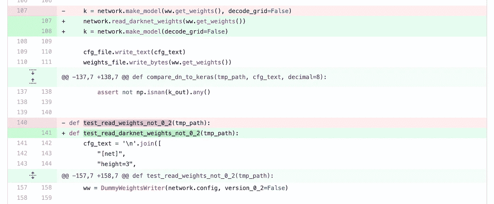

# 代码自我审查

> 原文：<https://blog.devgenius.io/code-self-reviews-b825a297d5b0?source=collection_archive---------25----------------------->

作者截图

我发现有一个简单的习惯可以非常有效地避免编码错误:在提交之前检查我的修改。一旦我做了修改，最后一次运行测试，一切似乎都准备好了，我就会做一个比较，深呼吸，以一种更具反思性的心态，审视我正在修改的东西。我喜欢我改变的东西吗？是不是少了什么？是否有一些不必要的或应该是不同变化的一部分？

我还会在休息一段时间后恢复工作时回顾我的改变。到目前为止我做了什么，我错过了什么…这一切还有意义吗？

一个可视化的工具，显示了什么改变了以及如何改变的，它指出了重新排序，而不是显示为删除和插入，等等。，可以使这项任务变得更加容易和有效，但实际上，经过一些练习，即使是纯文本 diffs 也能很好地工作。

这是一种代码审查，但它不同于其他人或结对编程的代码审查——事实上，我喜欢在结对编程时自我审查这样的变化。

他人的评审带来了更多的观点，并作为清晰性的试金石……自我评审不会让我这样做，但它有助于确保我对自己的改变有意识，并通过潜在提高我提交的质量来节省每个人的时间。

结对编程不断地从代码审查中获得好处，但是两个或更多的程序员仍然很可能遗漏一些东西。此外，编码人员更可能关注细节，而评审人员倾向于拓宽视野，看到更大的画面。

当然，我可以在提交后检查我的更改，但这增加了过程中的噪音…很少有什么比一系列的提交更能说明“过早提交”的了，这些提交修复了第一次提交中遗漏的内容。

对我来说，这实际上是对我对团队源代码所做的事情负责:)