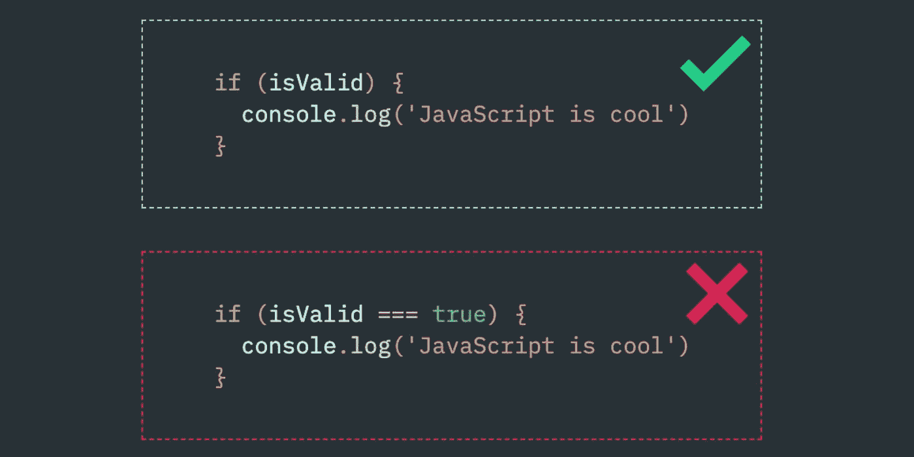

# 代码气味 07 —布尔变量

> 原文：<https://blog.devgenius.io/code-smell-07-boolean-variables-260bef4d1146?source=collection_archive---------1----------------------->

## 使用布尔变量作为标志，暴露了意外的实现，并用 Ifs 污染了代码。

照片由[菲尔在](https://unsplash.com/@philhearing?utm_source=unsplash&utm_medium=referral&utm_content=creditCopyText) [Unsplash](https://unsplash.com/s/photos/flag-finish?utm_source=unsplash&utm_medium=referral&utm_content=creditCopyText) 上听

# 问题

*   展开性
*   某些语言中的比较

# 解决方法

*   如果布尔映射到现实世界的实体是安全的。在其他情况下，建模为支持可扩展性状态。这也遵循[的开/关原则。](https://en.wikipedia.org/wiki/Open%E2%80%93closed_principle)

# 例子

*   旗帜

# 例外

*   真实世界的真/假规则

# 示例代码

## 错误的

## 对吧

# 侦查

自动检测可以警告布尔用法，但这可能会产生误报。

# 关系

一些语言有布尔比较器的问题。

在这些伴随着偶然复杂性的语言中，布尔是一个常见的错误来源。

# 也被称为

*   滥用旗帜者

# 标签

*   宣言的
*   原始的

# 结论

声明布尔值*时要格外小心。标志很难维护和扩展。了解有关该领域的更多信息。尝试迁移到[状态设计模式](https://en.wikipedia.org/wiki/State_pattern)。使用多态而不是 ifs/switch/cases。*

# 更多信息

 [## 方法上的布尔标志是一种代码气味吗？

### 出版日期:2020 年 4 月 15 日最近，我的一个时事通讯订阅者问我一个问题，关于它是否是一个…

ardalis.com](https://ardalis.com/are-boolean-flags-on-methods-a-code-smell/) 

# 信用

这些推文激发了代码的味道:

本文是 CodeSmell 系列的一部分。

 [## 如何找到你的代码中有问题的部分

### 代码很难闻。让我们看看如何改变香味。

mcsee.medium.com](https://mcsee.medium.com/how-to-find-the-stinky-parts-of-your-code-fa8df47fc39c)