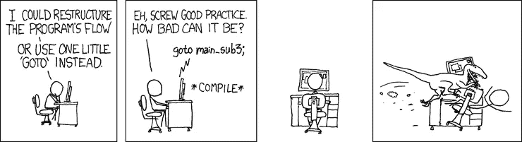

# 代码气味 100 —转到

> 原文：<https://blog.devgenius.io/code-smell-100-goto-f89a31f5c902?source=collection_archive---------7----------------------->

## 50 年前，后藤被认为是有害的

由[延斯·约翰森](https://unsplash.com/@jens_johnsson)在 [Unsplash](https://unsplash.com/s/photos/sign) 上拍摄的照片

> TL；博士:永远不要使用 GoTo。

# 问题

*   可读性
*   很难理解代码

# 解决方法

1.  用结构化代码替换[转到](https://en.wikipedia.org/wiki/Goto)
2.  使用例外

# 语境

我开始用 Basic 编程。

后藤在那里受到了严重的虐待。

我不得不在康复模式中从头开始学习结构化编程。

# 示例代码

## 错误的

## 对吧

# 侦查

[X]自动

在支持 **GOTO** 的语言中，我们的 linters 可以警告我们不要使用它。

# 标签

*   可读性

# 结论

几十年前我们就承认了 GOTO 问题。

这个问题仍然存在于 GoLang、PHP、Perl 等现代语言中。

大多数程序员幸运地避免了 GOTO 语句。下一个目标是考虑有害的空用法。

 [## Null:十亿美元的错误

### 他不是我们的朋友。它不会简化生活，也不会让我们更有效率。只是更懒。是时候停止了…

codeburst.io](https://codeburst.io/null-the-billion-dollar-mistake-c2918c92f7e0) 

礼遇 [XKCD](https://xkcd.com/292/)

# 关系

 [## 代码气味 12 —空

### 程序员使用 Null 作为不同的标志。它可以提示缺席、未定义的值、错误等。

blog.devgenius.io](/code-smell-12-null-64fbd7792a7c) 

# 更多信息

 [## 转到维基百科

### GoTo ( goto，，GoTo 或其他大小写组合，取决于编程语言)是一个在许多…

en.wikipedia.org](https://en.wikipedia.org/wiki/Goto) 

> 实际上，要向之前接触过 BASIC 的学生教授好的编程是不可能的:作为潜在的程序员，他们在精神上已经残缺不全，没有再生的希望。

*埃德格·迪杰斯特拉*

 [## 软件工程名言

### 有时一个简短的想法可以带来惊人的想法。

blog.devgenius.io](/software-engineering-great-quotes-3af63cea6782) 

本文是 CodeSmell 系列的一部分。

 [## 如何找到你的代码中有问题的部分

### 代码很难闻。让我们看看如何改变香味。

blog.devgenius.io](/how-to-find-the-stinky-parts-of-your-code-fa8df47fc39c)