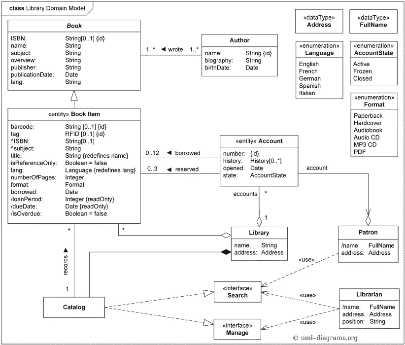

# 代码气味 47 —图表

> 原文：<https://blog.devgenius.io/code-smell-47-diagrams-b8bc7702a085?source=collection_archive---------9----------------------->

## *图不是代码。它们不可能是代码气味。它们只是图表气味。*

由[尼克·西格雷夫](https://unsplash.com/@seagrave)在 [Unsplash](https://unsplash.com/s/photos/map) 上拍摄的照片

# 问题

*   可维护性
*   垃圾代码
*   代码复制
*   图表只关注结构(偶然的)而不是行为(本质的)。

# 解决方法

1.  仅在与他人交流思想时使用图表。
2.  在您最喜欢的 IDE 上编程。
3.  研究所有图表。即使是从源代码中生成的。
4.  相信你的测试。它们还活着，保养得很好。
5.  使用[领域驱动设计](https://en.wikipedia.org/wiki/Domain-driven_design)技术。

# 示例代码

## 错误的

## 对吧

# 侦查

我们可以删除所有代码注释，并通过策略禁止它们。

# 例子

*   [自动代码生成器](https://codeburst.io/lazyness-ii-code-wizards-18cc5672b642)

# 结论

设计是一项接触运动。我们需要原型并从我们的运行模型中学习。

报纸和 jpg 不跑。他们生活在乌托邦式的世界里，一切都很顺利。

在 90 年代，这是一个非常热门的潮流。用这些工具没有开发出好的系统。

# 关系

 [## 代码气味 25 —模式滥用者

### 图案很赞。权力越大，责任越大

medium.com](https://medium.com/dev-genius/code-smell-25-pattern-abusers-bc0204b277b7)  [## 代码气味 01——贫血模型

### 你的对象是一堆没有行为的公共属性。

medium.com](https://medium.com/dev-genius/code-smell-01-anemic-models-f9fb5a1323b3) 

# 更多信息

 [## 懒惰 II:代码向导

### 代码生成器完成了我们的艰苦工作。但是我们不再需要它们了。

codeburst.io](https://codeburst.io/lazyness-ii-code-wizards-18cc5672b642)  [## 计算机辅助软件工程

### 计算机辅助软件工程(CASE)是用于设计和实现应用程序的软件工具的领域

en.wikipedia.org](https://en.wikipedia.org/wiki/Computer-aided_software_engineering)  [## 领域驱动设计

### 领域驱动设计(DDD)的概念是软件代码的结构和语言(类名，类…

en.wikipedia.org](https://en.wikipedia.org/wiki/Domain-driven_design) 

> 图表不是模型。模型不是图表。它是一种抽象，是一组概念和它们之间的关系。

埃里克·埃文斯

 [## 软件工程名言

### 有时一个简短的想法可以带来惊人的想法。

medium.com](https://medium.com/dev-genius/software-engineering-great-quotes-3af63cea6782) 

本文是 CodeSmell 系列的一部分。

 [## 如何找到你的代码中有问题的部分

### 代码很难闻。让我们看看如何改变香味。

medium.com](https://medium.com/dev-genius/how-to-find-the-stinky-parts-of-your-code-fa8df47fc39c)