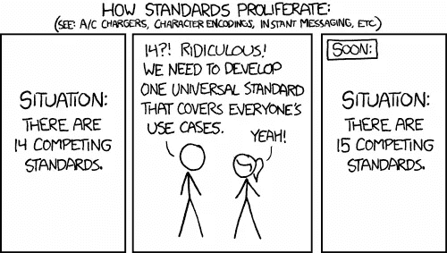

# 代码气味 48 —没有标准的代码

> 原文：<https://blog.devgenius.io/code-smell-48-code-without-standards-60c9e0905627?source=collection_archive---------4----------------------->

## 独自完成一个项目很容易。除非你几个月后再去找它。与许多其他开发人员合作需要一些协议。

# 问题

*   可维护性
*   可读性

# 解决方法

1.  自动化你的样式和缩进。
2.  实施商定的政策。

# 示例代码

## 错误的

*正确的样本取自桑德罗*[曼库索的银行形](https://github.com/sandromancuso/Bank-kata/blob/master/src/main/java/org/craftedsw/domain/Account.java)

## 对吧

*正确的例子有其他几种味道，但是我们让它忠于它的 GIT 版本，以便只显示代码标准化问题。*

# 侦查

在合并请求被批准之前，Linters 和 ide 应该测试编码标准。

我们可以添加自己的与对象、类、接口、模块等相关的[命名约定](https://medium.com/dev-genius/what-exactly-is-a-name-part-i-the-quest-b812a4b1e0bf)。

# 例子

*   [PSR2](https://www.php-fig.org/psr/psr-2/)

# 标签

*   标准化

# 结论

在项目中使用编码标准。

一个写得好的干净的代码总是遵循关于命名约定、格式和代码风格的标准。

这样的标准是有帮助的，因为它们让阅读你的代码的人，包括你自己，事情变得清晰和确定。

代码样式应该是自动的，并且在大型组织中是强制性的，以加强集体所有权。

# 关系

 [## 代码气味 06——太聪明的程序员

### 难以阅读的代码。没有语义的名字很棘手。有时使用语言的意外复杂性。

medium.com](https://medium.com/dev-genius/code-smell-06-too-clever-programmer-bffec35daf0b) 

# 更多信息

 [## 名字到底是什么？—第一部分:探索

### 我们都同意:好名声永远是最重要的。让我们找到他们。

medium.com](https://medium.com/dev-genius/what-exactly-is-a-name-part-i-the-quest-b812a4b1e0bf) 

> 标准的好处在于有太多的标准可供选择。

安德鲁·斯坦南鲍姆

 [## 软件工程名言

### 有时一个简短的想法可以带来惊人的想法。

medium.com](https://medium.com/dev-genius/software-engineering-great-quotes-3af63cea6782) 

本文是 CodeSmell 系列的一部分。

 [## 如何找到你的代码中有问题的部分

### 代码很难闻。让我们看看如何改变香味。

medium.com](https://medium.com/dev-genius/how-to-find-the-stinky-parts-of-your-code-fa8df47fc39c)