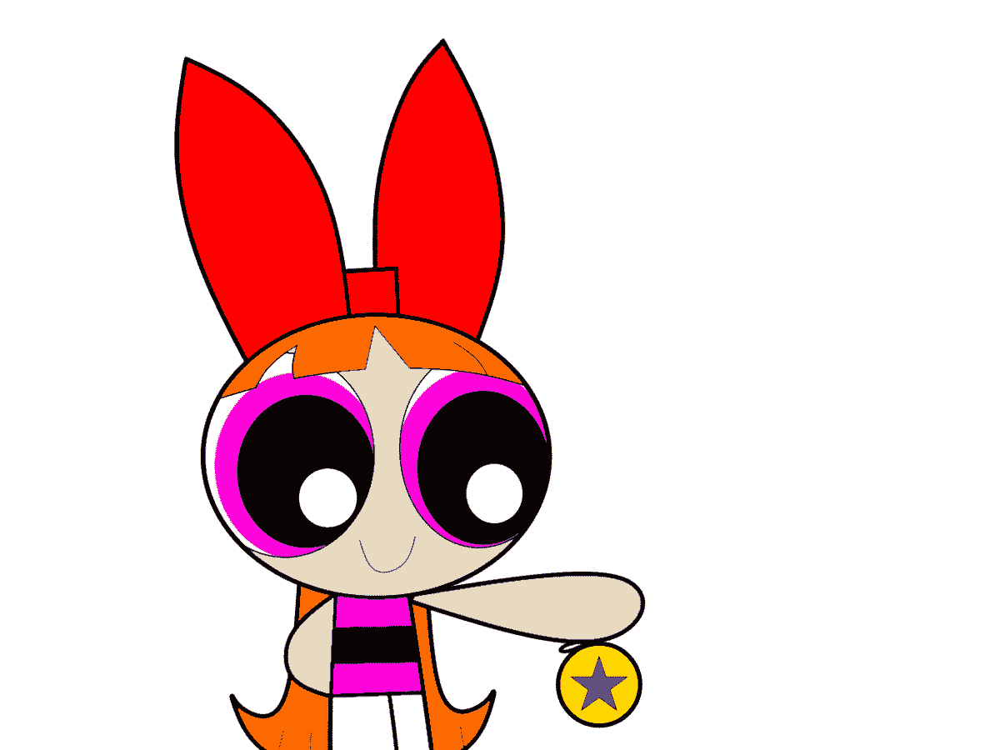

# 代码气味 58 —溜溜球问题

> 原文：<https://blog.devgenius.io/code-smell-58-yo-yo-problem-1e092d3c69ff?source=collection_archive---------0----------------------->

*寻找具体的方法实现？来来回回，上上下下。*

# 问题

*   深层等级制度
*   代码重用的子类化
*   可读性
*   低内聚力
*   高耦合

# 解决方法

1.  重构图轻继承。
2.  重构深层层次结构。

# 示例代码

## 错误的

## 对吧

# 侦查

任何棉绒都可以根据最大深度阈值检查可疑物。

# 标签

*   等级制度

# 结论

许多程序员新手通过层次结构重用代码。这带来了高耦合和低内聚的层次结构。

[Johnson 和 Foote](http://www.laputan.org/drc.html) 在他们的论文中证实，这实际上是 1988 年的一个好的设计方案。我们从那里学到了很多。

我们必须重构和扁平化这些类。

# 关系

 [## 代码味道 11 —代码重用的子类化

### 代码重用是好的。但是子类化会产生静态耦合。

medium.com](https://medium.com/dev-genius/code-smell-11-subclassification-for-code-reuse-2e2f5b564204) 

# 更多信息

 [## 耦合:唯一的软件设计问题

### 对我们软件的所有故障进行根本原因分析，会发现一个有多种伪装的单一罪魁祸首。

codeburst.io](https://codeburst.io/coupling-the-one-and-only-software-design-problem-869e293a9f04)  [## 溜溜球问题

### 在软件开发中，溜溜球问题是一种反模式，当程序员必须阅读和理解…

en.wikipedia.org](https://en.wikipedia.org/wiki/Yo-yo_problem) 

【https://wiki.c2.com/?DeepClassHierarchies 

约翰逊和富特认为等级应该更深

> 将对象变量(实例变量)视为数据属性，然后基于共享属性创建层次结构，会产生错误。始终基于共享行为创建层次结构，side。

*大卫·韦斯特*

 [## 软件工程名言

### 有时一个简短的想法可以带来惊人的想法。

medium.com](https://medium.com/dev-genius/software-engineering-great-quotes-3af63cea6782) 

本文是 CodeSmell 系列的一部分。

 [## 如何找到你的代码中有问题的部分

### 代码很难闻。让我们看看如何改变香味。

medium.com](https://medium.com/dev-genius/how-to-find-the-stinky-parts-of-your-code-fa8df47fc39c)