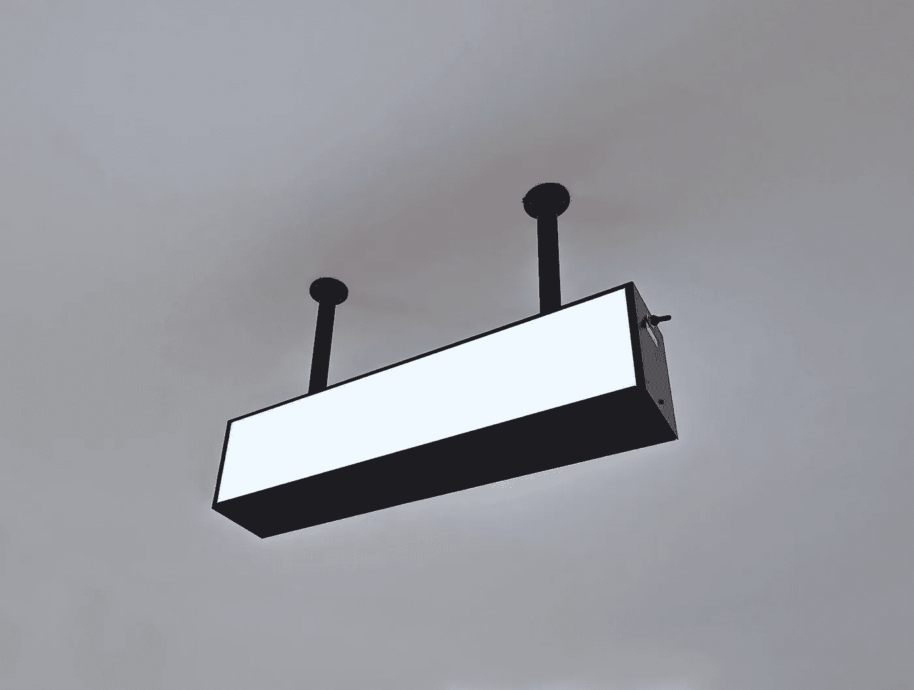

# 代码气味 74 —空行

> 原文：<https://blog.devgenius.io/code-smell-74-empty-lines-66d8d41d83e4?source=collection_archive---------2----------------------->

## 为了可读性而破坏代码需要重构。

照片由[西格蒙德](https://unsplash.com/@sigmund)在 [Unsplash](https://unsplash.com/s/photos/empty) 拍摄

> TL；不要在你的方法中加入空行。提取他们！

# 问题

*   可读性
*   吻
*   低重用

# 解决方法

1.提取方法

2.重构

3.删除不需要的行。

# 示例代码

## 错误的

## 对吧

# 侦查

这是一种政策味道。每个棉绒都能检测到空行并警告我们。

# 标签

*   可读性
*   长方法

# 结论

空行是无害的，但是向我们展示了一个将代码分解成小步骤的机会。

如果你用注释破坏了你的代码，这也是一种要求重构的代码味道。

# 关系

 [## 代码气味 03 —函数太长

### 人类过了 10 线就烦了。

blog.devgenius.io](/code-smell-03-functions-are-too-long-accea7eb4ae9) 

> 破解谋杀之谜是可以的，但你不应该需要破解密码。你应该能看懂。

*史蒂夫·麦康奈尔*

 [## 软件工程名言

### 有时一个简短的想法可以带来惊人的想法。

blog.devgenius.io](/software-engineering-great-quotes-3af63cea6782) 

本文是 CodeSmell 系列的一部分。

 [## 如何找到你的代码中有问题的部分

### 代码很难闻。让我们看看如何改变香味。

blog.devgenius.io](/how-to-find-the-stinky-parts-of-your-code-fa8df47fc39c)