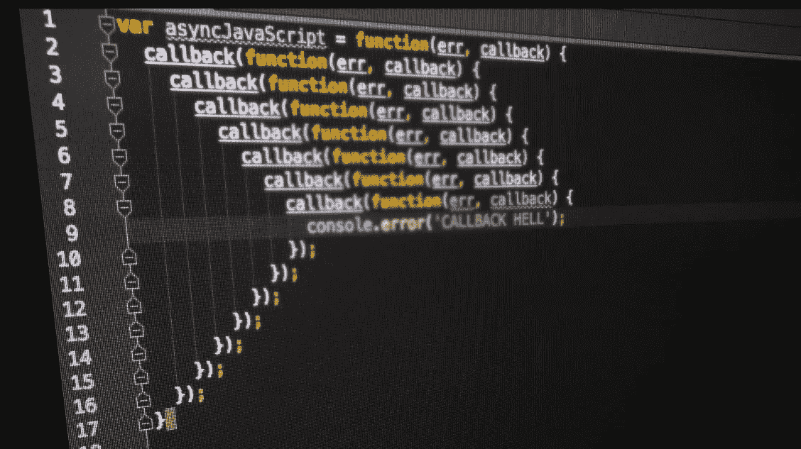

# 代码气味 78 —回调地狱

> 原文：<https://blog.devgenius.io/code-smell-78-callback-hell-aeb4a3010270?source=collection_archive---------6----------------------->

## 将算法作为一系列嵌套回调来处理并不明智。

> TL；DR:不要用回拨的方式处理电话。写一个序列。

# 问题

*   可读性
*   很难调试。
*   复杂性

# 解决方法

1.将回调改为顺序调用。

2.提取重复代码

3.重构。

# 示例代码

## 错误的

## 对吧

# 侦查

这个问题肉眼可见。许多棉绒可以检测到这种复杂性，并警告我们。

# 标签

*   可读性
*   复杂性

# 结论

回调地狱是有前途或承诺的编程语言中很常见的问题。

回调是以递增的方式添加的。刚开始没什么乱七八糟的。

没有重构的复杂性使得它们难以阅读和调试。

# 关系

 [## 代码气味 06——太聪明的程序员

### 难以阅读的代码。没有语义的名字很棘手。有时使用语言的意外复杂性。

blog.devgenius.io](/code-smell-06-too-clever-programmer-bffec35daf0b) 

> 写代码有两种方法:写得非常简单，没有明显的错误；或者写得非常复杂，没有明显的错误。

*东尼·霍尔*

 [## 软件工程名言

### 有时一个简短的想法可以带来惊人的想法。

blog.devgenius.io](/software-engineering-great-quotes-3af63cea6782) 

本文是 CodeSmell 系列的一部分。

 [## 如何找到你的代码中有问题的部分

### 代码很难闻。让我们看看如何改变香味。

blog.devgenius.io](/how-to-find-the-stinky-parts-of-your-code-fa8df47fc39c)