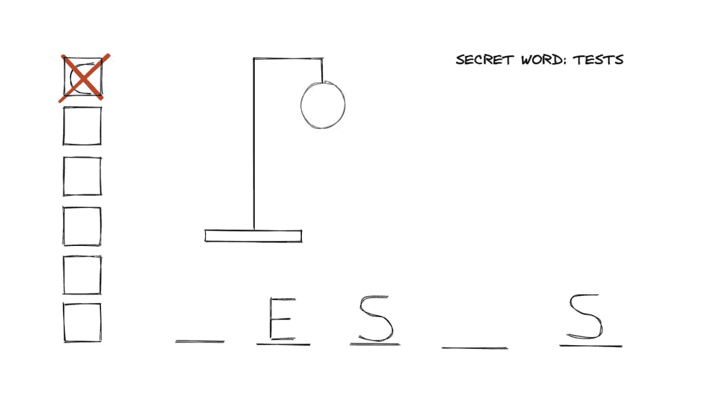

# 代码气味 82 —违反封装的测试

> 原文：<https://blog.devgenius.io/code-smell-82-tests-violating-encapsulation-aa10f5e02445?source=collection_archive---------6----------------------->

## 对象工作良好，并实现业务目标。但是我们需要测试它们。让我们打破他们。

> TL；DR:不要仅仅为了在你的测试中使用而编写方法。

# 问题

*   封装冲突。
*   不良接口
*   连接

# 解决方法

1.不要破坏封装。

2.测试必须完全受控。

3.如果你不能控制你的对象，你是耦合的。解耦！

# 示例代码

## 错误的

## 对吧

# 侦查

这是一种设计气味。

我们可以发现我们需要一个方法来测试。

# 标签

*   信息隐蔽

# 结论

白盒测试是脆弱的。他们测试实现而不是行为。

# 关系

 [## 代码气味 52 —易碎测试

### 测试是我们的安全网。如果我们不信任他们的正直，我们将处于极大的危险之中。

blog.devgenius.io](/code-smell-52-fragile-tests-b917de33fd53)  [## 气味代码 28 —设定器

### 初级程序员做的第一个练习。ide、教程和高级开发人员不断教他们这种反模式。

blog.devgenius.io](/code-smell-28-setters-5b0e764049aa) 

# 更多信息

*   我应该测试私有方法吗

# 信用

这种气味的灵感来自[罗德里哥姆](https://medium.com/u/ea9fb9a703df?source=post_page-----aa10f5e02445--------------------------------)

> 没有什么比一套测试更能让系统变得灵活。

*罗伯特·马丁*

 [## 软件工程名言

### 有时一个简短的想法可以带来惊人的想法。

blog.devgenius.io](/software-engineering-great-quotes-3af63cea6782) 

本文是 CodeSmell 系列的一部分。

 [## 如何找到你的代码中有问题的部分

### 代码很难闻。让我们看看如何改变香味。

blog.devgenius.io](/how-to-find-the-stinky-parts-of-your-code-fa8df47fc39c)