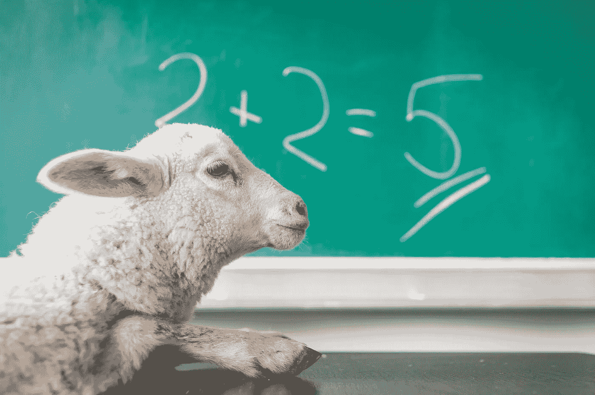

# 代码气味 89 —数学特征羡慕

> 原文：<https://blog.devgenius.io/code-smell-89-math-feature-envy-2c7e3c61f7d1?source=collection_archive---------0----------------------->

## 一个类为另一个类计算公式。

米歇尔·玛特隆在 [Unsplash](https://unsplash.com/s/photos/math) 上的照片

*TL；DR:把公式留给收集信息的对象。*

# 问题

*   公开地
*   低重用
*   缺少真实世界的概念
*   包装

# 解决方法

1.将数学公式移到课堂上

2.搜索[现实世界的抽象概念](https://medium.com/@mcsee/the-one-and-only-software-design-principle-5328420712af)

# 示例代码

## 错误的

## 对吧

# 侦查

由于许多级联消息发送到同一个对象，我们可以检测到一种模式。

# 标签

*   包装
*   连接

# 结论

这是一种非常基本的气味。如果我们在操纵另一个物体的特征，我们应该让它替我们计算。

# 关系

 [## 代码气味 63 —特征羡慕

### 如果你的方法是嫉妒和不信任授权，你应该开始这样做。

blog.devgenius.io](/code-smell-63-feature-envy-ac1f93cf8dce) 

# 更多信息

 [## 唯一的软件设计原则

### 如果我们在一个单一的规则上建立我们的整个范式，我们可以保持它的简单并做出优秀的模型。

codeburst.io](https://codeburst.io/the-one-and-only-software-design-principle-5328420712af) 

> 计算机科学与机器无关，就像天文学与望远镜无关一样。数学和计算机科学在本质上是统一的。

迈克尔·r·费罗斯

 [## 软件工程名言

### 有时一个简短的想法可以带来惊人的想法。

blog.devgenius.io](/software-engineering-great-quotes-3af63cea6782) 

本文是 CodeSmell 系列的一部分。

 [## 如何找到你的代码中有问题的部分

### 代码很难闻。让我们看看如何改变香味。

blog.devgenius.io](/how-to-find-the-stinky-parts-of-your-code-fa8df47fc39c)