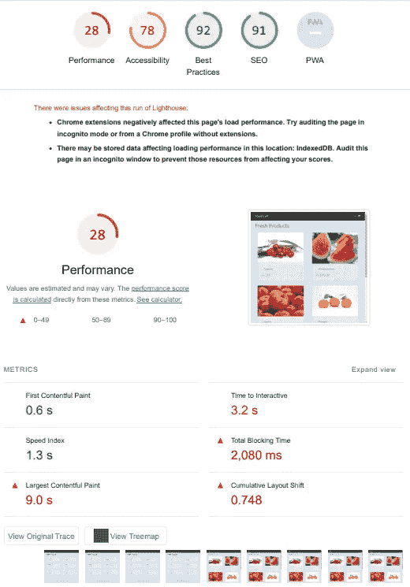

# 使用代码分割提高 React 应用程序的性能

> 原文：<https://blog.devgenius.io/code-splitting-in-react-js-c68dcb4e153b?source=collection_archive---------10----------------------->


大量 React JS 应用程序由许多组件、方法和库构建而成。尽管它们非常有用，但最终会使您的应用程序变得非常庞大。如果你不优化代码或者选择只显示需要的代码，将会严重影响应用程序的性能。

***注:*** *本文需要 React 和 components 的先验知识。*

我们该怎么做才能避免这种情况？答案是**代码拆分**。它的原始文档是[这里是](https://reactjs.org/docs/code-splitting.html#code-splitting)。它的简单解释是，它可以帮助你“延迟加载”用户当前需要的东西，这可以大大提高你的应用程序的性能。

# 首先，什么是捆绑销售？

> 这是导入文件并将其捆绑到单个文件中的过程，捆绑 Webpack、Rollup 和 merging，使用这些是为了将我们的代码捆绑成缩小的格式，但这并不保证这一点。

那么我们如何保证？

我们使用的概念叫做**延迟加载。**

> 我们只是拆分代码，这样我们就可以知道在什么时候加载哪个特定的组件，从而优化我们的网站性能。

# 延迟加载组件

为了理解延迟加载，我制作了一个简单的应用程序，我们将使用它来检查代码分割应用程序之前和之后的结果。

我们将使用一个**食品车**应用程序来跟踪这个主题，并给出一个例子。

# 示例:添加到购物车应用程序

它的后端是用 node.js 做的，把数据给我们的前端。我们的前端由 React.js 组成，分为屏幕和组件。这个例子上传在 [GitHub](https://github.com/ahmadrazach/Javascript-Challanges/tree/main/food-cart) 上。我们的应用程序结构如下:


食品车应用结构

通过进入文件夹并在终端上运行命令来运行它:

```
npm run dev
```

您将看到下面的应用程序。


从主页中选择一个产品，并将其添加到购物车中。转到购物车页面查看所有选中的产品，并查看它们的总价。

# 应用程序性能

现在让我们来看看下载我们的应用程序 Lighthouse 信息的应用程序的性能。我们将比较对应用程序应用代码分割前后的性能。



*Homescreen.js*

# React.lazy()

因此，我们想添加一些东西，当我们的应用程序从 API 加载产品数据时，我们可以显示这些东西。我们将在产品组件上使用 *React.lazy()* 并像这样导入它:

```
//in HomeScreen.js
import React from 'react';const Product=React.lazy(()=>import ('../components/Product'))
```

# 悬疑成分

很简单！我们必须将惰性组件包装在悬念组件中，以便在惰性组件准备工作时显示一些后备组件。

懒惰组件应该在 [**悬念**](https://reactjs.org/docs/code-splitting.html) **组件**中呈现，以提供一个**回退**。在回退中，我们将告诉应用程序在惰性组件准备时应该做什么。现在我需要给一些东西，这样它可以在我准备好的时候被加载！

在我们的例子中，我们提供了**加载器组件**和一个 h3 标题“获取产品…”。

*Homescreen.js*

```
<Suspense fallback=(<><Loader/><h3> Fetching Products ...</h3></>}><Row>{products.map((product,key)=>(<Col sm={12} md={6} lg={4} xl={3} key={key}><Product product={product}/></Col>))}</Row></Suspense>
```

添加代码拆分后，我们的 *Homescreen.js* 文件如下:

现在，它将在主屏幕前端给出以下结果


现在，当我们的应用程序加载产品时，我们看到了一个加载器和获取产品的标题。因此，这里的悬念是说，当你[产品组件]正在加载懒惰，我得到了你，并定义一些显示，当你准备好了。

耶！所以我们得到了一切！对吗？实际上不是，这是个圈套！

因此，我们显示一段时间的回退，并等待加载[Products Component]惰性组件。如果过一会儿出现错误，无法加载，该怎么办？当然，我们不希望用户等待一段时间后看到一个危险的错误页面，对吗？


这里有一个叫做误差边界的概念。

# 误差边界

去错误边界[文档](https://reactjs.org/docs/error-boundaries.html)看更多，但是很简单:

> **如果模块加载失败，将触发错误。错误边界让我们可以像专家一样处理错误，并展示良好的用户体验。**

**它们捕捉子组件树中任何地方的 JavaScript 错误，记录这些错误并显示一个后备 UI**

好吧，那太好了。怎么做？

您必须使用 ErrorBoundary 组件，并将其包装在包装 lazy 组件的悬念组件上。耶！

我们使用一个 [npm 包](https://www.npmjs.com/package/react-error-boundary?activeTab=dependencies)作为错误边界，用它包装我们的暂记组件，并给出我们的后备组件。

现在，当我们的产品组件出现内部错误时，它将触发**回退组件**或**错误边界**，在我们的情况下，这是 h3 标题，显示**“加载错误，请刷新”。这只是一个展示其工作原理的例子。**

因此，我们刚刚讨论了组件的代码分割，以提高性能和视觉效果。干得好！

让我们来看看基于路由的代码分割技术。

# 基于路由的代码拆分

我们不希望我们的应用程序在开始时加载所有的路线页面。它只加载我们在页面上使用的数据块！就这么简单！

按照我们的例子，我们可以看到我们的应用程序在开始时加载了所有的屏幕(在我们的例子中是 2 个)。


没有路由分割

为了添加路线分割，我们将只使用暂记组件包装我们的路线组件，给出一个回退值，在我们的例子中是文本“正在加载…”！


当我们在 HomeScree.js 上时进行路线分割

让我们看看应用程序的性能提高了多少。我们再次下载我们的灯塔报告。


**这一次，我们的性能提高了 35 %,这非常好，因为我们仅通过添加代码分割就将性能提高了 7%。**

# 结论:

代码分割是优化应用程序性能的一个很好的方法，可以减少与应用程序交互所需的数据，并增强用户体验。应用程序不同部分的物理分离，并能够决定浏览器何时加载它们。

*这只是我发表的第一篇文章，所以请给出你最好的建议。我肯定会喜欢的。谢谢你陪我走了这么远！*