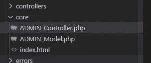
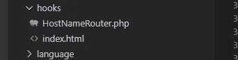
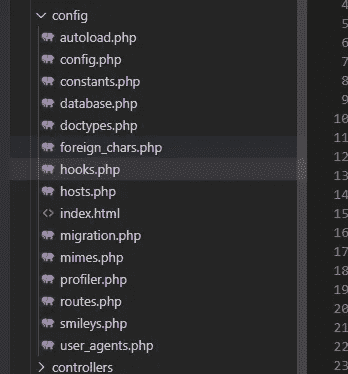
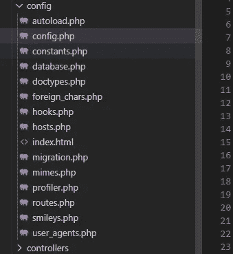
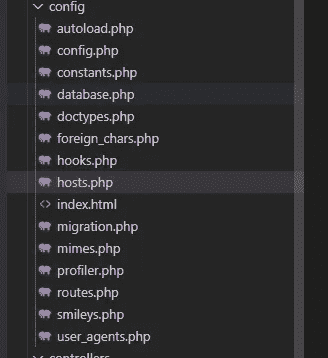
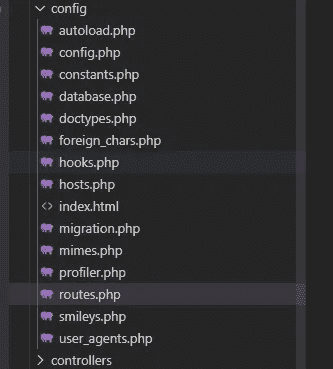
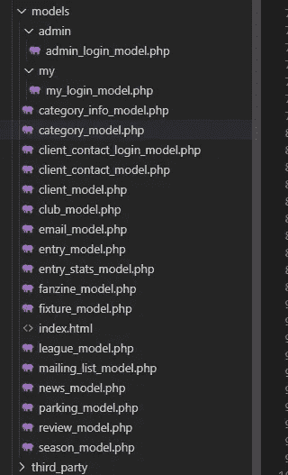
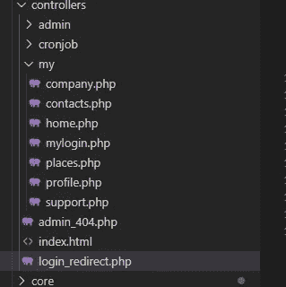
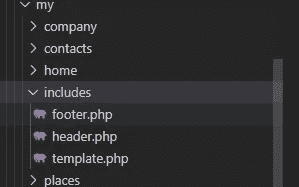

# codeigniter——扩展一个安装以处理多个站点

> 原文：<https://blog.devgenius.io/codeigniter-extending-one-install-to-handle-multiple-sites-f0383ae34aae?source=collection_archive---------7----------------------->


在之前的一篇博客文章中，我谈到了构建一个定制的 CMS，它允许我们管理显示在移动应用程序中的数据。

我设法让 CMS 的一个基本版本启动并运行。我们已经用了整整 12 个月来管理数据，没有出现太多问题或错误。

我们的移动应用程序想要达到什么目的。基本想法是让人们在英国的某些地区找到酒馆、酒吧、咖啡馆、外卖、酒店和交通信息。

在这款应用发布 18 个月后。我们联系了一个人，他在英国经营着很多酒吧。

我们提出的一个想法是创建一个“客户门户”，这样他们就可以登录并管理他们所拥有的酒吧的数据。允许他们在我们的应用程序中显示报价和其他变化的信息。

这让我们受益匪浅，因为我们可以开始从这个应用程序中赚点钱。该公司从中受益，因为到该地区旅游的人会将他们的酒吧视为推荐去的地方。以及用相关的优惠来吸引人们。

对我来说，最大的挑战是建立并运行这个客户门户。

专业编程和软件开发的一个原则是不要在你写的代码方面重复你自己。因为我已经做了登录机制的繁重工作，并且能够编辑条目和更新信息。我不想让两个代码库做同样的事情。

## 不要重复你自己

我已经写了一些代码和功能，允许你在我们现有的 CMS 中添加、编辑和删除应用程序中的条目。

所以我希望能够在新的客户门户中重用这些代码文件。然而，登录屏幕、仪表板和编辑屏幕的设计必须不同。

我希望我们的 CMS 和客户门户在不同的域上运行，但仍然可以访问许多相同的代码。

这是一个挑战。

两个不同的前端，使用相同的后端代码更新一个数据库。

我想使用相同代码的原因是，如果我必须改变我们保存条目的方式。我只需要在一个地方改变它，然后更新会过滤到两个网站。

如果我有两个代码库，我肯定会忘记修改其中的一个。给我们或我们的客户带来问题。

## 当两个人合二为一

我已经把我的帽子挂在了 [Codeigniter](https://codeigniter.com) 框架上。不用自己编写大量代码，就能快速启动并运行某些东西，这很棒。

是的，我找不到任何显而易见的方法来实现我想要的。我开始在很多开发者论坛上挖掘，比如 [stackoverflow](https://stackoverflow.com) 。希望能找到解决办法。

幸运的是，我设法找到了一些有用的东西。我现在找不到其中的联系，不管是谁想出来的，都想要一枚奖章。

它节省了我很多时间和精力。

那么，我是如何在我们的站点中实现它的呢？

我需要做的第一件事是创建一个基本控制器和基本模型类，以便能够将用户路由到正确的网站。

在核心文件夹中，我创建了两个名为 ADMIN_Controller.php 和 ADMIN_Model.php 的新文件



ADMIN_Controller.php 看起来像这样

```
<?php if ( ! defined('BASEPATH')) exit('No direct script access allowed');

class ADMIN_Controller extends CI_Controller {

    function __construct()
    {
        parent::__construct();

        $logged_in_value = 'logged_in';
        $redirect_url = 'admin/login';

        if (SITE == 'my')
        {
            $logged_in_value = 'my_logged_in';
            $redirect_url = 'my/mylogin';
        }

        if($this->session->userdata($logged_in_value) !== TRUE)
        {
            $this->session->set_userdata('redirect_url', current_url());
            redirect($redirect_url);
        }
    }
}
```

这个控制器将默认为管理员，主 CMS，除非该网站是我的。子域，那么它会假设你想登录到我们的客户门户网站。

这个控制器的主要目的是确定您是否登录，如果没有登录，重定向 url 应该是什么。

ADMIN_Model.php 看起来像这样

```
<?php

class ADMIN_Model extends CI_Model
{
    function __construct()
    {
        parent::__construct();

        //If the site is for my.xxx load new db config
        $site = SITE; 
    }
}
```

到目前为止相当直接？

接下来要做的是创建一个名为 HostNameRouter.php 的钩子。



该文件将根据您访问的子域，将您重定向到主管理 CMS 或客户端门户。

```
<?php if (!defined('BASEPATH')) exit('No direct script access allowed');
/*
	Manage multiple hostnames (domains, sub-domains) within a single instance of CodeIgniter.
	Example:
		If you had the following domain/sub-domain style for your site:
		your-domain.com
		api.your-domain.com
		shop.your-domain.com
		Create the following sub-directories (+ files) in your application/controllers directory:
		application/controllers/home.php
		application/controllers/api/product.php
		application/controllers/api/products.php
		application/controllers/shop/catalog.php
		And, in your application/config/hosts.php file:
		$config['home'] = 'your-domain.com';
		$config['api'] = 'api.your-domain.com';
		$config['shop'] = 'shop.your-domain.com';

		Now if you navigate to your site in a browser, here's what you should get:
		your-domain.com -> Your site's home page
		api.your-domain.com/product -> The product end-point of your API
		api.your-domain.com/products -> The products end-point of your API
		shop.your-domain.com/catalog -> The catalog page of your shop
*/

class HostNameRouter
{
	protected $hosts;
	/*
		Run as a pre-system hook.
	*/
	public function pre_system()
	{
		$this->prepare_hosts();
		$this->prevent_direct_controller_group_access();
		$this->route_host_to_controller_group();
	}
	/*
		Run as a pre-controller hook.
	*/
	public function pre_controller()
	{
		$this->prepare_hosts();
		$this->restore_uri();
	}
	/*
		Routes a host name to a specific controller group.
	*/
	protected function route_host_to_controller_group()
	{
		/*
			Have to use a super global here, because CI's Hooks class re-instantiates
			this class for every call to it from the config/hooks.php file.
		*/
		$_SERVER['ORIGINAL_REQUEST_URI'] = $_SERVER['REQUEST_URI'];
		/*
			Only route the request if there is a host name route
			for the current host.
		*/
		if ($this->has_controller_group($_SERVER['HTTP_HOST']))
		{
			$group = $this->get_controller_group($_SERVER['HTTP_HOST']);
			$_SERVER['REQUEST_URI'] = '/' . $group . $_SERVER['REQUEST_URI'];
		}
	}
	/*
		Restores the URI-related variables to their originals.
	*/
	protected function restore_uri()
	{
		/*
			Have to do it this way because the $CI object is not available yet.
		*/
		$this->uri =& load_class('URI', 'core');
		$_SERVER['REQUEST_URI'] = $_SERVER['ORIGINAL_REQUEST_URI'];
		$this->uri->uri_string = ltrim($_SERVER['REQUEST_URI'], '/');
		// Remove the query string, if there is one.
		if (strpos($this->uri->uri_string, '?') !== false)
			list ($this->uri->uri_string, ) = explode('?', $this->uri->uri_string);
		$this->uri->segments = array();
		if ($this->uri->uri_string !== '')
			foreach (explode('/', $this->uri->uri_string) as $i => $segment)
				$this->uri->segments[$i + 1] = $segment;
	}
	/*
		Returns TRUE/FALSE depending upon if the given host has a controller group.
	*/
	protected function has_controller_group($host)
	{
		$group = $this->get_controller_group($host);

		$controller_subdir = APPPATH . 'controllers/' . $group;
		return 	$group !== null &&
				file_exists($controller_subdir) &&
				is_dir($controller_subdir);
	}
	/*
		Returns the host's controller group.
	*/
	protected function get_controller_group($host)
	{
		$host_to_group = array_flip($this->hosts);
		return isset($host_to_group[$host]) ? $host_to_group[$host] : null;
	}
	/*
		Prevents direct URI access of controller groups.
	*/
	protected function prevent_direct_controller_group_access()
	{
		if (!($group = $this->uri_segment(1)))
			return;
		if ($this->group_has_host($group))
		{
			$protocol = $this->request_protocol();
			$host = $this->get_host_by_group($group);
			$uri = substr($_SERVER['REQUEST_URI'], strlen('/' . $group));
			header('Location: ' . $protocol . '://' . $host . $uri, true, 301);
			exit;
		}
	}
	/*
		Returns TRUE/FALSE depending upon if the given group has a host.
	*/
	protected function group_has_host($group)
	{
		return $this->get_host_by_group($group) !== null;
	}
	/*
		Returns group's host.
	*/
	protected function get_host_by_group($group)
	{
		return isset($this->hosts[$group]) ? $this->hosts[$group] : null;
	}
	/*
		Returns the URI segment specified by $n
	*/
	protected function uri_segment($n)
	{
		$uri = ltrim($_SERVER['REQUEST_URI'], '/');
		$segments = explode('/', $uri);
		return isset($segments[$n - 1]) ? $segments[$n - 1] : null;
	}
	/*
		Returns 'https' if that was the protocol used by the current request.
		Returns 'http' otherwise.
	*/
	protected function request_protocol()
	{
		return isset($_SERVER['HTTPS']) && strtolower($_SERVER['HTTPS']) === 'on' ? 'https' : 'http';
	}
	/*
		Prepares the hosts array.
	*/
	protected function prepare_hosts()
	{
		$this->config =& load_class('Config', 'core');
		$this->config->load('hosts', true);
		$this->hosts = $this->config->item('hosts');
	}
}
/* End of file HostNameRouter.php */
/* Location: ./application/hooks/HostNameRouter.php */
```

接下来，我去配置 hooks.php 文件，以了解新的路由器文件。



你告诉钩子文件关于新的路由器文件，让系统知道在 webapp 启动之前和控制器工作之前做什么。

```
<?php  if ( ! defined('BASEPATH')) exit('No direct script access allowed');
/*
| -------------------------------------------------------------------------
| Hooks
| -------------------------------------------------------------------------
| This file lets you define "hooks" to extend CI without hacking the core
| files.  Please see the user guide for info:
|
|	http://codeigniter.com/user_guide/general/hooks.html
|
*/
$hook['pre_system'][] = array(
	'class'    => 'HostNameRouter',
	'function' => 'pre_system',
	'filename' => 'HostNameRouter.php',
	'filepath' => 'hooks',
	'params'   => array()
);
$hook['pre_controller'][] = array(
	'class'    => 'HostNameRouter',
	'function' => 'pre_controller',
	'filename' => 'HostNameRouter.php',
	'filepath' => 'hooks',
	'params'   => array()
);

/* End of file hooks.php */
/* Location: ./application/config/hooks.php */
```

这个配置部分的最后一点是编辑 config.php 文件本身。



您需要确保设置了下面几行代码/值。这告诉 Codeigniter 框架使用您在上一步中设置的挂钩。和您创建的基类的默认前缀。在本例中为 ADMIN_

```
$config['enable_hooks'] = TRUE;

$config['subclass_prefix'] = 'ADMIN_';
```

接下来，您需要创建或编辑 hosts.php 文件。



这将告诉 Codeigniter 框架您希望在这个解决方案中运行的所有站点。

我的主机文件的内容是:

```
<?php  if ( ! defined('BASEPATH')) exit('No direct script access allowed');
$config = array();
$config[''] = 'admin.xxx';
$config['my'] = 'my.xx';
/*
	Define the SITE constant.
*/

foreach ($config as $site => $host)
if ($_SERVER['HTTP_HOST'] === $host)
{
    define('SITE', $site);
    break;
}
```

如您所见，默认主机被设置为管理区域，我有一个客户门户的特定键。

如果服务器的主机名与数组中设置的主机名匹配，它将定义一个全局站点常量，供 login_redirect 控制器稍后使用。

最后，同样重要的是。告诉 routes.php 在第一次加载时做什么，如果它找不到页面。



```
$route['default_controller'] = "login_redirect";
$route['404_override'] = 'admin_404';
```

我将在后面的文章中展示如何实现 login_redirect 部分。

## 我是个模特，你知道我的意思吗

模型文件夹是我的下一站。这是我不想复制的主要代码。

这就是我如何构建模型文件夹的。



里面没什么疯狂的东西。唯一值得一提的是，我创建了两个文件夹。一个叫做“管理”的是我们的主 CMS。一个名为“我的”,用于客户门户子域。

每个模型都与一个不同的数据库表相关，用于对用户进行身份验证。

其余的模型我不需要接触那么多。当客户登录门户时，我必须添加一些新的函数来加载相关数据。除此之外，在模型部分没什么可做的。

## 收回控制权

现在，这是更多的繁重工作被完成的地方。因为每个站点都需要不同的工作和外观

以下是我如何构建控制器文件夹。



管理 CMS 站点和客户门户有单独的文件夹，其中包含特定站点所需的所有控制器。

没有任何共享代码或某些控制器的重用。这一部分被有意地分开，以保持关注点的分离，以防万一。

我在配置部分接触了 login_redirect.php。这是文件的外观

```
<?php if ( ! defined('BASEPATH')) exit('No direct script access allowed');

class Login_redirect extends CI_Controller {

    function __construct()
    {
        parent::__construct();
    }

    public function index()
    {
        $site = SITE; 
        if($site == 'my')
        {           
            redirect("my/mylogin");
        }                     
        redirect("admin/login");
    }
}
```

如果你回头看看我们构建的 hosts.php 文件。这个文件决定了我们在哪个网站。根据我们所在的网站，会显示不同的登录屏幕。

关于这些控制器需要注意的一点是，你必须确保你继承了主控制器。在本例中是 ADMIN_controller.php

这是一个用于客户门户的 home.php 控制器的示例。

```
<?php if ( ! defined('BASEPATH')) exit('No direct script access allowed');

class Home extends ADMIN_Controller {

    function __construct()
    {
        parent::__construct();
        $this->load->model('entry_model');
        $this->load->model('client_contact_model');
    }

    public function index()
    {
        $places = $this->entry_model->get_total_for_client($this->session->userdata('client_id'));
        $contacts = $this->client_contact_model->get_total_for_client($this->session->userdata('client_id'));
        $data['contacts'] = $contacts;
        $data['title'] = 'Home';
        $data['main_content'] = 'my/home/index';
        $data['places'] = $places;
        $data['contacts'] = $contacts;
        $this->load->view('my/includes/template', $data);
    }

}
```

您会注意到“Home extends ADMIN_Controller”行。如果没有设置，你可能会遇到很多重定向和用户认证的问题。

## 观看杀戮

如同控制器一样。当创建向用户呈现 html 的视图时。每个网站都有自己的文件夹，“管理”和“我的”

同样，我这样做是为了分离关注点。管理 CMS 是非常基本的，客户门户的目标是让我们的客户看起来更容易。

每个部分都有自己的“includes”文件夹，以模板文件的形式呈现页眉、页脚和主要内容。



这是 template.php 文件在客户门户中的样子。

```
<?php $this->load->view('my/includes/header'); ?>
<?php $this->load->view($main_content); ?>
<?php $this->load->view('my/includes/footer'); ?>
```

使用正确的模板呈现页面。在每个控制器中，我需要做的就是调用下面几行代码

```
data['title'] = 'Home';
$data['main_content'] = 'my/home/index';
$this->load->view('my/includes/template', $data);
```

这将向登录用户显示正确的 html。

## 拇指向上或拇指向下

这就是了。我能够快速重用我已经编写的大量代码来启动和运行新的客户门户。

我唯一需要关注的是获得正确的信息，并以更漂亮的方式显示给用户。

如果你想了解更多关于我使用 Codeigniter 的项目。或者有任何问题请[联系](https://philliphughes.co.uk/get-in-touch/)。干杯