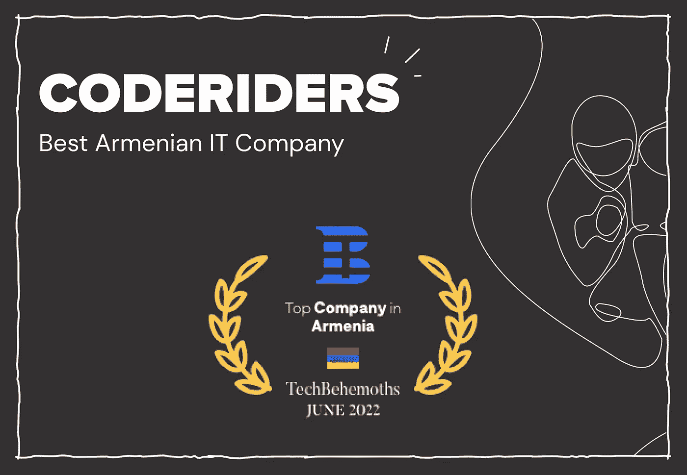
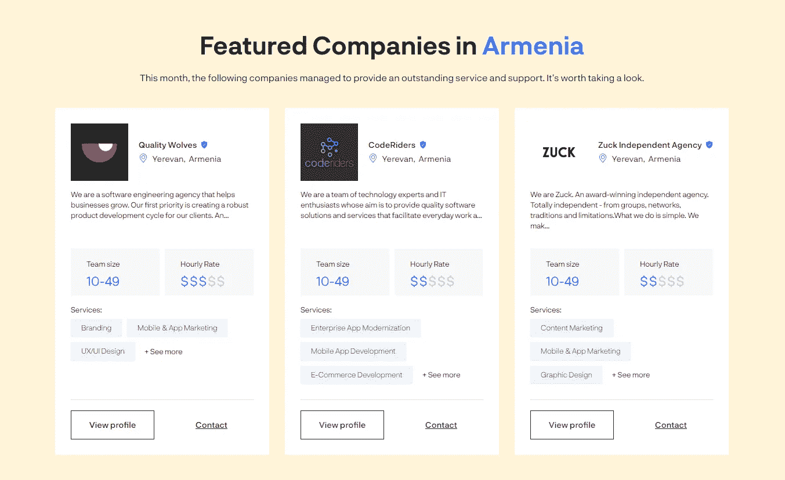
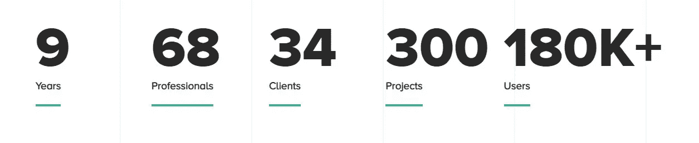

# 顶尖 IT 公司中的 CodeRiders

> 原文：<https://blog.devgenius.io/coderiders-among-top-it-companies-by-techbehemoths-b7098d292b03?source=collection_archive---------19----------------------->

[CodeRiders](https://www.coderiders.am/) 软件外包公司最近被评为亚美尼亚[顶级 IT 公司](https://techbehemoths.com/companies/armenia)之一，专门从事网络设计和开发、UI/UX 设计以及科技巨头的移动应用开发。

**关于科技巨兽**

TechBehemoths 是为 IT 公司匹配项目的最先进、最值得信赖的平台之一。这个庞大的平台将来自 140 多个国家和 6，800 多个城市的 40，000 多家 IT 公司的真实项目联系在一起。TechBehemoths 是在考虑用户体验的基础上创建的。服务是市场上最直观的。

**为什么**[**code riders**](https://www.coderiders.am/)**？**

**1。** **1。亚美尼亚的科技公司正在接受观察**

TechBehemoths 不断考察亚美尼亚的 IT 行业，认为它是世界上发展最快的技术中心之一。据 TechBehemoths 称，亚美尼亚是高加索地区软件开发、工业计算和电子产品的主要中心。

在亚美尼亚，信息产业是该国整体经济的重要部门之一。根据亚美尼亚国家统计局的数据，信息和通信技术部门去年增长了 5.3%，其价值超过 1.7 亿美元。

外国投资在亚美尼亚科技行业的快速增长中也发挥了关键作用。外国投资者喜欢亚美尼亚的主要原因是，与其他国家、科技巨头和软件外包中心相比，它拥有大量高质量的人才和实惠的价格。

例如:

●在过去的 18 个月里，总部位于亚美尼亚的科技初创公司获得了一波巨大的国际投资，总额累计超过 2 亿美元。

●更多世界知名巨头在亚美尼亚开设分公司(最近的一家是 Semrush)。

除了通过 CodeRiders 评估软件外包服务的质量之外，TechBehemoths 还单独信任我们的专业人员。例如，最近，TechBehemoths 采访了 CodeRiders 的业务发展主管安娜·哈恰特里安(Anna Khachatrian)。她讲述了自己成为软件开发行业专业数字营销和业务开发专家的故事。她还分享了她保持更新和准备迎接挑战的技巧和诀窍。查看下面安娜的故事。

[采访 CodeRiders 的业务发展主管 Anna Khachatrian](https://techbehemoths.com/blog/interview-anna-khachatrian-coderiders)

**2。CodeRiders 是亚美尼亚最著名的小型科技公司之一**

如果你试图寻找亚美尼亚的小型科技公司、网络开发和设计公司，或者定制软件外包提供商，你不能忽视 CodeRiders。

这家软件公司已经在亚美尼亚科技行业发展了近十年。 [CodeRiders](https://www.coderiders.am/company-why-us) 成立于 2013 年，最初是一所软件开发学校。在短短一年时间里，该校培养了 800 多名校友，其中 15 人被选中成立了 CodeRiders 软件外包公司。自那以后，该公司已经完成了 300 多个项目，并与来自世界各地的 68 名专业人士合作。

我们的专业知识包括构建、实施和维护复杂的软件解决方案，用于:

●企业软件解决方案(ERP tech/企业软件解决方案)，

●媒体和娱乐行业(媒体和娱乐软件解决方案)，

●数字营销和分析行业(营销和分析软件解决方案)，

●房地产行业(PropTech 软件解决方案)，

●医疗保健行业(HealthTech 软件解决方案)，

●金融行业(FinTech 软件解决方案)，

●教育行业(EdTech 软件解决方案)，

●零售和批发行业(电子商务软件解决方案)，

●法律行业(法律软件解决方案)，

●交通物流行业(物流软件解决方案)。

CodeRiders 的技术服务包括:

●网页开发与设计，

●定制软件开发，

●软件外包和 IT 咨询，

●手机 app 开发。

CodeRiders 是以下著名技术目录和奖项中公认的软件外包公司:

● [欧亚创业奖(EASA)](https://www.coderiders.am/blog/coderiders-is-awarded-as-best-software-development-partner-by-easa) ，

● [顶级开发者](https://www.coderiders.am/blog/coderiders-as-trusted-software-company-by-topdevelopers)，

●[Clutch.co](https://www.coderiders.am/blog/clutch-names-coderiders-as-one-of-the-best-custom-software-development-companies-in-armenia)，

●[OnlineDegree.com](https://www.coderiders.am/blog/best-software-companies-in-education-coderiders-included)，

● [设计草图](https://www.designrush.com/agency/profile/coderiders)，

● [TDA(顶级数字机构)](https://www.coderiders.am/blog/TDA-recognizes-coderiders-among-top-software-companies)，

● [古董店](https://www.coderiders.am/blog/coderiders-selected-as-one-of-the-best-tech-service-and-solution-providers-by-goodfirms)，

● [最佳创业公司。亚洲](https://www.coderiders.am/blog/coderiders-is-among-top-software-outsourcing-companies)，

● [技术评审员](https://www.coderiders.am/blog/coderiders-among-top-php-development-companies)。

我们的奖励包括:

●最好的 PHP 开发公司，

●最佳网页设计公司，

●最好的手机 app 开发公司，

●最好的网页开发公司，

●最佳软件开发合作伙伴，

●最佳定制软件开发公司

●教育领域最佳软件开发公司，

●顶级电商公司，等等。

我们软件开发者的主要技术栈包括世界上最常用的技术语言和框架，如 PHP、Laravel、JavaScript、React.js、Node.js、Vue.js、Angular、Python 等。对于[混合移动应用开发](https://www.coderiders.am/blog/reasons-to-choose-hybrid-mobile-app-development-over-native)，我们使用 Ionic 和 Flutter。点击查看我们的[完整技术清单。](https://www.coderiders.am/services#technologies)

除了提供一个完整的软件开发团队，我们在 CodeRiders 方面也做得很出色。突出是提供作为招聘公司一部分的个人专用开发人员的过程。在突出，这是至关重要的客户充分信任新员工。在 CodeRiders，我们确保我们的客户在雇用他们之前获得关于我们软件开发人员的所有必要信息。除了安排与特定软件开发人员的单独在线会议，我们还会在必要时组织快速测试任务。我们还在博客上分享对软件开发人员的采访，让他们表达自己的观点，分享他们的知识、专长和故事。看看下面的一些例子:

● [React.js 开发者 Garod Ajemian 关于世界上使用最多的框架](https://www.coderiders.am/blog/garod-ajemian-about-reactjs-worlds-most-used-framework)，

● [关于 PHP，你应该知道的一切，](https://www.coderiders.am/blog/albert-ispiryan-of-coderiders-clarifies-the-importance-of-php-in-web-applications)

● [CodeRiders 的 Babken Darbinyan 分享了他作为 SQL 开发人员的故事](https://www.coderiders.am/blog/babken-d-of-coderiders-shares-his-story-as-sql-developer)。

**为什么全球各行业的公司都选择 CodeRiders？**

●以合理的价格提供高质量的软件开发和设计服务。

如今，以可承受的价格找到合格的软件开发人员是一项艰巨的任务。每个企业都需要某种程度的自动化和数字化，并且需要大量构建和实施软件解决方案来保持在行业中的竞争力。这个问题在高度发达的国家更为突出，这些国家拥有极高的软件开发率。例如，一个普通软件开发人员的年薪在以下基于国家的比率之间:

瑞士:127.011 美元，

美国:92.232 美元，

英国:78.528 美元。

当然，这些比率会根据资历和技术水平而变化。但是，不要太多。另一方面，在亚美尼亚，一个普通的软件开发人员根据资历和技术水平每小时可以得到**25-55 美元**。如你所见，差别是巨大的，然而服务质量是相同的。

●如果企业主雇佣专门的软件开发人员，他们没有额外的开支。比如场地租金，员工医保费用等。

●灵活的时间安排。我们位于 GTC +4 时区，非常接近 CET 时区。

●根据软件外包公司的要求扩大团队的可能性。这因此减少了花费在新员工适应过程上的时间。

●如果客户不愿意，减少参与技术性工作。雇佣专门的软件开发人员和雇佣自由职业者是不一样的。如果你从软件开发公司雇佣专门的软件开发人员，你会做得很出色。这意味着你的专职软件开发人员不是唯一对他们工作质量负责的人。

**软件开发生命周期(SDLC)与 CodeRiders**

在 CodeRiders，我们确保与客户进行透明而简单的软件开发合作。我们根据客户的专业知识和目标定制每个流程。然而，毕竟一个典型的与 CodeRiders 的软件开发合作是以下述方式。

我们从免费软件开发咨询和支持开始。在这个阶段，我们了解潜在客户的担忧，并考虑解决方案。我们继续进行基于软件外包项目模型和公司特定目标的设计和架构流程。如果客户手头有一份 SOW 文档，提供时间和预算估计既简单又快捷。下一阶段包括实际的软件开发和实施，接着是软件开发维护和支持。

下载 CodeRiders 编写简单易用的 SOW 文档示例指南。

 [## 如何撰写可靠的工作范围| code riders 白皮书

### 里面是什么？

www.coderiders.am](https://www.coderiders.am/white-papers/how-to-write-a-solid-scope-of-work) 

总之，在 CodeRiders，我们重视所有声誉良好的技术目录和奖项，这些目录和奖项一直将我们的软件外包公司列入亚美尼亚和世界顶级 IT 公司。我们的软件开发人员和整个团队努力工作，以实现每个客户的目标和软件解决方案。TechBehemoths 的认可鼓励团队 CodeRiders 保持在亚美尼亚技术行业的领先地位。

立即将您的消息发送给 CodeRiders。

 [## 软件开发公司-联系我们| CodeRiders

### 让我们谈谈您在定制软件开发、网页开发和设计、软件外包方面的业务需求…

www.coderiders.am](https://www.coderiders.am/contact-us) 

阅读 CodeRiders 博客上的更多文章。

 [## 定制软件开发公司博客| CodeRiders

### CodeRiders 软件公司 2021 年的 15 大成就距离 2021 年正式关闭还有几天，而…

www.coderiders.am](https://www.coderiders.am/blog)