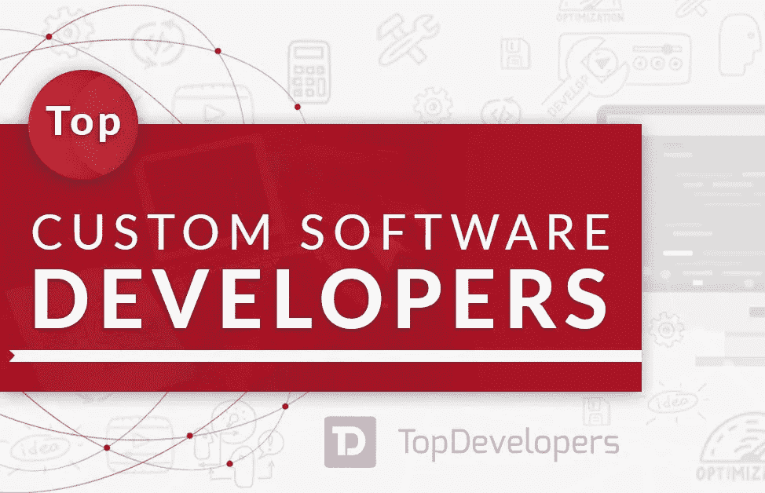
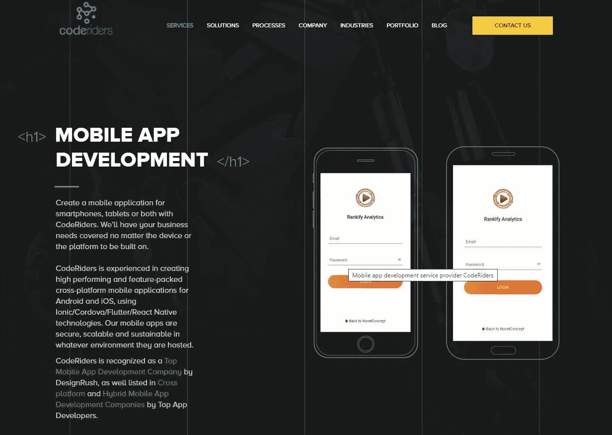
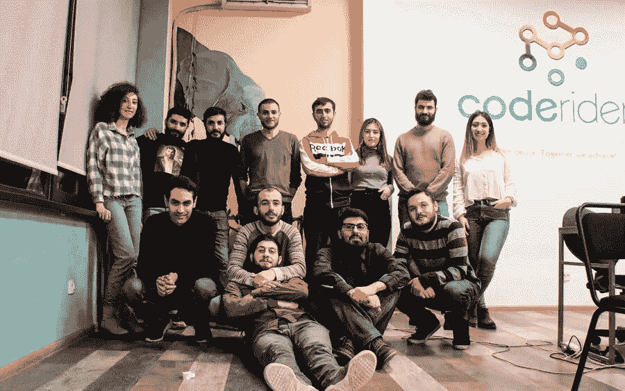

# CodeRiders 是最好的软件开发公司之一

> 原文：<https://blog.devgenius.io/coderiders-is-among-best-software-development-companies-5b7c1b4851ce?source=collection_archive---------6----------------------->

CodeRiders 是世界上许多高排名目录和评论平台最受欢迎的国际软件供应商。我们的软件外包团队最近被 TopDevelopers.Co 评选为 2021 年 5 月的[最佳定制软件开发公司](https://www.topdevelopers.co/press-releases/leading-software-development-companies-may-2021)。我们的辛勤工作、专注、高质量的服务和满意的客户评价为我们获得国际认可和不断从我们的软件开发机构雇佣开发人员铺平了道路。该公司被许多其他技术目录认为是信息技术行业中最好的软件外包公司之一，例如:

*●* [DesignRush](https://www.designrush.com/press/top-software-development-companies) —顶尖软件开发公司

*●* [好公司](https://coderiders.am/blog/coderiders-selected-as-one-of-the-best-tech-service-and-solution-providers-by-goodfirms) —最佳技术服务和解决方案提供商

*●*[TechReviewer.co](https://coderiders.am/blog/coderiders-is-among-top-php-development-companies-in-2021)—顶级 PHP 开发公司

*●* [AppFutura](https://www.appfutura.com/web-developers/armenia) —亚美尼亚顶尖的网络开发公司

*●* [欧亚创业奖](https://coderiders.am/blog/coderiders-is-awarded-as-best-software-development-partner-by-easa) —最佳区域软件开发合作伙伴

*●* [TDA](https://www.miscw.com/coderiders-top-software-development-agency-in-november-2019-by-tda-22950.html) (顶级数字机构)——2019 年 11 月顶级软件开发机构

**CodeRiders 成功案例**

CodeRiders 最初成立于 2013 年，是一所软件开发学校。仅仅一年时间，该校就培养了 800 多名校友，成为亚美尼亚最成功、评价最高的科技学校之一。由于受到成功的鼓舞，创始人决定给有才华的专业人士一个机会，并通过选择 15 名最优秀的学生成为离岸开发人员，于 2014 年成立了 CodeRiders 软件外包公司。幸运的是，新成立的软件开发公司和学校一样成功。它很快找到了客户，并成功完成了长期和短期的软件外包项目。从那时起，我们已经交付了大约 300 个完整的 web 和移动开发项目，与世界各地的 30 多个客户合作，拥有 18 万多用户。我们为中小型公司、初创公司和大型企业工作。我们的技术堆栈最初包括 PHP、Laravel、JavaScript、Node.js、Vue.js、SQL、MySQL、Angular 等技术，然后我们扩展到 React、Python、C#。NET 和混合移动应用技术，如 Dart、Flutter、Ionic。

在 CodeRiders，您可以找到针对 web 开发和设计、移动应用程序开发、定制软件开发、软件外包等领域的顶级创新解决方案。让我们更详细地研究一下每一个问题。

**网页开发与设计**

多年来，web 开发从开发单页面静态网站扩展到动态网站和 web 应用程序。新的编程语言被创造出来用于 web 开发，传统的编程语言，如 JavaScript、PHP、Java、C#和 Python，经历了重大的变化。有关这个话题的更多信息，请查看我们的软件开发人员阿尔伯特·伊斯皮扬的[专业概述](https://www.coderiders.am/blog/albert-ispiryan-of-coderiders-clarifies-the-importance-of-php-in-web-applications)以及[我们对 web 开发行业未来趋势的分析](https://www.coderiders.am/blog/top-3-programming-languages-that-will-define-coding-in-2019)。

除了功能良好，你的网站还应该有一个最新的和吸引人的设计。因此，网页设计服务和实际的网页开发本身一样重要。响应式 web 设计服务确保网页在各种设备上呈现良好，从最小到最大显示尺寸。UI(用户界面设计)和 UX(用户体验设计)服务对于最大化软件、移动设备、家用电器等的可用性和用户体验至关重要。

**手机应用开发**

移动应用程序用于各种行业，从仓库管理(VMS 软件)到医疗技术和远程医疗、电子商务、电子学习、物流等。由于其膨胀的需求，原生应用程序开发获得了一个竞争对手，即混合移动应用程序开发。通过本文了解关于混合和移动应用程序开发服务的利弊的更多细节。

**定制软件开发**

尽管有各种各样的开源软件解决方案，许多公司仍然更喜欢定制软件。与现成的软件不同，定制软件是专门为某一家公司制作的，因此它更安全、更灵活、更有竞争力、更可靠。不同行业的企业主通常会向供应商请求以下类型的定制软件。

*●* [定制 ERP 软件](https://www.coderiders.am/blog/is-erp-software-implementation-a-justified-investment)

*●* 定制仓库管理系统(VMS 软件)

*●* [定制电子学习软件或教育管理软件](https://www.coderiders.am/blog/the-importance-of-edtech-during-covid-19)

*●* [定制远程医疗或健康技术软件](https://www.coderiders.am/blog/telemedicine-vs-covid-19-healthcare-software-past-present-future)

*●* [定制电子商务软件](https://www.coderiders.am/blog/e-commerce-and-retail-solutions-are-stepping-up-during-covid-19-pandemic)

*●* [定制 EPM 和 HRM 软件](https://www.coderiders.am/blog/top-3-powerful-software-solutions-to-manage-your-remote-team)

*●* [定制金融科技软件](https://www.coderiders.am/blog/innovative-software-solutions-in-fintech-during-covid-19)

*●*电信定制软件

联系 [CodeRiders 软件外包团队](https://www.coderiders.am/contact-us)了解更多解决方案，阅读[这篇文章](https://snip.ly/va42py)了解更多关于现成软件和定制软件之间区别的信息。

*●* **外包和 IT 咨询**

外包在专注于最大投资回报率的企业中非常受欢迎。外包的一些最重要的好处包括降低劳动力成本、更快更好的服务、时区优势等等。在外包中，我们通常区分[离岸和近岸](https://www.coderiders.am/blog/5-crucial-things-to-know-before-working-with-software-vendors)。离岸软件开发意味着在海外雇佣软件供应商，而近岸则希望从邻近国家雇佣开发人员。有关这个话题的更多信息，请联系我们的专业人士并[预约免费咨询](https://www.coderiders.am/contact-us)。

CodeRiders 的主要优势之一是其组织良好的专业知识，可带来高成果。让我们快速浏览一下我们提供的服务和我们的工作方式。

*●* **中高级软件工程师**

如上所述，我们的员工从公司早期就开始与我们合作，因此他们知道团队内部有效合作的所有策略。他们确保代码符合客户的标准。这就是为什么我们的 CTO 通常在把它交给客户之前也要检查它。这导致了最少的错误，并使我们的客户从来回的聊天中解放出来，以找出可能的问题。

*●* **优秀的沟通**

沟通对于合作关系的成功至关重要。这是至关重要的和具有挑战性的，尤其是对于远程合作和离岸软件开发。我们通过几个业务管理平台提供灵活的沟通工作。这些平台包括特雷罗、吉拉、Slack 等等。我们开发人员典型的一天从与客户的快速通话开始，在那里他们讨论已完成的任务、问题以及应该做什么。我们手头也有项目经理和业务发展专家可以加入这个项目。看看这个简短的动画视频，展示了 CodeRiders 的一个典型早晨。

*●* **策划与汇报**

CodeRiders 的另一个优势是它对各种合作模式的开放性。例如，除了远程团队之外，您还可以雇佣个人专用软件工程师、项目经理、业务开发经理、产品经理等。

*●* **竞争成本**

我们的总部设在亚美尼亚，提供的服务价格不太夸张，与美国、加拿大、澳大利亚、北欧和南欧、中亚的其他软件开发机构相比具有竞争力。

*●* **发布和支持**

除了构建软件解决方案，我们还帮助确定合适的托管、许可和分发机制。无论是内部、共享、专用还是云系统，我们的 IT 专业人员都会部署和托管您的软件。

另一方面，CodeRiders 庞大的人才库使我们能够非常迅速地从我们的校友数据库中聘用熟练的专业人员。

我们还采用行业标准的外包模式，例如:

**基于项目的**

这种模式对于那些对员工管理和价格变动感到头疼的人来说尤其方便。好消息是，如果你确切地知道你想要一个固定的项目和交付期限，这种模式肯定会为你工作。在这种情况下，文件和最终协议在项目开始前全部完成并确定。该项目分为几个里程碑，在此期间，我们提供持续的演示，讨论您的需求并相应地实施解决方案。预先就最低前期成本达成一致。

**时间和材料(T & M)**

在时间和材料模型中，您为项目中涉及的时间和资源付费。这种模型在没有清晰的产品图片时使用，因此不可能将软件外包过程分成里程碑或阶段。由于 T&M 模式是高度可协商的，付款可以基于每小时，每周或每月的方式。在以下情况下，这种模式是理想的:

o 您没有固定的价格要求或明确的规格，

o 你需要一个灵活的团队，

o 在软件开发和实施过程中，你改变了你的任务或可能需要改变，

o 你希望在与你的软件供应商合作的整个过程中得到持续和直接的控制，

o 您的项目与不断变化的市场和未经测试的设施相关。

敏捷模型属于时间和材料软件开发方法。例如，我们与用于生活方式管理的[Dwel](https://www.coderiders.am/portfolio#dwel)private family cloud software 的合作就是基于敏捷方法。

**人员扩充**

人员扩充方法被认为是一种灵活的外包战略。这种模式有助于您在全球范围内雇佣技术人才，并直接有效地管理您的远程团队。在人员扩充模型中，客户评估现有人员，选择离岸软件开发团队或专门的开发人员，并说明需要哪些额外的技能。

**您的定制型号**

随时欢迎你来搭配这些型号，选择最适合你的。毕竟，这些远程工作策略的最终目标是确保高水平的合作。我们心中有满意的客户，我们随时准备调整到对您方便的软件开发参与模型。

无论你处于业务发展生命周期的哪个阶段。我们总是很乐意提供免费咨询，确定问题，给出解决方案，并开始实际的软件开发和实施过程。

点击下面的链接免费咨询。

 [## 软件开发公司-联系我们| CodeRiders

### 让我们谈谈您在定制软件开发、网页开发和设计、软件外包方面的业务需求…

www.coderiders.am](https://www.coderiders.am/contact-us)