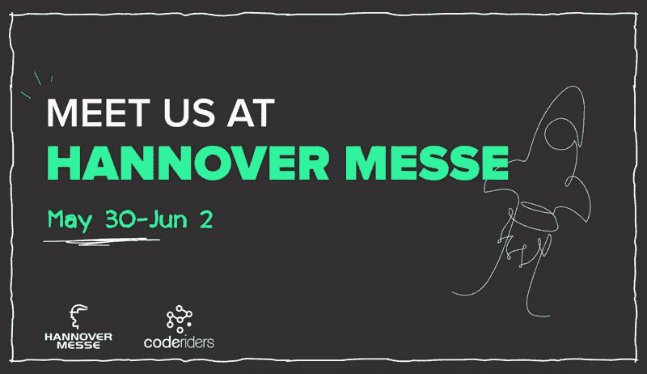
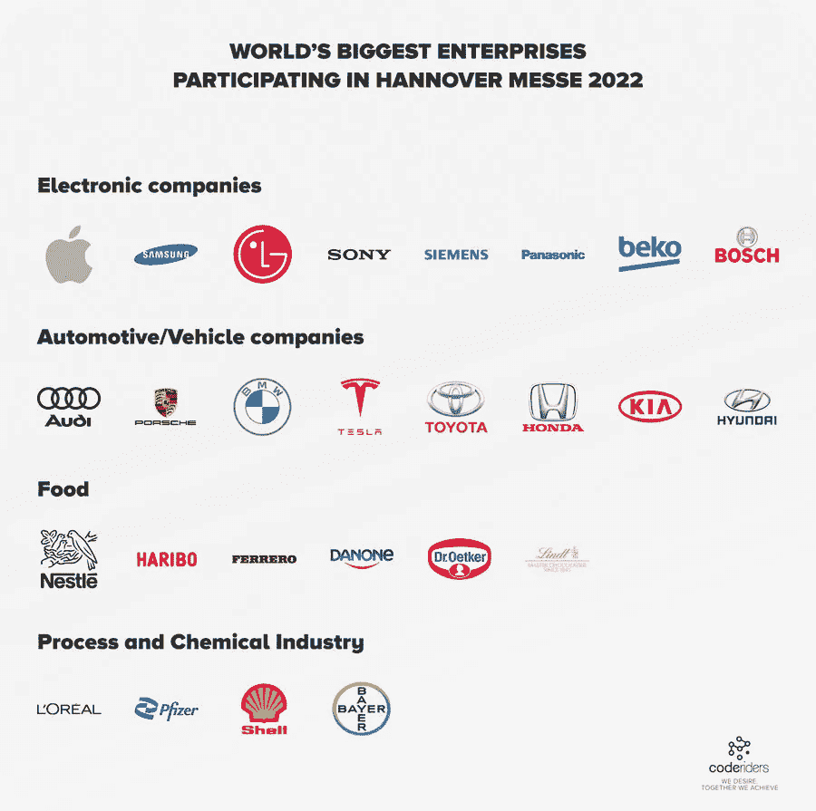
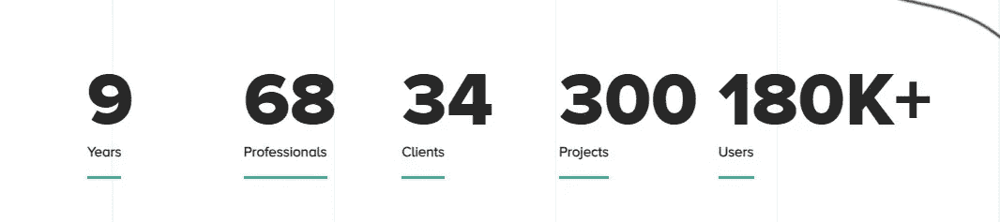
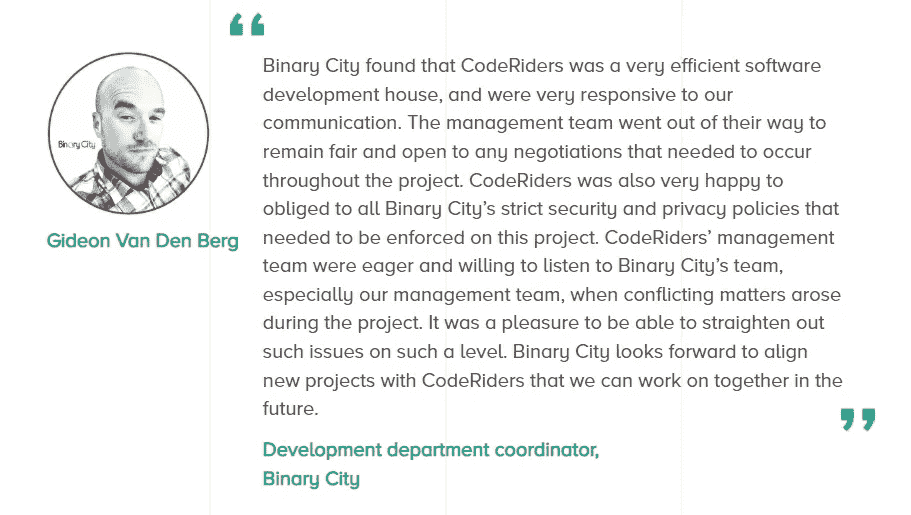
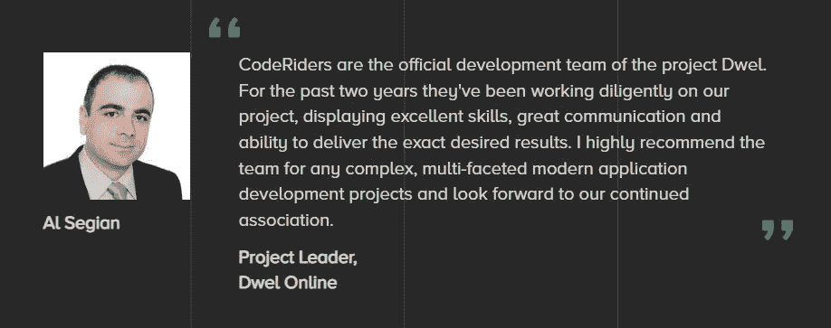
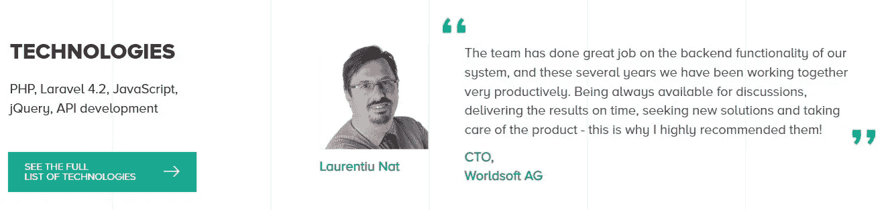

# CodeRiders 将参加汉诺威工业博览会 2022 交易会

> 原文：<https://blog.devgenius.io/coderiders-is-taking-part-in-hannover-messe-2022-trade-fair-fb647a47c87e?source=collection_archive---------11----------------------->

为致力于行业发展和数字化进步的世界上最大和最重要的年度贸易展 2022 年汉诺威工业博览会保留日期和地点。

交易会将于 5 月 30 日至 6 月 2 日在德国汉诺威市的 nde 展览中心举行。主办国德国每年欢迎来自世界各地的 6500 家参展商和 250000 名参观者。

汉诺威工业博览会将世界上最有前途的公司的领导者和代表联系起来，共同探讨计算机科学领域的顶尖解决方案。展会的主题是数字化和可持续发展。

作为一家经验丰富的软件外包公司，我们通过熟练的软件开发人员、设计人员和其他 IT 专家提供高质量的软件解决方案，我们很高兴地通知您， [CodeRiders](https://www.coderiders.am/) 团队将成为这一杰出活动的一部分。

**汉诺威工业博览会值得参加吗？**

该活动极大地帮助中型公司和企业寻找新的合作伙伴或满足合格的潜在员工、供应商公司和软件外包公司，如 CodeRiders。它为中小企业向国际观众展示其服务和产品提供了一个平台。

2004 年，该贸易展获得了作为技术创新奖的“爱马仕奖”。它被认为是工业研究和技术发展领域最负盛名的活动(RTD)。参观者加深了他们对最新的定制软件解决方案和计算机科学创新的了解，并获得了急需的关于世界未来的更新:自动化和数字化。他们也有机会参加关于他们感兴趣的话题的会议。这是一个交流经验和信息以及收集有价值和有益的业务联系的完美场所。

汉诺威工业博览会 2022 的主题包括:

●自动化、运动和驱动

●数字生态系统

●能源解决方案

●工程零件和解决方案

●物流

●全球业务和市场

●未来枢纽

然而，这个行业对任何行业的公司来说都是有吸引力和值得参与的，因为它的范围不局限于一个主题。

一年一度的行业发展博览会是世界上最大的企业不可错过的，如苹果，三星，特斯拉，宝马，雀巢，费列罗，辉瑞，欧莱雅等。

2022 年汉诺威工业博览会上的 CodeRiders 软件公司:如何与我们见面？

您可以在 5 月 30 日至 6 月 2 日期间的任何一天，晚上 9:00-6:00 与领导和公司代表会面[联系我们](https://www.coderiders.am/contact-us)或发送消息至 [info@coderiders.am](mailto:info@coderiders.am) ，我们将与以下人员会面:

CodeRiders 软件开发公司 CTO 兼 CEO Artak Amirkhanyan，

CodeRiders 软件开发公司的首席运营官·扎文·特尔-斯捷潘扬(Zaven Ter-Stepanyan)，

●安娜·哈恰特里安，商业发展执行官，

●高级软件开发人员亚瑟·特尔-斯特潘扬。

**为什么软件外包公司值得见 CodeRiders？**

CodeRiders 是一家总部位于亚美尼亚的软件开发公司。我们是一个由 16 名技术爱好者组成的团队，围绕一个目标，用最先进的技术和创新来构建简单强大的系统，以实现业务流程的自动化。我们相信时间是宝贵的，自动化应该可以节省时间。我们致力于通过定制软件开发和实施来简化工作流程和扩大可能性。我们提供:

●网页开发和设计服务，

●定制软件开发，

●软件外包和外包，

●手机 app 开发。

我们软件公司在 IT 外包行业已经 9 年了，和 68 个专业人士合作过，完成了 300 个项目。

**为什么来自不同行业和世界各地的公司会选择 CodeRiders？**

我们的优势:

●我们可以以可承受的价格提供高质量的软件服务。在许多国家(如美国、加拿大、澳大利亚、新西兰、东北欧国家、西南亚国家和中非)，质量加价格是不可能兼顾的。

●公司可以选择雇佣专门的软件开发人员和设计师，或者雇佣整个团队。我们对软件外包、外派和员工扩充解决方案持开放态度。

●我们的软件开发人员、设计人员和其他 IT 专家精通英语，没有可能使软件开发过程复杂化的特殊国家和文化心态问题。

●客户可以根据要求雇佣更多的软件开发人员、设计师和 IT 专家，因为 CodeRiders 拥有庞大的人才库。在我们作为软件开发公司成立之前，我们是一所软件开发学校。

●团队精神对我们来说极其重要。我们的员工几乎从职业生涯开始就一直在一起工作。他们知道同事的优缺点，容易合作，这对于快速成功至关重要。

**行业经验**

在国际软件开发行业 9 年的经验中，我们为各种行业开发了多种软件解决方案，例如:

● [电子学习或教育技术软件解决方案](https://www.coderiders.am/blog/revolutionary-e-learning-software-solutions)，

● [金融科技或金融软件解决方案](https://www.coderiders.am/blog/top-fintech-solutions-how-did-we-live-without-them)，

● [媒体和娱乐软件解决方案](https://www.coderiders.am/blog/best-media-entertainment-software-solutions-to-stay-updated)，

● [健康技术软件解决方案](https://www.coderiders.am/blog/top-healthtech-solutions-saving-millions-of-lives-during-covid)，

● [电子商务、零售和批发软件解决方案](https://www.coderiders.am/blog/e-commerce-and-retail-solutions-are-stepping-up-during-covid-19-pandemic)，

●房地产软件解决方案，

●运输和物流软件解决方案，

● [旅行和旅游软件解决方案](https://www.coderiders.am/blog/software-solutions-for-the-business-of-travel-in-2022)，

●业务和客户管理软件解决方案，

● [ERP 软件解决方案](https://www.coderiders.am/blog/is-erp-software-implementation-a-justified-investment)。

我们的主要技术栈包括以下技术:PHP、Laravel、JavaScript、Vue.js、React.js、Node.js、HTML/CSS、jQuery、MySQL、API 开发服务。[检查完整列表](https://www.coderiders.am/services#technologies)。

**我们的一些最新案例研究包括:**

[**财富管理系统**](https://www.coderiders.am/portfolio#binarycity)

我们帮助一家南非金融科技公司构建和执行数字金融解决方案，例如:

●理财交易

●汇款、取款和存款

●用于向银行发送请求的各种文件类型生成(XML、CSV、TXT 等)

●各种类型的银行回复分析报告生成(网络视图、PDF 生成、XLSX 生成)

[**面向生活方式管理的家庭云软件**](https://www.coderiders.am/portfolio#dwel)

我们建立了一个在线操作系统，用于管理家庭生活、更好的家庭管理以及家庭成员之间的交流。

一些主要的解决方案包括:

●组织信息和照片的文件管理系统

●财务管理系统，明智地花钱，节省更多

●共享日历，记录重要的家庭事件和约会

●完整的食物规划和烹饪系统，让任何人都能成为厨师

●任务管理系统，以跟上杂务和差事

●定期购买杂货和其他消费品的购物清单

●留言板，供家庭成员替换冰箱上的便利贴

●社交媒体风格的应用程序，显示当地商店的特价商品

●系统设置和配置管理应用程序

[**一个定制的 CRM 和电子邮件营销系统**](https://www.coderiders.am/portfolio#worldsoftag)

我们的团队构建了 CRM 和电子邮件营销系统的后端功能，并集成了 API 应用程序。主要解决方案包括:

这是一个开源项目，目前，它有超过 180，000 个用户。

在我们的[投资组合部分](https://www.coderiders.am/portfolio)查看更多案例研究和更详细的信息。与我们分享您的项目要求，以获得您的技术项目的报价。

这里继续阅读文章[。](https://www.coderiders.am/blog/coderiders-is-taking-part-in-hannover-messe-2022-trade-fair)

 [## CodeRiders 将参加汉诺威工业博览会 2022 交易会

### 为世界上最大、最重要的工业年度贸易展保留日期和地点…

www.coderiders.am](https://www.coderiders.am/blog/coderiders-is-taking-part-in-hannover-messe-2022-trade-fair)