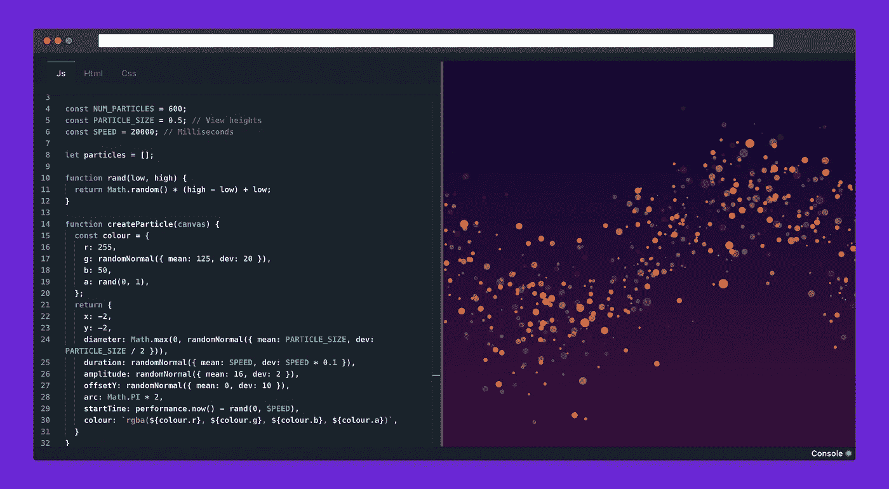
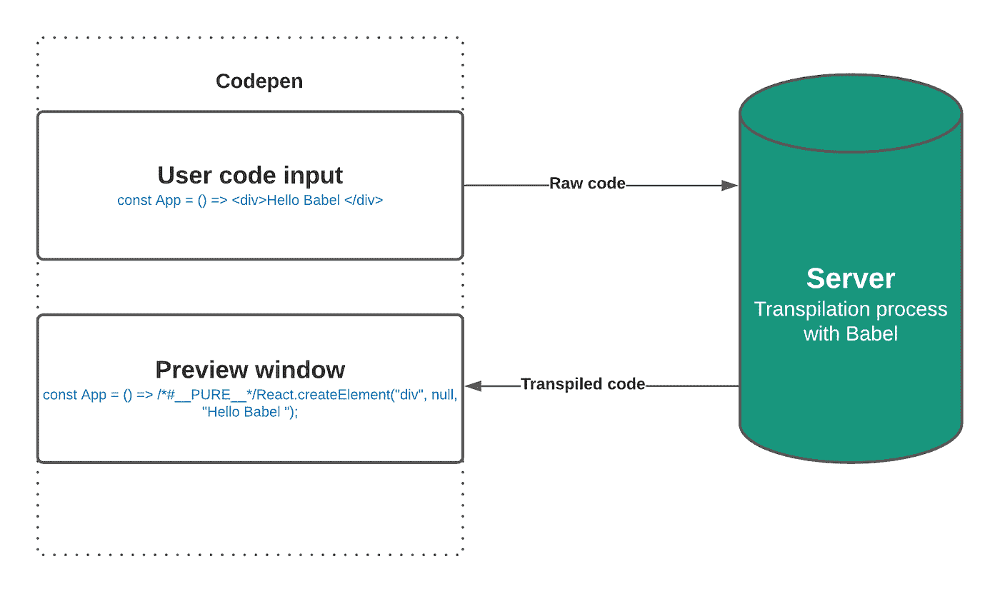
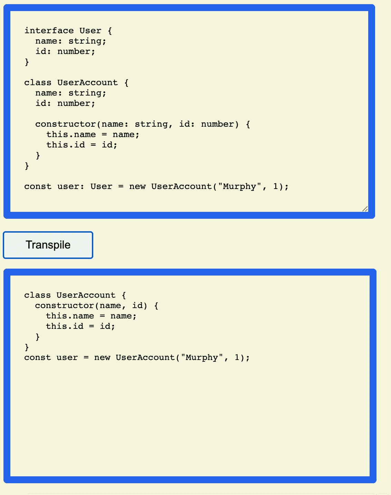

# 代码树！或者为什么我要创建一个新的密码笔。

> 原文：<https://blog.devgenius.io/codetree-or-why-i-create-a-new-codepen-5596bd52f96a?source=collection_archive---------8----------------------->



odepen 和 codesandbox 都很棒，但老实说，它们很慢，如果你的互联网连接很弱，速度会更慢，所以我创建了 Codetree，这是一个超快、高性能的在线游戏平台，具有自动 npm 模块检测功能。

## 为了能够理解为什么[代码树](https://codetree.vercel.app/)是一个强大的在线编辑器，我们将:

*   了解 codepen 的工作原理。
*   找到一个可以在我们的浏览器中执行的捆绑器。
*   构建一个简单的 react app transpiler。

# 一、Codepen/Codesandbox 是如何工作的？

感谢伟大的导师[斯蒂芬·格里德](https://medium.com/u/d058882d8cd2?source=post_page-----5596bd52f96a--------------------------------)，我在其中一个视频中找到了关于 [Codepen](https://codepen.io/) 如何工作的相当详细的解释。为了简化，他们检索原始用户代码，并将其发送到 Api 后端服务器，服务器将运行 Babel 或任何其他 transpiler，并将结果发送回应用程序，由用户的 web 浏览器执行。



这种方法的问题是，每次用户在编辑器中编写代码时都必须发出请求(即使有去抖器)，这需要更多的时间来接收、处理和转换代码，然后才能在应用程序中显示代码。所以对于 [**Codetree**](https://codetree.vercel.app/) ，我需要直接在浏览器中完成所有这些编译任务。

# 下一步:找到一个在浏览器中工作的 transpiler 和 bundler。

> **transpiler，**是一个获取一种编程语言的源代码并将其编译成另一种编程语言的程序。

对于[***code tree***](https://github.com/philippetedajo/codetree)，我选择了 ***Babel*** ，它将 JavaScript(es 2015 或更高版本)转换，并将 typeScript 转换成兼容的代码，并可由新旧浏览器直接执行。

**捆绑器**用于将多个模块组合成一个模块，更具体地说，它:
1-解析入口点，例如 index.js、main.css
2-查找导入/导出/要求语句，
3-在硬盘上搜索这些模块
4-将所有这些文件链接成一个文件

对于 bundler 的选择更复杂，因为 **Webpack** 捆绑过程在浏览器中不工作，作为[***web assembly***](https://webassembly.org/)**，**的忠实粉丝，我查看了[***es build***](https://esbuild.github.io/)。

[***web assembly***](https://webassembly.org/)**是一种低级的、类似汇编语言的语言，在 web 上运行时可以达到接近原生应用程序(例如用 C/C++编写)的性能，而[***es build***](https://esbuild.github.io/)如文档所说是*一种使用 Go 和 **WebAssembly** 构建的速度极快的 JavaScript bundler* 。**

# **最后代码树是如何工作的？**

**到理解了这一切，我们将使用 react 创建一个简单的应用程序，它允许我们将 typescript 编译成可由浏览器直接执行的代码。**

**首先，让我们进入终端或命令提示符，运行以下命令:**

```
 yarn create react-app my-app --template typescript
```

**如果您不熟悉 typescript，您可以忽略模板，然后像这样清理您的 app.ts 文件:**

```
import *React* from 'react';
```

**现在我们需要添加一个**文本区域**，我们将在其中键入我们的类型脚本代码，一个**按钮**来启动**传输**，以及一个**“pre”**标签来显示**传输的代码**:**

**让我们添加状态来存储用户输入代码和输出转换代码:**

****我们现在可以将 Esbuild 集成到我们的项目中:****

**Esbuild 将允许我们直接在浏览器中传输代码。它附带了一个 javascript 包装器，用于定义发送到 GoLang bundler 的命令，以及一个 webassembly binary (wasm)包装器，允许我们运行低级语言(如 C、Rust、Go..)直接在浏览器里面。**

*   **首先，我们需要安装 esbuild-wasm npm 模块:**

```
yarn add esbuild-wasm@0.8.57
```

**然后我们添加以下代码:**

**现在让我们快速浏览一下上面写的内容**

*   **我们在应用程序的主体中为 esbuild 添加了一个异步初始化函数。**
*   **我们添加了。wasm 文件:**" https://UNP kg . com/es build-wasm @ 0 . 8 . 57/es build . wasm "**在 wasm 参数中。**
*   **当第一次使用一个 **useEffect 钩子**和一个空数组**挂载组件时，我们启动服务函数。****
*   **esbuild 的服务函数带有一些内置函数(build:\，serve:\，transform:\，stop: f)**

****现在我们的应用程序中的 Esbuild 设置已经就绪，我们可以尝试编译一些类型脚本代码:****

****再一次让我们仔细看看发生了什么:****

*   **首先，我们设置 initialize()函数之外可用的服务函数的范围，以便能够在 onClick()函数中使用它，我们通过使用 **useRef** 钩子来引用我们的 Esbuild 服务**来做到这一点。****
*   **然后，如果 Esbuild 没有完成初始化，我们会阻止用户执行传输文件。**
*   **我们使用 transform 函数通过传递一些参数来传输我们的代码:
    *The **userInputCode** :我们放在文本区域的代码。
    *加载器**:指定我们提供的代码类型。
    *目标**:要在哪个 js 环境下生成代码。******
*   ******最后，我们从 transform 函数中获取代码结果，并用它来更新 transpiledCode 状态。******

******瞧啊。您已经构建了一个 ***的浏览器内打字稿传输器*** ，现在您可以添加任何打字稿代码并显示结果🥳🥳🥳.******

********

****如果你觉得这个项目有趣，请在 [**Github**](https://github.com/philippetedajo/Codetree) 上留个星支持我们，你可以在这里找到完整的开源项目[***code tree***](https://github.com/philippetedajo/codetree)*。✨*****