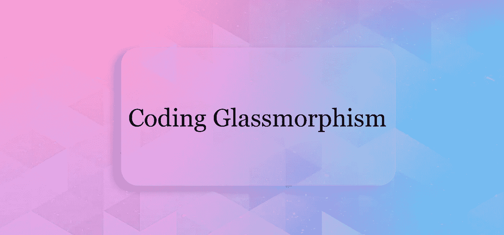
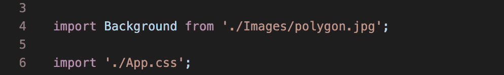
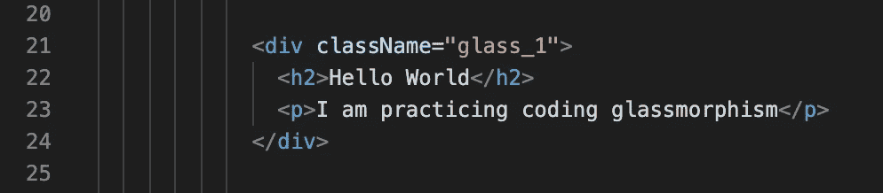
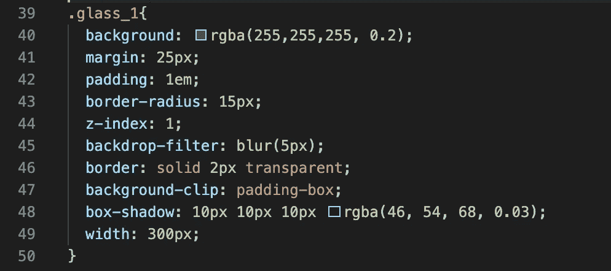
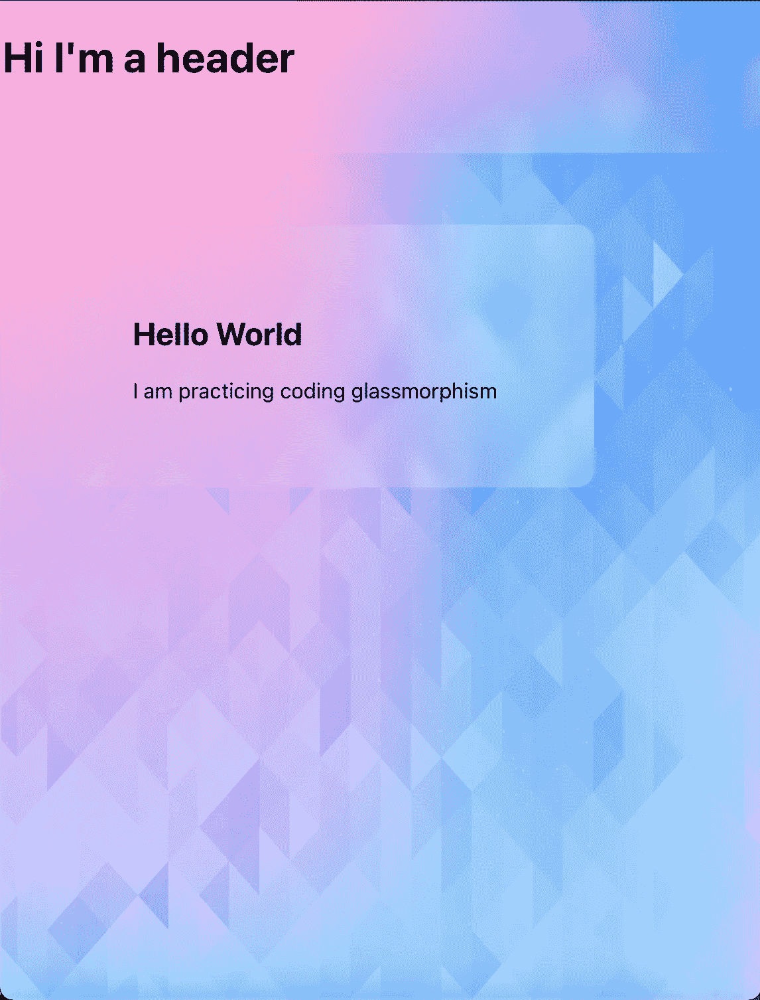

# 编码玻璃 Block✨

> 原文：<https://blog.devgenius.io/coding-a-glassy-block-3384f07274f4?source=collection_archive---------12----------------------->

Glassmorphism 是 UI 世界的上升趋势。可以理解，很华丽🤩！下面是我如何用 HTML5 和 CSS3 创建一个玻璃状块(并作出反应)。

1.  准备好你的背景。

这可以是你喜欢的任何形式，无论是编码渐变、图像，还是带有彩色形状的简单颜色。我为这个例子选择了一个抽象的渐变背景图像，并将其导入到我的文件中。

**2。创建你想成为玻璃状的 div。**

下面是显而易见的一点，创建 div 并给它一个类名，以便我们可以在 CSS 页面中专门调用它。

**3。应用样式**

1.  将 div 的背景色设置为白色，并使其稍微半透明。
2.  你需要添加一个背景滤镜，设置为“模糊”5 个像素。(5 像素不是一个硬性的数字，你可以随意选择不同的数字，看看什么最适合你的背景。)
3.  添加 2 像素宽的透明实心边框。这将为你的街区创造一个好的边缘。
4.  为了确保模糊效果不会超出外部块的边缘，添加背景剪辑，并将其设置为“填充框”。
5.  现在一些阴影😎，将方框阴影设置为 10 像素乘 10 像素乘 10 像素。将颜色设置为 rgba(46，54，68)，透明度设置为 0.03。这将创建一个微妙的蓝色阴影，不会像黑色的严厉。

**4。沐浴在你创造的荣耀中**

随意修改数字和效果，直到你对结果满意为止。对于任何其他块，你想成为玻璃，只是复制和粘贴你已经做了新的块的风格。

这里是我的 GitHub 的完整代码:[https://github.com/ReaganADavenport/GlassMorphism_React](https://github.com/ReaganADavenport/GlassMorphism_React)

编码快乐！