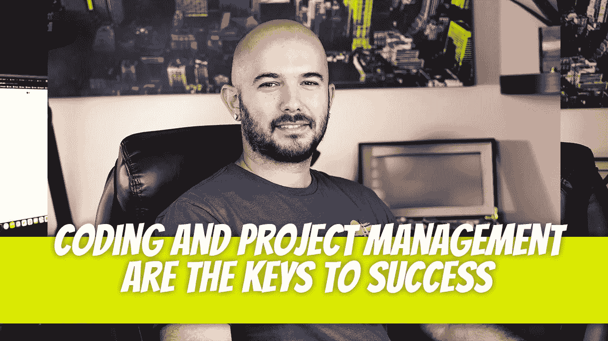

# 编码和项目管理是成功的关键

> 原文：<https://blog.devgenius.io/coding-and-project-management-are-the-keys-to-success-a8bbce4a543e?source=collection_archive---------8----------------------->

我经常和妻子开玩笑说，项目管理是生活的答案。但我只是半开玩笑。一旦你理解了项目管理，你就可以把它应用到任何事情上，让你自己变得有条理并脱颖而出。

我自信能在大多数公司找到工作的主要原因之一是我的项目管理技能。理解大多数人对项目管理不够了解是我的一个优势。

我将开始一份新工作，在几个月内组织好公司，并从那时起和其他人一起享受这份工作。从外面看起来很乱，但是当你知道你在做什么的时候，它实际上是非常简单的。大多数时候真的就是这么简单。

另一个方面是编码。重组你的思维，以一种极其有组织的方式完成任务，看起来像是一种欺骗代码，而大多数人都无法使用。知道如何将问题分解成可管理的块是大多数软件开发人员的优势。

开发人员可以将这些技能应用到他们所做的任何事情上。事实上，他们在大多数事情上都取得了成功。例如，我从来没有做过地板，但我有一个受过开发人员训练的头脑。我知道如何把这个问题分解到足以在我的整个房子里安装地板。如果我可以自吹自擂的话，那就太完美了。

我是怎么做到的？将项目分解成易于管理的部分，然后记录这些步骤。我一步一步地处理，直到完成。不相信我？这是其中一个房间的结果。房子的 4500 平方英尺都是我做的。下面是我放下四分之一圆之前的照片。

画画怎么样？以前也没这么做过。一次油漆整个房子的一个房间。结果很完美。电工？没问题。

来点更有挑战性的怎么样？重建你的克尔维特怎么样？打造定制内饰？定制悬挂？定制引擎？都在你的车库里？没问题。从来没有做过任何工作，我花了 6 个月的时间。完成后，我转动曲柄，它工作得很好。更难以相信？看看我的 YouTube 频道。

[https://www.youtube.com/c/CarModGuy](https://www.youtube.com/c/CarModGuy)

## 这是一个难以置信的优势

这不仅仅是我。我认识的每个开发人员都能完成他们想做的任何事情。在一个公司里，每个开发人员都会演奏一种乐器！我是说，我们可以组个乐队。为什么呢？包括我自己在内，大多数人直到成为软件开发人员后才开始演奏乐器。

因为我们知道如何分解问题。当你看到一个人弹吉他时，你会想，“哇，真令人印象深刻。”当一个开发者看到一个人在弹吉他时，他们会说，“我很确定我也能做到。有哪些步骤？”

显然，这个人知道和弦以及如何在它们之间转换。

*好吧。让我来。*

*在接下来的三个月里，我将只学习和弦。*

最简单的和弦是什么？e 大？好的。让我来做那个。

下一个和弦是什么？c？让我也学学那个。

我会慢慢开始。握住和弦，随着节拍弹奏。

*我会加大节拍，直到变得毫不费力。30 bpm 似乎是一个好的开始。不到 120 次/分我是不会停下来的。*

*接下来，我会把手指慢慢抬离吉他。*

我会越来越多地把手指从吉他上拿开，直到我学会为止。

*我懂了！现在让我试着在这两个和弦之间过渡。*

我也明白了。

是时候学习接下来的两个和弦以及它们之间的过渡了。

大约 6 个月后，你会对自己的能力感到惊讶。下面是我大约 8 个月后弹吉他的照片。

## 两个都要学吗？

我绝对认为你应该。尤其是编码，将会是你承担的最困难的任务之一。然而，一旦你完成了，你会重新连接你的大脑，即使最困难的任务也会变得简单。准备用接下来的几年学习。

上面列出的任务只是我生活中的几个例子。还有很多其他的。如果你想了解更多，我写了一些其他的文章，可能会对你的旅程有所帮助。祝你好运！

 [## 为什么保持一致如此困难？

### 无论你走到哪里，你都会听到这句话:“保持一致，才能取得成功。”做一个 100 天的编码挑战来快速…

medium.com](https://medium.com/geekculture/why-is-staying-consistent-so-difficult-a153114de169)  [## 如何有侵略性的组织？

### 我经常听说一天中没有足够的时间来完成我每天做的事情。我喜欢…

medium.com](https://medium.com/geekculture/how-to-be-aggressively-organized-12c079f41108)  [## 如何每日向社交媒体发布优质内容？

### 你有没有努力找到时间来发布高质量的内容？无论是为了自己的品牌，还是为了自己的企业…

medium.com](https://medium.com/geekculture/how-to-post-quality-content-to-social-media-daily-e5bf053da7b8) 

迪诺·卡伊奇目前是 [LSBio(生命周期生物科学公司)](https://www.lsbio.com/)、[绝对抗体](https://absoluteantibody.com/)、 [Kerafast](https://www.kerafast.com/) 、[珠穆朗玛生物](https://everestbiotech.com/)、[北欧 MUbio](https://www.nordicmubio.com/) 和 [Exalpha](https://www.exalpha.com/) 的 IT 主管。他还担任我的自动系统的首席执行官。他有十多年的软件工程经验。他拥有计算机科学学士学位，辅修生物学。他的背景包括创建企业级电子商务应用程序、执行基于研究的软件开发，以及通过写作促进知识的传播。

你可以在 [LinkedIn](https://www.linkedin.com/in/dinocajic/) 上联系他，在 [Instagram](https://instagram.com/think.dino) 上关注他，或者[订阅他的媒体出版物](https://dinocajic.medium.com/subscribe)。

[*阅读迪诺·卡吉克(以及媒体上成千上万其他作家)的每一个故事。你的会员费直接支持迪诺·卡吉克和你阅读的其他作家。你也可以在媒体上看到所有的故事。*](https://dinocajic.medium.com/membership)