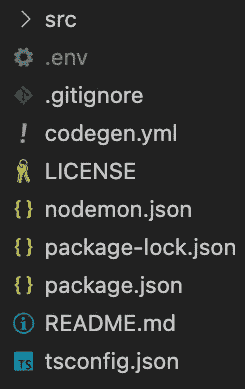
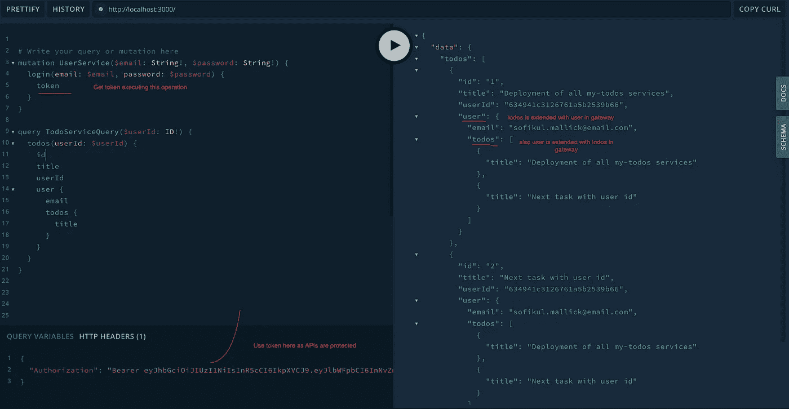
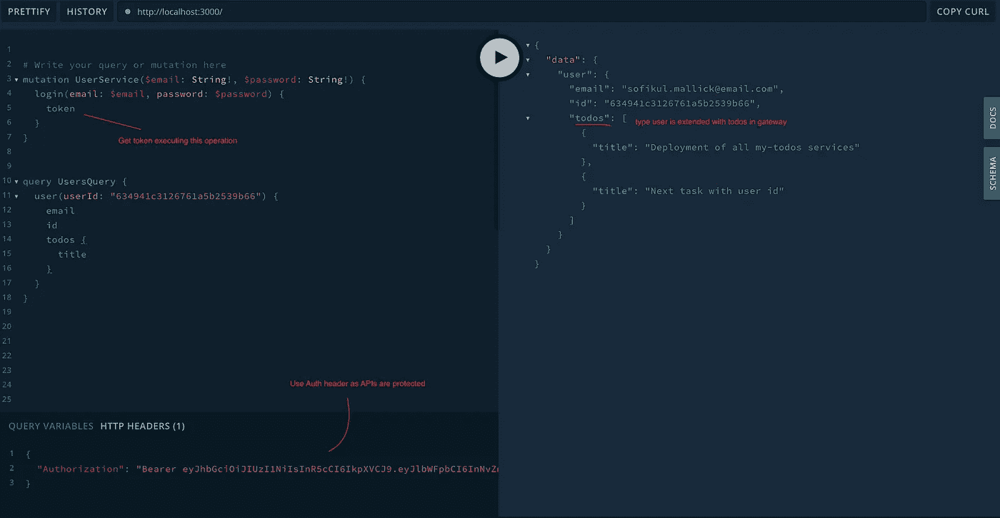

# 编码 GraphQL 网关服务

> 原文：<https://blog.devgenius.io/coding-graphql-gateway-service-b8516d4052d4?source=collection_archive---------15----------------------->

本内容面向那些对 REST 和 GraphQL 有基本了解的工程师。我们将陆续公布以下内容。

# 1[my-todos 项目设计](https://medium.com/@sofikul.m/design-my-todos-project-with-graphql-rest-microservices-482cffc7729b)

[#2 编码 GraphQL 服务(我们在本文中)](https://medium.com/@sofikul.m/coding-graphql-services-eafd9235fdf7)

[#3 GraphQL 服务认证和授权](https://medium.com/@sofikul.m/6894d6f40ac0)

***【4 #编码 GraphQL 网关服务(我们在这里)***

#5 使用 Nuxt 编码 my-todos web

#6 所有服务的部署

# 我们要在这里讨论什么？


我们已经开发了子图(如用户服务)。现在是时候将它们缝合在一个 GraphQL 服务(称为网关服务)中，该服务将向消费者公开。这个网关服务将合并上述服务，其中一个是用户 GraphQL 服务(在 Node express apollo 服务器中开发)，另一个是任务 rest 服务(Node express 服务器)。

# 技术栈

我们将用于构建 GraphQL 服务的技术堆栈

*   节点(快速框架)
*   Apollo GraphQL 服务器
*   以打字打的文件
*   GraphQL 库(graphql 工具缝合库等)

说得够多了，我们将马上着手实施👨‍💻。深呼吸😊专注于👇

# 项目结构

让我们首先决定我们的项目结构。现在我有以下内容给你。完整结构见[本](https://github.com/Sofiukl/my-todos-gateway-gql)。



# 项目开发

## #01 图表 SQL 模式

我们需要在网关中处理多个模式，因为该服务将合并几个子图。

*   ***用户服务模式*** :该模式在用户服务中定义，将被远程获取。
*   ***任务 rest 服务*** *:* 模式定义需要在网关服务中创建，至于 REST 服务我们没有现有的模式。让我们首先创建它。

*   ***网关模式:*** 我们需要一个特定于网关服务的模式，因为我们需要将子图缝合在一起以构建一个完整的功能。

我们在上面做什么

*   用`todos`扩展`GetUserResponse`，以便在获取用户响应时返回用户的 todos。
*   使用`user`扩展`Todo`类型，以便在 get todo 响应中返回 todo 的创建者。

## #02 用于类型脚本类型生成的 GraphQL 模式

我们在上面的模式中定义了 GetUserResponse，LogInResponse 类型。我们的代码中也需要相应的类型。我们将使用 npm ( [@graphql-codegen](https://www.npmjs.com/package/@graphql-codegen/cli) )从模式文件中自动创建它。

该库需要一个 codegen.yml 配置文件。

您需要运行下面的命令来创建类型。

```
graphql-codegen --config codegen.yml
```

输出将在/src/generated 文件夹下创建。你可以查看我的[库](https://github.com/Sofiukl/my-todos-gateway-gql)。

## #03 创建网关 apollo 服务器

在网关服务服务器文件中，我们需要处理比子图的服务器文件更多的东西。

*   提取远程模式
*   获取本地模式(如果有)
*   网关模式中的扩展类型
*   为所有扩展类型定义冲突解决程序
*   包括数据源(如果有)

*   *获取所有远程模式*:远程获取用户服务模式。参考第 50 行
*   *获取本地模式如果任何* : Todo 模式只存在于网关服务中，那么我们需要在本地获取它。参考第 52 行
*   *在网关模式中扩展类型*:类型扩展将在网关模式中定义。参考文件 schema.graphql
*   *为所有扩展类型定义解析器*:需要按照网关模式实现所有扩展类型的解析器。参考第 59–91 行
*   *包含数据源(如果有的话)*:有时我们有基于我们的实现的外部数据源(如 REST 数据源、SQL 数据源等)，需要在服务器配置的 data source 部分提及。对我们来说，我们将提到 TodoAPI 数据源。参考 117–121

完整代码可以在我的[回购](https://github.com/Sofiukl/my-todos-gateway-gql)中找到。

## #04 编写解析器代码

*   **用户服务解析器**:不需要为远程模式创建解析器，因为这将从子图服务远程获取。因此，用户服务网关中不需要解析器。
*   **任务服务解析器**:由于 todo 服务是一个遗留的 rest 服务，模式和解析器需要在我们的网关服务中创建。

*   **网关模式解析器**:这已经在 server.ts 文件参考行 59–91 中定义了

## #05 处理子图的远程授权

由于我们的用户服务受到身份验证的保护，授权头也需要传递给子图服务。我们已经在我们的用户执行器中实现了这一点。参考下文

## #06 在开发模式下运行代码

下面是我们在 package.json 中定义的脚本

```
"schema-type": "graphql-codegen --config codegen.yml",
"lint": "eslint . --ext .ts",
"build": "npm run schema-type && tsc",
"start": "npm run build && node build/server.js"
```

我们可以使用`npm run start`来运行我们的开发服务器。

## #07 测试 API

Apollo server 提供了内置文档和平台，可以非常快速轻松地测试这些特性。

运动场将在端点`baseurl/graphql`可用，例如[http://localhost:4000/graph QL](http://localhost:4000/graphql)

我们将测试以下两点

(1) ***扩展*** `***Todo***` ***类型用*** `***user***` ***这样 todo 的创建者将在 get todo 响应中返回。***



***(2)用*** `***todos***` ***扩展*** `***GetUserResponse***` ***以便在得到用户响应时返回用户的 todos。***



> *🔥恭喜你！您已经定义了您的 GraphQL 网关服务。*

## #08 参考

*   [远程模式](https://www.the-guild.dev/graphql/tools/docs/remote-schemas)
*   [模式拼接](https://www.the-guild.dev/graphql/tools/docs/schema-stitching/stitch-combining-schemas)
*   [数据来源](https://www.apollographql.com/docs/apollo-server/v3)

🌟完整的源代码可以在[这里](https://github.com/Sofiukl/my-todos-gateway-gql)找到。

想看讲座吗？

# 下一步是什么💁

庆祝你的学习和成就🎉。我们将在下一篇文章 [*#5 使用 Nuxt*](https://medium.com/@sofikul.m/coding-my-todos-web-to-consume-graphql-service-1e78302e7a04) 编写 my-todos web 中见到您。请订阅，以便在我们发布后立即获得更新。

> *坚持学习！*