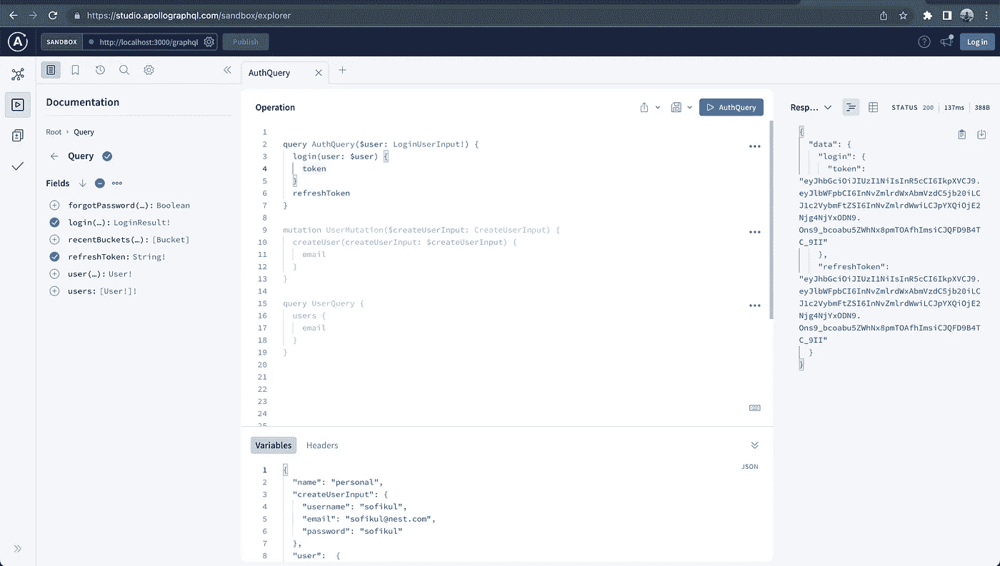
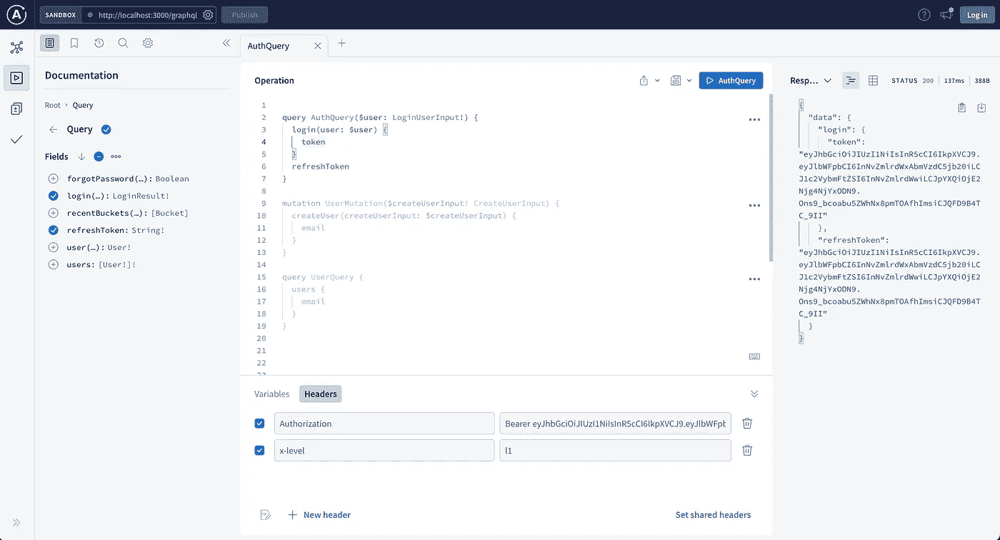

# 使用嵌套编码 GraphQL 服务

> 原文：<https://blog.devgenius.io/coding-graphql-service-using-nest-b646695b7b7f?source=collection_archive---------11----------------------->

今天我们将看看如何在 Nest 中开发用户服务。然而，我们已经在 express 中编写了类似的服务，您可以在这里查看。

# 要求

要求是创建一个具有以下功能支持的用户服务

*   创造用户
*   查找所有用户[受“管理员”用户保护]
*   登录功能

# 技术栈

我们将用来构建这个 GraphQL 服务的技术堆栈

*   嵌套 Js
*   Apollo GraphQL 服务器
*   GraphQL 库

说得够多了，我们将马上着手实施。深呼吸，专注于接下来的部分:)

# 项目结构

Nest Js 框架给了我们非常结构化的代码库，我们将使用默认的结构。

# 项目开发

# #01 图表 SQL 模式

GraphQL 模式是客户端可以从 GraphQL API 请求的数据的描述。它还定义了客户机可以用来从 GraphQL 服务器读取和写入数据的查询和变异函数。Nest 给了我们拥有模块化模式的自由。

验证模式将位于 src/auth/auth.types.graphql 下，用户模式将位于 src/user/user.types.graphql 等下。

```
type Query {
  login(user: LoginUserInput!): LoginResult!
  refreshToken: String!
}

type LoginResult {
  user: User!
  token: String!
}

input LoginUserInput {
  username: String
  email: String
  password: String!
}
```

```
scalar Date
scalar ObjectId

type Query {
  users: [User!]!
  user(username: String, email: String): User!
  forgotPassword(email: String): Boolean
}

type Mutation {
  createUser(createUserInput: CreateUserInput): User!
  updateUser(fieldsToUpdate: UpdateUserInput!, username: String): User!
  addAdminPermission(username: String!): User!
  removeAdminPermission(username: String!): User!
  resetPassword(username: String!, code: String!, password: String!): User!
}

type User {
  username: String!
  email: String!
  permissions: [String!]!
  createdAt: Date!
  updatedAt: Date!
  lastSeenAt: Date!
  enabled: Boolean!
  _id: ObjectId!
}

input CreateUserInput {
  username: String!
  email: String!
  password: String!
}

input UpdateUserInput {
  username: String
  email: String
  password: UpdatePasswordInput
  enabled: Boolean
}

input UpdatePasswordInput {
  oldPassword: String!
  newPassword: String!
}
```

# #02 在应用模块中配置 Apollo 服务器

我们将采用模式优先的方法。要使用模式优先的方法，首先要向 options 对象添加一个`typePaths`属性。`typePaths`属性指出了`GraphQLModule`应该在哪里寻找您将要编写的 GraphQL SDL 模式定义文件。这些文件将在内存中合并；这允许您将模式分成几个文件，并将它们放在它们的解析器附近。

```
GraphQLModule.forRoot<ApolloDriverConfig>({
  driver: ApolloDriver,
  typePaths: ['./**/*.graphql'],
}),
```

您通常还需要对应于 GraphQL SDL 类型的类型脚本定义(类和接口)。手动创建相应的 TypeScript 定义是多余和乏味的。它让我们失去了单一的真理来源——SDL 内部的每一个变化都迫使我们调整打字稿的定义。为了解决这个问题，`@nestjs/graphql`包可以从抽象语法树中自动生成 TypeScript 定义( [AST](https://en.wikipedia.org/wiki/Abstract_syntax_tree) )。要启用此功能，请在配置`GraphQLModule`时添加`definitions`选项属性。

```
GraphQLModule.forRoot<ApolloDriverConfig>({
      driver: ApolloDriver,
      typePaths: ['./**/*.graphql'],
      context: ({ req }: any) => ({ req }),
      definitions: {
        path: join(process.cwd(), 'src/graphql.classes.ts'),
        outputAs: 'class',
      },
}),
```

上述方法在应用程序每次启动时动态生成 TypeScript 定义。或者，最好构建一个简单的脚本来按需生成这些内容。例如，假设我们创建了下面的脚本`generate-typings.ts`

```
import { GraphQLDefinitionsFactory } from '@nestjs/graphql';
import { join } from 'path';

const definitionsFactory = new GraphQLDefinitionsFactory();
definitionsFactory.generate({
  typePaths: ['./src/**/*.graphql'],
  path: join(process.cwd(), 'src/graphql.classes.ts'),
  outputAs: 'class',
  watch: true,
  emitTypenameField: true,
  skipResolverArgs: true,
});
```

现在您可以按需运行这个脚本。

```
$ ts-node generate-typings
```

要使用 [Apollo 沙箱](https://www.apollographql.com/blog/announcement/platform/apollo-sandbox-an-open-graphql-ide-for-local-development/)而不是`graphql-playground`作为本地开发的 GraphQL IDE，请使用以下配置:

```
import { ApolloDriver, ApolloDriverConfig } from '@nestjs/apollo';
import { Module } from '@nestjs/common';
import { GraphQLModule } from '@nestjs/graphql';
import { ApolloServerPluginLandingPageLocalDefault } from 'apollo-server-core';

@Module({
  imports: [
    GraphQLModule.forRoot<ApolloDriverConfig>({
      driver: ApolloDriver,
      playground: false,
      plugins: [ApolloServerPluginLandingPageLocalDefault()],
    }),
  ],
})
export class AppModule {}
```

完整的配置是

```
GraphQLModule.forRoot<ApolloDriverConfig>({
      driver: ApolloDriver,
      typePaths: ['./**/*.graphql'],
      installSubscriptionHandlers: true,
      playground: false,
      plugins: [ApolloServerPluginLandingPageLocalDefault()],
      context: ({ req }: any) => ({ req }),
      definitions: {
        path: join(process.cwd(), 'src/graphql.classes.ts'),
        outputAs: 'class',
      },
    }),
```

# #03 编写一个模块

我们将有不同的模块。让我们以认证模块为例。模块结构如下所示

```
auth
  auth.interface.ts.  --> All the types will be defined here
  auth.module.ts.     --> Module config
  auth.resolver.ts.   --> All the resolver functions
  auth.service.ts.    --> Service file to contains the business logics
  auth.types.graphql  --> Schema definition 
```

登录查询的示例代码

```
@Query('login')
  async login(@Args('user') user: LoginUserInput): Promise<LoginResult> {
    const result = await this.authService.validateUserByPassword(user);
    if (result) return result;
    throw new AuthenticationError(
      'Could not log-in with the provided credentials',
    );
 }
```

完整的代码可以在资源库中找到。

我们将开发几个 auth guards，并在我们的解析器中使用它来保护查询和变异访问。转到授权/守卫文件夹找到所有的授权守卫。

```
import { Injectable, CanActivate, ExecutionContext } from '@nestjs/common';
import { Observable } from 'rxjs';
import { GqlExecutionContext } from '@nestjs/graphql';
import { User } from '../../graphql.classes';
import { UsersService } from '../../users/users.service';
import { AuthenticationError } from 'apollo-server-core';

// Check if username in field for query matches authenticated user's username
// or if the user is admin
@Injectable()
export class AdminGuard implements CanActivate {
  constructor(private usersService: UsersService) {}

  canActivate(context: ExecutionContext): boolean {
    const ctx = GqlExecutionContext.create(context);
    const request = ctx.getContext().req;
    if (request.user) {
      const user = <User>request.user;
      if (this.usersService.isAdmin(user.permissions)) return true;
    }
    throw new AuthenticationError(
      'Could not authenticate with token or user does not have permissions',
    );
  }
}
```

```
@Query('users')
@UseGuards(JwtAuthGuard, AdminGuard)
async users(): Promise<UserDocument[]> {
   return await this.usersService.getAllUsers();
}
```

# #04 在开发模式下运行代码

运行下面的命令启动开发服务器。

```
npm run start
```

# #05 测试 API

Apollo server 提供了内置文档和平台，可以非常快速轻松地测试这些特性。

运动场将在端点`baseurl/graphql`可用，例如[http://localhost:3000/graph QL](http://localhost:4000/graphql)



正如我们在模式中定义的那样，我们的用户查询是受保护的，只有“admin”用户才能访问。所以要访问它，你需要在`Authorization`头中传递令牌。(执行`login`查询将获得的令牌)



# #06 参考

👨‍💻完整的源代码可以在[这里](https://github.com/Sofiukl/my-todos-bucket-nestjs-gql)找到。

# 下一步是什么

你可以阅读我已经发表的其他 GraphQL 文章来了解更多。

> 继续学习！